---

> **📋 文档来源**: `DataBaseTheory\10-流处理与时序\10.05-数据库事件处理模型-复杂事件处理与模式匹配的形式化.md`
> **📅 复制日期**: 2025-12-22
> **⚠️ 注意**: 本文档为复制版本，原文件保持不变

---

# 数据库事件处理模型-复杂事件处理与模式匹配的形式化

> **文档版本**: v1.0
> **最后更新**: 2025-01-16
> **版本覆盖**: PostgreSQL 18.x (推荐) ⭐ | 17.x (推荐) | 16.x (兼容)
> **文档状态**: ✅ 内容已完成

---

## 📋 目录

- [数据库事件处理模型-复杂事件处理与模式匹配的形式化](#数据库事件处理模型-复杂事件处理与模式匹配的形式化)
  - [📋 目录](#-目录)
  - [1. 概述](#1-概述)
    - [1.0 复杂事件处理工作原理概述](#10-复杂事件处理工作原理概述)
    - [1.1 本文档的范围](#11-本文档的范围)
  - [2. 核心内容](#2-核心内容)
    - [2.1 事件模式定义](#21-事件模式定义)
    - [2.2 CEP状态机](#22-cep状态机)
    - [2.3 时间语义](#23-时间语义)
  - [3. 形式化定义](#3-形式化定义)
    - [3.1 事件流形式化](#31-事件流形式化)
    - [3.2 模式匹配形式语义](#32-模式匹配形式语义)
    - [3.3 时间窗口语义](#33-时间窗口语义)
  - [4. 实际应用](#4-实际应用)
    - [4.1 PostgreSQL流处理扩展](#41-postgresql流处理扩展)
    - [4.2 事件模式匹配](#42-事件模式匹配)
    - [4.3 实时CEP应用](#43-实时cep应用)
  - [5. 相关文档](#5-相关文档)
    - [5.1 理论基础文档](#51-理论基础文档)
  - [6. 参考文献](#6-参考文献)
    - [6.1 核心理论文献](#61-核心理论文献)
    - [6.2 模式匹配相关](#62-模式匹配相关)
    - [6.3 相关文档](#63-相关文档)

---

## 1. 概述

### 1.0 复杂事件处理工作原理概述

**复杂事件处理（CEP）**：

复杂事件处理是一种实时事件流处理技术，用于检测和响应复杂的事件模式。本文档提供CEP和模式匹配的形式化模型。

**CEP处理流程**：

```mermaid
flowchart TD
    A[事件流] --> B[事件接收]
    B --> C[模式匹配]
    C --> D{匹配成功?}
    D -->|是| E[触发动作]
    D -->|否| F[继续监听]
    E --> G[输出结果]
    F --> C

    style A fill:#FFD700
    style C fill:#90EE90
    style G fill:#87CEEB
```



**模式匹配流程**：

```mermaid
flowchart TD
    A[事件序列] --> B[构建状态机]
    B --> C[状态转换]
    C --> D{匹配状态?}
    D -->|是| E[记录匹配]
    D -->|否| F[状态重置]
    E --> G[输出模式]
    F --> C

    style A fill:#FFD700
    style B fill:#90EE90
    style G fill:#87CEEB
```



### 1.1 本文档的范围

本文档涵盖：

- **CEP模型**：复杂事件处理的形式化模型
- **模式匹配**：事件模式匹配的算法和语义
- **时间语义**：事件处理中的时间语义
- **实际应用**：CEP在实时系统中的应用

---

## 2. 核心内容

### 2.1 事件模式定义

**事件模式语法**：

```haskell
-- 事件模式定义
data EventPattern =
    EventType String                    -- 事件类型
  | Sequence [EventPattern]             -- 序列模式
  | Conjunction [EventPattern]          -- 合取模式
  | Disjunction [EventPattern]          -- 析取模式
  | KleeneStar EventPattern             -- 重复模式
  | TimeWindow EventPattern Duration    -- 时间窗口
  | Filter EventPattern Predicate       -- 过滤模式
```

**模式匹配语义**：

```haskell
-- 模式匹配函数
matchPattern :: EventPattern -> [Event] -> [Match]

matchPattern (EventType t) events =
    [Match [e] | e <- events, eventType e == t]

matchPattern (Sequence ps) events =
    -- 序列匹配算法
    findSequences ps events

matchPattern (TimeWindow p d) events =
    -- 时间窗口内的模式匹配
    filterByTimeWindow (matchPattern p) events d
```

### 2.2 CEP状态机

**状态机定义**：

```haskell
-- CEP状态机
data CEPStateMachine = CEPStateMachine {
    states :: [State],
    transitions :: [Transition],
    initialState :: State,
    acceptingStates :: [State]
}

data Transition = Transition {
    fromState :: State,
    eventPattern :: EventPattern,
    toState :: State,
    action :: Maybe Action
}
```

### 2.3 时间语义

**时间模型**：

```haskell
-- 时间戳
type Timestamp = Time

-- 事件时间
data EventTime = EventTime {
    eventTimestamp :: Timestamp,
    processingTimestamp :: Timestamp
}

-- 水印
type Watermark = Timestamp

-- 时间窗口
data TimeWindow = TimeWindow {
    start :: Timestamp,
    end :: Timestamp
}
```

---

## 3. 形式化定义

### 3.1 事件流形式化

**事件流定义**：

```haskell
-- 事件流
type EventStream = [Event]

-- 事件
data Event = Event {
    eventId :: EventID,
    eventType :: String,
    attributes :: Map String Value,
    timestamp :: Timestamp
}
```

### 3.2 模式匹配形式语义

**匹配语义函数**：

```haskell
-- 模式匹配语义
⟦·⟧ : EventPattern → EventStream → P(Match)

⟦t⟧(S) = {[e] | e ∈ S, type(e) = t}
⟦p1; p2⟧(S) = {m1 ++ m2 | m1 ∈ ⟦p1⟧(S), m2 ∈ ⟦p2⟧(Suffix(S, m1))}
⟦p*⟧(S) = {[]} ∪ {m ++ m' | m ∈ ⟦p⟧(S), m' ∈ ⟦p*⟧(Suffix(S, m))}
```

### 3.3 时间窗口语义

**窗口操作语义**：

```haskell
-- 时间窗口语义
window : Duration → EventStream → [EventWindow]

window d S =
    [EventWindow {events = filter (inWindow w) S} |
     w <- generateWindows d S]
```

---

## 4. 实际应用

### 4.1 PostgreSQL流处理扩展

**TimescaleDB连续聚合**：

```sql
-- 创建连续聚合（类似CEP窗口，带错误处理）
DO $$
BEGIN
    IF NOT EXISTS (SELECT 1 FROM information_schema.tables WHERE table_schema = 'public' AND table_name = 'sensor_data') THEN
        RAISE EXCEPTION '表sensor_data不存在，请先创建';
    END IF;

    IF NOT EXISTS (
        SELECT 1 FROM pg_extension
        WHERE extname = 'timescaledb'
    ) THEN
        RAISE WARNING 'TimescaleDB扩展未安装，time_bucket函数可能不可用';
    END IF;

    IF EXISTS (
        SELECT 1 FROM pg_matviews
        WHERE schemaname = 'public'
        AND matviewname = 'hourly_metrics'
    ) THEN
        DROP MATERIALIZED VIEW hourly_metrics;
        RAISE NOTICE '已删除现有物化视图: hourly_metrics';
    END IF;

    CREATE MATERIALIZED VIEW hourly_metrics
    WITH (timescaledb.continuous) AS
    SELECT
        time_bucket('1 hour', timestamp) AS hour,
        device_id,
        AVG(temperature) AS avg_temp,
        MAX(temperature) AS max_temp
    FROM sensor_data
    GROUP BY hour, device_id;

    RAISE NOTICE '连续聚合视图创建成功: hourly_metrics';
EXCEPTION
    WHEN undefined_table THEN
        RAISE EXCEPTION '表sensor_data不存在';
    WHEN undefined_function THEN
        RAISE EXCEPTION 'time_bucket函数不存在，请检查TimescaleDB扩展安装';
    WHEN duplicate_table THEN
        RAISE WARNING '物化视图已存在';
    WHEN OTHERS THEN
        RAISE EXCEPTION '创建连续聚合视图失败: %', SQLERRM;
END $$;

-- 自动刷新（类似CEP滑动窗口，带错误处理）
DO $$
DECLARE
    policy_exists BOOLEAN;
BEGIN
    IF NOT EXISTS (
        SELECT 1 FROM pg_matviews
        WHERE schemaname = 'public'
        AND matviewname = 'hourly_metrics'
    ) THEN
        RAISE EXCEPTION '物化视图hourly_metrics不存在，请先创建';
    END IF;

    SELECT EXISTS (
        SELECT 1 FROM timescaledb_information.jobs
        WHERE hypertable_name = 'hourly_metrics'
        AND proc_name = 'policy_refresh_continuous_aggregate'
    ) INTO policy_exists;

    IF NOT policy_exists THEN
        PERFORM add_continuous_aggregate_policy('hourly_metrics',
            start_offset => INTERVAL '3 hours',
            end_offset => INTERVAL '1 hour',
            schedule_interval => INTERVAL '1 hour'
        );
        RAISE NOTICE '连续聚合刷新策略添加成功: hourly_metrics';
    ELSE
        RAISE WARNING '刷新策略已存在';
    END IF;
EXCEPTION
    WHEN undefined_table THEN
        RAISE EXCEPTION '物化视图hourly_metrics不存在';
    WHEN undefined_function THEN
        RAISE EXCEPTION 'add_continuous_aggregate_policy函数不存在，请检查TimescaleDB扩展安装';
    WHEN OTHERS THEN
        RAISE EXCEPTION '添加刷新策略失败: %', SQLERRM;
END $$;
```

### 4.2 事件模式匹配

**使用触发器实现CEP**：

```sql
-- 创建事件表（带错误处理）
DO $$
BEGIN
    IF EXISTS (SELECT 1 FROM information_schema.tables WHERE table_schema = 'public' AND table_name = 'events') THEN
        DROP TABLE events;
        RAISE NOTICE '已删除现有表: events';
    END IF;

    CREATE TABLE events (
        id SERIAL PRIMARY KEY,
        event_type VARCHAR(50),
        event_data JSONB,
        timestamp TIMESTAMPTZ DEFAULT NOW()
    );

    RAISE NOTICE '表创建成功: events';
EXCEPTION
    WHEN duplicate_table THEN
        RAISE WARNING '表events已存在';
    WHEN OTHERS THEN
        RAISE EXCEPTION '创建表失败: %', SQLERRM;
END $$;

-- 创建模式匹配函数（带错误处理）
CREATE OR REPLACE FUNCTION match_event_pattern()
RETURNS TRIGGER AS $$
BEGIN
    IF NOT EXISTS (SELECT 1 FROM information_schema.tables WHERE table_schema = 'public' AND table_name = 'events') THEN
        RAISE WARNING '表events不存在';
        RETURN NEW;
    END IF;

    -- 检查事件序列是否匹配模式
    IF EXISTS (
        SELECT 1 FROM events
        WHERE timestamp > NOW() - INTERVAL '5 minutes'
        AND event_type IN ('login', 'purchase')
        ORDER BY timestamp
    ) THEN
        -- 触发动作
        IF EXISTS (SELECT 1 FROM information_schema.tables WHERE table_schema = 'public' AND table_name = 'alerts') THEN
            INSERT INTO alerts (message, severity)
            VALUES ('Pattern matched', 'high');
        ELSE
            RAISE WARNING '表alerts不存在，跳过告警插入';
        END IF;
    END IF;

    RETURN NEW;
EXCEPTION
    WHEN undefined_table THEN
        RAISE WARNING '表events或alerts不存在';
        RETURN NEW;
    WHEN OTHERS THEN
        RAISE WARNING '模式匹配失败: %', SQLERRM;
        RETURN NEW;
END;
$$ LANGUAGE plpgsql;

-- 创建触发器（带错误处理）
DO $$
BEGIN
    IF NOT EXISTS (SELECT 1 FROM information_schema.tables WHERE table_schema = 'public' AND table_name = 'events') THEN
        RAISE EXCEPTION '表events不存在，请先创建';
    END IF;

    IF NOT EXISTS (
        SELECT 1 FROM pg_proc
        WHERE proname = 'match_event_pattern'
    ) THEN
        RAISE EXCEPTION '函数match_event_pattern不存在，请先创建';
    END IF;

    IF EXISTS (
        SELECT 1 FROM pg_trigger
        WHERE tgname = 'event_pattern_matcher'
    ) THEN
        DROP TRIGGER event_pattern_matcher ON events;
        RAISE NOTICE '已删除现有触发器: event_pattern_matcher';
    END IF;

    CREATE TRIGGER event_pattern_matcher
    AFTER INSERT ON events
    FOR EACH ROW
    EXECUTE FUNCTION match_event_pattern();

    RAISE NOTICE '触发器创建成功: event_pattern_matcher';
EXCEPTION
    WHEN undefined_table THEN
        RAISE EXCEPTION '表events不存在';
    WHEN undefined_function THEN
        RAISE EXCEPTION '函数match_event_pattern不存在';
    WHEN duplicate_object THEN
        RAISE WARNING '触发器已存在';
    WHEN OTHERS THEN
        RAISE EXCEPTION '创建触发器失败: %', SQLERRM;
END $$;
```

### 4.3 实时CEP应用

**金融交易监控**：

```sql
-- 检测异常交易模式（带错误处理）
DO $$
BEGIN
    IF NOT EXISTS (SELECT 1 FROM information_schema.tables WHERE table_schema = 'public' AND table_name = 'transactions') THEN
        RAISE EXCEPTION '表transactions不存在，请先创建';
    END IF;

    IF EXISTS (
        SELECT 1 FROM pg_matviews
        WHERE schemaname = 'public'
        AND matviewname = 'suspicious_transactions'
    ) THEN
        DROP MATERIALIZED VIEW suspicious_transactions;
        RAISE NOTICE '已删除现有物化视图: suspicious_transactions';
    END IF;

    CREATE MATERIALIZED VIEW suspicious_transactions AS
    SELECT
        t1.account_id,
        t1.amount AS first_amount,
        t2.amount AS second_amount,
        t2.timestamp - t1.timestamp AS time_diff
    FROM transactions t1
    JOIN transactions t2 ON t1.account_id = t2.account_id
    WHERE t2.timestamp > t1.timestamp
      AND t2.timestamp - t1.timestamp < INTERVAL '5 minutes'
      AND t1.amount > 1000
      AND t2.amount > 1000;

    RAISE NOTICE '物化视图创建成功: suspicious_transactions';
EXCEPTION
    WHEN undefined_table THEN
        RAISE EXCEPTION '表transactions不存在';
    WHEN duplicate_table THEN
        RAISE WARNING '物化视图已存在';
    WHEN OTHERS THEN
        RAISE EXCEPTION '创建物化视图失败: %', SQLERRM;
END $$;
```

---

## 5. 相关文档

### 5.1 理论基础文档

- [形式语言与证明：总论](./1.1.25-形式语言与证明-总论.md)
- [理论基础导航](./README.md)

---

## 6. 参考文献

### 6.1 核心理论文献

- **Luckham, D. C. (2002). "The Power of Events: An Introduction to Complex Event Processing in Distributed Enterprise Systems."**
  - 出版社: Addison-Wesley
  - **重要性**: 复杂事件处理的经典教材
  - **核心贡献**: 提出了CEP的理论框架

- **Etzion, O., & Niblett, P. (2010). "Event Processing in Action."**
  - 出版社: Manning Publications
  - **重要性**: 事件处理的实践指南
  - **核心贡献**: 提供了CEP的实践模式

### 6.2 模式匹配相关

- **Agrawal, J., et al. (2008). "Efficient Pattern Matching over Event Streams."**
  - 会议: SIGMOD 2008
  - **重要性**: 事件流模式匹配的经典研究
  - **核心贡献**: 提供了高效的模式匹配算法

### 6.3 相关文档

- [流处理与时间语义-窗口与CEP的形式化](./10.01-流处理与时间语义-窗口与CEP的形式化.md)
- [理论基础导航](../README.md)

---

**最后更新**: 2025-01-16
**维护者**: Documentation Team
**状态**: ✅ 内容已完成
