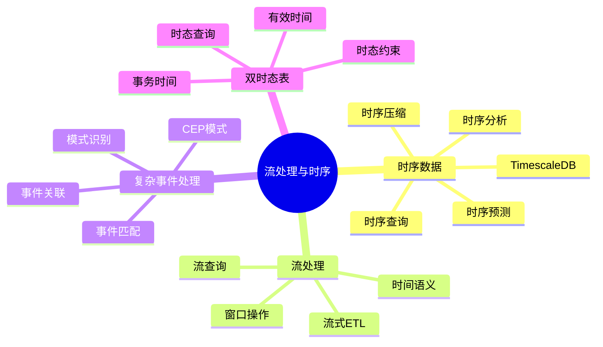
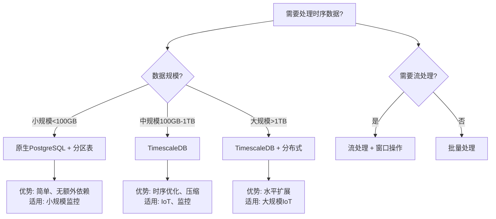

# 08-流处理与时序

> **文档总数**: 5个文档
> **覆盖领域**: TimescaleDB、流处理、CEP、时序数据、双时态表
> **版本覆盖**: PostgreSQL 18.x (推荐) ⭐ | 17.x (推荐) | 16.x (兼容)

---

## 📊 知识体系思维导图

---

## 📋 主题说明

本主题整合所有PostgreSQL流处理与时序相关内容，包括TimescaleDB时序数据库、流处理机制、复杂事件处理（CEP）、时序数据分析以及双时态表等。

---

## 📚 核心文档

### 流处理

- **[流处理场景完整指南.md](./流处理场景完整指南.md)** ⭐⭐⭐⭐⭐ - 流处理场景完整指南
- **[10.01-流处理与时间语义-窗口与CEP的形式化.md](./10.01-流处理与时间语义-窗口与CEP的形式化.md)** - 流处理与时间语义的形式化
- **[10.04-数据库流处理模型-流查询语言与窗口操作的形式化.md](./10.04-数据库流处理模型-流查询语言与窗口操作的形式化.md)** - 流处理模型形式化
- **[10.05-数据库事件处理模型-复杂事件处理与模式匹配的形式化.md](./10.05-数据库事件处理模型-复杂事件处理与模式匹配的形式化.md)** - 事件处理模型形式化

### 时序数据

- **[10.03-数据库时序数据模型-时间序列分析与预测的形式化.md](./10.03-数据库时序数据模型-时间序列分析与预测的形式化.md)** - 时序数据模型形式化

### 双时态表

- **[10.02-双时态表-事务时间与有效时间的形式语义.md](./10.02-双时态表-事务时间与有效时间的形式语义.md)** - 双时态表形式语义

---

## 📊 时序数据处理选型决策树

---

## 📊 时序数据库对比矩阵

| 方案 | 性能 | 压缩率 | 查询能力 | 扩展性 | 成本 | 适用场景 |
| --- | --- | --- | --- | --- | --- | --- |
| **原生PostgreSQL** | ⭐⭐⭐ | ⭐⭐ | ⭐⭐⭐⭐⭐ | ⭐⭐⭐ | 低 | 小规模时序数据 |
| **TimescaleDB** | ⭐⭐⭐⭐⭐ | ⭐⭐⭐⭐⭐ | ⭐⭐⭐⭐⭐ | ⭐⭐⭐⭐ | 中 | 中大规模时序数据 |
| **TimescaleDB分布式** | ⭐⭐⭐⭐⭐ | ⭐⭐⭐⭐⭐ | ⭐⭐⭐⭐ | ⭐⭐⭐⭐⭐ | 高 | 超大规模时序数据 |

---

## 🎯 使用建议

### 时序数据处理

1. 学习 [10.03-数据库时序数据模型-时间序列分析与预测的形式化.md](./10.03-数据库时序数据模型-时间序列分析与预测的形式化.md) 了解时序数据模型
2. 使用TimescaleDB进行时序数据存储和分析
3. 参考相关实战案例进行实践

### 流处理应用

1. 学习 [10.01-流处理与时间语义-窗口与CEP的形式化.md](./10.01-流处理与时间语义-窗口与CEP的形式化.md) 理解流处理机制
2. 参考 [10.04-数据库流处理模型-流查询语言与窗口操作的形式化.md](./10.04-数据库流处理模型-流查询语言与窗口操作的形式化.md) 实现流查询
3. 使用 [10.05-数据库事件处理模型-复杂事件处理与模式匹配的形式化.md](./10.05-数据库事件处理模型-复杂事件处理与模式匹配的形式化.md) 进行事件处理

### 时态数据

1. 学习 [10.02-双时态表-事务时间与有效时间的形式语义.md](./10.02-双时态表-事务时间与有效时间的形式语义.md) 理解双时态表
2. 在实际应用中实现时态数据管理

---

## 📚 文档来源

本主题整合了以下源目录的文档：

- `PostgreSQL/03-高级特性/03.03-流处理与CEP.md`
- `PostgreSQL培训/03-数据类型/【深入】TimescaleDB时序数据库完整实战指南.md`
- `DataBaseTheory/10-流处理与时序/`
- `docs/01-PostgreSQL18/22-TimescaleDB时序数据库完整指南.md`

**原则**: 所有文档均为复制，原文件保持不变。

---

## 🔗 相关文档

- [07-多模型数据库](../07-多模型数据库/README.md) - 多模型数据库应用
- [19-实战案例/03-IoT时序数据系统](../19-实战案例/03-IoT时序数据系统/) - IoT时序数据系统案例

---

**最后更新**: 2025年1月
**状态**: ✅ 文档整合完成
