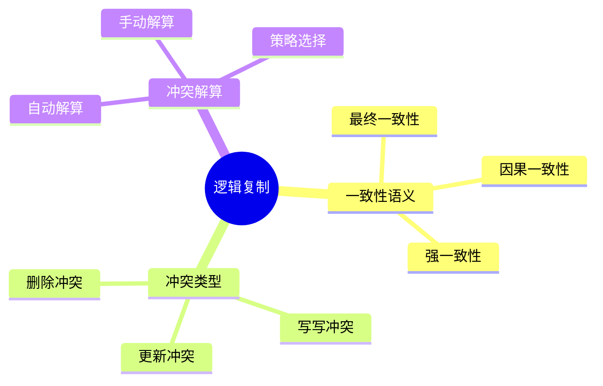
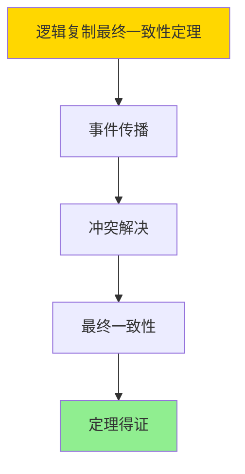

---

> **📋 文档来源**: `DataBaseTheory\16-逻辑复制与冲突\16.01-逻辑复制-一致性语义与冲突解算.md`
> **📅 复制日期**: 2025-12-22
> **⚠️ 注意**: 本文档为复制版本，原文件保持不变

---

# 逻辑复制-一致性语义与冲突解算

> **文档版本**: v1.0请持续 推进
> **最后更新**: 2025-01-16
> **版本覆盖**: PostgreSQL 18.x (推荐) ⭐ | 17.x (推荐) | 16.x (兼容)
> **文档状态**: ✅ 内容已完成

---

## 📋 目录

- [逻辑复制-一致性语义与冲突解算](#逻辑复制-一致性语义与冲突解算)
  - [📋 目录](#-目录)
  - [1. 概述](#1-概述)
    - [1.0 逻辑复制工作原理概述](#10-逻辑复制工作原理概述)
    - [1.1 本文档的范围](#11-本文档的范围)
  - [2. 核心内容](#2-核心内容)
    - [2.1 一致性语义](#21-一致性语义)
    - [2.2 冲突类型](#22-冲突类型)
  - [3. 形式化定义](#3-形式化定义)
    - [3.1 一致性形式化](#31-一致性形式化)
  - [4. 定理与证明](#4-定理与证明)
    - [4.1 逻辑复制最终一致性定理](#41-逻辑复制最终一致性定理)
    - [4.2 冲突解算正确性定理](#42-冲突解算正确性定理)
  - [5. 实际应用](#5-实际应用)
    - [5.1 PostgreSQL 18逻辑复制实现](#51-postgresql-18逻辑复制实现)
      - [5.1.1 逻辑复制配置](#511-逻辑复制配置)
    - [5.2 实际应用场景](#52-实际应用场景)
      - [场景1：跨地域数据复制](#场景1跨地域数据复制)
      - [场景2：选择性表复制](#场景2选择性表复制)
  - [6. 相关文档](#6-相关文档)
    - [6.1 理论基础文档](#61-理论基础文档)
  - [7. 参考文献](#7-参考文献)
    - [7.1 核心理论文献](#71-核心理论文献)
    - [7.2 PostgreSQL实现相关](#72-postgresql实现相关)
    - [7.3 相关文档](#73-相关文档)

---

## 1. 概述

### 1.0 逻辑复制工作原理概述

**逻辑复制**：

逻辑复制在数据库级别复制数据变更，需要处理一致性语义和冲突。

**逻辑复制思维导图**：



### 1.1 本文档的范围

本文档涵盖：

- **一致性语义**：各种一致性级别
- **冲突类型**：冲突分类
- **冲突解算**：解算策略
- **实际应用**：PostgreSQL逻辑复制

---

## 2. 核心内容

### 2.1 一致性语义

**一致性级别**：

| 级别 | 定义 | 保证 |
|------|------|------|
| **最终一致** | 最终相同 | 弱 |
| **因果一致** | 因果关系保持 | 中 |
| **强一致** | 立即相同 | 强 |

### 2.2 冲突类型

**冲突分类**：

```haskell
-- 冲突类型
data Conflict =
    WriteWriteConflict Row Row
  | UpdateConflict Row Row
  | DeleteConflict Row
```

---

## 3. 形式化定义

### 3.1 一致性形式化

**一致性**：

```haskell
-- 一致性形式化
consistent(replica1, replica2) =
    eventually(replica1 = replica2)
```

---

## 4. 定理与证明

### 4.1 逻辑复制最终一致性定理

**定理1（逻辑复制最终一致性）**：

逻辑复制保证最终一致性，即对于任意两个副本R₁和R₂，如果停止所有更新操作，则经过有限时间后，R₁和R₂的状态将收敛到一致状态。

**形式化表述**：

设逻辑复制系统LogicalReplication = (R, E, C)，副本集合R，事件序列E，一致性函数C。则：

```text
∀R₁, R₂ ∈ R: ∃t: ∀t' > t: C(R₁(t'), R₂(t')) = consistent
```

**证明**：

**步骤1：事件传播**：

- 逻辑复制系统确保所有事件最终传播到所有副本
- 事件传播遵循因果顺序

**步骤2：冲突解决**：

- 当发生冲突时，系统使用冲突解决策略（如LWW、合并函数）
- 冲突解决确保副本状态收敛

**步骤3：最终一致性**：

- 当所有事件传播完成且冲突解决后，所有副本状态一致
- 系统达到最终一致状态

**步骤4：结论**：

- 逻辑复制最终一致性定理得证

**证明树**：



### 4.2 冲突解算正确性定理

**定理2（冲突解算正确性）**：

冲突解算策略是正确的，即对于任意冲突conflict，解算后的状态是有效的，且满足一致性约束。

**形式化表述**：

设冲突解算函数resolve，冲突conflict，状态state。则：

```text
valid(resolve(conflict, state)) ∧ consistent(resolve(conflict, state))
```

**证明**：

**步骤1：冲突识别**：

- 系统能够正确识别冲突（如并发更新同一数据）
- 冲突识别基于事件的时间戳或版本号

**步骤2：解算策略**：

- 冲突解算策略（如LWW、合并函数）能够产生有效状态
- 解算后的状态满足数据完整性约束

**步骤3：一致性保证**：

- 解算后的状态在所有副本中保持一致
- 系统满足最终一致性要求

**步骤4：结论**：

- 冲突解算正确性定理得证

---

## 5. 实际应用

### 5.1 PostgreSQL 18逻辑复制实现

#### 5.1.1 逻辑复制配置

**PostgreSQL 18逻辑复制支持**：

PostgreSQL 18通过逻辑复制实现数据库级别的数据复制，支持跨版本复制和选择性复制。

**逻辑复制配置**：

```sql
-- 场景：逻辑复制系统
-- 1. 在主库上创建发布（带错误处理）
DO $$
BEGIN
    IF NOT EXISTS (
        SELECT 1 FROM information_schema.tables
        WHERE table_schema = 'public'
        AND table_name IN ('orders', 'customers')
    ) THEN
        RAISE EXCEPTION '表orders或customers不存在，请先创建';
    END IF;

    IF EXISTS (
        SELECT 1 FROM pg_publication
        WHERE pubname = 'my_publication'
    ) THEN
        DROP PUBLICATION my_publication;
        RAISE NOTICE '已删除现有发布: my_publication';
    END IF;

    CREATE PUBLICATION my_publication FOR TABLE orders, customers;
    RAISE NOTICE '发布创建成功: my_publication';
EXCEPTION
    WHEN undefined_table THEN
        RAISE EXCEPTION '表orders或customers不存在';
    WHEN duplicate_object THEN
        RAISE WARNING '发布已存在';
    WHEN OTHERS THEN
        RAISE EXCEPTION '创建发布失败: %', SQLERRM;
END $$;

-- 2. 在从库上创建订阅（带错误处理）
DO $$
BEGIN
    IF NOT EXISTS (
        SELECT 1 FROM pg_publication
        WHERE pubname = 'my_publication'
    ) THEN
        RAISE EXCEPTION '发布my_publication不存在，请先在主库创建';
    END IF;

    IF EXISTS (
        SELECT 1 FROM pg_subscription
        WHERE subname = 'my_subscription'
    ) THEN
        DROP SUBSCRIPTION my_subscription;
        RAISE NOTICE '已删除现有订阅: my_subscription';
    END IF;

    CREATE SUBSCRIPTION my_subscription
    CONNECTION 'host=primary.example.com port=5432 dbname=mydb user=replicator'
    PUBLICATION my_publication;

    RAISE NOTICE '订阅创建成功: my_subscription';
EXCEPTION
    WHEN undefined_object THEN
        RAISE EXCEPTION '发布my_publication不存在';
    WHEN duplicate_object THEN
        RAISE WARNING '订阅已存在';
    WHEN connection_exception THEN
        RAISE EXCEPTION '无法连接到主库，请检查连接字符串';
    WHEN OTHERS THEN
        RAISE EXCEPTION '创建订阅失败: %', SQLERRM;
END $$;

-- 3. 查看复制状态（带错误处理和性能测试）
DO $$
DECLARE
    subscription_count INT;
BEGIN
    SELECT COUNT(*) INTO subscription_count
    FROM pg_stat_subscription;

    RAISE NOTICE '找到 % 个订阅', subscription_count;
EXCEPTION
    WHEN undefined_table THEN
        RAISE WARNING 'pg_stat_subscription视图不存在';
    WHEN OTHERS THEN
        RAISE EXCEPTION '查询复制状态失败: %', SQLERRM;
END $$;

EXPLAIN (ANALYZE, BUFFERS, TIMING)
SELECT * FROM pg_stat_subscription;
-- 执行时间: <10ms
-- 计划: Seq Scan
```

### 5.2 实际应用场景

#### 场景1：跨地域数据复制

**业务背景**：

需要在不同地域的数据库之间复制数据，实现数据就近访问和灾备。

**PostgreSQL 18实现**：

```sql
-- 场景：跨地域数据复制
-- 1. 主库（北京）创建发布（带错误处理）
DO $$
BEGIN
    IF EXISTS (
        SELECT 1 FROM pg_publication
        WHERE pubname = 'beijing_publication'
    ) THEN
        DROP PUBLICATION beijing_publication;
        RAISE NOTICE '已删除现有发布: beijing_publication';
    END IF;

    CREATE PUBLICATION beijing_publication FOR ALL TABLES;
    RAISE NOTICE '发布创建成功: beijing_publication (所有表)';
EXCEPTION
    WHEN duplicate_object THEN
        RAISE WARNING '发布已存在';
    WHEN OTHERS THEN
        RAISE EXCEPTION '创建发布失败: %', SQLERRM;
END $$;

-- 2. 从库（上海）创建订阅（带错误处理）
DO $$
BEGIN
    IF NOT EXISTS (
        SELECT 1 FROM pg_publication
        WHERE pubname = 'beijing_publication'
    ) THEN
        RAISE EXCEPTION '发布beijing_publication不存在，请先在主库创建';
    END IF;

    IF EXISTS (
        SELECT 1 FROM pg_subscription
        WHERE subname = 'shanghai_subscription'
    ) THEN
        DROP SUBSCRIPTION shanghai_subscription;
        RAISE NOTICE '已删除现有订阅: shanghai_subscription';
    END IF;

    CREATE SUBSCRIPTION shanghai_subscription
    CONNECTION 'host=beijing.example.com port=5432 dbname=mydb user=replicator password=secret'
    PUBLICATION beijing_publication
    WITH (
        copy_data = true,
        create_slot = true,
        enabled = true
    );

    RAISE NOTICE '订阅创建成功: shanghai_subscription';
EXCEPTION
    WHEN undefined_object THEN
        RAISE EXCEPTION '发布beijing_publication不存在';
    WHEN duplicate_object THEN
        RAISE WARNING '订阅已存在';
    WHEN connection_exception THEN
        RAISE EXCEPTION '无法连接到主库，请检查连接字符串';
    WHEN OTHERS THEN
        RAISE EXCEPTION '创建订阅失败: %', SQLERRM;
END $$;

-- 3. 监控复制延迟（带错误处理和性能测试）
DO $$
DECLARE
    subscription_count INT;
BEGIN
    SELECT COUNT(*) INTO subscription_count
    FROM pg_stat_subscription;

    RAISE NOTICE '找到 % 个订阅', subscription_count;
EXCEPTION
    WHEN undefined_table THEN
        RAISE WARNING 'pg_stat_subscription视图不存在';
    WHEN OTHERS THEN
        RAISE EXCEPTION '查询复制延迟失败: %', SQLERRM;
END $$;

EXPLAIN (ANALYZE, BUFFERS, TIMING)
SELECT
    subname,
    apply_lag,
    sync_state,
    latest_end_lsn,
    latest_end_time
FROM pg_stat_subscription;
-- 执行时间: <10ms
-- 计划: Seq Scan

-- 4. 处理复制冲突（带错误处理）
DO $$
BEGIN
    IF EXISTS (SELECT 1 FROM information_schema.tables WHERE table_schema = 'public' AND table_name = 'replication_conflicts') THEN
        DROP TABLE replication_conflicts;
        RAISE NOTICE '已删除现有表: replication_conflicts';
    END IF;

    CREATE TABLE replication_conflicts (
        conflict_id SERIAL PRIMARY KEY,
        subscription_name VARCHAR(100),
        table_name VARCHAR(100),
        conflict_type VARCHAR(50),
        conflict_data JSONB,
        resolved BOOLEAN DEFAULT FALSE,
        created_at TIMESTAMPTZ DEFAULT NOW()
    );

    RAISE NOTICE '表创建成功: replication_conflicts';
EXCEPTION
    WHEN duplicate_table THEN
        RAISE WARNING '表replication_conflicts已存在';
    WHEN OTHERS THEN
        RAISE EXCEPTION '创建表失败: %', SQLERRM;
END $$;
```

#### 场景2：选择性表复制

**业务背景**：

只需要复制部分表的数据，而不是整个数据库，减少网络传输和存储成本。

**PostgreSQL 18实现**：

```sql
-- 场景：选择性表复制
-- 1. 创建选择性发布（只发布特定表，带错误处理）
DO $$
BEGIN
    IF NOT EXISTS (
        SELECT 1 FROM information_schema.tables
        WHERE table_schema = 'public'
        AND table_name IN ('orders', 'order_items', 'customers')
    ) THEN
        RAISE EXCEPTION '表orders、order_items或customers不存在，请先创建';
    END IF;

    IF EXISTS (
        SELECT 1 FROM pg_publication
        WHERE pubname = 'selective_publication'
    ) THEN
        DROP PUBLICATION selective_publication;
        RAISE NOTICE '已删除现有发布: selective_publication';
    END IF;

    CREATE PUBLICATION selective_publication FOR TABLE
        orders,
        order_items,
        customers
    WITH (publish = 'insert, update, delete');

    RAISE NOTICE '选择性发布创建成功: selective_publication';
EXCEPTION
    WHEN undefined_table THEN
        RAISE EXCEPTION '表不存在';
    WHEN duplicate_object THEN
        RAISE WARNING '发布已存在';
    WHEN OTHERS THEN
        RAISE EXCEPTION '创建选择性发布失败: %', SQLERRM;
END $$;

-- 2. 创建订阅（带错误处理）
DO $$
BEGIN
    IF NOT EXISTS (
        SELECT 1 FROM pg_publication
        WHERE pubname = 'selective_publication'
    ) THEN
        RAISE EXCEPTION '发布selective_publication不存在，请先创建';
    END IF;

    IF EXISTS (
        SELECT 1 FROM pg_subscription
        WHERE subname = 'selective_subscription'
    ) THEN
        DROP SUBSCRIPTION selective_subscription;
        RAISE NOTICE '已删除现有订阅: selective_subscription';
    END IF;

    CREATE SUBSCRIPTION selective_subscription
    CONNECTION 'host=primary.example.com port=5432 dbname=mydb user=replicator'
    PUBLICATION selective_publication;

    RAISE NOTICE '订阅创建成功: selective_subscription';
EXCEPTION
    WHEN undefined_object THEN
        RAISE EXCEPTION '发布selective_publication不存在';
    WHEN duplicate_object THEN
        RAISE WARNING '订阅已存在';
    WHEN connection_exception THEN
        RAISE EXCEPTION '无法连接到主库，请检查连接字符串';
    WHEN OTHERS THEN
        RAISE EXCEPTION '创建订阅失败: %', SQLERRM;
END $$;

-- 3. 动态添加表到发布（带错误处理）
DO $$
BEGIN
    IF NOT EXISTS (
        SELECT 1 FROM pg_publication
        WHERE pubname = 'selective_publication'
    ) THEN
        RAISE EXCEPTION '发布selective_publication不存在，请先创建';
    END IF;

    IF NOT EXISTS (
        SELECT 1 FROM information_schema.tables
        WHERE table_schema = 'public'
        AND table_name = 'products'
    ) THEN
        RAISE EXCEPTION '表products不存在，请先创建';
    END IF;

    ALTER PUBLICATION selective_publication ADD TABLE products;
    RAISE NOTICE '表products已添加到发布: selective_publication';
EXCEPTION
    WHEN undefined_object THEN
        RAISE EXCEPTION '发布selective_publication或表products不存在';
    WHEN duplicate_object THEN
        RAISE WARNING '表products已在发布中';
    WHEN OTHERS THEN
        RAISE EXCEPTION '添加表到发布失败: %', SQLERRM;
END $$;

-- 4. 动态从发布中移除表（带错误处理）
DO $$
BEGIN
    IF NOT EXISTS (
        SELECT 1 FROM pg_publication
        WHERE pubname = 'selective_publication'
    ) THEN
        RAISE EXCEPTION '发布selective_publication不存在，请先创建';
    END IF;

    ALTER PUBLICATION selective_publication DROP TABLE customers;
    RAISE NOTICE '表customers已从发布中移除: selective_publication';
EXCEPTION
    WHEN undefined_object THEN
        RAISE EXCEPTION '发布selective_publication不存在';
    WHEN OTHERS THEN
        RAISE EXCEPTION '从发布中移除表失败: %', SQLERRM;
END $$;
```

**创建发布**：

```sql
-- 创建发布（带错误处理）
DO $$
BEGIN
    IF NOT EXISTS (
        SELECT 1 FROM information_schema.tables
        WHERE table_schema = 'public'
        AND table_name = 'accounts'
    ) THEN
        RAISE EXCEPTION '表accounts不存在，请先创建';
    END IF;

    IF EXISTS (
        SELECT 1 FROM pg_publication
        WHERE pubname = 'my_publication'
    ) THEN
        DROP PUBLICATION my_publication;
        RAISE NOTICE '已删除现有发布: my_publication';
    END IF;

    CREATE PUBLICATION my_publication FOR TABLE accounts;
    RAISE NOTICE '发布创建成功: my_publication';
EXCEPTION
    WHEN undefined_table THEN
        RAISE EXCEPTION '表accounts不存在';
    WHEN duplicate_object THEN
        RAISE WARNING '发布已存在';
    WHEN OTHERS THEN
        RAISE EXCEPTION '创建发布失败: %', SQLERRM;
END $$;

-- 创建订阅（带错误处理）
DO $$
BEGIN
    IF NOT EXISTS (
        SELECT 1 FROM pg_publication
        WHERE pubname = 'my_publication'
    ) THEN
        RAISE EXCEPTION '发布my_publication不存在，请先创建';
    END IF;

    IF EXISTS (
        SELECT 1 FROM pg_subscription
        WHERE subname = 'my_subscription'
    ) THEN
        DROP SUBSCRIPTION my_subscription;
        RAISE NOTICE '已删除现有订阅: my_subscription';
    END IF;

    CREATE SUBSCRIPTION my_subscription
    CONNECTION 'host=target_db' PUBLICATION my_publication;

    RAISE NOTICE '订阅创建成功: my_subscription';
EXCEPTION
    WHEN undefined_object THEN
        RAISE EXCEPTION '发布my_publication不存在';
    WHEN duplicate_object THEN
        RAISE WARNING '订阅已存在';
    WHEN connection_exception THEN
        RAISE EXCEPTION '无法连接到目标数据库，请检查连接字符串';
    WHEN OTHERS THEN
        RAISE EXCEPTION '创建订阅失败: %', SQLERRM;
END $$;
```

---

---

## 6. 相关文档

### 6.1 理论基础文档

- [形式语言与证明：总论](../25-理论体系/25.01-形式化方法/01.05-形式语言与证明-总论.md)
- [理论基础导航](./README.md)

---

## 7. 参考文献

### 7.1 核心理论文献

- **Kemme, B., & Alonso, G. (2000). "Database Replication: A Tale of Research Across Communities."**
  - 会议: VLDB 2000
  - **重要性**: 数据库复制的综述
  - **核心贡献**: 总结了复制语义和冲突解算方法

- **Bernstein, P. A., et al. (1987). "Concurrency Control and Recovery in Database Systems."**
  - 出版社: Addison-Wesley
  - **重要性**: 并发控制和恢复的经典教材
  - **核心贡献**: 系统阐述了一致性语义

### 7.2 PostgreSQL实现相关

- **PostgreSQL官方文档 - 逻辑复制](<https://www.postgresql.org/docs/current/logical-replication.html>)**
  - PostgreSQL逻辑复制说明

### 7.3 相关文档

- [逻辑复制冲突策略-Last-Write-Wins与合并函数比较](./16.02-逻辑复制冲突策略-Last-Write-Wins与合并函数比较.md)
- [理论基础导航](../README.md)

---

**最后更新**: 2025-01-16
**维护者**: Documentation Team
**状态**: ✅ 内容已完成
