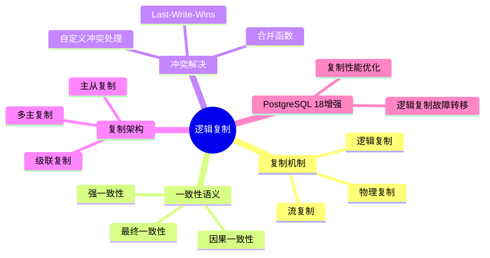
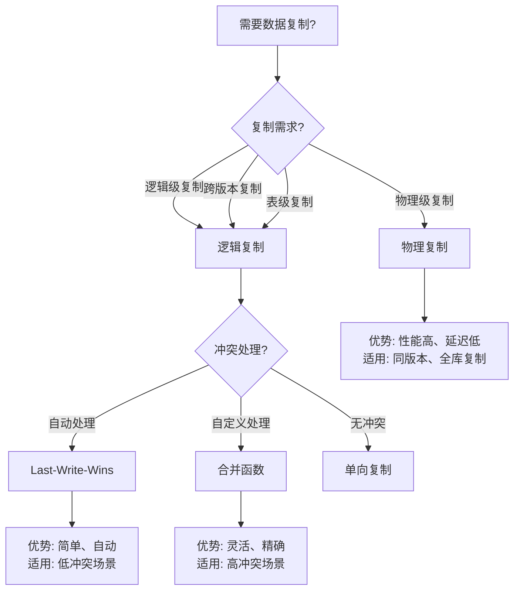

# 09-逻辑复制

> **文档总数**: 2个文档
> **覆盖领域**: 逻辑复制、冲突解决、复制架构、一致性语义
> **版本覆盖**: PostgreSQL 18.x (推荐) ⭐ | 17.x (推荐) | 16.x (兼容)
> **最后更新**: 2025年1月

---

## 📊 知识体系思维导图

---

## 📋 主题说明

本主题整合所有PostgreSQL逻辑复制相关内容，包括逻辑复制机制、冲突解决策略、复制架构设计以及一致性语义等。

---

## 📚 核心文档

### 逻辑复制基础

- **[16.01-逻辑复制-一致性语义与冲突解算.md](./16.01-逻辑复制-一致性语义与冲突解算.md)** - 逻辑复制一致性语义与冲突解算

### 冲突解决策略

- **[16.02-逻辑复制冲突策略-Last-Write-Wins与合并函数比较.md](./16.02-逻辑复制冲突策略-Last-Write-Wins与合并函数比较.md)** - 冲突解决策略比较

---

## 🎯 使用建议

### 逻辑复制配置

1. 学习 [16.01-逻辑复制-一致性语义与冲突解算.md](./16.01-逻辑复制-一致性语义与冲突解算.md) 了解逻辑复制机制
2. 理解一致性语义和冲突解算方法
3. 在实际环境中配置逻辑复制

### 冲突处理

1. 参考 [16.02-逻辑复制冲突策略-Last-Write-Wins与合并函数比较.md](./16.02-逻辑复制冲突策略-Last-Write-Wins与合并函数比较.md) 选择冲突解决策略
2. 根据业务需求选择合适的冲突处理方式
3. 实现自定义冲突解决函数

---

## 📚 文档来源

本主题整合了以下源目录的文档：

- `DataBaseTheory/16-逻辑复制与冲突/`
- `docs/01-PostgreSQL18/07-逻辑复制增强完整指南.md`

**原则**: 所有文档均为复制，原文件保持不变。

---

## 📊 复制方案选型决策树

---

## 📊 复制方案对比矩阵

| 复制方案 | 复制级别 | 性能 | 灵活性 | 冲突处理 | 适用场景 |
|---------|---------|------|--------|---------|---------|
| **逻辑复制** | 逻辑级 | ⭐⭐⭐ | ⭐⭐⭐⭐⭐ | ⭐⭐⭐⭐ | 跨版本、表级、灵活 |
| **物理复制** | 物理级 | ⭐⭐⭐⭐⭐ | ⭐⭐ | ⭐ | 同版本、全库、高性能 |
| **流复制** | 物理级 | ⭐⭐⭐⭐ | ⭐⭐⭐ | ⭐⭐ | 实时同步、高可用 |

---

## 🔗 相关文档

- [13-高可用架构](../13-高可用架构/README.md) - 高可用架构设计
- [04-存储与恢复](../04-存储与恢复/README.md) - 数据备份与恢复

---

**最后更新**: 2025年1月
**状态**: ✅ 文档整合完成
