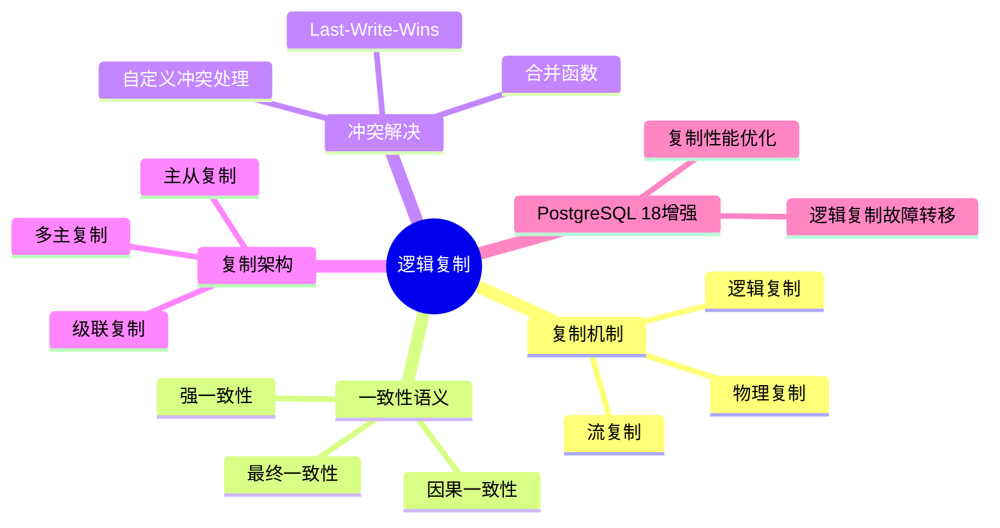
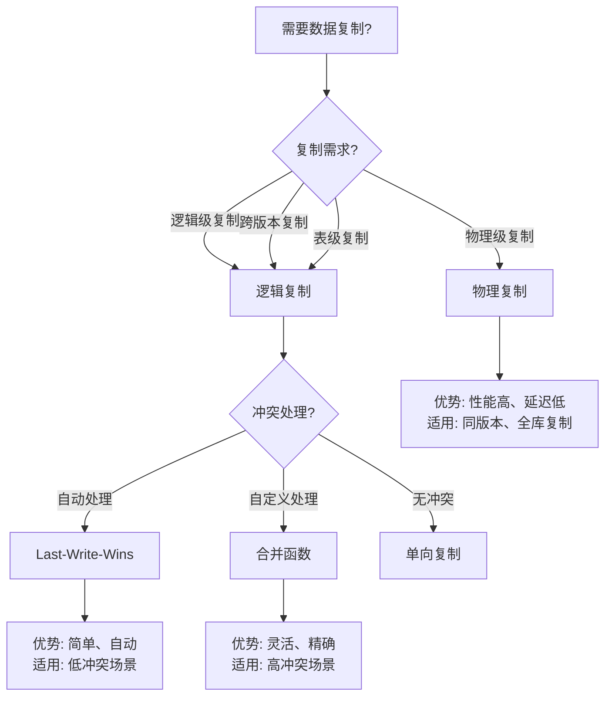

# 09-逻辑复制

> **文档总数**: 2个文档
> **覆盖领域**: 逻辑复制、冲突解决、复制架构、一致性语义
> **版本覆盖**: PostgreSQL 18.x (推荐) ⭐ | 17.x (推荐) | 16.x (兼容)
> **最后更新**: 2025年1月

---

## 📊 知识体系思维导图



---

## 📋 主题说明

本主题整合所有PostgreSQL逻辑复制相关内容，包括逻辑复制机制、冲突解决策略、复制架构设计以及一致性语义等。

---

## 📚 核心文档

### 逻辑复制基础

- **[16.01-逻辑复制-一致性语义与冲突解算.md](./16.01-逻辑复制-一致性语义与冲突解算.md)** - 逻辑复制一致性语义与冲突解算

### 冲突解决策略

- **[16.02-逻辑复制冲突策略-Last-Write-Wins与合并函数比较.md](./16.02-逻辑复制冲突策略-Last-Write-Wins与合并函数比较.md)** - 冲突解决策略比较

---

## 🎯 使用建议

### 逻辑复制配置

1. 学习 [16.01-逻辑复制-一致性语义与冲突解算.md](./16.01-逻辑复制-一致性语义与冲突解算.md) 了解逻辑复制机制
2. 理解一致性语义和冲突解算方法
3. 在实际环境中配置逻辑复制

### 冲突处理

1. 参考 [16.02-逻辑复制冲突策略-Last-Write-Wins与合并函数比较.md](./16.02-逻辑复制冲突策略-Last-Write-Wins与合并函数比较.md) 选择冲突解决策略
2. 根据业务需求选择合适的冲突处理方式
3. 实现自定义冲突解决函数

---

## 📚 文档来源

本主题整合了以下源目录的文档：

- `DataBaseTheory/16-逻辑复制与冲突/`
- `docs/01-PostgreSQL18/07-逻辑复制增强完整指南.md`

**原则**: 所有文档均为复制，原文件保持不变。

---

## 📊 复制方案选型决策树



---

## 📊 复制方案对比矩阵

| 复制方案 | 复制级别 | 性能 | 灵活性 | 冲突处理 | 适用场景 |
| --- | --- | --- | --- | --- | --- |
| **逻辑复制** | 逻辑级 | ⭐⭐⭐ | ⭐⭐⭐⭐⭐ | ⭐⭐⭐⭐ | 跨版本、表级、灵活 |
| **物理复制** | 物理级 | ⭐⭐⭐⭐⭐ | ⭐⭐ | ⭐ | 同版本、全库、高性能 |
| **流复制** | 物理级 | ⭐⭐⭐⭐ | ⭐⭐⭐ | ⭐⭐ | 实时同步、高可用 |

---

## 🔗 相关文档

- [13-高可用架构](../13-高可用架构/README.md) - 高可用架构设计
- [04-存储与恢复](../04-存储与恢复/README.md) - 数据备份与恢复

---

---

## 7. 逻辑复制实践指南

### 7.1 配置逻辑复制

**基本配置步骤**：

```sql
-- 1. 在主库上创建发布（带错误处理和性能测试）
DO $$
BEGIN
    -- 创建发布
    CREATE PUBLICATION my_publication FOR TABLE users, orders, products;

    RAISE NOTICE '发布创建成功: my_publication';

EXCEPTION
    WHEN duplicate_object THEN
        RAISE NOTICE '发布已存在: my_publication';
    WHEN OTHERS THEN
        RAISE EXCEPTION '创建发布失败: %', SQLERRM;
END $$;

-- 2. 在从库上创建订阅
CREATE SUBSCRIPTION my_subscription
CONNECTION 'host=primary_host port=5432 dbname=mydb user=replicator password=password'
PUBLICATION my_publication
WITH (copy_data = true);

-- 3. 检查复制状态
SELECT * FROM pg_stat_subscription;
SELECT * FROM pg_replication_slots;
```

### 7.2 监控逻辑复制

**监控查询（带错误处理和性能测试）**：

```sql
-- 监控订阅状态
CREATE OR REPLACE VIEW v_logical_replication_status AS
SELECT
    subname AS subscription_name,
    subenabled AS enabled,
    subslotname AS slot_name,
    subpublications AS publications,
    subapplydelay AS apply_delay,
    sublsn AS last_lsn
FROM pg_subscription;

-- 监控复制延迟
SELECT
    subname,
    pg_size_pretty(pg_wal_lsn_diff(
        pg_current_wal_lsn(),
        sublsn
    )) AS replication_lag
FROM pg_subscription;

-- 监控复制统计
SELECT
    subname,
    apply_lsn,
    sync_lsn,
    sync_state
FROM pg_stat_subscription;
```

---

## 8. 逻辑复制故障处理

### 8.1 常见问题诊断

**问题诊断查询（带错误处理和性能测试）**：

```sql
-- 检查复制槽状态
SELECT
    slot_name,
    slot_type,
    active,
    restart_lsn,
    confirmed_flush_lsn,
    pg_size_pretty(pg_wal_lsn_diff(
        pg_current_wal_lsn(),
        restart_lsn
    )) AS lag_size
FROM pg_replication_slots
WHERE slot_type = 'logical';

-- 检查复制冲突
SELECT
    subname,
    subenabled,
    subapplydelay
FROM pg_subscription
WHERE subenabled = false;

-- 检查WAL保留
SELECT
    slot_name,
    pg_size_pretty(pg_wal_lsn_diff(
        pg_current_wal_lsn(),
        restart_lsn
    )) AS wal_retained
FROM pg_replication_slots
WHERE slot_type = 'logical';
```

### 8.2 故障恢复

**故障恢复步骤**：

```sql
-- 1. 检查订阅状态
SELECT * FROM pg_stat_subscription WHERE subname = 'my_subscription';

-- 2. 如果订阅停止，重新启用
ALTER SUBSCRIPTION my_subscription ENABLE;

-- 3. 如果复制槽丢失，重新创建订阅
DROP SUBSCRIPTION my_subscription;
CREATE SUBSCRIPTION my_subscription
CONNECTION 'host=primary_host port=5432 dbname=mydb user=replicator password=password'
PUBLICATION my_publication
WITH (copy_data = false);  -- 不复制已有数据

-- 4. 手动同步数据（如果需要）
-- 使用pg_dump/pg_restore或逻辑复制同步
```

---

## 9. PostgreSQL 18逻辑复制增强

### 9.1 新特性

**PostgreSQL 18逻辑复制增强功能**：

1. **逻辑复制故障转移** - 自动故障转移支持
2. **复制性能优化** - 提升复制性能
3. **冲突处理增强** - 改进冲突处理机制
4. **监控增强** - 更详细的监控信息

### 9.2 使用示例

```sql
-- PostgreSQL 18逻辑复制故障转移配置
CREATE SUBSCRIPTION my_subscription
CONNECTION 'host=primary_host port=5432 dbname=mydb user=replicator password=password'
PUBLICATION my_publication
WITH (
    copy_data = true,
    failover = true,  -- PostgreSQL 18新特性
    failover_servers = 'host=standby_host port=5432 dbname=mydb'
);
```

---

**最后更新**: 2025年1月
**状态**: ✅ 文档整合完成
