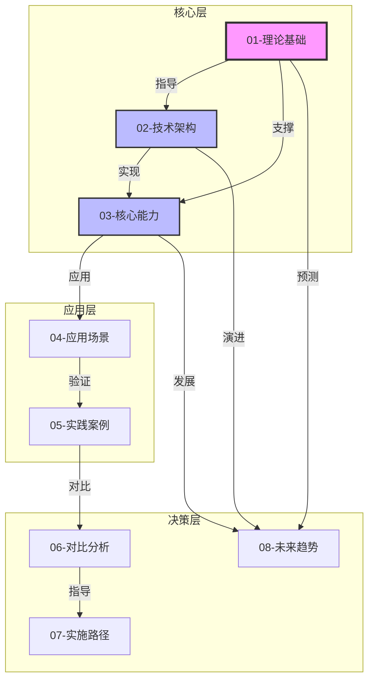
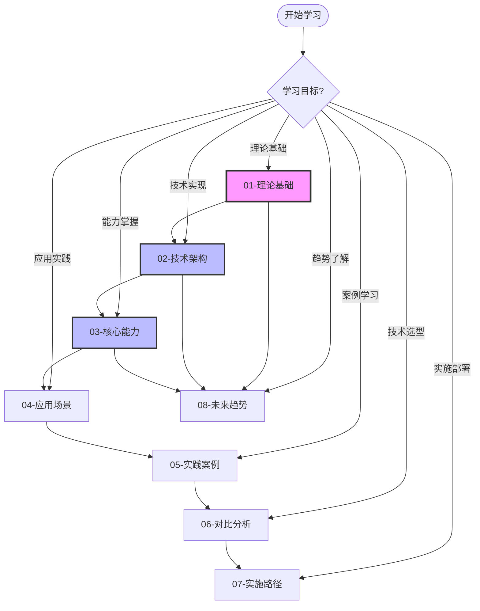

---

> **📋 文档来源**: `PostgreSQL_AI\00-主题关联关系图.md`
> **📅 复制日期**: 2025-12-22
> **⚠️ 注意**: 本文档为复制版本，原文件保持不变

---

# PostgreSQL AI 主题关联关系图

> **文档编号**: AI-00-01
> **最后更新**: 2025年1月

## 📊 主题关联可视化图



## 📊 主题关联矩阵

| 主题 | 01-理论基础 | 02-技术架构 | 03-核心能力 | 04-应用场景 | 05-实践案例 | 06-对比分析 | 07-实施路径 | 08-未来趋势 |
|------|:----------:|:----------:|:----------:|:----------:|:----------:|:----------:|:----------:|:----------:|
| **01-理论基础** | - | 强依赖 | 强依赖 | 间接依赖 | 间接依赖 | 强依赖 | 间接依赖 | 强依赖 |
| **02-技术架构** | 被依赖 | - | 强依赖 | 强依赖 | 强依赖 | 间接依赖 | 强依赖 | 强依赖 |
| **03-核心能力** | 被依赖 | 被依赖 | - | 强依赖 | 强依赖 | 间接依赖 | 强依赖 | 强依赖 |
| **04-应用场景** | 间接依赖 | 被依赖 | 被依赖 | - | 强依赖 | 间接依赖 | 强依赖 | 间接依赖 |
| **05-实践案例** | 间接依赖 | 被依赖 | 被依赖 | 被依赖 | - | 强依赖 | 强依赖 | 间接依赖 |
| **06-对比分析** | 被依赖 | 间接依赖 | 间接依赖 | 间接依赖 | 被依赖 | - | 强依赖 | 间接依赖 |
| **07-实施路径** | 间接依赖 | 被依赖 | 被依赖 | 被依赖 | 被依赖 | 被依赖 | - | 间接依赖 |
| **08-未来趋势** | 被依赖 | 被依赖 | 被依赖 | 间接依赖 | 间接依赖 | 间接依赖 | 间接依赖 | - |

**图例**:

- **强依赖**: 主题A的核心内容直接依赖主题B
- **间接依赖**: 主题A的部分内容参考主题B
- **被依赖**: 主题A被其他主题依赖

## 🔗 详细关联关系

### 01-理论基础

**依赖关系**:

- **被依赖**:
  - 02-技术架构 (架构设计需要理论指导)
  - 03-核心能力 (能力实现基于理论模型)
  - 06-对比分析 (对比需要理论框架)
  - 08-未来趋势 (趋势预测基于理论发展)

**依赖内容**:

- 系统级理论模型 → 指导架构设计
- 核心理论模型 → 支撑能力实现
- 形式化证明 → 用于对比验证

**关联强度**: ⭐⭐⭐⭐⭐ (核心基础)

---

### 02-技术架构

**依赖关系**:

- **依赖**: 01-理论基础
- **被依赖**:
  - 03-核心能力 (能力在架构中实现)
  - 04-应用场景 (场景基于架构)
  - 05-实践案例 (案例验证架构)
  - 07-实施路径 (路径基于架构)
  - 08-未来趋势 (趋势影响架构)

**依赖内容**:

- 理论基础 → 架构设计原则
- 核心能力 → 架构组件选择
- 应用场景 → 架构模式选择

**关联强度**: ⭐⭐⭐⭐⭐ (核心枢纽)

---

### 03-核心能力

**依赖关系**:

- **依赖**: 01-理论基础, 02-技术架构
- **被依赖**:
  - 04-应用场景 (场景使用能力)
  - 05-实践案例 (案例展示能力)
  - 07-实施路径 (路径实现能力)
  - 08-未来趋势 (趋势增强能力)

**依赖内容**:

- 理论基础 → 能力设计原理
- 技术架构 → 能力实现方式
- 应用场景 → 能力需求分析

**关联强度**: ⭐⭐⭐⭐⭐ (核心实现)

---

### 04-应用场景

**依赖关系**:

- **依赖**: 02-技术架构, 03-核心能力
- **被依赖**:
  - 05-实践案例 (案例实现场景)
  - 07-实施路径 (路径服务于场景)
  - 08-未来趋势 (趋势扩展场景)

**依赖内容**:

- 技术架构 → 场景架构设计
- 核心能力 → 场景能力需求
- 实践案例 → 场景最佳实践

**关联强度**: ⭐⭐⭐⭐ (应用导向)

---

### 05-实践案例

**依赖关系**:

- **依赖**: 02-技术架构, 03-核心能力, 04-应用场景
- **被依赖**:
  - 06-对比分析 (案例用于对比)
  - 07-实施路径 (路径基于案例)
  - 08-未来趋势 (趋势参考案例)

**依赖内容**:

- 技术架构 → 案例架构验证
- 核心能力 → 案例能力展示
- 应用场景 → 案例场景实现

**关联强度**: ⭐⭐⭐⭐ (验证导向)

---

### 06-对比分析

**依赖关系**:

- **依赖**: 01-理论基础, 05-实践案例
- **被依赖**:
  - 07-实施路径 (路径考虑对比)

**依赖内容**:

- 理论基础 → 对比理论框架
- 实践案例 → 对比数据来源

**关联强度**: ⭐⭐⭐ (决策支持)

---

### 07-实施路径

**依赖关系**:

- **依赖**: 02-技术架构, 03-核心能力, 04-应用场景, 05-实践案例, 06-对比分析
- **被依赖**: 无

**依赖内容**:

- 技术架构 → 路径架构选择
- 核心能力 → 路径能力实现
- 应用场景 → 路径场景适配
- 实践案例 → 路径经验参考
- 对比分析 → 路径方案选择

**关联强度**: ⭐⭐⭐⭐ (实践导向)

---

### 08-未来趋势

**依赖关系**:

- **依赖**: 01-理论基础, 02-技术架构, 03-核心能力
- **被依赖**: 无

**依赖内容**:

- 理论基础 → 趋势理论依据
- 技术架构 → 趋势架构演进
- 核心能力 → 趋势能力增强

**关联强度**: ⭐⭐⭐ (前瞻导向)

## 🎯 学习路径推荐

### 路径1: 理论到实践 (适合研究者)

```text
01-理论基础 → 02-技术架构 → 03-核心能力 → 04-应用场景 → 05-实践案例
```

### 路径2: 架构到实施 (适合架构师)

```text
02-技术架构 → 03-核心能力 → 06-对比分析 → 07-实施路径
```

### 路径3: 场景到案例 (适合开发者)

```text
04-应用场景 → 03-核心能力 → 05-实践案例 → 07-实施路径
```

### 路径4: 对比到决策 (适合决策者)

```text
06-对比分析 → 05-实践案例 → 07-实施路径 → 08-未来趋势
```

## 🔄 主题依赖关系流程图



## 📈 主题重要性评分

| 主题 | 重要性 | 依赖度 | 被依赖度 | 综合评分 |
|------|:------:|:------:|:--------:|:--------:|
| 01-理论基础 | ⭐⭐⭐⭐⭐ | 低 | 高 | 9.5/10 |
| 02-技术架构 | ⭐⭐⭐⭐⭐ | 中 | 高 | 9.8/10 |
| 03-核心能力 | ⭐⭐⭐⭐⭐ | 高 | 高 | 9.7/10 |
| 04-应用场景 | ⭐⭐⭐⭐ | 高 | 中 | 8.5/10 |
| 05-实践案例 | ⭐⭐⭐⭐ | 高 | 中 | 8.3/10 |
| 06-对比分析 | ⭐⭐⭐ | 中 | 低 | 7.0/10 |
| 07-实施路径 | ⭐⭐⭐⭐ | 高 | 低 | 8.0/10 |
| 08-未来趋势 | ⭐⭐⭐ | 中 | 低 | 7.5/10 |

**评分说明**:

- **重要性**: 主题在整个知识体系中的核心程度
- **依赖度**: 主题对其他主题的依赖程度
- **被依赖度**: 主题被其他主题依赖的程度
- **综合评分**: 综合考虑各项指标的加权评分

---

**最后更新**: 2025年1月
**维护者**: PostgreSQL Modern Team
**文档编号**: AI-00-01
