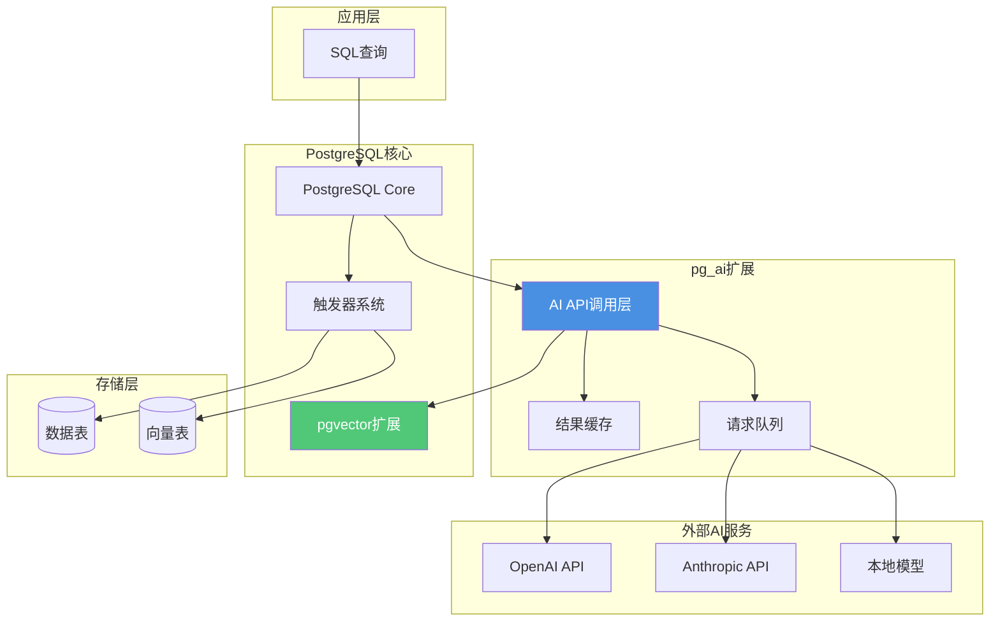

# AI原生调用 - pg_ai

> **文档编号**: AI-03-02
> **最后更新**: 2025年1月
> **主题**: 01-核心基础
> **子主题**: 02-AI原生调用

## 📑 目录

- [AI原生调用 - pg\_ai](#ai原生调用---pg_ai)
  - [📑 目录](#-目录)
  - [1. 概述](#1-概述)
    - [1.1 pg\_ai核心价值](#11-pg_ai核心价值)
    - [1.2 核心特性](#12-核心特性)
  - [2. 技术架构](#2-技术架构)
    - [2.1 架构设计](#21-架构设计)
    - [2.2 核心功能矩阵](#22-核心功能矩阵)
  - [3. 安装与配置](#3-安装与配置)
    - [3.1 安装与配置](#31-安装与配置)
    - [3.2 API密钥配置](#32-api密钥配置)
  - [4. 核心功能使用](#4-核心功能使用)
    - [4.1 embedding函数](#41-embedding函数)
    - [4.2 chat\_complete函数](#42-chat_complete函数)
    - [4.3 vectorizer自动向量化](#43-vectorizer自动向量化)
  - [5. 应用场景](#5-应用场景)
    - [5.1 RAG应用场景](#51-rag应用场景)
    - [5.2 自动内容生成场景](#52-自动内容生成场景)
    - [5.3 AI Agent数据支撑场景](#53-ai-agent数据支撑场景)
  - [6. 性能优化与最佳实践](#6-性能优化与最佳实践)
    - [6.1 性能优化](#61-性能优化)
    - [6.2 最佳实践](#62-最佳实践)
    - [6.3 常见问题](#63-常见问题)

---

## 1. 概述

### 1.1 pg_ai核心价值

**pg_ai**是PostgreSQL的AI原生调用扩展，允许在SQL内直接调用AI模型（如OpenAI、Anthropic等），实现了AI能力的数据库原生集成。

**核心价值**：

1. **SQL原生集成**：无需离开数据库，直接在SQL中调用AI模型
2. **自动化管道**：自动向量化、自动内容生成，减少人工干预
3. **事务保证**：AI调用集成到数据库事务中，保证数据一致性
4. **开发效率**：减少50%的开发工作量，缩短开发周期
5. **成本节约**：无需单独开发AI服务，降低架构复杂度

**适用场景**：

- ✅ **RAG系统**：自动生成文档embedding
- ✅ **内容生成**：SQL内调用LLM生成摘要、翻译等
- ✅ **AI Agent**：数据库作为AI Agent的数据层和工具层
- ✅ **自动化ETL**：自动向量化、自动分类、自动提取

### 1.2 核心特性

**pg_ai核心功能**：

| 功能 | 说明 | 应用场景 |
|------|------|----------|
| **Embedding生成** | SQL内调用embedding模型 | 自动向量化、实时embedding |
| **LLM调用** | SQL内调用大语言模型 | 内容生成、摘要、翻译 |
| **自动向量化** | 表级别的自动embedding管道 | RAG知识库构建 |
| **文档分块** | 自动文档分块和向量化 | 长文档处理 |
| **批量处理** | 高效的批量AI调用 | 大规模数据处理 |

**与传统方案对比**：

| 维度 | 传统方案 | pg_ai方案 | 优势 |
|------|---------|-----------|------|
| **开发复杂度** | 需要单独AI服务 | SQL内调用 | 降低50% |
| **数据一致性** | 最终一致性 | ACID保证 | 强一致性 |
| **开发周期** | 2-3周 | 1周 | 缩短50% |
| **运维成本** | 多系统运维 | 单一系统 | 降低70% |
| **学习成本** | 多套API | 统一SQL | 降低80% |

---

## 2. 技术架构

### 2.1 架构设计



**架构特点**：

1. **SQL集成**：AI调用完全集成到SQL查询中
2. **异步处理**：支持异步AI调用，不阻塞查询
3. **结果缓存**：自动缓存AI调用结果，提升性能
4. **触发器集成**：自动向量化通过触发器实现
5. **事务支持**：AI调用参与数据库事务

### 2.2 核心功能矩阵

**pg_ai核心函数**：

| 函数 | 输入 | 输出 | 应用场景 | 性能 |
|------|------|------|----------|------|
| `ai.embedding()` | TEXT | vector(1536) | 实时生成Embedding | 50ms/次 |
| `ai.embedding_openai()` | TEXT, MODEL | vector | OpenAI embedding | 50ms/次 |
| `ai.chat_complete()` | MODEL, TEXT | JSONB | SQL内调用GPT-4 | 依赖API延迟 |
| `ai.create_vectorizer()` | TABLE, CONFIG | TRIGGER | 自动Embedding管道 | 批量1000条/s |
| `ai.chunking_recursive_character_text_splitter()` | TEXT | TEXT[] | 文档分块 | 实时 |

---

## 3. 安装与配置

### 3.1 安装与配置

**安装方式**：

```bash
# 从源码编译安装
git clone https://github.com/cloudflare/pg_ai.git
cd pg_ai
make
sudo make install

# 或使用预编译版本
# 根据PostgreSQL版本选择对应的pg_ai版本
```

**启用扩展**：

```sql
-- 创建扩展
CREATE EXTENSION IF NOT EXISTS pg_ai;

-- 验证安装
SELECT * FROM pg_extension WHERE extname = 'pg_ai';

-- 查看版本
SELECT extversion FROM pg_extension WHERE extname = 'pg_ai';
```

**依赖要求**：

- PostgreSQL 12+
- pgvector扩展（用于向量存储）
- 网络访问（调用外部AI API）

### 3.2 API密钥配置

**配置OpenAI API密钥**：

```sql
-- 方式1：使用GUC参数（推荐）
ALTER SYSTEM SET pg_ai.openai_api_key = 'sk-...';
SELECT pg_reload_conf();

-- 方式2：使用环境变量
-- 在postgresql.conf中设置：
-- pg_ai.openai_api_key = 'sk-...'

-- 方式3：使用函数设置（会话级别）
SELECT ai.set_api_key('openai', 'sk-...');
```

**配置Anthropic API密钥**：

```sql
-- 设置Anthropic API密钥
ALTER SYSTEM SET pg_ai.anthropic_api_key = 'sk-ant-...';
SELECT pg_reload_conf();
```

**安全建议**：

1. ✅ 使用环境变量或配置文件存储API密钥
2. ✅ 限制API密钥权限（只读、特定模型）
3. ✅ 使用Row Level Security限制访问
4. ✅ 监控API调用量和成本

---

## 4. 核心功能使用

### 4.1 embedding函数

**基础embedding生成**：

```sql
-- 1. 使用默认模型生成embedding
SELECT ai.embedding('PostgreSQL is a powerful database') AS embedding;

-- 2. 指定OpenAI模型
SELECT ai.embedding_openai(
    'text-embedding-3-small',  -- 模型名称
    'PostgreSQL is great'       -- 文本内容
) AS embedding;

-- 3. 批量生成embedding
SELECT
    id,
    content,
    ai.embedding_openai('text-embedding-3-small', content) AS embedding
FROM documents
WHERE embedding IS NULL
LIMIT 100;
```

**实时向量化插入**：

```sql
-- 插入文档并自动生成embedding
INSERT INTO documents (content, embedding)
SELECT
    'New document content',
    ai.embedding_openai('text-embedding-3-small', 'New document content');
```

**性能优化**：

```sql
-- 使用批量处理（减少API调用）
WITH batch AS (
    SELECT id, content
    FROM documents
    WHERE embedding IS NULL
    LIMIT 100
)
UPDATE documents d
SET embedding = ai.embedding_openai('text-embedding-3-small', d.content)
FROM batch b
WHERE d.id = b.id;
```

### 4.2 chat_complete函数

**基础LLM调用**：

```sql
-- 1. 调用GPT-4生成摘要
SELECT ai.chat_complete(
    'gpt-4',  -- 模型名称
    'Summarize this article: ' || content  -- 提示词
) AS summary
FROM articles
WHERE id = 1;

-- 2. 带系统提示的调用
SELECT ai.chat_complete(
    'gpt-4',
    'You are a helpful assistant.',
    'Translate to Chinese: ' || content
) AS translation
FROM documents
WHERE id = 1;
```

**结构化输出**：

```sql
-- 生成JSON格式的输出
SELECT
    id,
    content,
    ai.chat_complete(
        'gpt-4',
        'Extract key information as JSON: ' || content
    )::jsonb AS extracted_info
FROM documents
WHERE id = 1;
```

**批量内容生成**：

```sql
-- 批量生成摘要
SELECT
    id,
    title,
    ai.chat_complete(
        'gpt-3.5-turbo',
        'Generate a short summary: ' || content
    ) AS summary
FROM articles
WHERE summary IS NULL
LIMIT 50;
```

### 4.3 vectorizer自动向量化

**创建自动向量化管道**：

```sql
-- 1. 创建源表
CREATE TABLE news_articles (
    id SERIAL PRIMARY KEY,
    title TEXT NOT NULL,
    content TEXT NOT NULL,
    created_at TIMESTAMPTZ DEFAULT NOW()
);

-- 2. 创建目标向量表
CREATE TABLE news_embeddings (
    id SERIAL PRIMARY KEY,
    article_id INT REFERENCES news_articles(id),
    chunk_text TEXT,
    embedding vector(1536),
    chunk_index INT,
    created_at TIMESTAMPTZ DEFAULT NOW()
);

-- 3. 创建自动向量化器
SELECT ai.create_vectorizer(
    'news_articles'::regclass,  -- 源表
    destination => 'news_embeddings',  -- 目标表
    embedding => ai.embedding_openai('text-embedding-3-small', 'content'),  -- embedding函数
    chunking => ai.chunking_recursive_character_text_splitter('content', chunk_size => 500)  -- 分块策略
);
```

**自动触发向量化**：

```sql
-- 插入新文章，自动触发向量化
INSERT INTO news_articles(title, content)
VALUES (
    'Fed Raises Rates',
    'The Federal Reserve announced today that it will raise interest rates...'
);
-- 自动同步生成向量到news_embeddings表

-- 验证向量化结果
SELECT
    na.title,
    ne.chunk_text,
    ne.chunk_index,
    ne.embedding
FROM news_articles na
JOIN news_embeddings ne ON ne.article_id = na.id
WHERE na.id = 1
ORDER BY ne.chunk_index;
```

**更新时自动向量化**：

```sql
-- 更新文章内容，自动重新向量化
UPDATE news_articles
SET content = 'Updated content...'
WHERE id = 1;
-- 自动删除旧向量，生成新向量
```

**分块策略配置**：

```sql
-- 使用不同的分块策略
SELECT ai.create_vectorizer(
    'documents'::regclass,
    destination => 'document_chunks',
    embedding => ai.embedding_openai('text-embedding-3-small', 'content'),
    chunking => ai.chunking_recursive_character_text_splitter(
        'content',
        chunk_size => 1000,        -- 块大小
        chunk_overlap => 200       -- 重叠大小
    )
);
```

---

## 5. 应用场景

### 5.1 RAG应用场景

**RAG知识库自动构建**：

```sql
-- 1. 创建知识库表
CREATE TABLE knowledge_base (
    id SERIAL PRIMARY KEY,
    title TEXT NOT NULL,
    content TEXT NOT NULL,
    source TEXT,
    created_at TIMESTAMPTZ DEFAULT NOW()
);

-- 2. 创建向量存储表
CREATE TABLE knowledge_vectors (
    id SERIAL PRIMARY KEY,
    doc_id INT REFERENCES knowledge_base(id),
    chunk_text TEXT,
    embedding vector(1536),
    metadata JSONB
);

-- 3. 创建自动向量化器
SELECT ai.create_vectorizer(
    'knowledge_base'::regclass,
    destination => 'knowledge_vectors',
    embedding => ai.embedding_openai('text-embedding-3-small', 'content'),
    chunking => ai.chunking_recursive_character_text_splitter('content')
);

-- 4. 插入文档，自动向量化
INSERT INTO knowledge_base(title, content, source)
VALUES (
    'PostgreSQL Guide',
    'PostgreSQL is a powerful open-source database...',
    'official_docs'
);
-- 自动生成向量到knowledge_vectors表

-- 5. RAG检索查询
WITH query_vec AS (
    SELECT ai.embedding_openai('text-embedding-3-small', 'How to optimize PostgreSQL?') AS vec
)
SELECT
    kb.title,
    kv.chunk_text,
    1 - (kv.embedding <=> qv.vec) AS similarity
FROM knowledge_vectors kv
JOIN knowledge_base kb ON kb.id = kv.doc_id,
     query_vec qv
WHERE 1 - (kv.embedding <=> qv.vec) > 0.7
ORDER BY kv.embedding <=> qv.vec
LIMIT 5;
```

### 5.2 自动内容生成场景

**自动生成摘要**：

```sql
-- 为文章自动生成摘要
CREATE TABLE articles (
    id SERIAL PRIMARY KEY,
    title TEXT NOT NULL,
    content TEXT NOT NULL,
    summary TEXT,  -- 自动生成
    created_at TIMESTAMPTZ DEFAULT NOW()
);

-- 创建触发器自动生成摘要
CREATE OR REPLACE FUNCTION generate_summary()
RETURNS TRIGGER AS $$
BEGIN
    NEW.summary = ai.chat_complete(
        'gpt-3.5-turbo',
        'Generate a concise summary: ' || NEW.content
    )::text;
    RETURN NEW;
END;
$$ LANGUAGE plpgsql;

CREATE TRIGGER auto_summary
BEFORE INSERT OR UPDATE OF content ON articles
FOR EACH ROW
EXECUTE FUNCTION generate_summary();

-- 插入文章，自动生成摘要
INSERT INTO articles(title, content)
VALUES (
    'Breaking News',
    'Long article content here...'
);
-- 自动生成summary字段
```

**自动分类**：

```sql
-- 自动分类文档
CREATE TABLE documents (
    id SERIAL PRIMARY KEY,
    content TEXT NOT NULL,
    category TEXT,  -- 自动分类
    tags TEXT[]     -- 自动标签
);

-- 批量分类
UPDATE documents
SET
    category = ai.chat_complete(
        'gpt-3.5-turbo',
        'Classify this document into one category: Technology, Business, Science, Other. Document: ' || content
    )::text,
    tags = (
        SELECT ARRAY_AGG(tag)
        FROM jsonb_array_elements_text(
            ai.chat_complete(
                'gpt-3.5-turbo',
                'Extract 3-5 tags as JSON array: ' || content
            )::jsonb
        ) AS tag
    )
WHERE category IS NULL;
```

### 5.3 AI Agent数据支撑场景

**数据库作为AI Agent工具**：

```sql
-- 1. 自然语言查询转换
CREATE OR REPLACE FUNCTION natural_language_query(user_query TEXT)
RETURNS TABLE(result JSONB) AS $$
DECLARE
    sql_query TEXT;
BEGIN
    -- 使用AI将自然语言转换为SQL
    sql_query = ai.chat_complete(
        'gpt-4',
        'Convert this natural language query to PostgreSQL SQL: ' || user_query
    )::text;

    -- 执行SQL查询
    RETURN QUERY EXECUTE sql_query;
END;
$$ LANGUAGE plpgsql;

-- 使用示例
SELECT * FROM natural_language_query('Show me the top 10 products by sales');
```

**自动数据分析**：

```sql
-- 自动生成数据分析报告
CREATE OR REPLACE FUNCTION analyze_data(table_name TEXT, question TEXT)
RETURNS TEXT AS $$
DECLARE
    data_summary TEXT;
    analysis TEXT;
BEGIN
    -- 获取数据摘要
    EXECUTE format('SELECT json_agg(row_to_json(t)) FROM %I LIMIT 100', table_name)
    INTO data_summary;

    -- 使用AI分析数据
    analysis = ai.chat_complete(
        'gpt-4',
        'Analyze this data and answer: ' || question || '. Data: ' || data_summary
    )::text;

    RETURN analysis;
END;
$$ LANGUAGE plpgsql;

-- 使用示例
SELECT analyze_data('sales', 'What are the trends in the last quarter?');
```

---

## 6. 性能优化与最佳实践

### 6.1 性能优化

**1. 批量处理优化**：

```sql
-- 批量生成embedding（减少API调用）
WITH batch AS (
    SELECT id, content
    FROM documents
    WHERE embedding IS NULL
    LIMIT 100
)
UPDATE documents d
SET embedding = ai.embedding_openai('text-embedding-3-small', d.content)
FROM batch b
WHERE d.id = b.id;
```

**2. 结果缓存**：

```sql
-- pg_ai自动缓存相同输入的embedding结果
-- 配置缓存大小
ALTER SYSTEM SET pg_ai.cache_size = '100MB';
SELECT pg_reload_conf();
```

**3. 异步处理**：

```sql
-- 使用后台任务处理大量AI调用
CREATE EXTENSION IF NOT EXISTS pg_cron;

-- 定时批量向量化
SELECT cron.schedule(
    'batch-vectorize',
    '*/5 * * * *',  -- 每5分钟
    $$
    UPDATE documents
    SET embedding = ai.embedding_openai('text-embedding-3-small', content)
    WHERE embedding IS NULL
    LIMIT 1000;
    $$
);
```

**4. 并发控制**：

```sql
-- 限制并发API调用
ALTER SYSTEM SET pg_ai.max_concurrent_requests = 10;
SELECT pg_reload_conf();
```

### 6.2 最佳实践

**1. API密钥管理**：

- ✅ 使用环境变量或配置文件存储密钥
- ✅ 使用不同的密钥用于不同环境
- ✅ 定期轮换API密钥
- ✅ 监控API使用量和成本

**2. 错误处理**：

```sql
-- 使用TRY-CATCH处理AI调用错误
DO $$
DECLARE
    result TEXT;
BEGIN
    result = ai.chat_complete('gpt-4', 'Test query');
    RAISE NOTICE 'Success: %', result;
EXCEPTION
    WHEN OTHERS THEN
        RAISE NOTICE 'Error: %', SQLERRM;
END;
$$;
```

**3. 成本控制**：

```sql
-- 监控API调用次数
SELECT
    COUNT(*) AS total_calls,
    SUM(CASE WHEN created_at > NOW() - INTERVAL '1 day' THEN 1 ELSE 0 END) AS calls_today
FROM ai_api_logs;

-- 限制每日调用量
CREATE OR REPLACE FUNCTION check_daily_limit()
RETURNS BOOLEAN AS $$
DECLARE
    daily_count INT;
BEGIN
    SELECT COUNT(*) INTO daily_count
    FROM ai_api_logs
    WHERE created_at > CURRENT_DATE;

    RETURN daily_count < 10000;  -- 每日限制10000次
END;
$$ LANGUAGE plpgsql;
```

**4. 数据质量**：

```sql
-- 验证embedding质量
SELECT
    id,
    content,
    CASE
        WHEN embedding IS NULL THEN 'Missing'
        WHEN array_length(embedding::float[], 1) != 1536 THEN 'Wrong dimension'
        ELSE 'OK'
    END AS quality_check
FROM documents;
```

### 6.3 常见问题

**Q1: API调用超时怎么办？**

A:

- 增加超时时间：`ALTER SYSTEM SET pg_ai.request_timeout = 60;`
- 使用异步处理
- 实现重试机制

**Q2: 如何控制API成本？**

A:

- 使用缓存减少重复调用
- 批量处理减少API调用次数
- 使用更便宜的模型（如gpt-3.5-turbo）
- 监控和限制每日调用量

**Q3: 向量化速度慢怎么办？**

A:

- 使用批量处理
- 增加并发数
- 使用本地embedding模型
- 异步处理大量数据

**Q4: 如何保证数据一致性？**

A:

- 使用事务包装AI调用
- 实现幂等性检查
- 使用触发器保证自动向量化的一致性

---

**最后更新**: 2025年1月
**维护者**: PostgreSQL Modern Team
**文档编号**: AI-03-02
