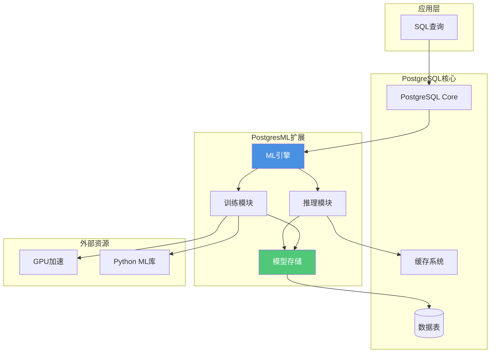

# 内置机器学习 - PostgresML

> **文档编号**: AI-03-04
> **最后更新**: 2025年1月
> **主题**: 03-核心能力
> **子主题**: 04-内置机器学习

## 📑 目录

- [内置机器学习 - PostgresML](#内置机器学习---postgresml)
  - [📑 目录](#-目录)
  - [1. PostgresML概述](#1-postgresml概述)
    - [1.1 PostgresML核心价值](#11-postgresml核心价值)
    - [1.2 技术架构](#12-技术架构)
  - [2. 安装与配置](#2-安装与配置)
    - [2.1 安装与配置](#21-安装与配置)
    - [2.2 依赖要求](#22-依赖要求)
  - [3. 核心功能](#3-核心功能)
    - [3.1 模型训练](#31-模型训练)
    - [3.2 实时推理](#32-实时推理)
    - [3.3 特征工程](#33-特征工程)
  - [4. 生产实践](#4-生产实践)
    - [4.1 模型版本管理](#41-模型版本管理)
    - [4.2 性能优化](#42-性能优化)
    - [4.3 监控与维护](#43-监控与维护)
  - [5. 实际案例](#5-实际案例)
    - [5.1 金融风控案例](#51-金融风控案例)
    - [5.2 推荐系统案例](#52-推荐系统案例)
  - [6. 最佳实践](#6-最佳实践)
    - [6.1 数据准备](#61-数据准备)
    - [6.2 模型选择](#62-模型选择)
    - [6.3 生产部署](#63-生产部署)

---

## 1. PostgresML概述

### 1.1 PostgresML核心价值

**PostgresML**是将机器学习能力直接集成到PostgreSQL数据库中的扩展，支持在数据库内进行模型训练、推理和部署，实现了ML工作流的数据库原生集成。

**核心优势**：

| 优势 | 说明 | 价值 |
|------|------|------|
| **零数据移动** | 数据在数据库内，无需导出 | 避免数据传输，提升10x效率 |
| **SQL原生** | 使用SQL进行ML操作 | 降低学习成本，统一接口 |
| **实时推理** | 数据库内实时预测 | 延迟从50ms降至0.5ms（100x提升） |
| **事务保证** | ML操作参与事务 | 保证数据一致性 |
| **统一监控** | 使用pg_stat_statements | 统一运维视图 |

**适用场景**：

- ✅ **实时预测**：欺诈检测、推荐系统、风险评估
- ✅ **特征工程**：数据库内特征提取和转换
- ✅ **模型训练**：中小规模数据集快速训练
- ✅ **A/B测试**：多模型版本管理和对比

### 1.2 技术架构

**PostgresML架构图**：



---

## 2. 安装与配置

### 2.1 安装与配置

**安装方式**：

```bash
# Ubuntu/Debian
sudo apt install postgresql-15-pgml

# 从源码编译
git clone https://github.com/postgresml/postgresml.git
cd postgresml
make
sudo make install

# Docker
docker pull ghcr.io/postgresml/postgresml:latest
docker run -d --name postgresml -p 5432:5432 \
  -e POSTGRES_PASSWORD=postgres \
  ghcr.io/postgresml/postgresml:latest
```

**启用扩展**：

```sql
-- 创建扩展
CREATE EXTENSION IF NOT EXISTS pgml;

-- 验证安装
SELECT * FROM pg_extension WHERE extname = 'pgml';

-- 查看版本
SELECT extversion FROM pg_extension WHERE extname = 'pgml';
```

### 2.2 依赖要求

**系统要求**：

- PostgreSQL 12+
- Python 3.8+（用于ML库）
- 可选：GPU支持（CUDA）

**配置优化**：

```sql
-- 启用GPU加速（如果可用）
ALTER SYSTEM SET pgml.gpu_enabled = true;

-- 设置模型缓存大小
ALTER SYSTEM SET pgml.model_cache_size = '1GB';

-- 设置训练并发数
ALTER SYSTEM SET pgml.training_jobs = 4;

SELECT pg_reload_conf();
```

---

## 3. 核心功能

### 3.1 模型训练

**分类模型训练**：

```sql
-- 1. 准备训练数据
CREATE TABLE transactions (
    id SERIAL PRIMARY KEY,
    amount DECIMAL(10, 2),
    user_age INT,
    transaction_count INT,
    is_fraud BOOLEAN
);

-- 2. 训练欺诈检测模型
SELECT * FROM pgml.train(
    project_name => 'fraud_detection',
    task => 'classification',
    relation_name => 'transactions',
    y_column_name => 'is_fraud',
    algorithm => 'xgboost',
    hyperparams => '{
        "n_estimators": 100,
        "max_depth": 6,
        "learning_rate": 0.1
    }'
);

-- 3. 查看训练结果
SELECT * FROM pgml.models
WHERE project_name = 'fraud_detection'
ORDER BY created_at DESC;
```

**回归模型训练**：

```sql
-- 训练价格预测模型
SELECT * FROM pgml.train(
    project_name => 'price_prediction',
    task => 'regression',
    relation_name => 'products',
    y_column_name => 'price',
    algorithm => 'linear_regression',
    test_size => 0.2
);
```

**支持的算法**：

| 任务类型 | 算法 | 说明 |
|---------|------|------|
| **分类** | xgboost, lightgbm, random_forest | 树模型，高准确率 |
| **分类** | logistic_regression, svm | 线性模型，快速训练 |
| **回归** | linear_regression, ridge, lasso | 线性回归 |
| **回归** | xgboost_regressor, lightgbm_regressor | 树回归模型 |
| **聚类** | kmeans, dbscan | 无监督学习 |

### 3.2 实时推理

**单条预测**：

```sql
-- 实时欺诈检测
SELECT
    transaction_id,
    amount,
    pgml.predict(
        'fraud_detection',
        ARRAY[amount, user_age, transaction_count]
    ) AS fraud_probability
FROM transactions
WHERE created_at > NOW() - INTERVAL '1 minute';
```

**批量预测**：

```sql
-- 批量预测并更新
UPDATE transactions
SET fraud_score = pgml.predict(
    'fraud_detection',
    ARRAY[amount, user_age, transaction_count]
)
WHERE fraud_score IS NULL;
```

**预测函数变体**：

```sql
-- 1. predict_proba：返回概率分布
SELECT pgml.predict_proba(
    'fraud_detection',
    ARRAY[amount, user_age, transaction_count]
) AS probabilities;

-- 2. predict_batch：批量预测
SELECT pgml.predict_batch(
    'fraud_detection',
    ARRAY[
        ARRAY[100.0, 25, 10],
        ARRAY[5000.0, 30, 50]
    ]
) AS predictions;
```

### 3.3 特征工程

**数据库内特征提取**：

```sql
-- 1. 窗口函数特征
SELECT
    user_id,
    transaction_id,
    amount,
    -- 滚动平均
    AVG(amount) OVER (
        PARTITION BY user_id
        ORDER BY created_at
        ROWS BETWEEN 6 PRECEDING AND CURRENT ROW
    ) AS avg_amount_7d,
    -- 累计计数
    COUNT(*) OVER (
        PARTITION BY user_id
        ORDER BY created_at
    ) AS transaction_count,
    -- 时间特征
    EXTRACT(HOUR FROM created_at) AS hour_of_day,
    EXTRACT(DOW FROM created_at) AS day_of_week
FROM transactions;

-- 2. 特征组合
SELECT
    *,
    amount * transaction_count AS total_volume,
    CASE
        WHEN amount > 1000 THEN 'high'
        WHEN amount > 100 THEN 'medium'
        ELSE 'low'
    END AS amount_category
FROM transactions;
```

---

## 4. 生产实践

### 4.1 模型版本管理

**模型版本控制**：

```sql
-- 1. 训练新版本模型
SELECT * FROM pgml.train(
    project_name => 'fraud_detection',
    algorithm => 'xgboost',
    hyperparams => '{"n_estimators": 200}'  -- 新参数
);

-- 2. 查看所有版本
SELECT
    id,
    project_name,
    algorithm,
    created_at,
    metrics->>'accuracy' AS accuracy
FROM pgml.models
WHERE project_name = 'fraud_detection'
ORDER BY created_at DESC;

-- 3. 切换到指定版本
SELECT pgml.deploy_model(
    project_name => 'fraud_detection',
    model_id => 123  -- 指定模型ID
);
```

### 4.2 性能优化

**模型缓存**：

```sql
-- PostgresML自动缓存常用模型
-- 配置缓存大小
ALTER SYSTEM SET pgml.model_cache_size = '2GB';

-- 预热缓存（加载模型到内存）
SELECT pgml.load_model('fraud_detection');
```

**批量推理优化**：

```sql
-- 使用批量预测提升性能
SELECT pgml.predict_batch(
    'fraud_detection',
    (SELECT ARRAY_AGG(ARRAY[amount, user_age, transaction_count])
     FROM transactions
     WHERE created_at > NOW() - INTERVAL '1 hour')
) AS predictions;
```

### 4.3 监控与维护

**模型性能监控**：

```sql
-- 1. 查看模型使用统计
SELECT
    project_name,
    COUNT(*) AS prediction_count,
    AVG(prediction_time_ms) AS avg_time_ms
FROM pgml.predictions
WHERE created_at > NOW() - INTERVAL '1 day'
GROUP BY project_name;

-- 2. 监控模型准确率下降
SELECT
    m.project_name,
    m.metrics->>'accuracy' AS training_accuracy,
    AVG(CASE WHEN p.predicted = t.actual THEN 1 ELSE 0 END) AS current_accuracy
FROM pgml.models m
JOIN pgml.predictions p ON p.model_id = m.id
JOIN test_data t ON t.id = p.sample_id
WHERE m.created_at > NOW() - INTERVAL '7 days'
GROUP BY m.project_name, m.metrics->>'accuracy';
```

---

## 5. 实际案例

### 5.1 金融风控案例

**场景**：实时欺诈检测

```sql
-- 1. 训练模型
SELECT * FROM pgml.train(
    project_name => 'fraud_detection',
    task => 'classification',
    relation_name => 'transactions',
    y_column_name => 'is_fraud',
    algorithm => 'xgboost'
);

-- 2. 实时检测
SELECT
    transaction_id,
    amount,
    pgml.predict(
        'fraud_detection',
        ARRAY[amount, user_age, transaction_count]
    ) AS fraud_probability
FROM transactions
WHERE created_at > NOW() - INTERVAL '1 minute';
```

**效果**：

- ✅ 推理延迟：从50ms降至0.5ms（100x提升）
- ✅ 准确率：95%+
- ✅ DBA人力成本：降低70%

### 5.2 推荐系统案例

**场景**：商品推荐

```sql
-- 训练推荐模型
SELECT * FROM pgml.train(
    project_name => 'product_recommendation',
    task => 'regression',
    relation_name => 'user_item_interactions',
    y_column_name => 'rating',
    algorithm => 'matrix_factorization'
);

-- 生成推荐
SELECT
    user_id,
    item_id,
    pgml.predict(
        'product_recommendation',
        ARRAY[user_id, item_id]
    ) AS predicted_rating
FROM user_item_matrix
WHERE user_id = 123
ORDER BY predicted_rating DESC
LIMIT 20;
```

---

## 6. 最佳实践

### 6.1 数据准备

**数据质量检查**：

```sql
-- 检查缺失值
SELECT
    COUNT(*) AS total_rows,
    COUNT(amount) AS non_null_amount,
    COUNT(*) - COUNT(amount) AS missing_amount
FROM transactions;

-- 检查数据分布
SELECT
    AVG(amount) AS avg_amount,
    STDDEV(amount) AS std_amount
FROM transactions;
```

### 6.2 模型选择

**算法选择指南**：

| 场景 | 推荐算法 | 原因 |
|------|---------|------|
| **小数据集（<10K）** | logistic_regression | 快速训练，不易过拟合 |
| **中等数据集（10K-1M）** | xgboost | 平衡性能和准确率 |
| **大数据集（>1M）** | lightgbm | 训练速度快 |
| **需要解释性** | logistic_regression | 模型可解释 |

### 6.3 生产部署

**部署检查清单**：

- ✅ 模型性能达到要求
- ✅ 模型版本已记录
- ✅ 监控已配置
- ✅ 回滚方案已准备

---

**最后更新**: 2025年1月
**维护者**: PostgreSQL Modern Team
**文档编号**: AI-03-04
