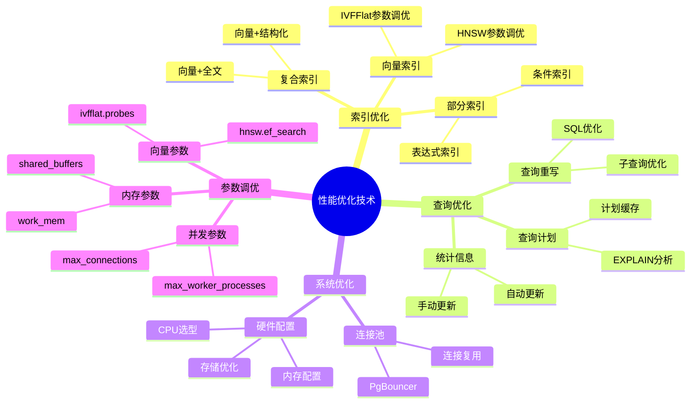
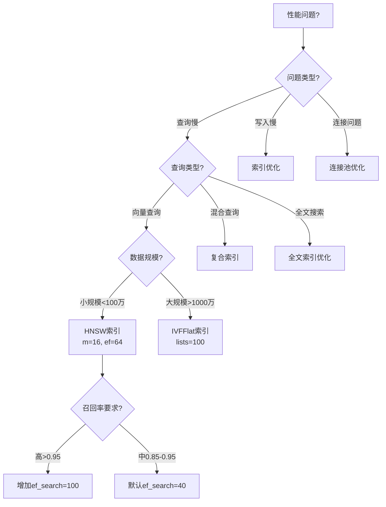
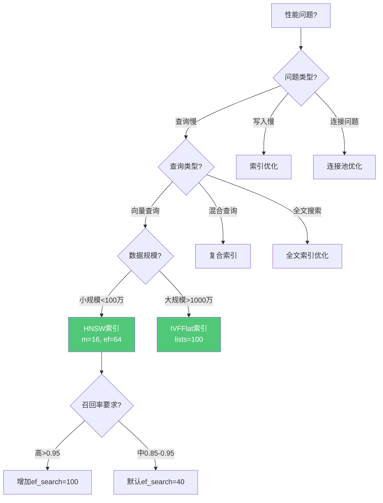
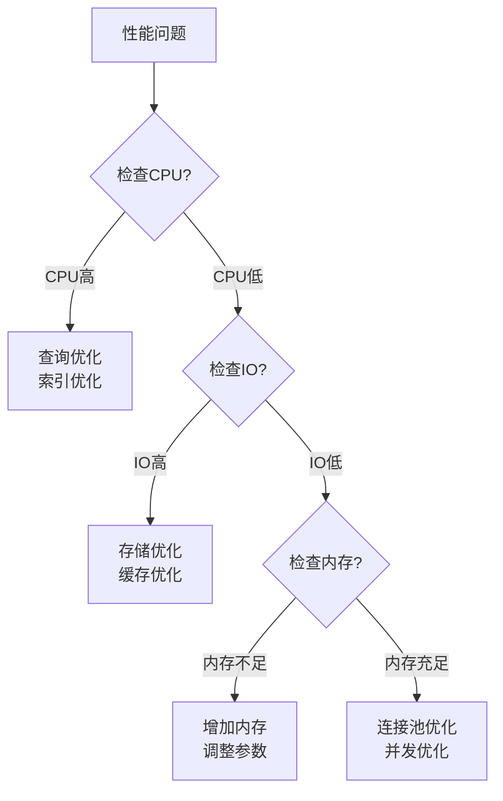

---

> **📋 文档来源**: `PostgreSQL_AI\01-核心基础\性能优化技术.md`
> **📅 复制日期**: 2025-12-22
> **⚠️ 注意**: 本文档为复制版本，原文件保持不变

---

# 性能优化技术

> **文档编号**: AI-03-05
> **最后更新**: 2025年1月
> **主题**: 01-核心基础
> **子主题**: 05-性能优化技术

## 📑 目录

- [性能优化技术](#性能优化技术)
  - [📑 目录](#-目录)
  - [1. 性能优化概述](#1-性能优化概述)
    - [1.1 性能优化思维导图](#11-性能优化思维导图)
    - [1.2 性能优化决策树](#12-性能优化决策树)
  - [2. 索引优化](#2-索引优化)
    - [2.1 向量索引优化](#21-向量索引优化)
    - [2.2 复合索引优化](#22-复合索引优化)
    - [2.3 部分索引优化](#23-部分索引优化)
  - [3. 查询优化](#3-查询优化)
    - [3.1 查询计划分析](#31-查询计划分析)
    - [3.2 查询重写](#32-查询重写)
    - [3.3 统计信息更新](#33-统计信息更新)
  - [4. 连接池优化](#4-连接池优化)
    - [4.1 PgBouncer配置](#41-pgbouncer配置)
    - [4.2 连接池模式](#42-连接池模式)
    - [4.3 连接池调优](#43-连接池调优)
  - [5. 硬件配置优化](#5-硬件配置优化)
    - [5.1 CPU选型](#51-cpu选型)
    - [5.2 内存配置](#52-内存配置)
    - [5.3 存储配置](#53-存储配置)
    - [5.4 网络配置](#54-网络配置)
  - [6. PostgreSQL参数调优](#6-postgresql参数调优)
    - [6.1 内存参数](#61-内存参数)
    - [6.2 并发参数](#62-并发参数)
    - [6.3 向量查询参数](#63-向量查询参数)
  - [7. 性能监控与诊断](#7-性能监控与诊断)
    - [7.1 性能监控](#71-性能监控)
    - [7.2 慢查询分析](#72-慢查询分析)
    - [7.3 瓶颈诊断](#73-瓶颈诊断)
  - [2. 索引优化](#2-索引优化-1)
    - [2.1 向量索引优化](#21-向量索引优化-1)
    - [2.2 复合索引优化](#22-复合索引优化-1)
    - [2.3 部分索引优化](#23-部分索引优化-1)
  - [3. 查询优化](#3-查询优化-1)
    - [3.1 查询计划分析](#31-查询计划分析-1)
    - [3.2 查询重写](#32-查询重写-1)
    - [3.3 统计信息更新](#33-统计信息更新-1)
  - [4. 连接池优化](#4-连接池优化-1)
    - [4.1 PgBouncer配置](#41-pgbouncer配置-1)
    - [4.2 连接池模式](#42-连接池模式-1)
    - [4.3 连接池调优](#43-连接池调优-1)
  - [5. 硬件配置优化](#5-硬件配置优化-1)
    - [5.1 CPU选型](#51-cpu选型-1)
    - [5.2 内存配置](#52-内存配置-1)
    - [5.3 存储配置](#53-存储配置-1)
    - [5.4 网络配置](#54-网络配置-1)
  - [6. PostgreSQL参数调优](#6-postgresql参数调优-1)
    - [6.1 内存参数](#61-内存参数-1)
    - [6.2 并发参数](#62-并发参数-1)
    - [6.3 向量查询参数](#63-向量查询参数-1)
  - [7. 性能监控与诊断](#7-性能监控与诊断-1)
    - [7.1 性能监控](#71-性能监控-1)
    - [7.2 慢查询分析](#72-慢查询分析-1)
    - [7.3 瓶颈诊断](#73-瓶颈诊断-1)

---

## 1. 性能优化概述

### 1.1 性能优化思维导图



### 1.2 性能优化决策树



---

## 2. 索引优化

### 2.1 向量索引优化

**HNSW索引参数调优**：

```sql
-- 1. 高召回率场景（推荐系统、RAG）
CREATE INDEX ON documents
USING hnsw(embedding vector_cosine_ops)
WITH (
    m = 32,              -- 增加连接数，提升查询性能
    ef_construction = 128  -- 增加构建范围，提升索引质量
);

-- 查询时提升召回率
SET hnsw.ef_search = 100;  -- 默认40，增加可提升召回率

-- 2. 平衡性能场景（通用）
CREATE INDEX ON documents
USING hnsw(embedding vector_cosine_ops)
WITH (
    m = 16,              -- 默认值，平衡性能和存储
    ef_construction = 64  -- 默认值，平衡质量和构建时间
);
```

**IVFFlat索引参数调优**：

```sql
-- 大规模数据（>1000万向量）
CREATE INDEX ON documents
USING ivfflat(embedding vector_cosine_ops)
WITH (lists = 100);  -- lists = rows / 1000 到 rows / 10000

-- 查询时提升召回率
SET ivfflat.probes = 10;  -- 默认1，增加可提升召回率但降低性能
```

### 2.2 复合索引优化

**向量+结构化复合索引**：

```sql
-- 使用部分索引（特定类别）
CREATE INDEX ON documents
USING hnsw(embedding vector_cosine_ops)
WHERE category_id = 1;  -- 只为特定类别创建索引

-- 表达式索引（向量+计算字段）
CREATE INDEX ON documents
USING hnsw(embedding vector_cosine_ops)
WHERE created_at > NOW() - INTERVAL '1 year';  -- 只索引最近一年的数据
```

### 2.3 部分索引优化

**条件索引**：

```sql
-- 只为活跃数据创建索引
CREATE INDEX ON documents
USING hnsw(embedding vector_cosine_ops)
WHERE created_at > NOW() - INTERVAL '1 year';

-- 只为特定类别创建索引
CREATE INDEX ON documents
USING hnsw(embedding vector_cosine_ops)
WHERE category_id IN (1, 2, 3);
```

---

## 3. 查询优化

### 3.1 查询计划分析

**EXPLAIN分析**：

```sql
-- 详细EXPLAIN (ANALYZE, BUFFERS, TIMING)
EXPLAIN (ANALYZE, BUFFERS, TIMING)
SELECT * FROM documents
WHERE embedding <=> query_vec < 0.3
ORDER BY embedding <=> query_vec
LIMIT 10;
```

### 3.2 查询重写

**SQL优化技巧**：

```sql
-- 1. 使用LIMIT提前终止
SELECT * FROM documents
ORDER BY embedding <=> query_vec
LIMIT 10;  -- 提前终止，只返回Top 10

-- 2. 设置相似度阈值提前过滤
SELECT * FROM documents
WHERE embedding <=> query_vec < 0.3  -- 提前过滤
ORDER BY embedding <=> query_vec
LIMIT 10;

-- 3. 避免在WHERE子句中使用函数
-- 优化前：函数计算
SELECT * FROM documents
WHERE 1 - (embedding <=> query_vec) > 0.7;

-- 优化后：直接使用距离
SELECT * FROM documents
WHERE embedding <=> query_vec < 0.3;  -- 等价但更快
```

### 3.3 统计信息更新

**统计信息优化**：

```sql
-- 手动更新统计信息
ANALYZE documents;

-- 更新特定列统计信息
ANALYZE documents(embedding, category_id);

-- 增加统计信息采样
ALTER TABLE documents
ALTER COLUMN embedding SET STATISTICS 1000;
```

---

## 4. 连接池优化

### 4.1 PgBouncer配置

**PgBouncer配置示例**：

```ini
[pgbouncer]
pool_mode = transaction  # 事务级连接池（推荐）
max_client_conn = 1000    # 最大客户端连接
default_pool_size = 25   # 默认连接池大小
min_pool_size = 5        # 最小连接池大小
max_db_connections = 100 # 每个数据库最大连接
```

### 4.2 连接池模式

**连接池模式对比**：

| 模式 | 说明 | 适用场景 | 限制 |
|------|------|---------|------|
| **session** | 会话级连接池 | 需要会话状态 | 连接数=客户端数 |
| **transaction** | 事务级连接池（推荐） | 大多数场景 | 连接数<客户端数 |
| **statement** | 语句级连接池 | 简单查询 | 不支持事务 |

### 4.3 连接池调优

**连接池大小计算**：

```text
连接池大小 = (max_connections - superuser_reserved_connections) /
            (平均并发事务数 * 1.2)

示例：
- max_connections = 100
- 平均并发事务数 = 20
- 连接池大小 = (100 - 3) / (20 * 1.2) ≈ 4
- 推荐值：25（考虑峰值）
```

---

## 5. 硬件配置优化

### 5.1 CPU选型

**CPU选型指南**：

| 场景 | 推荐CPU | 说明 |
|------|---------|------|
| **向量查询密集** | 高主频CPU（>3.5GHz） | 单线程性能重要 |
| **并发查询多** | 多核CPU（>16核） | 并行查询能力 |
| **混合负载** | 平衡型CPU | 兼顾单核和多核 |

### 5.2 内存配置

**内存配置原则**（32GB RAM示例）：

```sql
ALTER SYSTEM SET shared_buffers = '8GB';  -- RAM的25%
ALTER SYSTEM SET effective_cache_size = '24GB';  -- RAM的75%
ALTER SYSTEM SET work_mem = '64MB';  -- 假设max_connections=100
ALTER SYSTEM SET maintenance_work_mem = '2GB';
```

### 5.3 存储配置

**存储选型**：

| 存储类型 | 适用场景 | IOPS | 延迟 |
|---------|---------|------|------|
| **NVMe SSD** | 生产环境（推荐） | 100K+ | <1ms |
| **SATA SSD** | 开发测试 | 10K+ | <5ms |
| **HDD** | 归档数据 | 100+ | 10ms+ |

**存储优化**：

```sql
-- 调整随机IO成本（SSD环境）
ALTER SYSTEM SET random_page_cost = 1.1;  -- 默认4.0
ALTER SYSTEM SET effective_io_concurrency = 200;  -- SSD环境
```

### 5.4 网络配置

**网络优化**：

```sql
ALTER SYSTEM SET max_connections = 200;
ALTER SYSTEM SET listen_addresses = '*';
```

---

## 6. PostgreSQL参数调优

### 6.1 内存参数

**核心内存参数**：

```sql
-- 1. 共享内存（最重要）
ALTER SYSTEM SET shared_buffers = '8GB';  -- RAM的25%

-- 2. 工作内存
ALTER SYSTEM SET work_mem = '64MB';  -- 每个操作的内存

-- 3. 有效缓存大小
ALTER SYSTEM SET effective_cache_size = '24GB';  -- RAM的75%
```

### 6.2 并发参数

**并发配置**：

```sql
ALTER SYSTEM SET max_connections = 200;
ALTER SYSTEM SET max_worker_processes = 8;  -- CPU核心数
ALTER SYSTEM SET max_parallel_workers_per_gather = 4;
ALTER SYSTEM SET max_parallel_workers = 8;
```

### 6.3 向量查询参数

**pgvector参数调优**：

```sql
-- HNSW查询参数
SET hnsw.ef_search = 100;  -- 默认40，增加可提升召回率

-- IVFFlat查询参数
SET ivfflat.probes = 10;  -- 默认1，增加可提升召回率

-- 向量操作符成本
SET cpu_operator_cost = 0.0025;  -- 降低向量操作成本
```

---

## 7. 性能监控与诊断

### 7.1 性能监控

**pg_stat_statements监控**：

```sql
-- 启用pg_stat_statements
CREATE EXTENSION IF NOT EXISTS pg_stat_statements;

-- 查看慢查询
SELECT
    query,
    calls,
    mean_exec_time,
    max_exec_time
FROM pg_stat_statements
WHERE mean_exec_time > 100  -- 平均执行时间>100ms
ORDER BY mean_exec_time DESC
LIMIT 10;

-- 查看向量查询统计
SELECT
    query,
    calls,
    mean_exec_time
FROM pg_stat_statements
WHERE query LIKE '%<=>%' OR query LIKE '%<->%'
ORDER BY mean_exec_time DESC;
```

### 7.2 慢查询分析

**慢查询识别**：

```sql
-- 启用慢查询日志
ALTER SYSTEM SET log_min_duration_statement = 1000;  -- 记录>1s的查询
SELECT pg_reload_conf();

-- 分析慢查询
SELECT
    query,
    calls,
    mean_exec_time,
    (mean_exec_time * calls) AS total_time
FROM pg_stat_statements
WHERE mean_exec_time > 100
ORDER BY total_time DESC
LIMIT 20;
```

### 7.3 瓶颈诊断

**系统资源监控**：

```sql
-- 查看表大小
SELECT
    schemaname,
    tablename,
    pg_size_pretty(pg_total_relation_size(schemaname||'.'||tablename)) AS size
FROM pg_tables
WHERE schemaname = 'public'
ORDER BY pg_total_relation_size(schemaname||'.'||tablename) DESC;

-- 查看索引大小
SELECT
    indexname,
    pg_size_pretty(pg_relation_size(indexrelid)) AS index_size
FROM pg_stat_user_indexes
WHERE schemaname = 'public'
ORDER BY pg_relation_size(indexrelid) DESC;

-- 查看当前连接
SELECT
    count(*) AS total_connections,
    count(*) FILTER (WHERE state = 'active') AS active,
    count(*) FILTER (WHERE state = 'idle') AS idle
FROM pg_stat_activity;
```

---

**最后更新**: 2025年1月
**维护者**: PostgreSQL Modern Team
**文档编号**: AI-03-05

    索引优化
      向量索引
        HNSW参数调优
        IVFFlat参数调优
      复合索引
        向量+结构化
        向量+全文
      部分索引
        条件索引
        表达式索引
    查询优化
      查询计划
        EXPLAIN分析
        计划缓存
      查询重写
        SQL优化
        子查询优化
      统计信息
        自动更新
        手动更新
    系统优化
      连接池
        PgBouncer
        连接复用
      硬件配置
        CPU选型
        内存配置
        存储优化
    参数调优
      内存参数
        shared_buffers
        work_mem
      并发参数
        max_connections
        max_worker_processes
      向量参数
        hnsw.ef_search
        ivfflat.probes

```

### 1.2 性能优化决策树



---

## 2. 索引优化

### 2.1 向量索引优化

**HNSW索引参数调优**：

```sql
-- 1. 高召回率场景（推荐系统、RAG）
CREATE INDEX ON documents
USING hnsw(embedding vector_cosine_ops)
WITH (
    m = 32,              -- 增加连接数，提升查询性能
    ef_construction = 128  -- 增加构建范围，提升索引质量
);

-- 查询时提升召回率
SET hnsw.ef_search = 100;  -- 默认40，增加可提升召回率

-- 2. 平衡性能场景（通用）
CREATE INDEX ON documents
USING hnsw(embedding vector_cosine_ops)
WITH (
    m = 16,              -- 默认值，平衡性能和存储
    ef_construction = 64  -- 默认值，平衡质量和构建时间
);

-- 3. 写入频繁场景
CREATE INDEX ON documents
USING hnsw(embedding vector_cosine_ops)
WITH (
    m = 8,               -- 减少连接数，提升写入性能
    ef_construction = 32  -- 减少构建范围，加快构建速度
);
```

**IVFFlat索引参数调优**：

```sql
-- 1. 大规模数据（>1000万向量）
CREATE INDEX ON documents
USING ivfflat(embedding vector_cosine_ops)
WITH (lists = 100);  -- lists = rows / 1000 到 rows / 10000

-- 查询时提升召回率
SET ivfflat.probes = 10;  -- 默认1，增加可提升召回率但降低性能

-- 2. 超大规模数据（>1亿向量）
CREATE INDEX ON documents
USING ivfflat(embedding vector_cosine_ops)
WITH (lists = 1000);  -- 增加lists数量

SET ivfflat.probes = 20;  -- 增加probes数量
```

**索引选择指南**：

| 场景 | 推荐索引 | 参数配置 | 性能指标 |
|------|---------|---------|----------|
| **小规模（<100万）** | HNSW | m=16, ef_construction=64 | QPS>10K, P95<5ms |
| **中等规模（100万-1000万）** | HNSW | m=16, ef_construction=64 | QPS>5K, P95<10ms |
| **大规模（>1000万）** | IVFFlat | lists=100 | QPS>2K, P95<20ms |
| **高召回率（>0.98）** | HNSW | m=32, ef_search=100 | 召回率>0.98 |
| **写入频繁** | IVFFlat | lists=50 | 写入性能更好 |

### 2.2 复合索引优化

**向量+结构化复合索引**：

```sql
-- 1. 创建复合索引（向量+类别）
CREATE INDEX ON documents
USING hnsw(embedding vector_cosine_ops)
INCLUDE (category_id, created_at);

-- 2. 使用部分索引（特定类别）
CREATE INDEX ON documents
USING hnsw(embedding vector_cosine_ops)
WHERE category_id = 1;  -- 只为特定类别创建索引

-- 3. 表达式索引（向量+计算字段）
CREATE INDEX ON documents
USING hnsw(embedding vector_cosine_ops)
WHERE created_at > NOW() - INTERVAL '1 year';  -- 只索引最近一年的数据
```

**向量+全文搜索复合索引**：

```sql
-- 1. 向量索引
CREATE INDEX ON documents
USING hnsw(embedding vector_cosine_ops);

-- 2. 全文搜索索引
CREATE INDEX ON documents
USING GIN(to_tsvector('english', content));

-- 3. 组合使用
SELECT
    id,
    content,
    1 - (embedding <=> query_vec) AS vector_score,
    ts_rank(to_tsvector('english', content), query_ts) AS text_score
FROM documents,
     plainto_tsquery('english', 'keywords') AS query_ts
WHERE
    to_tsvector('english', content) @@ query_ts  -- 全文索引
    AND embedding <=> query_vec < 0.3  -- 向量索引
ORDER BY (vector_score * 0.7 + text_score * 0.3) DESC;
```

### 2.3 部分索引优化

**条件索引**：

```sql
-- 1. 只为活跃数据创建索引
CREATE INDEX ON documents
USING hnsw(embedding vector_cosine_ops)
WHERE created_at > NOW() - INTERVAL '1 year';

-- 2. 只为特定类别创建索引
CREATE INDEX ON documents
USING hnsw(embedding vector_cosine_ops)
WHERE category_id IN (1, 2, 3);

-- 3. 只为高质量数据创建索引
CREATE INDEX ON documents
USING hnsw(embedding vector_cosine_ops)
WHERE quality_score > 0.8;
```

**表达式索引**：

```sql
-- 1. 基于表达式的向量索引
CREATE INDEX ON documents
USING hnsw((embedding::float[]::vector) vector_cosine_ops);

-- 2. 基于函数的索引
CREATE INDEX ON documents
USING hnsw(normalize(embedding) vector_cosine_ops);
```

---

## 3. 查询优化

### 3.1 查询计划分析

**EXPLAIN分析**：

```sql
-- 1. 基础EXPLAIN
EXPLAIN SELECT * FROM documents
WHERE embedding <=> query_vec < 0.3
ORDER BY embedding <=> query_vec
LIMIT 10;

-- 2. 详细EXPLAIN (ANALYZE, BUFFERS, TIMING)
EXPLAIN (ANALYZE, BUFFERS, TIMING)
SELECT * FROM documents
WHERE embedding <=> query_vec < 0.3
ORDER BY embedding <=> query_vec
LIMIT 10;

-- 3. 检查索引使用情况（带性能测试）
EXPLAIN (ANALYZE, BUFFERS, TIMING)
SELECT * FROM documents
WHERE
    category_id = 1
    AND embedding <=> query_vec < 0.3
ORDER BY embedding <=> query_vec
LIMIT 10;
```

**查询计划优化**：

```sql
-- 1. 强制使用索引
SET enable_seqscan = off;  -- 禁用顺序扫描
SET enable_indexscan = on;  -- 启用索引扫描

-- 2. 调整成本参数
SET random_page_cost = 1.1;  -- SSD环境降低随机IO成本
SET cpu_index_tuple_cost = 0.005;  -- 降低索引扫描成本

-- 3. 查看计划缓存
SELECT * FROM pg_prepared_statements;
```

### 3.2 查询重写

**SQL优化技巧**：

```sql
-- 1. 使用LIMIT提前终止
-- 优化前：全表扫描后排序
SELECT * FROM documents
ORDER BY embedding <=> query_vec;

-- 优化后：使用索引+LIMIT
SELECT * FROM documents
ORDER BY embedding <=> query_vec
LIMIT 10;  -- 提前终止，只返回Top 10

-- 2. 设置相似度阈值提前过滤
-- 优化前：计算所有相似度
SELECT * FROM documents
ORDER BY embedding <=> query_vec;

-- 优化后：提前过滤
SELECT * FROM documents
WHERE embedding <=> query_vec < 0.3  -- 提前过滤
ORDER BY embedding <=> query_vec
LIMIT 10;

-- 3. 避免在WHERE子句中使用函数
-- 优化前：函数计算
SELECT * FROM documents
WHERE 1 - (embedding <=> query_vec) > 0.7;

-- 优化后：直接使用距离
SELECT * FROM documents
WHERE embedding <=> query_vec < 0.3;  -- 等价但更快
```

**子查询优化**：

```sql
-- 1. 使用CTE优化复杂查询
WITH query_vec AS (
    SELECT ai.embedding_openai('text-embedding-3-small', 'query') AS vec
),
filtered_docs AS (
    SELECT id, content, embedding
    FROM documents
    WHERE category_id = 1
)
SELECT
    fd.id,
    fd.content,
    1 - (fd.embedding <=> qv.vec) AS similarity
FROM filtered_docs fd, query_vec qv
ORDER BY fd.embedding <=> qv.vec
LIMIT 10;

-- 2. 使用物化视图预计算
CREATE MATERIALIZED VIEW popular_documents AS
SELECT id, content, embedding
FROM documents
WHERE view_count > 1000;

CREATE INDEX ON popular_documents
USING hnsw(embedding vector_cosine_ops);

-- 定期刷新
REFRESH MATERIALIZED VIEW CONCURRENTLY popular_documents;
```

### 3.3 统计信息更新

**自动更新统计信息**：

```sql
-- 1. 配置自动更新
ALTER TABLE documents
SET (autovacuum_analyze_scale_factor = 0.05);  -- 5%变化时更新

-- 2. 手动更新统计信息
ANALYZE documents;

-- 3. 更新特定列统计信息
ANALYZE documents(embedding, category_id);
```

**统计信息优化**：

```sql
-- 1. 增加统计信息采样
ALTER TABLE documents
SET (n_distinct = 1000000);  -- 指定唯一值数量

-- 2. 设置统计目标
ALTER TABLE documents
ALTER COLUMN embedding SET STATISTICS 1000;  -- 增加统计信息采样

-- 3. 查看统计信息
SELECT
    schemaname,
    tablename,
    attname,
    n_distinct,
    correlation
FROM pg_stats
WHERE tablename = 'documents';
```

---

## 4. 连接池优化

### 4.1 PgBouncer配置

**PgBouncer安装配置**：

```bash
# Ubuntu/Debian
sudo apt install pgbouncer

# 配置文件：/etc/pgbouncer/pgbouncer.ini
```

**PgBouncer配置示例**：

```ini
[databases]
mydb = host=localhost port=5432 dbname=mydb

[pgbouncer]
pool_mode = transaction  # 事务级连接池
max_client_conn = 1000    # 最大客户端连接
default_pool_size = 25   # 默认连接池大小
min_pool_size = 5        # 最小连接池大小
reserve_pool_size = 5    # 保留连接池
reserve_pool_timeout = 3 # 保留连接超时
max_db_connections = 100 # 每个数据库最大连接
max_user_connections = 100 # 每个用户最大连接
```

### 4.2 连接池模式

**连接池模式对比**：

| 模式 | 说明 | 适用场景 | 限制 |
|------|------|---------|------|
| **session** | 会话级连接池 | 需要会话状态 | 连接数=客户端数 |
| **transaction** | 事务级连接池（推荐） | 大多数场景 | 连接数<客户端数 |
| **statement** | 语句级连接池 | 简单查询 | 不支持事务 |

**推荐配置**：

```ini
# 事务级连接池（推荐）
pool_mode = transaction
default_pool_size = 25
max_client_conn = 1000
```

### 4.3 连接池调优

**连接池大小计算**：

```text
连接池大小 = (max_connections - superuser_reserved_connections) /
            (平均并发事务数 * 1.2)

示例：
- max_connections = 100
- superuser_reserved_connections = 3
- 平均并发事务数 = 20

连接池大小 = (100 - 3) / (20 * 1.2) ≈ 4
推荐值：25（考虑峰值）
```

**连接池监控**：

```sql
-- 查看连接池状态
SELECT * FROM pgbouncer.pools;
SELECT * FROM pgbouncer.stats;
SELECT * FROM pgbouncer.clients;
```

---

## 5. 硬件配置优化

### 5.1 CPU选型

**CPU选型指南**：

| 场景 | 推荐CPU | 说明 |
|------|---------|------|
| **向量查询密集** | 高主频CPU（>3.5GHz） | 单线程性能重要 |
| **并发查询多** | 多核CPU（>16核） | 并行查询能力 |
| **混合负载** | 平衡型CPU | 兼顾单核和多核 |

**CPU配置建议**：

- ✅ **主频优先**：向量计算依赖CPU主频
- ✅ **缓存重要**：大L3缓存提升性能
- ✅ **AVX支持**：向量指令加速计算

### 5.2 内存配置

**内存配置原则**：

```text
shared_buffers = RAM * 25%  # PostgreSQL共享内存
effective_cache_size = RAM * 75%  # 查询规划器假设的缓存
work_mem = (RAM - shared_buffers) / (max_connections * 2)  # 工作内存
```

**内存配置示例**（32GB RAM）：

```sql
-- 32GB RAM服务器配置
ALTER SYSTEM SET shared_buffers = '8GB';
ALTER SYSTEM SET effective_cache_size = '24GB';
ALTER SYSTEM SET work_mem = '64MB';  -- 假设max_connections=100
ALTER SYSTEM SET maintenance_work_mem = '2GB';
ALTER SYSTEM SET max_wal_size = '4GB';
```

### 5.3 存储配置

**存储选型**：

| 存储类型 | 适用场景 | IOPS | 延迟 |
|---------|---------|------|------|
| **NVMe SSD** | 生产环境（推荐） | 100K+ | <1ms |
| **SATA SSD** | 开发测试 | 10K+ | <5ms |
| **HDD** | 归档数据 | 100+ | 10ms+ |

**存储优化**：

```sql
-- 1. 调整随机IO成本（SSD环境）
ALTER SYSTEM SET random_page_cost = 1.1;  -- 默认4.0

-- 2. 调整顺序IO成本
ALTER SYSTEM SET seq_page_cost = 1.0;  -- 默认1.0

-- 3. 调整IO并发
ALTER SYSTEM SET effective_io_concurrency = 200;  -- SSD环境
```

### 5.4 网络配置

**网络优化**：

```sql
-- 1. 调整TCP参数（操作系统级别）
# /etc/sysctl.conf
net.core.somaxconn = 4096
net.ipv4.tcp_max_syn_backlog = 4096

-- 2. PostgreSQL网络配置
ALTER SYSTEM SET listen_addresses = '*';
ALTER SYSTEM SET max_connections = 200;
```

---

## 6. PostgreSQL参数调优

### 6.1 内存参数

**核心内存参数**：

```sql
-- 1. 共享内存（最重要）
ALTER SYSTEM SET shared_buffers = '8GB';  -- RAM的25%

-- 2. 工作内存
ALTER SYSTEM SET work_mem = '64MB';  -- 每个操作的内存

-- 3. 维护工作内存
ALTER SYSTEM SET maintenance_work_mem = '2GB';  -- VACUUM等操作

-- 4. 有效缓存大小
ALTER SYSTEM SET effective_cache_size = '24GB';  -- RAM的75%

-- 5. WAL缓冲区
ALTER SYSTEM SET wal_buffers = '16MB';
```

**内存参数调优指南**：

| 参数 | 推荐值 | 说明 |
|------|--------|------|
| **shared_buffers** | RAM * 25% | 数据库缓存 |
| **effective_cache_size** | RAM * 75% | 查询规划器假设 |
| **work_mem** | (RAM - shared_buffers) / (max_connections * 2) | 每个操作内存 |
| **maintenance_work_mem** | RAM * 10% | 维护操作内存 |

### 6.2 并发参数

**并发配置**：

```sql
-- 1. 最大连接数
ALTER SYSTEM SET max_connections = 200;

-- 2. 工作进程数
ALTER SYSTEM SET max_worker_processes = 8;  -- CPU核心数

-- 3. 并行工作进程
ALTER SYSTEM SET max_parallel_workers_per_gather = 4;
ALTER SYSTEM SET max_parallel_workers = 8;

-- 4. 并行查询阈值
ALTER SYSTEM SET parallel_setup_cost = 1000;
ALTER SYSTEM SET parallel_tuple_cost = 0.01;
ALTER SYSTEM SET min_parallel_table_scan_size = '8MB';
ALTER SYSTEM SET min_parallel_index_scan_size = '512KB';
```

### 6.3 向量查询参数

**pgvector参数调优**：

```sql
-- 1. HNSW查询参数
SET hnsw.ef_search = 100;  -- 默认40，增加可提升召回率

-- 2. IVFFlat查询参数
SET ivfflat.probes = 10;  -- 默认1，增加可提升召回率

-- 3. 向量操作符成本
SET cpu_operator_cost = 0.0025;  -- 降低向量操作成本
```

**查询参数优化**：

```sql
-- 1. 启用并行查询
SET max_parallel_workers_per_gather = 4;
SET parallel_setup_cost = 1000;

-- 2. 调整成本参数
SET random_page_cost = 1.1;  -- SSD环境
SET cpu_index_tuple_cost = 0.005;

-- 3. 向量查询优化
SET enable_seqscan = off;  -- 强制使用索引
SET enable_indexscan = on;
```

---

## 7. 性能监控与诊断

### 7.1 性能监控

**pg_stat_statements监控**：

```sql
-- 1. 启用pg_stat_statements
CREATE EXTENSION IF NOT EXISTS pg_stat_statements;

-- 2. 查看慢查询
SELECT
    query,
    calls,
    mean_exec_time,
    max_exec_time,
    total_exec_time
FROM pg_stat_statements
WHERE mean_exec_time > 100  -- 平均执行时间>100ms
ORDER BY mean_exec_time DESC
LIMIT 10;

-- 3. 查看向量查询统计
SELECT
    query,
    calls,
    mean_exec_time,
    (shared_blks_hit + shared_blks_read) AS total_blocks
FROM pg_stat_statements
WHERE query LIKE '%<=>%' OR query LIKE '%<->%'
ORDER BY mean_exec_time DESC;
```

**索引使用监控**：

```sql
-- 1. 查看索引使用情况
SELECT
    schemaname,
    tablename,
    indexname,
    idx_scan,
    idx_tup_read,
    idx_tup_fetch
FROM pg_stat_user_indexes
WHERE indexname LIKE '%hnsw%' OR indexname LIKE '%ivfflat%'
ORDER BY idx_scan DESC;

-- 2. 查看未使用的索引
SELECT
    schemaname,
    tablename,
    indexname,
    idx_scan
FROM pg_stat_user_indexes
WHERE idx_scan = 0
  AND indexname LIKE '%vector%';
```

### 7.2 慢查询分析

**慢查询识别**：

```sql
-- 1. 启用慢查询日志
ALTER SYSTEM SET log_min_duration_statement = 1000;  -- 记录>1s的查询
ALTER SYSTEM SET log_line_prefix = '%t [%p]: [%l-1] user=%u,db=%d,app=%a,client=%h ';
SELECT pg_reload_conf();

-- 2. 分析慢查询（带性能测试）
EXPLAIN (ANALYZE, BUFFERS, TIMING)
SELECT
    query,
    calls,
    mean_exec_time,
    max_exec_time,
    (mean_exec_time * calls) AS total_time
FROM pg_stat_statements
WHERE mean_exec_time > 100
ORDER BY total_time DESC
LIMIT 20;
```

**查询计划分析**：

```sql
-- 1. 分析查询计划（带性能测试）
EXPLAIN (ANALYZE, BUFFERS, TIMING)
SELECT * FROM documents
WHERE embedding <=> query_vec < 0.3
ORDER BY embedding <=> query_vec
LIMIT 10;

-- 2. 检查索引使用（带性能测试）
EXPLAIN (ANALYZE, BUFFERS, TIMING)
SELECT * FROM documents
WHERE category_id = 1
  AND embedding <=> query_vec < 0.3
ORDER BY embedding <=> query_vec
LIMIT 10;
```

### 7.3 瓶颈诊断

**性能瓶颈诊断流程**：



**系统资源监控**：

```sql
-- 1. 查看数据库大小
SELECT
    pg_database.datname,
    pg_size_pretty(pg_database_size(pg_database.datname)) AS size
FROM pg_database
ORDER BY pg_database_size(pg_database.datname) DESC;

-- 2. 查看表大小
SELECT
    schemaname,
    tablename,
    pg_size_pretty(pg_total_relation_size(schemaname||'.'||tablename)) AS size
FROM pg_tables
WHERE schemaname = 'public'
ORDER BY pg_total_relation_size(schemaname||'.'||tablename) DESC;

-- 3. 查看索引大小
SELECT
    schemaname,
    tablename,
    indexname,
    pg_size_pretty(pg_relation_size(indexrelid)) AS index_size
FROM pg_stat_user_indexes
WHERE schemaname = 'public'
ORDER BY pg_relation_size(indexrelid) DESC;
```

**连接监控**：

```sql
-- 1. 查看当前连接
SELECT
    count(*) AS total_connections,
    count(*) FILTER (WHERE state = 'active') AS active,
    count(*) FILTER (WHERE state = 'idle') AS idle
FROM pg_stat_activity;

-- 2. 查看长时间运行的查询
SELECT
    pid,
    now() - pg_stat_activity.query_start AS duration,
    query,
    state
FROM pg_stat_activity
WHERE (now() - pg_stat_activity.query_start) > interval '5 minutes';
```

---

**最后更新**: 2025年1月
**维护者**: PostgreSQL Modern Team
**文档编号**: AI-03-05
