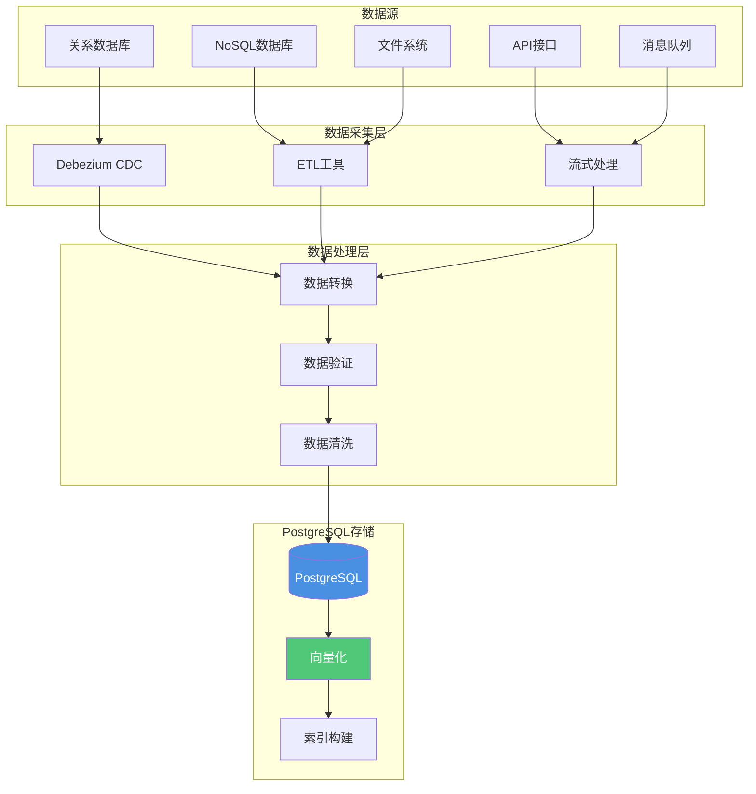

---

> **📋 文档来源**: `PostgreSQL_AI\03-核心能力\数据注入与治理.md`
> **📅 复制日期**: 2025-12-22
> **⚠️ 注意**: 本文档为复制版本，原文件保持不变

---

# 数据注入与治理

> **文档编号**: AI-03-06
> **最后更新**: 2025年1月
> **主题**: 03-核心能力
> **子主题**: 06-数据注入与治理

## 📑 目录

- [数据注入与治理](#数据注入与治理)
  - [📑 目录](#-目录)
  - [1. 数据注入概述](#1-数据注入概述)
    - [1.1 数据注入架构](#11-数据注入架构)
    - [1.2 数据注入方式](#12-数据注入方式)
  - [2. 数据注入实现](#2-数据注入实现)
    - [2.1 CDC变更数据捕获](#21-cdc变更数据捕获)
    - [2.2 批量ETL处理](#22-批量etl处理)
    - [2.3 实时流式处理](#23-实时流式处理)
  - [3. 数据治理](#3-数据治理)
    - [3.1 数据验证](#31-数据验证)
    - [3.2 数据清洗](#32-数据清洗)
    - [3.3 数据标准化](#33-数据标准化)
  - [4. 数据版本管理](#4-数据版本管理)
    - [4.1 版本控制策略](#41-版本控制策略)
    - [4.2 数据快照](#42-数据快照)
    - [4.3 数据回滚](#43-数据回滚)
  - [5. 自动化向量化](#5-自动化向量化)
    - [5.1 pg\_ai Vectorizer](#51-pg_ai-vectorizer)
    - [5.2 批量处理](#52-批量处理)
    - [5.3 增量更新](#53-增量更新)
  - [6. 监控与告警](#6-监控与告警)
    - [6.1 数据质量监控](#61-数据质量监控)
    - [6.2 处理进度监控](#62-处理进度监控)
    - [6.3 异常告警](#63-异常告警)

---

## 1. 数据注入概述

### 1.1 数据注入架构

**数据注入流程**：



### 1.2 数据注入方式

**数据注入方式对比**：

| 方式 | 延迟 | 吞吐量 | 适用场景 |
|------|------|--------|---------|
| **COPY命令** | 低 | 100万行/s | 批量导入 |
| **INSERT批量** | 中 | 10万行/s | 小批量导入 |
| **逻辑复制** | 低 | 实时 | 实时同步 |
| **CDC（Debezium）** | 低 | 5万条/s | 变更捕获 |
| **流式处理（Flink）** | 低 | 10万+QPS | 实时计算 |

---

## 2. 数据注入实现

### 2.1 CDC变更数据捕获

**Debezium配置**：

```sql
-- 1. 配置逻辑复制
ALTER SYSTEM SET wal_level = logical;
ALTER SYSTEM SET max_replication_slots = 10;
SELECT pg_reload_conf();

-- 2. 创建复制槽
SELECT pg_create_logical_replication_slot('debezium_slot', 'pgoutput');

-- 3. Debezium自动捕获变更并写入PostgreSQL
-- 配置自动创建向量表结构
CREATE TABLE user_behavior_vectors (
    id SERIAL PRIMARY KEY,
    user_id INT REFERENCES users(id),
    behavior_vec vector(1536),
    created_at TIMESTAMPTZ DEFAULT NOW()
);
```

**实时数据同步**：

```sql
-- 使用逻辑复制实时同步
CREATE PUBLICATION my_publication FOR TABLE users, items, behaviors;

-- 订阅端
CREATE SUBSCRIPTION my_subscription
CONNECTION 'host=source_db port=5432 dbname=mydb'
PUBLICATION my_publication;
```

### 2.2 批量ETL处理

**COPY命令批量导入**：

```sql
-- 1. 从CSV文件导入
COPY documents(title, content, category_id)
FROM '/path/to/data.csv'
WITH (FORMAT csv, HEADER true);

-- 2. 批量生成向量
UPDATE documents
SET embedding = ai.embedding_openai(
    'text-embedding-3-small',
    title || ' ' || content
)
WHERE embedding IS NULL;

-- 3. 批量创建索引
CREATE INDEX CONCURRENTLY ON documents
USING hnsw(embedding vector_cosine_ops);
```

**Airflow ETL管道**：

```python
from airflow.providers.postgres.operators.postgres import PostgresOperator
from airflow.operators.python import PythonOperator

def generate_embeddings(**context):
    # 批量生成embedding
    docs = fetch_unprocessed_docs()
    vectors = openai.Embedding.create(input=docs)
    # 批量写入PostgreSQL
    postgres_hook.insert_rows("document_vectors", vectors)

with DAG('ai_data_pipeline') as dag:
    extract = PostgresOperator(
        sql="SELECT * FROM raw_documents WHERE processed=false"
    )
    embed = PythonOperator(python_callable=generate_embeddings)
    load = PostgresOperator(
        sql="UPDATE raw_documents SET processed=true"
    )
    extract >> embed >> load
```

### 2.3 实时流式处理

**Flink流式处理**：

```sql
-- Flink实时写入PostgreSQL
-- 使用UPSERT语义保证exactly-once
INSERT INTO documents (id, content, embedding)
VALUES (?, ?, ?)
ON CONFLICT (id) DO UPDATE
SET content = EXCLUDED.content,
    embedding = EXCLUDED.embedding;
```

**Kafka Connect集成**：

```sql
-- Kafka Connect JDBC Sink配置
-- 批量写入PostgreSQL
INSERT INTO documents (content, embedding)
SELECT content, embedding
FROM kafka_messages
WHERE processed = false
LIMIT 1000;
```

---

## 3. 数据治理

### 3.1 数据验证

**数据质量检查**：

```sql
-- 1. 检查缺失值
SELECT
    COUNT(*) AS total_rows,
    COUNT(embedding) AS non_null_embedding,
    COUNT(*) - COUNT(embedding) AS missing_embedding
FROM documents;

-- 2. 检查向量维度
SELECT
    id,
    CASE
        WHEN array_length(embedding::float[], 1) != 1536 THEN 'Wrong dimension'
        ELSE 'OK'
    END AS dimension_check
FROM documents
WHERE embedding IS NOT NULL;

-- 3. 检查数据范围
SELECT
    COUNT(*) AS total,
    COUNT(*) FILTER (WHERE rating BETWEEN 0 AND 5) AS valid_rating,
    COUNT(*) FILTER (WHERE rating NOT BETWEEN 0 AND 5) AS invalid_rating
FROM items;
```

### 3.2 数据清洗

**数据清洗SQL**：

```sql
-- 1. 清理HTML标签
UPDATE documents
SET content = regexp_replace(content, '<[^>]+>', '', 'g')
WHERE content ~ '<[^>]+>';

-- 2. 标准化空格
UPDATE documents
SET content = regexp_replace(content, '\s+', ' ', 'g');

-- 3. 移除特殊字符
UPDATE documents
SET content = regexp_replace(content, '[^\w\s\u4e00-\u9fa5]', '', 'g');

-- 4. 截断过长文本
UPDATE documents
SET content = left(content, 2000)
WHERE length(content) > 2000;
```

### 3.3 数据标准化

**数据标准化处理**：

```sql
-- 1. 文本标准化
CREATE OR REPLACE FUNCTION normalize_text(text_content TEXT)
RETURNS TEXT AS $$
BEGIN
    -- 移除HTML标签
    text_content = regexp_replace(text_content, '<[^>]+>', '', 'g');
    -- 标准化空格
    text_content = regexp_replace(text_content, '\s+', ' ', 'g');
    -- 截断过长文本
    IF length(text_content) > 2000 THEN
        text_content = left(text_content, 2000);
    END IF;
    RETURN trim(text_content);
END;
$$ LANGUAGE plpgsql;

-- 2. 使用标准化函数
UPDATE documents
SET content = normalize_text(content)
WHERE content IS NOT NULL;
```

---

## 4. 数据版本管理

### 4.1 版本控制策略

**数据版本表设计**：

```sql
-- 1. 主数据表
CREATE TABLE documents (
    id SERIAL PRIMARY KEY,
    content TEXT NOT NULL,
    embedding vector(1536),
    version INT DEFAULT 1,
    created_at TIMESTAMPTZ DEFAULT NOW(),
    updated_at TIMESTAMPTZ DEFAULT NOW()
);

-- 2. 版本历史表
CREATE TABLE document_versions (
    id SERIAL PRIMARY KEY,
    document_id INT REFERENCES documents(id),
    content TEXT,
    embedding vector(1536),
    version INT,
    created_at TIMESTAMPTZ DEFAULT NOW()
);

-- 3. 版本触发器
CREATE OR REPLACE FUNCTION save_document_version()
RETURNS TRIGGER AS $$
BEGIN
    INSERT INTO document_versions (document_id, content, embedding, version)
    VALUES (OLD.id, OLD.content, OLD.embedding, OLD.version);
    NEW.version = OLD.version + 1;
    NEW.updated_at = NOW();
    RETURN NEW;
END;
$$ LANGUAGE plpgsql;

CREATE TRIGGER document_version_trigger
BEFORE UPDATE ON documents
FOR EACH ROW
EXECUTE FUNCTION save_document_version();
```

### 4.2 数据快照

**数据快照创建**：

```sql
-- 1. 创建快照表
CREATE TABLE documents_snapshot_20250101 AS
SELECT * FROM documents;

-- 2. 使用时间点恢复
-- 配置WAL归档
ALTER SYSTEM SET archive_mode = on;
ALTER SYSTEM SET archive_command = 'cp %p /backup/wal/%f';

-- 3. 创建基础备份
SELECT pg_start_backup('backup_label');
-- 复制数据目录
SELECT pg_stop_backup();
```

### 4.3 数据回滚

**数据回滚实现**：

```sql
-- 1. 回滚到指定版本
UPDATE documents d
SET
    content = dv.content,
    embedding = dv.embedding,
    version = dv.version
FROM document_versions dv
WHERE d.id = dv.document_id
  AND dv.version = 5;  -- 回滚到版本5

-- 2. 回滚到指定时间点
UPDATE documents d
SET
    content = dv.content,
    embedding = dv.embedding
FROM document_versions dv
WHERE d.id = dv.document_id
  AND dv.created_at = (
      SELECT MAX(created_at)
      FROM document_versions
      WHERE document_id = d.id
        AND created_at <= '2025-01-01 00:00:00'
  );
```

---

## 5. 自动化向量化

### 5.1 pg_ai Vectorizer

**自动向量化配置**：

```sql
-- 1. 创建自动向量化器
SELECT ai.create_vectorizer(
    'documents'::regclass,
    destination => 'document_chunks',
    embedding => ai.embedding_openai('text-embedding-3-small', 'content'),
    chunking => ai.chunking_recursive_character_text_splitter(
        'content',
        chunk_size => 500,
        chunk_overlap => 100
    )
);

-- 2. 插入文档，自动向量化
INSERT INTO documents(title, content)
VALUES ('New Document', 'Content here...');
-- 自动生成chunks和embeddings
```

### 5.2 批量处理

**批量向量化**：

```sql
-- 1. 批量生成向量
WITH batch AS (
    SELECT id, content
    FROM documents
    WHERE embedding IS NULL
    LIMIT 1000
)
UPDATE documents d
SET embedding = ai.embedding_openai('text-embedding-3-small', d.content)
FROM batch b
WHERE d.id = b.id;

-- 2. 使用COPY批量导入
COPY documents(title, content)
FROM '/path/to/data.csv'
WITH (FORMAT csv, HEADER true);

-- 3. 批量创建索引
CREATE INDEX CONCURRENTLY ON documents
USING hnsw(embedding vector_cosine_ops);
```

### 5.3 增量更新

**增量向量化**：

```sql
-- 1. 增量更新向量
CREATE OR REPLACE FUNCTION incremental_vectorize()
RETURNS void AS $$
BEGIN
    UPDATE documents
    SET embedding = ai.embedding_openai('text-embedding-3-small', content)
    WHERE embedding IS NULL
      AND updated_at > NOW() - INTERVAL '1 day'
    LIMIT 1000;
END;
$$ LANGUAGE plpgsql;

-- 2. 定时任务（使用pg_cron）
SELECT cron.schedule(
    'incremental-vectorize',
    '*/5 * * * *',  -- 每5分钟
    'SELECT incremental_vectorize();'
);
```

---

## 6. 监控与告警

### 6.1 数据质量监控

**数据质量检查**：

```sql
-- 1. 检查向量完整性
SELECT
    COUNT(*) AS total_documents,
    COUNT(embedding) AS documents_with_embedding,
    COUNT(*) - COUNT(embedding) AS missing_embeddings,
    ROUND(COUNT(embedding)::float / COUNT(*) * 100, 2) AS completeness_pct
FROM documents;

-- 2. 检查向量质量
SELECT
    id,
    CASE
        WHEN array_length(embedding::float[], 1) != 1536 THEN 'Wrong dimension'
        WHEN embedding IS NULL THEN 'Missing'
        ELSE 'OK'
    END AS quality_status
FROM documents
WHERE quality_status != 'OK';

-- 3. 检查数据一致性
SELECT
    COUNT(*) AS total_chunks,
    COUNT(DISTINCT document_id) AS unique_documents,
    COUNT(*) - COUNT(DISTINCT document_id) AS duplicate_chunks
FROM document_chunks;
```

### 6.2 处理进度监控

**处理进度跟踪**：

```sql
-- 1. 创建处理进度表
CREATE TABLE processing_status (
    table_name TEXT PRIMARY KEY,
    total_rows BIGINT,
    processed_rows BIGINT,
    last_processed_at TIMESTAMPTZ,
    status TEXT  -- processing, completed, error
);

-- 2. 更新处理进度
UPDATE processing_status
SET
    processed_rows = (
        SELECT COUNT(*) FROM documents WHERE embedding IS NOT NULL
    ),
    last_processed_at = NOW()
WHERE table_name = 'documents';

-- 3. 查看处理进度
SELECT
    table_name,
    total_rows,
    processed_rows,
    ROUND(processed_rows::float / total_rows * 100, 2) AS progress_pct,
    last_processed_at
FROM processing_status;
```

### 6.3 异常告警

**异常检测与告警**：

```sql
-- 1. 检测异常数据
CREATE OR REPLACE FUNCTION check_data_quality()
RETURNS TABLE(issue TEXT, count BIGINT) AS $$
BEGIN
    RETURN QUERY
    SELECT 'Missing embeddings'::TEXT, COUNT(*)
    FROM documents
    WHERE embedding IS NULL
    UNION ALL
    SELECT 'Wrong dimension'::TEXT, COUNT(*)
    FROM documents
    WHERE array_length(embedding::float[], 1) != 1536
    UNION ALL
    SELECT 'Duplicate content'::TEXT, COUNT(*)
    FROM (
        SELECT content, COUNT(*)
        FROM documents
        GROUP BY content
        HAVING COUNT(*) > 1
    ) AS dupes;
END;
$$ LANGUAGE plpgsql;

-- 2. 定时检查（使用pg_cron）
SELECT cron.schedule(
    'data-quality-check',
    '0 * * * *',  -- 每小时
    $$
    DO $$
    DECLARE
        issue_count INT;
    BEGIN
        SELECT COUNT(*) INTO issue_count FROM check_data_quality();
        IF issue_count > 0 THEN
            RAISE WARNING 'Data quality issues detected: %', issue_count;
        END IF;
    END;
    $$;
    $$
);
```

---

**最后更新**: 2025年1月
**维护者**: PostgreSQL Modern Team
**文档编号**: AI-03-06
