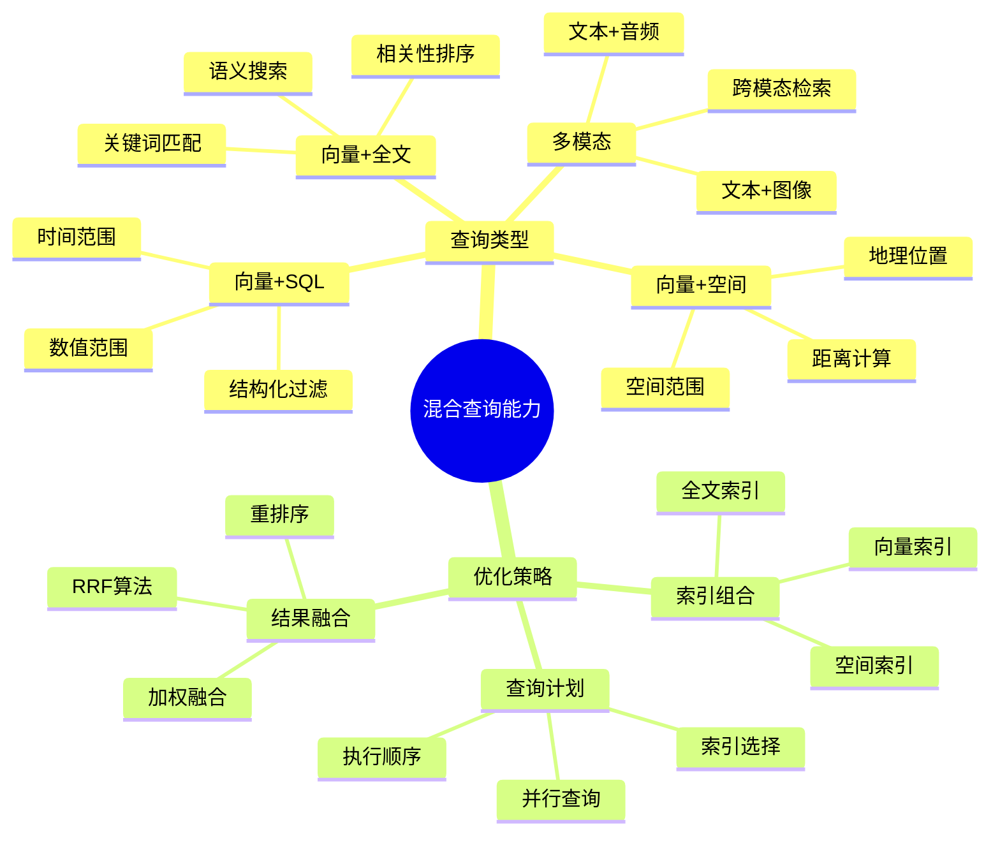
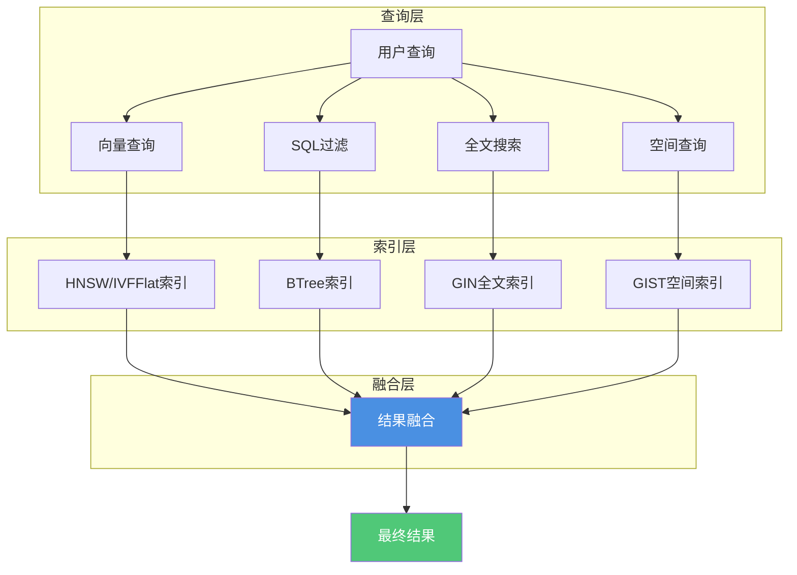

---

> **📋 文档来源**: `PostgreSQL_AI\03-核心能力\混合查询能力.md`
> **📅 复制日期**: 2025-12-22
> **⚠️ 注意**: 本文档为复制版本，原文件保持不变

---

# 混合查询能力

> **文档编号**: AI-03-03
> **最后更新**: 2025年1月
> **主题**: 03-核心能力
> **子主题**: 03-混合查询能力

## 📑 目录

- [混合查询能力](#混合查询能力)
  - [📑 目录](#-目录)
  - [1. 混合查询概述](#1-混合查询概述)
    - [1.1 混合查询能力思维导图](#11-混合查询能力思维导图)
    - [1.2 混合查询架构图](#12-混合查询架构图)
  - [2. 混合查询实现](#2-混合查询实现)
    - [2.1 向量+SQL联合查询](#21-向量sql联合查询)
    - [2.2 向量+全文搜索](#22-向量全文搜索)
    - [2.3 向量+地理空间查询](#23-向量地理空间查询)
    - [2.4 多模态数据查询](#24-多模态数据查询)
  - [3. 优化策略](#3-优化策略)
    - [3.1 索引组合策略](#31-索引组合策略)
    - [3.2 查询计划优化](#32-查询计划优化)
    - [3.3 结果融合算法](#33-结果融合算法)
  - [4. 性能优化](#4-性能优化)
    - [4.1 查询性能优化](#41-查询性能优化)
    - [4.2 索引优化](#42-索引优化)
    - [4.3 缓存策略](#43-缓存策略)

---

## 1. 混合查询概述

### 1.1 混合查询能力思维导图



### 1.2 混合查询架构图

**混合查询架构**：



**核心价值**：

- ✅ **统一查询**：单条SQL完成多种查询
- ✅ **性能优化**：利用多种索引加速
- ✅ **结果准确**：结合多种信号提升相关性
- ✅ **开发简化**：无需多系统集成

---

## 2. 混合查询实现

### 2.1 向量+SQL联合查询

**基础混合查询**：

```sql
-- 向量搜索 + 结构化过滤
SELECT
    id,
    content,
    category_id,
    rating,
    1 - (embedding <=> query_vec) AS similarity
FROM documents
WHERE
    -- 向量相似度过滤
    1 - (embedding <=> query_vec) > 0.7
    -- 结构化过滤
    AND category_id = 1
    AND rating > 4.0
    AND created_at > NOW() - INTERVAL '30 days'
ORDER BY embedding <=> query_vec
LIMIT 10;
```

**复杂混合查询**：

```sql
-- 多条件混合查询
WITH query_vec AS (
    SELECT ai.embedding_openai('text-embedding-3-small', 'user query') AS vec
)
SELECT
    d.id,
    d.title,
    d.content,
    d.category_id,
    d.rating,
    d.price,
    -- 向量相似度
    1 - (d.embedding <=> qv.vec) AS vector_score,
    -- 综合得分
    (1 - (d.embedding <=> qv.vec)) * 0.6 +  -- 向量权重60%
    (d.rating / 5.0) * 0.3 +                  -- 评分权重30%
    CASE WHEN d.price BETWEEN 100 AND 500 THEN 0.1 ELSE 0 END  -- 价格权重10%
    AS final_score
FROM documents d, query_vec qv
WHERE
    -- 向量过滤
    1 - (d.embedding <=> qv.vec) > 0.7
    -- 结构化过滤
    AND d.category_id IN (1, 2, 3)
    AND d.rating > 4.0
    AND d.price BETWEEN 100 AND 500
    AND d.status = 'active'
ORDER BY final_score DESC
LIMIT 20;
```

### 2.2 向量+全文搜索

**混合检索实现**：

```sql
-- 1. 向量检索结果
WITH vector_results AS (
    SELECT
        id,
        content,
        1 - (embedding <=> query_vec) AS vector_score
    FROM documents
    WHERE 1 - (embedding <=> query_vec) > 0.7
    ORDER BY embedding <=> query_vec
    LIMIT 50
),
-- 2. 全文检索结果
text_results AS (
    SELECT
        id,
        content,
        ts_rank(
            to_tsvector('english', content),
            plainto_tsquery('english', 'search keywords')
        ) AS text_score
    FROM documents
    WHERE to_tsvector('english', content)
          @@ plainto_tsquery('english', 'search keywords')
    ORDER BY text_score DESC
    LIMIT 50
)
-- 3. 结果融合（RRF算法）
SELECT
    COALESCE(vr.id, tr.id) AS id,
    COALESCE(vr.content, tr.content) AS content,
    COALESCE(vr.vector_score, 0) AS vector_score,
    COALESCE(tr.text_score, 0) AS text_score,
    -- RRF融合得分
    1.0 / (60 + COALESCE(vr.vector_rank, 100)) +
    1.0 / (60 + COALESCE(tr.text_rank, 100)) AS rrf_score
FROM vector_results vr
FULL OUTER JOIN text_results tr ON vr.id = tr.id
ORDER BY rrf_score DESC
LIMIT 10;
```

**简化版混合检索**：

```sql
-- 使用加权融合
SELECT
    id,
    content,
    -- 向量相似度
    1 - (embedding <=> query_vec) AS vector_score,
    -- 全文搜索相关性
    ts_rank(
        to_tsvector('english', content),
        plainto_tsquery('english', 'keywords')
    ) AS text_score,
    -- 加权融合
    (1 - (embedding <=> query_vec)) * 0.7 +
    ts_rank(
        to_tsvector('english', content),
        plainto_tsquery('english', 'keywords')
    ) * 0.3 AS final_score
FROM documents
WHERE
    to_tsvector('english', content) @@ plainto_tsquery('english', 'keywords')
    AND 1 - (embedding <=> query_vec) > 0.7
ORDER BY final_score DESC
LIMIT 10;
```

### 2.3 向量+地理空间查询

**空间+向量混合查询**：

```sql
-- 向量搜索 + 地理位置过滤
WITH query_vec AS (
    SELECT ai.embedding_openai('text-embedding-3-small', 'restaurant') AS vec
),
user_location AS (
    SELECT ST_Point(-122.4194, 37.7749)::geography AS loc
)
SELECT
    l.id,
    l.name,
    l.description,
    -- 向量相似度
    1 - (l.description_vec <=> qv.vec) AS semantic_score,
    -- 地理距离（米）
    ST_Distance(l.location, ul.loc) AS distance_meters,
    -- 综合得分
    (1 - (l.description_vec <=> qv.vec)) * 0.6 +  -- 语义权重60%
    CASE
        WHEN ST_Distance(l.location, ul.loc) < 1000 THEN 0.4  -- 1公里内
        WHEN ST_Distance(l.location, ul.loc) < 5000 THEN 0.2  -- 5公里内
        ELSE 0
    END AS final_score
FROM listings l,
     query_vec qv,
     user_location ul
WHERE
    -- 向量相似度过滤
    1 - (l.description_vec <=> qv.vec) > 0.7
    -- 地理位置过滤（5公里内）
    AND ST_DWithin(l.location, ul.loc, 5000)
ORDER BY final_score DESC
LIMIT 20;
```

### 2.4 多模态数据查询

**文本+图像混合检索**：

```sql
-- 文本向量 + 图像向量混合查询
WITH text_query AS (
    SELECT ai.embedding_openai('text-embedding-3-small', 'sunset beach') AS vec
),
image_query AS (
    SELECT ai.embedding_image('clip-vit-base-patch32', image_data) AS vec
)
SELECT
    m.id,
    m.text_content,
    m.image_url,
    -- 文本相似度
    1 - (m.text_vec <=> tq.vec) AS text_score,
    -- 图像相似度
    1 - (m.image_vec <=> iq.vec) AS image_score,
    -- 多模态融合得分
    (1 - (m.text_vec <=> tq.vec)) * 0.5 +
    (1 - (m.image_vec <=> iq.vec)) * 0.5 AS multimodal_score
FROM multimodal_content m,
     text_query tq,
     image_query iq
WHERE
    (1 - (m.text_vec <=> tq.vec) > 0.7 OR
     1 - (m.image_vec <=> iq.vec) > 0.7)
ORDER BY multimodal_score DESC
LIMIT 10;
```

---

## 3. 优化策略

### 3.1 索引组合策略

**多索引组合**：

```sql
-- 1. 向量索引
CREATE INDEX ON documents
USING hnsw(embedding vector_cosine_ops);

-- 2. 全文搜索索引
CREATE INDEX ON documents
USING GIN(to_tsvector('english', content));

-- 3. BTree索引（结构化字段）
CREATE INDEX ON documents (category_id, rating DESC, created_at DESC);

-- 4. 空间索引（如果适用）
CREATE INDEX ON listings USING GIST(location);

-- 5. 复合索引（向量+结构化）
CREATE INDEX ON documents
USING hnsw(embedding vector_cosine_ops)
INCLUDE (category_id, rating);
```

### 3.2 查询计划优化

**查询计划分析**：

```sql
-- 分析混合查询计划（带性能测试）
EXPLAIN (ANALYZE, BUFFERS, TIMING)
SELECT
    id,
    content,
    1 - (embedding <=> query_vec) AS vector_score,
    ts_rank(to_tsvector('english', content), query_ts) AS text_score
FROM documents,
     plainto_tsquery('english', 'keywords') AS query_ts
WHERE
    to_tsvector('english', content) @@ query_ts
    AND embedding <=> query_vec < 0.3
ORDER BY (vector_score * 0.7 + text_score * 0.3) DESC
LIMIT 10;
```

**查询优化技巧**：

```sql
-- 1. 使用CTE优化查询计划
WITH vector_filtered AS (
    SELECT id, content, embedding
    FROM documents
    WHERE embedding <=> query_vec < 0.3
    LIMIT 100  -- 先过滤向量，减少后续处理
),
text_filtered AS (
    SELECT id, content
    FROM vector_filtered
    WHERE to_tsvector('english', content) @@ query_ts
)
SELECT
    id,
    content,
    1 - (embedding <=> query_vec) AS vector_score,
    ts_rank(to_tsvector('english', content), query_ts) AS text_score
FROM text_filtered
ORDER BY (vector_score * 0.7 + text_score * 0.3) DESC
LIMIT 10;
```

### 3.3 结果融合算法

**RRF（Reciprocal Rank Fusion）算法**：

```sql
-- RRF融合实现
WITH vector_results AS (
    SELECT
        id,
        content,
        ROW_NUMBER() OVER (ORDER BY embedding <=> query_vec) AS vector_rank
    FROM documents
    WHERE embedding <=> query_vec < 0.3
    LIMIT 50
),
text_results AS (
    SELECT
        id,
        content,
        ROW_NUMBER() OVER (
            ORDER BY ts_rank(
                to_tsvector('english', content),
                plainto_tsquery('english', 'keywords')
            ) DESC
        ) AS text_rank
    FROM documents
    WHERE to_tsvector('english', content)
          @@ plainto_tsquery('english', 'keywords')
    LIMIT 50
)
SELECT
    COALESCE(vr.id, tr.id) AS id,
    COALESCE(vr.content, tr.content) AS content,
    -- RRF得分（k=60）
    1.0 / (60 + COALESCE(vr.vector_rank, 100)) +
    1.0 / (60 + COALESCE(tr.text_rank, 100)) AS rrf_score
FROM vector_results vr
FULL OUTER JOIN text_results tr ON vr.id = tr.id
ORDER BY rrf_score DESC
LIMIT 10;
```

**加权融合算法**：

```sql
-- 加权融合（更简单）
SELECT
    id,
    content,
    -- 向量得分（归一化到0-1）
    (1 - (embedding <=> query_vec)) AS vector_score,
    -- 文本得分（归一化）
    ts_rank(
        to_tsvector('english', content),
        plainto_tsquery('english', 'keywords')
    ) / 10.0 AS text_score,  -- 假设最大rank为10
    -- 加权融合
    (1 - (embedding <=> query_vec)) * 0.7 +
    (ts_rank(...) / 10.0) * 0.3 AS final_score
FROM documents
WHERE
    to_tsvector('english', content) @@ plainto_tsquery('english', 'keywords')
    AND embedding <=> query_vec < 0.3
ORDER BY final_score DESC
LIMIT 10;
```

---

## 4. 性能优化

### 4.1 查询性能优化

**查询优化技巧**：

```sql
-- 1. 使用LIMIT提前终止
SELECT ... LIMIT 10;  -- 只返回Top 10

-- 2. 设置阈值提前过滤
WHERE similarity > 0.7  -- 提前过滤低相似度结果

-- 3. 使用物化视图预计算
CREATE MATERIALIZED VIEW hybrid_search_cache AS
SELECT
    id,
    content,
    embedding,
    to_tsvector('english', content) AS content_tsvector
FROM documents
WHERE created_at > NOW() - INTERVAL '1 year';

CREATE INDEX ON hybrid_search_cache
USING hnsw(embedding vector_cosine_ops);
CREATE INDEX ON hybrid_search_cache
USING GIN(content_tsvector);
```

### 4.2 索引优化

**索引选择策略**：

| 查询模式 | 推荐索引组合 | 性能提升 |
|---------|-------------|---------|
| **向量+类别** | HNSW + BTree | 10x |
| **向量+全文** | HNSW + GIN | 5x |
| **向量+空间** | HNSW + GIST | 8x |
| **向量+时间** | HNSW + BTree(时间) | 6x |

### 4.3 缓存策略

**多级缓存**：

```sql
-- 1. PostgreSQL内置缓存（自动）
-- 2. 应用层缓存（Redis）
-- 3. 查询结果缓存

CREATE TABLE query_cache (
    query_hash TEXT PRIMARY KEY,
    results JSONB,
    created_at TIMESTAMPTZ DEFAULT NOW(),
    expires_at TIMESTAMPTZ
);
```

---

**最后更新**: 2025年1月
**维护者**: PostgreSQL Modern Team
**文档编号**: AI-03-03
