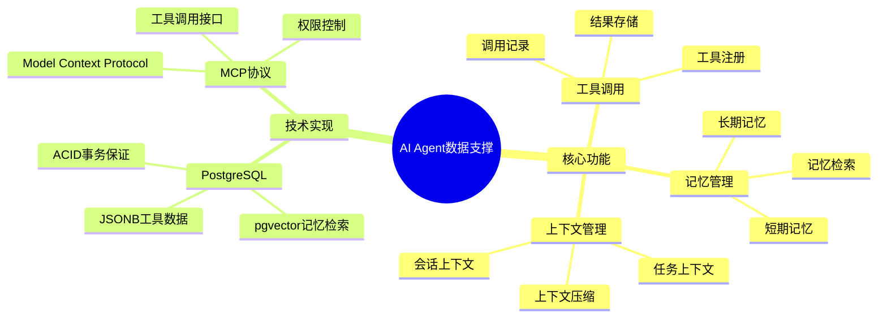
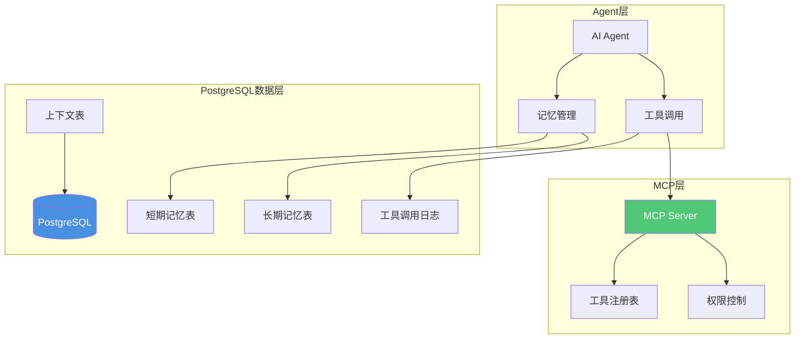

# AI Agent数据支撑

> **文档编号**: AI-04-04
> **最后更新**: 2025年1月
> **主题**: 04-应用场景
> **子主题**: 04-AI Agent数据支撑

## 📑 目录

- [AI Agent数据支撑](#ai-agent数据支撑)
  - [📑 目录](#-目录)

---

## 1. AI Agent数据支撑概述

### 1.1 AI Agent数据支撑思维导图



### 1.2 系统价值

**核心优势**：

- ✅ **持久化记忆**：Agent长期记忆存储
- ✅ **工具调用记录**：完整的工具调用历史
- ✅ **上下文管理**：高效的上下文检索和压缩
- ✅ **数据一致性**：ACID事务保证

---

## 2. 系统架构

### 2.1 系统架构

**AI Agent数据支撑架构**：



### 2.2 数据流

**AI Agent数据流**：

```text
1. Agent执行任务 → 生成记忆
2. 记忆向量化 → pgvector存储
3. 工具调用 → 记录到PostgreSQL
4. 上下文检索 → pgvector相似度搜索
5. 上下文压缩 → LLM摘要
6. 数据持久化 → PostgreSQL事务保证
```

---

## 3. 数据库设计

### 3.1 Agent记忆管理

**记忆表结构**：

```sql
-- 1. 短期记忆表（会话内记忆）
CREATE TABLE agent_short_term_memory (
    id SERIAL PRIMARY KEY,
    agent_id TEXT NOT NULL,
    session_id TEXT NOT NULL,
    memory_type TEXT,  -- observation, action, reflection
    content TEXT NOT NULL,
    embedding vector(1536),  -- 记忆向量
    importance_score DECIMAL(3, 2),  -- 重要性评分
    created_at TIMESTAMPTZ DEFAULT NOW()
);

-- 2. 长期记忆表（跨会话记忆）
CREATE TABLE agent_long_term_memory (
    id SERIAL PRIMARY KEY,
    agent_id TEXT NOT NULL,
    memory_type TEXT,
    content TEXT NOT NULL,
    embedding vector(1536),
    importance_score DECIMAL(3, 2),
    access_count INT DEFAULT 0,
    last_accessed_at TIMESTAMPTZ,
    created_at TIMESTAMPTZ DEFAULT NOW()
);

-- 3. 创建向量索引
CREATE INDEX ON agent_short_term_memory
USING hnsw(embedding vector_cosine_ops);
CREATE INDEX ON agent_long_term_memory
USING hnsw(embedding vector_cosine_ops);
```

### 3.2 工具调用记录

**工具调用表结构**：

```sql
-- 1. 工具注册表
CREATE TABLE agent_tools (
    id SERIAL PRIMARY KEY,
    tool_name TEXT UNIQUE NOT NULL,
    tool_description TEXT,
    tool_schema JSONB,  -- 工具参数schema
    handler_function TEXT,  -- PostgreSQL函数名
    permissions JSONB,  -- 权限配置
    created_at TIMESTAMPTZ DEFAULT NOW()
);

-- 2. 工具调用记录表
CREATE TABLE agent_tool_calls (
    id SERIAL PRIMARY KEY,
    agent_id TEXT NOT NULL,
    session_id TEXT NOT NULL,
    tool_id INT REFERENCES agent_tools(id),
    tool_name TEXT NOT NULL,
    arguments JSONB,  -- 调用参数
    result JSONB,  -- 调用结果
    status TEXT,  -- success, error, timeout
    execution_time_ms INT,
    created_at TIMESTAMPTZ DEFAULT NOW()
);

-- 3. 工具调用索引
CREATE INDEX ON agent_tool_calls (agent_id, session_id, created_at DESC);
CREATE INDEX ON agent_tool_calls (tool_name, created_at DESC);
```

### 3.3 上下文管理

**上下文表结构**：

```sql
-- 1. 会话上下文表
CREATE TABLE agent_session_context (
    id SERIAL PRIMARY KEY,
    agent_id TEXT NOT NULL,
    session_id TEXT UNIQUE NOT NULL,
    context_summary TEXT,  -- 上下文摘要
    context_embedding vector(1536),  -- 上下文向量
    memory_ids INT[],  -- 关联的记忆IDs
    tool_call_ids INT[],  -- 关联的工具调用IDs
    created_at TIMESTAMPTZ DEFAULT NOW(),
    updated_at TIMESTAMPTZ DEFAULT NOW()
);

-- 2. 任务上下文表
CREATE TABLE agent_task_context (
    id SERIAL PRIMARY KEY,
    agent_id TEXT NOT NULL,
    task_id TEXT NOT NULL,
    task_description TEXT,
    context_data JSONB,
    status TEXT,  -- pending, in_progress, completed
    created_at TIMESTAMPTZ DEFAULT NOW(),
    updated_at TIMESTAMPTZ DEFAULT NOW()
);
```

### 3.4 会话管理

**会话表结构**：

```sql
-- 会话表
CREATE TABLE agent_sessions (
    id SERIAL PRIMARY KEY,
    agent_id TEXT NOT NULL,
    session_id TEXT UNIQUE NOT NULL,
    user_id TEXT,
    status TEXT DEFAULT 'active',  -- active, paused, completed
    metadata JSONB,
    created_at TIMESTAMPTZ DEFAULT NOW(),
    updated_at TIMESTAMPTZ DEFAULT NOW()
);

-- 会话索引
CREATE INDEX ON agent_sessions (agent_id, created_at DESC);
CREATE INDEX ON agent_sessions (user_id, created_at DESC);
```

---

## 4. 核心功能实现

### 4.1 短期记忆

**短期记忆管理**：

```sql
-- 1. 添加短期记忆
CREATE OR REPLACE FUNCTION add_short_term_memory(
    p_agent_id TEXT,
    p_session_id TEXT,
    p_memory_type TEXT,
    p_content TEXT
)
RETURNS INT AS $$
DECLARE
    v_memory_id INT;
    v_embedding vector(1536);
    v_importance DECIMAL;
BEGIN
    -- 向量化记忆内容
    SELECT ai.embedding_openai('text-embedding-3-small', p_content)
    INTO v_embedding;

    -- 计算重要性（使用LLM）
    SELECT ai.chat_complete(
        'gpt-4',
        'Rate the importance of this memory (0-1): ' || p_content
    )::DECIMAL INTO v_importance;

    -- 插入记忆
    INSERT INTO agent_short_term_memory (
        agent_id, session_id, memory_type, content, embedding, importance_score
    )
    VALUES (
        p_agent_id, p_session_id, p_memory_type, p_content, v_embedding, v_importance
    )
    RETURNING id INTO v_memory_id;

    RETURN v_memory_id;
END;
$$ LANGUAGE plpgsql;
```

### 4.2 长期记忆

**长期记忆管理**：

```sql
-- 1. 短期记忆转长期记忆
CREATE OR REPLACE FUNCTION consolidate_memory(
    p_agent_id TEXT,
    p_session_id TEXT
)
RETURNS void AS $$
BEGIN
    -- 将重要的短期记忆转为长期记忆
    INSERT INTO agent_long_term_memory (
        agent_id, memory_type, content, embedding, importance_score
    )
    SELECT
        agent_id,
        memory_type,
        content,
        embedding,
        importance_score
    FROM agent_short_term_memory
    WHERE agent_id = p_agent_id
      AND session_id = p_session_id
      AND importance_score > 0.7;

    -- 清理短期记忆
    DELETE FROM agent_short_term_memory
    WHERE agent_id = p_agent_id
      AND session_id = p_session_id;
END;
$$ LANGUAGE plpgsql;

-- 2. 检索长期记忆
CREATE OR REPLACE FUNCTION retrieve_long_term_memory(
    p_agent_id TEXT,
    p_query TEXT,
    p_limit INT DEFAULT 5
)
RETURNS TABLE(content TEXT, similarity DECIMAL) AS $$
DECLARE
    v_query_vec vector(1536);
BEGIN
    -- 向量化查询
    SELECT ai.embedding_openai('text-embedding-3-small', p_query)
    INTO v_query_vec;

    -- 检索相似记忆
    RETURN QUERY
    SELECT
        ltm.content,
        1 - (ltm.embedding <=> v_query_vec) AS similarity
    FROM agent_long_term_memory ltm
    WHERE ltm.agent_id = p_agent_id
      AND 1 - (ltm.embedding <=> v_query_vec) > 0.7
    ORDER BY ltm.embedding <=> v_query_vec
    LIMIT p_limit;

    -- 更新访问计数
    UPDATE agent_long_term_memory
    SET access_count = access_count + 1,
        last_accessed_at = NOW()
    WHERE agent_id = p_agent_id
      AND embedding <=> v_query_vec < 0.3;
END;
$$ LANGUAGE plpgsql;
```

### 4.3 工具调用接口

**工具调用实现**：

```sql
-- 1. 注册工具
CREATE OR REPLACE FUNCTION register_agent_tool(
    p_tool_name TEXT,
    p_tool_description TEXT,
    p_tool_schema JSONB,
    p_handler_function TEXT
)
RETURNS INT AS $$
DECLARE
    v_tool_id INT;
BEGIN
    INSERT INTO agent_tools (
        tool_name, tool_description, tool_schema, handler_function
    )
    VALUES (
        p_tool_name, p_tool_description, p_tool_schema, p_handler_function
    )
    RETURNING id INTO v_tool_id;

    RETURN v_tool_id;
END;
$$ LANGUAGE plpgsql;

-- 2. 调用工具
CREATE OR REPLACE FUNCTION call_agent_tool(
    p_agent_id TEXT,
    p_session_id TEXT,
    p_tool_name TEXT,
    p_arguments JSONB
)
RETURNS JSONB AS $$
DECLARE
    v_tool_id INT;
    v_handler_function TEXT;
    v_result JSONB;
    v_start_time TIMESTAMPTZ;
    v_execution_time INT;
BEGIN
    v_start_time = NOW();

    -- 获取工具信息
    SELECT id, handler_function INTO v_tool_id, v_handler_function
    FROM agent_tools
    WHERE tool_name = p_tool_name;

    IF v_tool_id IS NULL THEN
        RAISE EXCEPTION 'Tool not found: %', p_tool_name;
    END IF;

    -- 执行工具函数
    EXECUTE format('SELECT %I($1)', v_handler_function)
    USING p_arguments
    INTO v_result;

    v_execution_time = EXTRACT(EPOCH FROM (NOW() - v_start_time)) * 1000;

    -- 记录工具调用
    INSERT INTO agent_tool_calls (
        agent_id, session_id, tool_id, tool_name, arguments, result,
        status, execution_time_ms
    )
    VALUES (
        p_agent_id, p_session_id, v_tool_id, p_tool_name, p_arguments, v_result,
        'success', v_execution_time
    );

    RETURN v_result;
END;
$$ LANGUAGE plpgsql;
```

### 4.4 数据版本控制

**数据版本管理**：

```sql
-- 1. 记忆版本表
CREATE TABLE agent_memory_versions (
    id SERIAL PRIMARY KEY,
    memory_id INT,
    content TEXT,
    embedding vector(1536),
    version INT,
    created_at TIMESTAMPTZ DEFAULT NOW()
);

-- 2. 版本控制触发器
CREATE OR REPLACE FUNCTION save_memory_version()
RETURNS TRIGGER AS $$
BEGIN
    INSERT INTO agent_memory_versions (
        memory_id, content, embedding, version
    )
    VALUES (
        OLD.id, OLD.content, OLD.embedding,
        COALESCE((SELECT MAX(version) FROM agent_memory_versions WHERE memory_id = OLD.id), 0) + 1
    );
    RETURN NEW;
END;
$$ LANGUAGE plpgsql;

CREATE TRIGGER memory_version_trigger
BEFORE UPDATE ON agent_long_term_memory
FOR EACH ROW
EXECUTE FUNCTION save_memory_version();
```

---

## 5. MCP Server实现

### 5.1 MCP Server实现

**MCP Server架构**：

```sql
-- 1. MCP Server配置表
CREATE TABLE mcp_servers (
    id SERIAL PRIMARY KEY,
    server_name TEXT UNIQUE NOT NULL,
    server_url TEXT,
    capabilities JSONB,
    status TEXT DEFAULT 'active',
    created_at TIMESTAMPTZ DEFAULT NOW()
);

-- 2. MCP工具映射表
CREATE TABLE mcp_tool_mappings (
    id SERIAL PRIMARY KEY,
    mcp_server_id INT REFERENCES mcp_servers(id),
    tool_id INT REFERENCES agent_tools(id),
    mcp_tool_name TEXT,
    mapping_config JSONB,
    created_at TIMESTAMPTZ DEFAULT NOW()
);
```

### 5.2 工具注册

**工具注册流程**：

```sql
-- 1. 注册PostgreSQL函数为Agent工具
SELECT register_agent_tool(
    'query_database',
    'Execute SQL query on database',
    '{"type": "object", "properties": {"query": {"type": "string"}}}'::jsonb,
    'execute_sql_query'
);

-- 2. 注册MCP工具
INSERT INTO mcp_tool_mappings (mcp_server_id, tool_id, mcp_tool_name)
VALUES (
    (SELECT id FROM mcp_servers WHERE server_name = 'postgresql_mcp'),
    (SELECT id FROM agent_tools WHERE tool_name = 'query_database'),
    'postgresql.query'
);
```

### 5.3 权限控制

**权限控制实现**：

```sql
-- 1. Agent权限表
CREATE TABLE agent_permissions (
    id SERIAL PRIMARY KEY,
    agent_id TEXT NOT NULL,
    tool_id INT REFERENCES agent_tools(id),
    permission_type TEXT,  -- read, write, execute
    granted BOOLEAN DEFAULT true,
    created_at TIMESTAMPTZ DEFAULT NOW(),
    UNIQUE(agent_id, tool_id, permission_type)
);

-- 2. 权限检查函数
CREATE OR REPLACE FUNCTION check_tool_permission(
    p_agent_id TEXT,
    p_tool_name TEXT,
    p_permission_type TEXT
)
RETURNS BOOLEAN AS $$
DECLARE
    v_granted BOOLEAN;
BEGIN
    SELECT ap.granted INTO v_granted
    FROM agent_permissions ap
    JOIN agent_tools at ON at.id = ap.tool_id
    WHERE ap.agent_id = p_agent_id
      AND at.tool_name = p_tool_name
      AND ap.permission_type = p_permission_type;

    RETURN COALESCE(v_granted, false);
END;
$$ LANGUAGE plpgsql;
```

---

## 6. 性能优化

### 6.1 记忆检索优化

**记忆检索优化**：

```sql
-- 1. 使用HNSW索引提升召回率
SET hnsw.ef_search = 100;

-- 2. 重要性加权检索
SELECT
    content,
    (1 - (embedding <=> query_vec)) * importance_score AS weighted_score
FROM agent_long_term_memory
WHERE agent_id = $1
  AND 1 - (embedding <=> query_vec) > 0.7
ORDER BY weighted_score DESC
LIMIT 5;
```

### 6.2 上下文压缩

**上下文压缩实现**：

```sql
-- 1. 上下文摘要生成
CREATE OR REPLACE FUNCTION compress_context(
    p_agent_id TEXT,
    p_session_id TEXT
)
RETURNS TEXT AS $$
DECLARE
    v_memories TEXT;
    v_summary TEXT;
BEGIN
    -- 获取所有记忆
    SELECT string_agg(content, '\n')
    INTO v_memories
    FROM agent_short_term_memory
    WHERE agent_id = p_agent_id
      AND session_id = p_session_id;

    -- 使用LLM生成摘要
    SELECT ai.chat_complete(
        'gpt-4',
        'Summarize the following memories:\n' || v_memories
    )
    INTO v_summary;

    -- 更新上下文摘要
    UPDATE agent_session_context
    SET context_summary = v_summary,
        updated_at = NOW()
    WHERE agent_id = p_agent_id
      AND session_id = p_session_id;

    RETURN v_summary;
END;
$$ LANGUAGE plpgsql;
```

### 6.3 缓存策略

**缓存策略**：

```sql
-- 1. 记忆检索缓存
CREATE TABLE memory_retrieval_cache (
    query_hash TEXT PRIMARY KEY,
    agent_id TEXT,
    results JSONB,
    created_at TIMESTAMPTZ DEFAULT NOW(),
    expires_at TIMESTAMPTZ
);

-- 2. 工具调用结果缓存
CREATE TABLE tool_result_cache (
    tool_call_hash TEXT PRIMARY KEY,
    tool_name TEXT,
    arguments_hash TEXT,
    result JSONB,
    created_at TIMESTAMPTZ DEFAULT NOW(),
    expires_at TIMESTAMPTZ
);
```

---

**最后更新**: 2025年1月
**维护者**: PostgreSQL Modern Team
**文档编号**: AI-04-04
