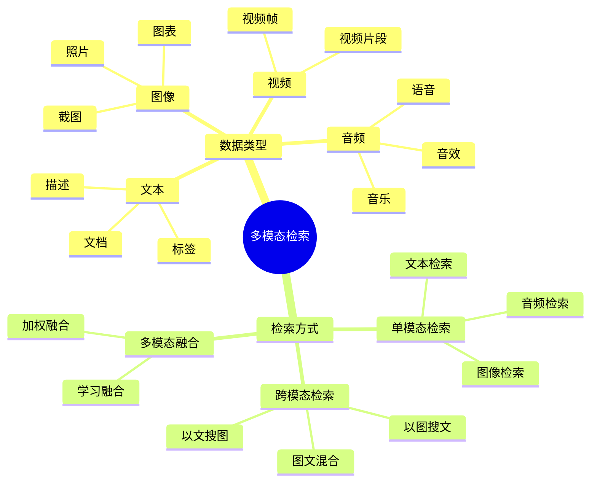
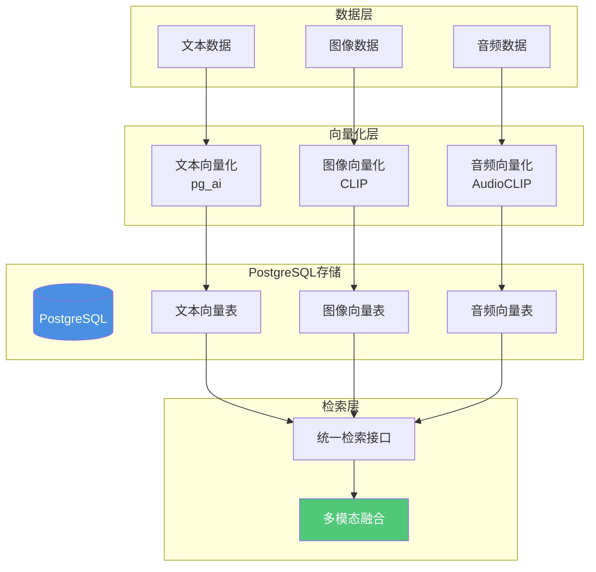

# 多模态检索应用

> **文档编号**: AI-04-06
> **最后更新**: 2025年1月
> **主题**: 04-应用场景
> **子主题**: 06-多模态检索应用

## 📑 目录

- [多模态检索应用](#多模态检索应用)

---

## 1. 多模态检索概述

### 1.1 多模态检索思维导图



### 1.2 应用场景

**多模态检索应用场景**：

- ✅ **电商搜索**：以图搜商品、以文搜图
- ✅ **内容推荐**：图文混合推荐
- ✅ **知识库检索**：文档+图像检索
- ✅ **媒体库管理**：统一检索文本、图像、视频

---

## 2. 系统架构

### 2.1 系统架构

**多模态检索系统架构**：



### 2.2 数据流

**多模态检索数据流**：

```text
1. 多模态数据输入（文本、图像、音频）
2. 分别向量化（使用不同模型）
3. 存储到PostgreSQL（不同向量表）
4. 用户查询（文本/图像/音频）
5. 查询向量化
6. 跨模态检索
7. 多模态融合排序
8. 返回结果
```

---

## 3. 数据库设计

### 3.1 多模态数据表

**多模态数据表结构**：

```sql
-- 1. 多模态内容主表
CREATE TABLE multimodal_content (
    id SERIAL PRIMARY KEY,
    content_type TEXT NOT NULL,  -- text, image, audio, video
    title TEXT,
    description TEXT,
    file_path TEXT,
    file_url TEXT,
    metadata JSONB,
    created_at TIMESTAMPTZ DEFAULT NOW()
);

-- 2. 文本向量表
CREATE TABLE text_vectors (
    id SERIAL PRIMARY KEY,
    content_id INT REFERENCES multimodal_content(id),
    text_content TEXT NOT NULL,
    text_vec vector(1536),  -- OpenAI text embedding
    created_at TIMESTAMPTZ DEFAULT NOW()
);

-- 3. 图像向量表
CREATE TABLE image_vectors (
    id SERIAL PRIMARY KEY,
    content_id INT REFERENCES multimodal_content(id),
    image_path TEXT,
    image_url TEXT,
    image_vec vector(512),  -- CLIP image embedding
    created_at TIMESTAMPTZ DEFAULT NOW()
);

-- 4. 音频向量表
CREATE TABLE audio_vectors (
    id SERIAL PRIMARY KEY,
    content_id INT REFERENCES multimodal_content(id),
    audio_path TEXT,
    audio_url TEXT,
    audio_vec vector(512),  -- AudioCLIP embedding
    created_at TIMESTAMPTZ DEFAULT NOW()
);

-- 5. 创建向量索引
CREATE INDEX ON text_vectors USING hnsw(text_vec vector_cosine_ops);
CREATE INDEX ON image_vectors USING hnsw(image_vec vector_cosine_ops);
CREATE INDEX ON audio_vectors USING hnsw(audio_vec vector_cosine_ops);
```

### 3.2 文本向量表

**文本向量生成**：

```sql
-- 使用pg_ai自动生成文本向量
UPDATE text_vectors
SET text_vec = ai.embedding_openai(
    'text-embedding-3-small',
    text_content
)
WHERE text_vec IS NULL;
```

### 3.3 图像向量表

**图像向量生成**：

```sql
-- 使用pg_ai生成图像向量（CLIP模型）
UPDATE image_vectors
SET image_vec = ai.embedding_image(
    'clip-vit-base-patch32',
    image_data  -- 图像二进制数据
)
WHERE image_vec IS NULL;
```

---

## 4. 多模态检索实现

### 4.1 文本+图像检索

**文本+图像混合检索**：

```sql
-- 1. 文本查询检索图像
WITH text_query AS (
    SELECT ai.embedding_openai('text-embedding-3-small', 'sunset beach') AS vec
),
image_results AS (
    SELECT
        iv.content_id,
        mc.title,
        mc.file_url,
        1 - (iv.image_vec <=> tq.vec) AS similarity
    FROM image_vectors iv
    JOIN multimodal_content mc ON mc.id = iv.content_id,
         text_query tq
    WHERE 1 - (iv.image_vec <=> tq.vec) > 0.7
    ORDER BY iv.image_vec <=> tq.vec
    LIMIT 10
)
SELECT * FROM image_results;

-- 性能测试：文本查询检索图像
EXPLAIN (ANALYZE, BUFFERS, TIMING)
WITH text_query AS (
    SELECT ai.embedding_openai('text-embedding-3-small', 'sunset beach') AS vec
),
image_results AS (
    SELECT
        iv.content_id,
        mc.title,
        mc.file_url,
        1 - (iv.image_vec <=> tq.vec) AS similarity
    FROM image_vectors iv
    JOIN multimodal_content mc ON mc.id = iv.content_id,
         text_query tq
    WHERE 1 - (iv.image_vec <=> tq.vec) > 0.7
    ORDER BY iv.image_vec <=> tq.vec
    LIMIT 10
)
SELECT * FROM image_results;

-- 2. 图像查询检索文本
WITH image_query AS (
    SELECT ai.embedding_image('clip-vit-base-patch32', $1) AS vec
),
text_results AS (
    SELECT
        tv.content_id,
        mc.title,
        tv.text_content,
        1 - (tv.text_vec <=> iq.vec) AS similarity
    FROM text_vectors tv
    JOIN multimodal_content mc ON mc.id = tv.content_id,
         image_query iq
    WHERE 1 - (tv.text_vec <=> iq.vec) > 0.7
    ORDER BY tv.text_vec <=> iq.vec
    LIMIT 10
)
SELECT * FROM text_results;

-- 性能测试：图像查询检索文本
EXPLAIN (ANALYZE, BUFFERS, TIMING)
WITH image_query AS (
    SELECT ai.embedding_image('clip-vit-base-patch32', $1) AS vec
),
text_results AS (
    SELECT
        tv.content_id,
        mc.title,
        tv.text_content,
        1 - (tv.text_vec <=> iq.vec) AS similarity
    FROM text_vectors tv
    JOIN multimodal_content mc ON mc.id = tv.content_id,
         image_query iq
    WHERE 1 - (tv.text_vec <=> iq.vec) > 0.7
    ORDER BY tv.text_vec <=> iq.vec
    LIMIT 10
)
SELECT * FROM text_results;
```

### 4.2 跨模态相似度

**跨模态相似度计算**：

```sql
-- 文本和图像跨模态相似度
WITH text_query AS (
    SELECT ai.embedding_openai('text-embedding-3-small', 'mountain landscape') AS vec
),
image_results AS (
    SELECT
        iv.content_id,
        mc.title,
        mc.file_url,
        -- 跨模态相似度（使用CLIP统一空间）
        1 - (iv.image_vec <=> tq.vec) AS cross_modal_similarity
    FROM image_vectors iv
    JOIN multimodal_content mc ON mc.id = iv.content_id,
         text_query tq
    WHERE 1 - (iv.image_vec <=> tq.vec) > 0.7
    ORDER BY iv.image_vec <=> tq.vec
    LIMIT 10
)
SELECT * FROM image_results;
```

### 4.3 统一查询接口

**统一查询接口**：

```sql
CREATE OR REPLACE FUNCTION multimodal_search(
    p_query_type TEXT,  -- 'text', 'image', 'audio'
    p_query_content TEXT,  -- 查询内容或路径
    p_result_type TEXT DEFAULT 'all'  -- 'text', 'image', 'audio', 'all'
)
RETURNS TABLE(
    content_id INT,
    content_type TEXT,
    title TEXT,
    similarity DECIMAL,
    file_url TEXT
) AS $$
DECLARE
    v_query_vec vector;
BEGIN
    -- 1. 根据查询类型向量化
    IF p_query_type = 'text' THEN
        SELECT ai.embedding_openai('text-embedding-3-small', p_query_content)
        INTO v_query_vec;
    ELSIF p_query_type = 'image' THEN
        SELECT ai.embedding_image('clip-vit-base-patch32', p_query_content)
        INTO v_query_vec;
    END IF;

    -- 2. 跨模态检索
    IF p_result_type = 'all' OR p_result_type = 'text' THEN
        RETURN QUERY
        SELECT
            tv.content_id,
            'text'::TEXT,
            mc.title,
            1 - (tv.text_vec <=> v_query_vec) AS similarity,
            mc.file_url
        FROM text_vectors tv
        JOIN multimodal_content mc ON mc.id = tv.content_id
        WHERE 1 - (tv.text_vec <=> v_query_vec) > 0.7
        ORDER BY tv.text_vec <=> v_query_vec
        LIMIT 10;
    END IF;

    IF p_result_type = 'all' OR p_result_type = 'image' THEN
        RETURN QUERY
        SELECT
            iv.content_id,
            'image'::TEXT,
            mc.title,
            1 - (iv.image_vec <=> v_query_vec) AS similarity,
            mc.file_url
        FROM image_vectors iv
        JOIN multimodal_content mc ON mc.id = iv.content_id
        WHERE 1 - (iv.image_vec <=> v_query_vec) > 0.7
        ORDER BY iv.image_vec <=> v_query_vec
        LIMIT 10;
    END IF;
END;
$$ LANGUAGE plpgsql;
```

### 4.4 多模态融合

**多模态融合检索**：

```sql
-- 文本+图像多模态融合检索
WITH text_query AS (
    SELECT ai.embedding_openai('text-embedding-3-small', 'sunset beach') AS text_vec
),
image_query AS (
    SELECT ai.embedding_image('clip-vit-base-patch32', image_data) AS image_vec
),
text_results AS (
    SELECT
        tv.content_id,
        mc.title,
        mc.file_url,
        1 - (tv.text_vec <=> tq.text_vec) AS text_score
    FROM text_vectors tv
    JOIN multimodal_content mc ON mc.id = tv.content_id,
         text_query tq
    WHERE 1 - (tv.text_vec <=> tq.text_vec) > 0.7
),
image_results AS (
    SELECT
        iv.content_id,
        mc.title,
        mc.file_url,
        1 - (iv.image_vec <=> iq.image_vec) AS image_score
    FROM image_vectors iv
    JOIN multimodal_content mc ON mc.id = iv.content_id,
         image_query iq
    WHERE 1 - (iv.image_vec <=> iq.image_vec) > 0.7
)
SELECT
    COALESCE(tr.content_id, ir.content_id) AS content_id,
    COALESCE(tr.title, ir.title) AS title,
    COALESCE(tr.file_url, ir.file_url) AS file_url,
    COALESCE(tr.text_score, 0) * 0.5 + COALESCE(ir.image_score, 0) * 0.5 AS fusion_score
FROM text_results tr
FULL OUTER JOIN image_results ir ON tr.content_id = ir.content_id
ORDER BY fusion_score DESC
LIMIT 20;
```

---

## 5. 性能优化

### 5.1 向量索引优化

**多模态向量索引优化**：

```sql
-- 1. 文本向量索引
CREATE INDEX ON text_vectors
USING hnsw(text_vec vector_cosine_ops)
WITH (m = 16, ef_construction = 64);

-- 2. 图像向量索引
CREATE INDEX ON image_vectors
USING hnsw(image_vec vector_cosine_ops)
WITH (m = 16, ef_construction = 64);

-- 3. 查询时优化
SET hnsw.ef_search = 100;  -- 提升召回率
```

### 5.2 查询优化

**查询优化策略**：

```sql
-- 1. 使用LIMIT提前终止
SELECT ... LIMIT 10;

-- 2. 设置相似度阈值
WHERE similarity > 0.7;

-- 3. 使用物化视图预计算
CREATE MATERIALIZED VIEW popular_multimodal_content AS
SELECT
    mc.id,
    mc.title,
    mc.content_type,
    tv.text_vec,
    iv.image_vec
FROM multimodal_content mc
LEFT JOIN text_vectors tv ON tv.content_id = mc.id
LEFT JOIN image_vectors iv ON iv.content_id = mc.id
WHERE mc.view_count > 1000;

CREATE INDEX ON popular_multimodal_content
USING hnsw(text_vec vector_cosine_ops);
CREATE INDEX ON popular_multimodal_content
USING hnsw(image_vec vector_cosine_ops);
```

### 5.3 缓存策略

**多模态检索缓存**：

```sql
-- 1. 查询结果缓存
CREATE TABLE multimodal_search_cache (
    query_hash TEXT PRIMARY KEY,
    query_type TEXT,
    results JSONB,
    created_at TIMESTAMPTZ DEFAULT NOW(),
    expires_at TIMESTAMPTZ
);

-- 2. 向量缓存（常用查询向量）
CREATE TABLE query_vector_cache (
    query_text TEXT PRIMARY KEY,
    query_vec vector(1536),
    created_at TIMESTAMPTZ DEFAULT NOW()
);
```

---

**最后更新**: 2025年1月
**维护者**: PostgreSQL Modern Team
**文档编号**: AI-04-06
