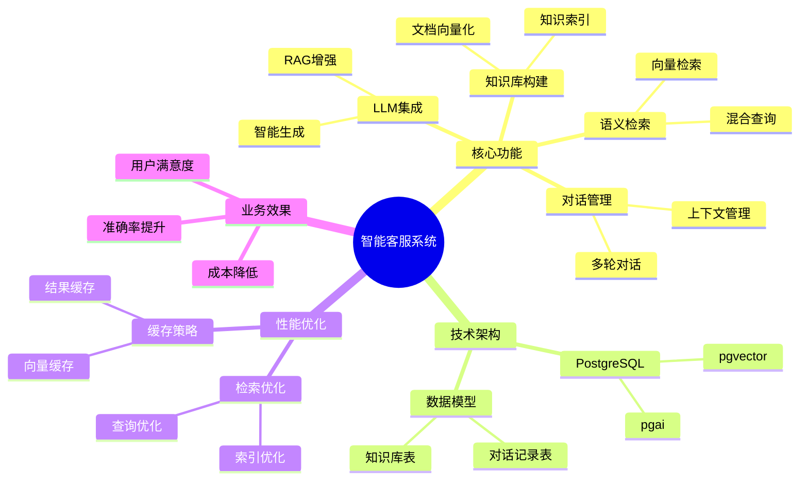
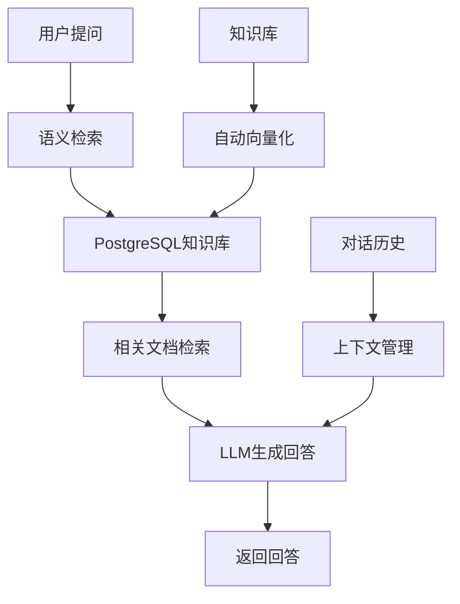

---

> **📋 文档来源**: `PostgreSQL_AI\04-应用场景\智能客服系统.md`
> **📅 复制日期**: 2025-12-22
> **⚠️ 注意**: 本文档为复制版本，原文件保持不变

---

# 智能客服系统

> **文档编号**: AI-04-05
> **最后更新**: 2025年1月
> **主题**: 04-应用场景
> **子主题**: 05-智能客服系统

## 📑 目录

- [智能客服系统](#智能客服系统)
  - [📑 目录](#-目录)
  - [一、概述](#一概述)
    - [1.1 智能客服系统思维导图](#11-智能客服系统思维导图)
  - [二、架构设计](#二架构设计)
    - [2.1 系统架构](#21-系统架构)
    - [2.2 数据流](#22-数据流)
  - [三、数据模型设计](#三数据模型设计)
    - [3.1 知识库表](#31-知识库表)
    - [3.2 对话记录表](#32-对话记录表)
    - [3.3 用户反馈表](#33-用户反馈表)
  - [四、核心功能实现](#四核心功能实现)
    - [4.1 知识库构建](#41-知识库构建)
    - [4.2 语义检索](#42-语义检索)
    - [4.3 对话管理](#43-对话管理)
    - [4.4 多轮对话支持](#44-多轮对话支持)
  - [五、LLM集成](#五llm集成)
    - [5.1 使用pgai调用LLM](#51-使用pgai调用llm)
    - [5.2 RAG增强生成](#52-rag增强生成)
    - [5.3 上下文管理](#53-上下文管理)
  - [六、性能优化](#六性能优化)
    - [6.1 检索优化](#61-检索优化)
    - [6.2 缓存策略](#62-缓存策略)
    - [6.3 并发处理](#63-并发处理)
  - [七、效果评估](#七效果评估)
    - [7.1 准确率评估](#71-准确率评估)
    - [7.2 用户满意度](#72-用户满意度)
    - [7.3 成本分析](#73-成本分析)
  - [八、关联主题](#八关联主题)
  - [九、对标资源](#九对标资源)
    - [企业案例](#企业案例)
    - [技术文档](#技术文档)

## 一、概述

基于PostgreSQL构建的智能客服系统，结合pgvector语义检索和pgai LLM调用，实现知识库问答、多轮对话和智能推荐，提供7x24小时自动化客服服务。

### 1.1 智能客服系统思维导图



## 二、架构设计

### 2.1 系统架构



### 2.2 数据流

1. **知识库构建流**:
   - 文档导入 → 自动向量化 → 存储到PostgreSQL

2. **问答流**:
   - 用户提问 → 向量检索 → 上下文构建 → LLM生成 → 返回回答

3. **学习流**:
   - 用户反馈 → 知识库更新 → 模型优化

## 三、数据模型设计

### 3.1 知识库表

```sql
-- 知识库文档表
CREATE TABLE knowledge_base (
    id SERIAL PRIMARY KEY,
    title TEXT NOT NULL,
    content TEXT NOT NULL,
    category TEXT,
    tags TEXT[],
    content_vector vector(1536),
    created_at TIMESTAMPTZ DEFAULT NOW(),
    updated_at TIMESTAMPTZ DEFAULT NOW(),
    metadata JSONB
);

-- 向量索引
CREATE INDEX ON knowledge_base
USING hnsw (content_vector vector_cosine_ops)
WITH (m = 16, ef_construction = 100);

-- 分类索引
CREATE INDEX ON knowledge_base (category);
CREATE INDEX ON knowledge_base USING GIN (tags);
```

### 3.2 对话记录表

```sql
-- 对话记录表
CREATE TABLE conversations (
    id SERIAL PRIMARY KEY,
    user_id TEXT,
    session_id TEXT,
    question TEXT NOT NULL,
    answer TEXT NOT NULL,
    question_vector vector(1536),
    retrieved_docs INTEGER[],  -- 检索到的文档ID
    confidence_score DECIMAL(5,4),
    created_at TIMESTAMPTZ DEFAULT NOW(),
    metadata JSONB
);

-- 会话索引
CREATE INDEX ON conversations (session_id, created_at DESC);
CREATE INDEX ON conversations (user_id, created_at DESC);
```

### 3.3 用户反馈表

```sql
-- 用户反馈表
CREATE TABLE user_feedback (
    id SERIAL PRIMARY KEY,
    conversation_id INTEGER REFERENCES conversations(id),
    user_id TEXT,
    rating INTEGER,  -- 1-5分
    feedback_text TEXT,
    helpful BOOLEAN,
    created_at TIMESTAMPTZ DEFAULT NOW()
);

-- 反馈索引
CREATE INDEX ON user_feedback (conversation_id);
CREATE INDEX ON user_feedback (rating, created_at DESC);
```

## 四、核心功能实现

### 4.1 知识库构建

```sql
-- 使用pgai Vectorizer自动构建知识库
SELECT ai.create_vectorizer(
    'knowledge_base'::regclass,
    destination => 'knowledge_embeddings',
    embedding => ai.embedding_openai('text-embedding-3-small', 'content'),
    chunking => ai.chunking_recursive_character_text_splitter(
        'content',
        chunk_size => 500,
        chunk_overlap => 50
    )
);

-- 批量导入知识
INSERT INTO knowledge_base (title, content, category)
VALUES
    ('产品介绍', '我们的产品是...', 'product'),
    ('使用指南', '使用步骤如下...', 'guide'),
    ('常见问题', 'Q: 如何... A: ...', 'faq');
-- 自动生成向量
```

### 4.2 语义检索

```sql
-- 语义检索函数
CREATE OR REPLACE FUNCTION search_knowledge_base(
    p_query_text TEXT,
    p_category TEXT DEFAULT NULL,
    p_limit INTEGER DEFAULT 5
) RETURNS TABLE (
    id INTEGER,
    title TEXT,
    content TEXT,
    similarity DECIMAL,
    category TEXT
) AS $$
DECLARE
    v_query_vector vector(1536);
BEGIN
    -- 生成查询向量
    v_query_vector := ai.embedding('text-embedding-3-small', p_query_text);

    -- 检索相关文档
    RETURN QUERY
    SELECT
        kb.id,
        kb.title,
        kb.content,
        (1 - (kb.content_vector <=> v_query_vector))::DECIMAL(5,4) AS similarity,
        kb.category
    FROM knowledge_base kb
    WHERE (p_category IS NULL OR kb.category = p_category)
      AND kb.content_vector <=> v_query_vector < 0.8
    ORDER BY kb.content_vector <=> v_query_vector
    LIMIT p_limit;
END;
$$ LANGUAGE plpgsql;
```

### 4.3 对话管理

```sql
-- 创建对话
CREATE OR REPLACE FUNCTION create_conversation(
    p_user_id TEXT,
    p_session_id TEXT,
    p_question TEXT
) RETURNS INTEGER AS $$
DECLARE
    v_conversation_id INTEGER;
    v_question_vector vector(1536);
BEGIN
    -- 生成问题向量
    v_question_vector := ai.embedding('text-embedding-3-small', p_question);

    -- 创建对话记录
    INSERT INTO conversations (
        user_id,
        session_id,
        question,
        question_vector
    ) VALUES (
        p_user_id,
        p_session_id,
        p_question,
        v_question_vector
    )
    RETURNING id INTO v_conversation_id;

    RETURN v_conversation_id;
END;
$$ LANGUAGE plpgsql;
```

### 4.4 多轮对话支持

```sql
-- 获取对话历史
CREATE OR REPLACE FUNCTION get_conversation_history(
    p_session_id TEXT,
    p_limit INTEGER DEFAULT 10
) RETURNS JSONB AS $$
BEGIN
    RETURN (
        SELECT jsonb_agg(
            jsonb_build_object(
                'question', question,
                'answer', answer,
                'created_at', created_at
            ) ORDER BY created_at DESC
        )
        FROM conversations
        WHERE session_id = p_session_id
        ORDER BY created_at DESC
        LIMIT p_limit
    );
END;
$$ LANGUAGE plpgsql;

-- 带上下文的问答
CREATE OR REPLACE FUNCTION answer_with_context(
    p_session_id TEXT,
    p_question TEXT
) RETURNS TEXT AS $$
DECLARE
    v_context TEXT;
    v_answer TEXT;
    v_retrieved_docs INTEGER[];
BEGIN
    -- 检索相关文档
    SELECT
        string_agg(content, E'\n\n'),
        array_agg(id)
    INTO v_context, v_retrieved_docs
    FROM search_knowledge_base(p_question, NULL, 5);

    -- 获取对话历史
    DECLARE
        v_history JSONB;
    BEGIN
        v_history := get_conversation_history(p_session_id, 5);

        -- 构建完整上下文
        v_context := format('对话历史:\n%s\n\n相关知识:\n%s\n\n问题: %s',
            v_history::text, v_context, p_question);
    END;

    -- 调用LLM生成回答
    v_answer := ai.chat_complete(
        'gpt-4',
        format('基于以下上下文回答问题:\n\n%s', v_context)
    )->>'content';

    -- 保存对话
    INSERT INTO conversations (
        session_id,
        question,
        answer,
        retrieved_docs,
        confidence_score
    ) VALUES (
        p_session_id,
        p_question,
        v_answer,
        v_retrieved_docs,
        0.8  -- 置信度分数
    );

    RETURN v_answer;
END;
$$ LANGUAGE plpgsql;
```

## 五、LLM集成

### 5.1 使用pgai调用LLM

```sql
-- 简单问答
CREATE OR REPLACE FUNCTION simple_qa(
    p_question TEXT
) RETURNS TEXT AS $$
BEGIN
    RETURN ai.chat_complete(
        'gpt-4',
        format('请回答以下问题: %s', p_question)
    )->>'content';
END;
$$ LANGUAGE plpgsql;
```

### 5.2 RAG增强生成

```sql
-- RAG增强问答
CREATE OR REPLACE FUNCTION rag_qa(
    p_question TEXT,
    p_category TEXT DEFAULT NULL
) RETURNS TEXT AS $$
DECLARE
    v_context TEXT;
    v_answer TEXT;
BEGIN
    -- 检索相关文档
    SELECT string_agg(content, E'\n\n')
    INTO v_context
    FROM search_knowledge_base(p_question, p_category, 5);

    -- 使用RAG生成回答
    v_answer := ai.chat_complete(
        'gpt-4',
        format('基于以下知识库内容回答问题:\n\n%s\n\n问题: %s',
            v_context, p_question)
    )->>'content';

    RETURN v_answer;
END;
$$ LANGUAGE plpgsql;
```

### 5.3 上下文管理

```sql
-- 上下文压缩
CREATE OR REPLACE FUNCTION compress_context(
    p_session_id TEXT,
    p_max_tokens INTEGER DEFAULT 4000
) RETURNS TEXT AS $$
DECLARE
    v_context TEXT;
    v_token_count INTEGER;
BEGIN
    -- 获取对话历史
    SELECT
        string_agg(question || ' ' || answer, E'\n\n'),
        COUNT(*) * 100  -- 估算Token数
    INTO v_context, v_token_count
    FROM conversations
    WHERE session_id = p_session_id
    ORDER BY created_at DESC
    LIMIT 10;

    -- 如果超过限制，压缩
    IF v_token_count > p_max_tokens THEN
        v_context := ai.chat_complete(
            'gpt-4',
            format('压缩以下对话历史，保留关键信息:\n\n%s', v_context)
        )->>'content';
    END IF;

    RETURN v_context;
END;
$$ LANGUAGE plpgsql;
```

## 六、性能优化

### 6.1 检索优化

```sql
-- 使用缓存优化检索
CREATE TABLE knowledge_cache (
    query_hash TEXT PRIMARY KEY,
    query_vector vector(1536),
    results JSONB,
    created_at TIMESTAMPTZ DEFAULT NOW(),
    expires_at TIMESTAMPTZ DEFAULT NOW() + INTERVAL '1 hour'
);

-- 使用缓存的检索
CREATE OR REPLACE FUNCTION cached_search(
    p_query_text TEXT
) RETURNS JSONB AS $$
DECLARE
    v_query_vector vector(1536);
    v_cache_key TEXT;
    v_results JSONB;
BEGIN
    v_query_vector := ai.embedding('text-embedding-3-small', p_query_text);
    v_cache_key := md5(p_query_text);

    -- 检查缓存
    SELECT results INTO v_results
    FROM knowledge_cache
    WHERE query_hash = v_cache_key
      AND expires_at > NOW();

    IF v_results IS NOT NULL THEN
        RETURN v_results;
    END IF;

    -- 检索并缓存
    SELECT jsonb_agg(
        jsonb_build_object(
            'id', id,
            'title', title,
            'content', content,
            'similarity', similarity
        )
    ) INTO v_results
    FROM search_knowledge_base(p_query_text);

    INSERT INTO knowledge_cache (query_hash, query_vector, results)
    VALUES (v_cache_key, v_query_vector, v_results)
    ON CONFLICT (query_hash) DO UPDATE
    SET results = v_results,
        expires_at = NOW() + INTERVAL '1 hour';

    RETURN v_results;
END;
$$ LANGUAGE plpgsql;
```

### 6.2 缓存策略

```sql
-- 热门问题缓存
CREATE MATERIALIZED VIEW popular_questions AS
SELECT
    question,
    COUNT(*) AS ask_count,
    AVG(rating) AS avg_rating
FROM conversations c
LEFT JOIN user_feedback uf ON c.id = uf.conversation_id
WHERE c.created_at > NOW() - INTERVAL '7 days'
GROUP BY question
ORDER BY ask_count DESC
LIMIT 100;

-- 定期刷新
REFRESH MATERIALIZED VIEW CONCURRENTLY popular_questions;
```

### 6.3 并发处理

```sql
-- 使用连接池
-- PgBouncer配置
pool_mode = transaction
max_client_conn = 10000
default_pool_size = 50

-- 异步处理
CREATE OR REPLACE FUNCTION async_answer(
    p_session_id TEXT,
    p_question TEXT
) RETURNS void AS $$
BEGIN
    -- 异步生成回答
    PERFORM pg_notify('answer_ready',
        format('{"session_id": "%s", "question": "%s"}',
            p_session_id, p_question));
END;
$$ LANGUAGE plpgsql;
```

## 七、效果评估

### 7.1 准确率评估

```sql
-- 准确率统计
SELECT
    DATE_TRUNC('day', created_at) AS date,
    COUNT(*) AS total_questions,
    COUNT(*) FILTER (WHERE rating >= 4) AS satisfied_count,
    ROUND(100.0 * COUNT(*) FILTER (WHERE rating >= 4) / COUNT(*), 2) AS satisfaction_rate
FROM conversations c
LEFT JOIN user_feedback uf ON c.id = uf.conversation_id
WHERE c.created_at > NOW() - INTERVAL '30 days'
GROUP BY DATE_TRUNC('day', created_at)
ORDER BY date DESC;
```

### 7.2 用户满意度

```sql
-- 用户满意度分析
SELECT
    AVG(rating) AS avg_rating,
    COUNT(*) FILTER (WHERE rating = 5) AS excellent_count,
    COUNT(*) FILTER (WHERE rating >= 4) AS good_count,
    COUNT(*) FILTER (WHERE rating < 3) AS poor_count
FROM user_feedback
WHERE created_at > NOW() - INTERVAL '30 days';
```

### 7.3 成本分析

```sql
-- API调用成本统计
SELECT
    DATE_TRUNC('day', created_at) AS date,
    COUNT(*) AS api_calls,
    COUNT(DISTINCT session_id) AS unique_sessions,
    AVG(LENGTH(answer)) AS avg_answer_length
FROM conversations
WHERE created_at > NOW() - INTERVAL '30 days'
GROUP BY DATE_TRUNC('day', created_at)
ORDER BY date DESC;
```

## 八、关联主题

- [RAG系统设计](./RAG系统设计.md) - RAG架构
- [AI原生调用 (pgai)](../03-核心能力/AI原生调用-pgai.md) - LLM调用
- [向量处理能力 (pgvector)](../03-核心能力/向量处理能力-pgvector.md) - 语义检索

## 九、对标资源

### 企业案例

- **Google Cloud AlloyDB + Vertex AI**: 智能客服应用
- **准确率**: 92%
- **用户满意度**: 4.5/5

### 技术文档

- [LangChain客服示例](https://python.langchain.com/docs/use_cases/question_answering/)
- [pgai文档](https://github.com/pgai/pgai)

---

**最后更新**: 2025年1月
**维护者**: PostgreSQL Modern Team
**文档编号**: AI-04-05
