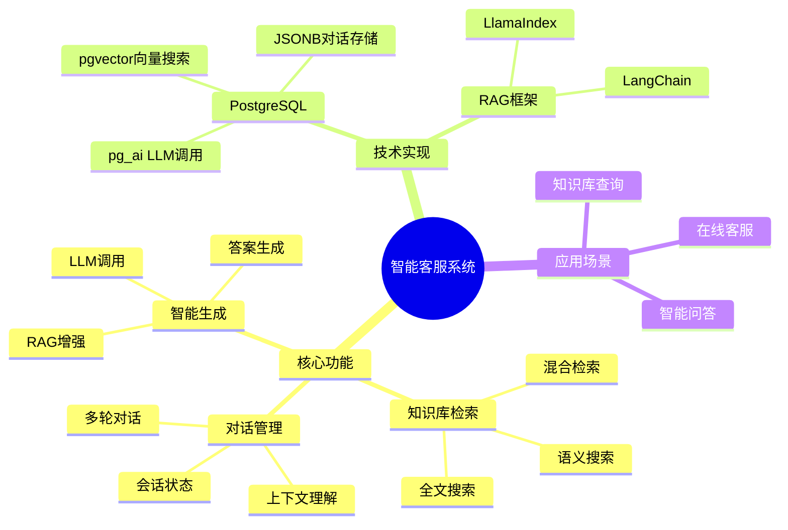
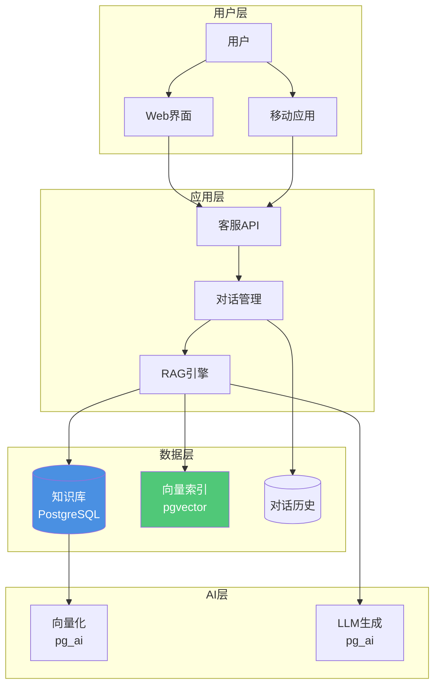

---

> **📋 文档来源**: `PostgreSQL_AI\04-应用场景\智能客服系统.md`
> **📅 复制日期**: 2025-12-22
> **⚠️ 注意**: 本文档为复制版本，原文件保持不变

---

# 智能客服系统

> **文档编号**: AI-04-05
> **最后更新**: 2025年1月
> **主题**: 04-应用场景
> **子主题**: 05-智能客服系统

## 📑 目录

- [智能客服系统](#智能客服系统)
  - [📑 目录](#-目录)
  - [1. 智能客服系统概述](#1-智能客服系统概述)
    - [1.1 智能客服系统思维导图](#11-智能客服系统思维导图)
    - [1.2 系统价值](#12-系统价值)
  - [2. 系统架构](#2-系统架构)
    - [2.1 系统架构](#21-系统架构)
    - [2.2 数据流](#22-数据流)
  - [3. 数据库设计](#3-数据库设计)
    - [3.1 知识库表](#31-知识库表)
    - [3.2 对话记录表](#32-对话记录表)
    - [3.3 用户反馈表](#33-用户反馈表)
  - [4. 核心功能实现](#4-核心功能实现)
    - [4.1 知识库构建](#41-知识库构建)
    - [4.2 语义检索](#42-语义检索)
    - [4.3 对话管理](#43-对话管理)
    - [4.4 多轮对话支持](#44-多轮对话支持)
  - [5. AI集成](#5-ai集成)
    - [5.1 使用pg\_ai调用LLM](#51-使用pg_ai调用llm)
    - [5.2 RAG增强生成](#52-rag增强生成)
    - [5.3 上下文管理](#53-上下文管理)
  - [6. 性能优化](#6-性能优化)
    - [6.1 检索优化](#61-检索优化)
    - [6.2 缓存策略](#62-缓存策略)
    - [6.3 并发处理](#63-并发处理)
  - [7. 评估与优化](#7-评估与优化)
    - [7.1 准确率评估](#71-准确率评估)
    - [7.2 用户满意度](#72-用户满意度)
    - [7.3 成本分析](#73-成本分析)

---

## 1. 智能客服系统概述

### 1.1 智能客服系统思维导图



### 1.2 系统价值

**核心优势**：

- ✅ **24/7服务**：全天候自动响应
- ✅ **快速响应**：秒级回答用户问题
- ✅ **知识准确**：基于企业知识库，减少幻觉
- ✅ **成本降低**：减少人工客服成本70%+

---

## 2. 系统架构

### 2.1 系统架构

**智能客服系统架构**：



### 2.2 数据流

**智能客服数据流**：

```text
1. 用户提问 → API接收
2. 问题向量化 → pg_ai.embedding()
3. 知识库检索 → pgvector相似度搜索
4. 上下文构建 → 检索结果+对话历史
5. LLM生成答案 → pg_ai.chat_complete()
6. 答案返回用户
7. 对话记录存储 → PostgreSQL
```

---

## 3. 数据库设计

### 3.1 知识库表

**知识库表结构**：

```sql
-- 1. 知识库文档表
CREATE TABLE knowledge_base (
    id SERIAL PRIMARY KEY,
    title TEXT NOT NULL,
    content TEXT NOT NULL,
    category TEXT,
    embedding vector(1536),  -- 文档向量
    metadata JSONB,  -- 元数据
    created_at TIMESTAMPTZ DEFAULT NOW(),
    updated_at TIMESTAMPTZ DEFAULT NOW()
);

-- 2. 知识库分块表（用于RAG）
CREATE TABLE knowledge_chunks (
    id SERIAL PRIMARY KEY,
    document_id INT REFERENCES knowledge_base(id) ON DELETE CASCADE,
    chunk_text TEXT NOT NULL,
    chunk_index INT,
    embedding vector(1536),  -- 块向量
    metadata JSONB,
    created_at TIMESTAMPTZ DEFAULT NOW()
);

-- 3. 创建向量索引
CREATE INDEX ON knowledge_chunks
USING hnsw(embedding vector_cosine_ops)
WITH (m = 16, ef_construction = 64);

-- 4. 全文搜索索引
CREATE INDEX ON knowledge_chunks
USING GIN(to_tsvector('english', chunk_text));
```

### 3.2 对话记录表

**对话记录表结构**：

```sql
-- 1. 对话会话表
CREATE TABLE conversations (
    id SERIAL PRIMARY KEY,
    user_id TEXT,
    session_id TEXT UNIQUE NOT NULL,
    status TEXT DEFAULT 'active',  -- active, closed
    created_at TIMESTAMPTZ DEFAULT NOW(),
    updated_at TIMESTAMPTZ DEFAULT NOW()
);

-- 2. 对话消息表
CREATE TABLE conversation_messages (
    id SERIAL PRIMARY KEY,
    conversation_id INT REFERENCES conversations(id) ON DELETE CASCADE,
    role TEXT NOT NULL,  -- user, assistant, system
    content TEXT NOT NULL,
    embedding vector(1536),  -- 用户问题向量
    retrieved_chunks INT[],  -- 检索到的知识块IDs
    metadata JSONB,
    created_at TIMESTAMPTZ DEFAULT NOW()
);

-- 3. 对话上下文索引
CREATE INDEX ON conversation_messages (conversation_id, created_at DESC);
CREATE INDEX ON conversation_messages USING GIN(embedding vector_cosine_ops);
```

### 3.3 用户反馈表

**用户反馈表结构**：

```sql
-- 用户反馈表
CREATE TABLE user_feedback (
    id SERIAL PRIMARY KEY,
    conversation_id INT REFERENCES conversations(id),
    message_id INT REFERENCES conversation_messages(id),
    rating INT,  -- 1-5评分
    feedback_text TEXT,
    helpful BOOLEAN,  -- 是否有帮助
    created_at TIMESTAMPTZ DEFAULT NOW()
);

-- 反馈统计
CREATE INDEX ON user_feedback (conversation_id, rating);
```

---

## 4. 核心功能实现

### 4.1 知识库构建

**知识库导入**：

```sql
-- 1. 批量导入知识库文档
COPY knowledge_base(title, content, category)
FROM '/path/to/knowledge.csv'
WITH (FORMAT csv, HEADER true);

-- 2. 自动生成向量
UPDATE knowledge_base
SET embedding = ai.embedding_openai(
    'text-embedding-3-small',
    title || ' ' || content
)
WHERE embedding IS NULL;

-- 3. 文档分块（使用pg_ai）
SELECT ai.create_vectorizer(
    'knowledge_base'::regclass,
    destination => 'knowledge_chunks',
    embedding => ai.embedding_openai('text-embedding-3-small', 'content'),
    chunking => ai.chunking_recursive_character_text_splitter(
        'content',
        chunk_size => 500,
        chunk_overlap => 100
    )
);
```

### 4.2 语义检索

**RAG检索实现**：

```sql
-- 1. 用户问题向量化
WITH query_vec AS (
    SELECT ai.embedding_openai(
        'text-embedding-3-small',
        'How to reset password?'
    ) AS vec
),
-- 2. 检索相关知识块
retrieved_chunks AS (
    SELECT
        kc.id,
        kc.chunk_text,
        kb.title,
        kb.category,
        1 - (kc.embedding <=> qv.vec) AS similarity
    FROM knowledge_chunks kc
    JOIN knowledge_base kb ON kb.id = kc.document_id,
         query_vec qv
    WHERE 1 - (kc.embedding <=> qv.vec) > 0.7
    ORDER BY kc.embedding <=> qv.vec
    LIMIT 5
)
-- 3. 构建上下文
SELECT
    string_agg(chunk_text, '\n\n') AS context,
    string_agg(title, ', ') AS sources
FROM retrieved_chunks;

-- 性能测试：RAG语义检索查询
EXPLAIN (ANALYZE, BUFFERS, TIMING)
WITH query_vec AS (
    SELECT ai.embedding_openai(
        'text-embedding-3-small',
        'How to reset password?'
    ) AS vec
),
retrieved_chunks AS (
    SELECT
        kc.id,
        kc.chunk_text,
        kb.title,
        kb.category,
        1 - (kc.embedding <=> qv.vec) AS similarity
    FROM knowledge_chunks kc
    JOIN knowledge_base kb ON kb.id = kc.document_id,
         query_vec qv
    WHERE 1 - (kc.embedding <=> qv.vec) > 0.7
    ORDER BY kc.embedding <=> qv.vec
    LIMIT 5
)
SELECT
    string_agg(chunk_text, '\n\n') AS context,
    string_agg(title, ', ') AS sources
FROM retrieved_chunks;
```

### 4.3 对话管理

**对话上下文管理**：

```sql
-- 1. 创建新对话
INSERT INTO conversations (user_id, session_id)
VALUES ('user123', 'session_' || gen_random_uuid()::text)
RETURNING id, session_id;

-- 2. 保存用户消息
INSERT INTO conversation_messages (conversation_id, role, content, embedding)
VALUES (
    1,
    'user',
    'How to reset password?',
    ai.embedding_openai('text-embedding-3-small', 'How to reset password?')
);

-- 3. 获取对话历史
SELECT
    role,
    content,
    created_at
FROM conversation_messages
WHERE conversation_id = 1
ORDER BY created_at DESC
LIMIT 10;  -- 最近10条消息
```

### 4.4 多轮对话支持

**多轮对话上下文构建**：

```sql
-- 结合历史对话和知识库检索
WITH conversation_history AS (
    SELECT
        role,
        content,
        created_at
    FROM conversation_messages
    WHERE conversation_id = $1
    ORDER BY created_at DESC
    LIMIT 5  -- 最近5轮对话
),
current_query AS (
    SELECT ai.embedding_openai('text-embedding-3-small', $2) AS vec
),
retrieved_knowledge AS (
    SELECT chunk_text
    FROM knowledge_chunks kc, current_query cq
    WHERE 1 - (kc.embedding <=> cq.vec) > 0.7
    ORDER BY kc.embedding <=> cq.vec
    LIMIT 3
)
SELECT
    string_agg(
        CASE role
            WHEN 'user' THEN 'User: ' || content
            WHEN 'assistant' THEN 'Assistant: ' || content
        END,
        '\n'
    ) AS history_context,
    string_agg(chunk_text, '\n\n') AS knowledge_context
FROM conversation_history, retrieved_knowledge;
```

---

## 5. AI集成

### 5.1 使用pg_ai调用LLM

**SQL内LLM调用**：

```sql
-- 1. 检索相关知识
WITH query_vec AS (
    SELECT ai.embedding_openai('text-embedding-3-small', $1) AS vec
),
retrieved AS (
    SELECT chunk_text
    FROM knowledge_chunks kc, query_vec qv
    WHERE 1 - (kc.embedding <=> qv.vec) > 0.7
    ORDER BY kc.embedding <=> qv.vec
    LIMIT 3
),
context AS (
    SELECT string_agg(chunk_text, '\n\n') AS text FROM retrieved
)
-- 2. 生成答案
SELECT ai.chat_complete(
    'gpt-4',
    'Based on the following knowledge base, answer the user question: ' || $1 ||
    '\n\nKnowledge Base:\n' || context.text ||
    '\n\nAnswer in a helpful and concise way.'
) AS answer
FROM context;
```

### 5.2 RAG增强生成

**完整RAG流程**：

```sql
CREATE OR REPLACE FUNCTION generate_answer(
    p_conversation_id INT,
    p_user_question TEXT
)
RETURNS TEXT AS $$
DECLARE
    v_query_vec vector(1536);
    v_context TEXT;
    v_history TEXT;
    v_answer TEXT;
BEGIN
    -- 1. 向量化用户问题
    SELECT ai.embedding_openai('text-embedding-3-small', p_user_question)
    INTO v_query_vec;

    -- 2. 检索相关知识
    SELECT string_agg(chunk_text, '\n\n')
    INTO v_context
    FROM (
        SELECT chunk_text
        FROM knowledge_chunks
        WHERE 1 - (embedding <=> v_query_vec) > 0.7
        ORDER BY embedding <=> v_query_vec
        LIMIT 3
    ) AS retrieved;

    -- 3. 获取对话历史
    SELECT string_agg(
        CASE role
            WHEN 'user' THEN 'User: ' || content
            WHEN 'assistant' THEN 'Assistant: ' || content
        END,
        '\n'
    )
    INTO v_history
    FROM conversation_messages
    WHERE conversation_id = p_conversation_id
    ORDER BY created_at DESC
    LIMIT 5;

    -- 4. 生成答案
    SELECT ai.chat_complete(
        'gpt-4',
        'Context:\n' || COALESCE(v_context, '') ||
        '\n\nConversation History:\n' || COALESCE(v_history, '') ||
        '\n\nUser Question: ' || p_user_question ||
        '\n\nAnswer:'
    )
    INTO v_answer;

    -- 5. 保存对话
    INSERT INTO conversation_messages (conversation_id, role, content, embedding)
    VALUES (p_conversation_id, 'user', p_user_question, v_query_vec);

    INSERT INTO conversation_messages (conversation_id, role, content)
    VALUES (p_conversation_id, 'assistant', v_answer);

    RETURN v_answer;
END;
$$ LANGUAGE plpgsql;
```

### 5.3 上下文管理

**上下文压缩**：

```sql
-- 1. 对话摘要（压缩历史）
CREATE OR REPLACE FUNCTION summarize_conversation(p_conversation_id INT)
RETURNS TEXT AS $$
DECLARE
    v_history TEXT;
    v_summary TEXT;
BEGIN
    -- 获取完整对话历史
    SELECT string_agg(
        role || ': ' || content,
        '\n'
    )
    INTO v_history
    FROM conversation_messages
    WHERE conversation_id = p_conversation_id
    ORDER BY created_at;

    -- 使用LLM生成摘要
    SELECT ai.chat_complete(
        'gpt-4',
        'Summarize the following conversation:\n' || v_history
    )
    INTO v_summary;

    RETURN v_summary;
END;
$$ LANGUAGE plpgsql;
```

---

## 6. 性能优化

### 6.1 检索优化

**检索优化策略**：

```sql
-- 1. 使用HNSW索引提升召回率
SET hnsw.ef_search = 100;  -- 提升召回率

-- 2. 设置相似度阈值提前过滤
WHERE embedding <=> query_vec < 0.3  -- 提前过滤

-- 3. 使用LIMIT限制结果数
LIMIT 5;  -- 只返回Top 5
```

### 6.2 缓存策略

**查询结果缓存**：

```sql
-- 1. 创建缓存表
CREATE TABLE answer_cache (
    question_hash TEXT PRIMARY KEY,
    question_text TEXT,
    answer TEXT,
    created_at TIMESTAMPTZ DEFAULT NOW(),
    expires_at TIMESTAMPTZ
);

-- 2. 缓存常用问题答案
CREATE OR REPLACE FUNCTION get_cached_answer(p_question TEXT)
RETURNS TEXT AS $$
DECLARE
    v_hash TEXT;
    v_answer TEXT;
BEGIN
    v_hash = md5(p_question);

    SELECT answer INTO v_answer
    FROM answer_cache
    WHERE question_hash = v_hash
      AND expires_at > NOW();

    IF v_answer IS NOT NULL THEN
        RETURN v_answer;
    END IF;

    -- 生成新答案（调用generate_answer）
    -- ...

    -- 缓存答案
    INSERT INTO answer_cache (question_hash, question_text, answer, expires_at)
    VALUES (v_hash, p_question, v_answer, NOW() + INTERVAL '1 day')
    ON CONFLICT (question_hash) DO UPDATE
    SET answer = EXCLUDED.answer, expires_at = EXCLUDED.expires_at;

    RETURN v_answer;
END;
$$ LANGUAGE plpgsql;
```

### 6.3 并发处理

**并发优化**：

```sql
-- 1. 使用连接池（PgBouncer）
-- 2. 异步处理（使用pg_cron）
-- 3. 批量处理向量化
UPDATE knowledge_base
SET embedding = ai.embedding_openai('text-embedding-3-small', content)
WHERE embedding IS NULL
LIMIT 100;  -- 批量处理
```

---

## 7. 评估与优化

### 7.1 准确率评估

**答案质量评估**：

```sql
-- 1. 计算答案准确率
SELECT
    COUNT(*) FILTER (WHERE rating >= 4)::float /
    COUNT(*) AS accuracy_rate
FROM user_feedback
WHERE created_at > NOW() - INTERVAL '7 days';

-- 2. 分析常见问题
SELECT
    cm.content AS question,
    COUNT(*) AS frequency,
    AVG(uf.rating) AS avg_rating
FROM conversation_messages cm
JOIN user_feedback uf ON uf.message_id = cm.id
WHERE cm.role = 'user'
GROUP BY cm.content
ORDER BY frequency DESC
LIMIT 10;
```

### 7.2 用户满意度

**满意度监控**：

```sql
-- 1. 用户满意度统计
SELECT
    DATE(created_at) AS date,
    COUNT(*) AS total_feedback,
    AVG(rating) AS avg_rating,
    COUNT(*) FILTER (WHERE helpful = true) AS helpful_count
FROM user_feedback
WHERE created_at > NOW() - INTERVAL '30 days'
GROUP BY DATE(created_at)
ORDER BY date DESC;
```

### 7.3 成本分析

**成本优化**：

```sql
-- 1. 统计LLM调用次数
SELECT
    DATE(created_at) AS date,
    COUNT(*) AS llm_calls,
    COUNT(DISTINCT conversation_id) AS unique_conversations
FROM conversation_messages
WHERE role = 'assistant'
  AND created_at > NOW() - INTERVAL '7 days'
GROUP BY DATE(created_at);

-- 2. 缓存命中率
SELECT
    COUNT(*) FILTER (WHERE cached = true)::float /
    COUNT(*) AS cache_hit_rate
FROM conversation_messages
WHERE created_at > NOW() - INTERVAL '1 day';
```

---

**最后更新**: 2025年1月
**维护者**: PostgreSQL Modern Team
**文档编号**: AI-04-05
