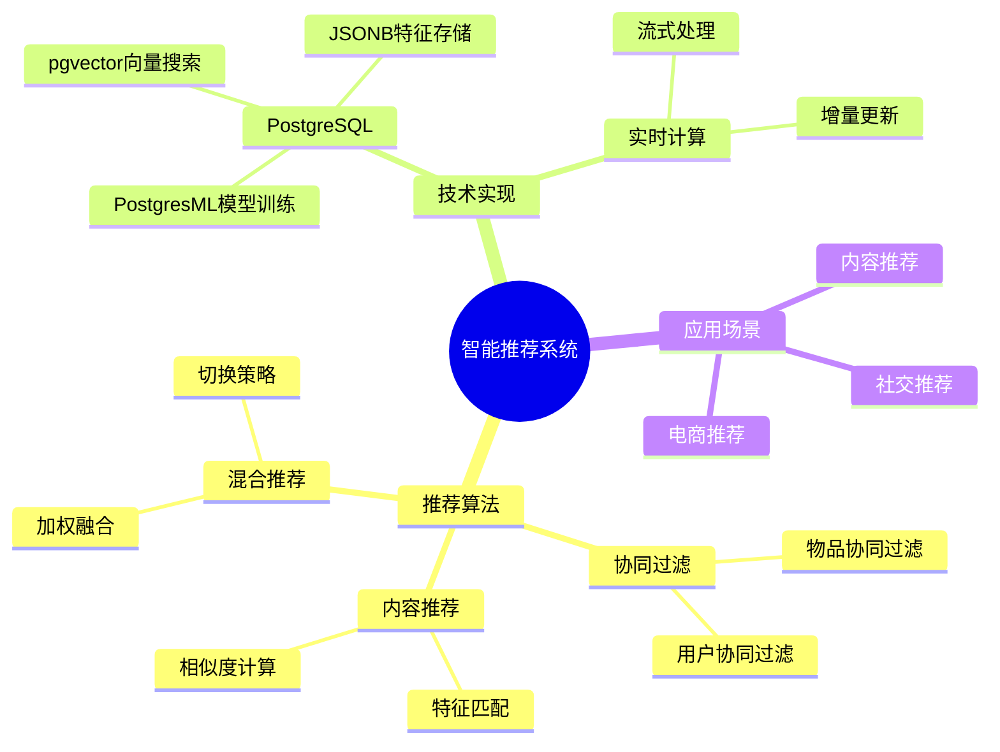
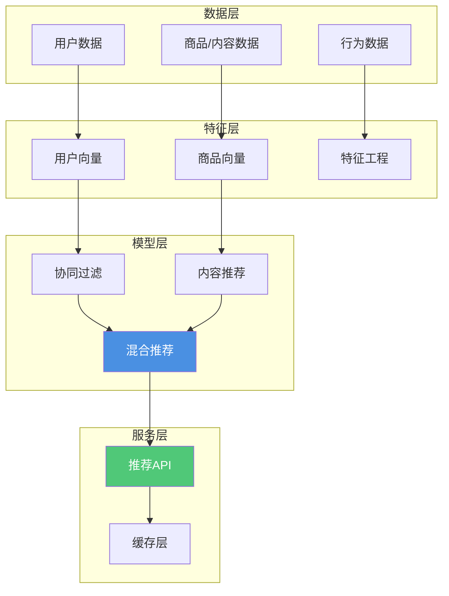

---

> **📋 文档来源**: `PostgreSQL_AI\04-应用场景\智能推荐系统.md`
> **📅 复制日期**: 2025-12-22
> **⚠️ 注意**: 本文档为复制版本，原文件保持不变

---

# 智能推荐系统

> **文档编号**: AI-04-02
> **最后更新**: 2025年1月
> **主题**: 04-应用场景
> **子主题**: 02-智能推荐系统

## 📑 目录

- [智能推荐系统](#智能推荐系统)
  - [📑 目录](#-目录)
  - [1. 推荐系统概述](#1-推荐系统概述)
    - [1.1 推荐系统思维导图](#11-推荐系统思维导图)
    - [1.2 推荐系统简介](#12-推荐系统简介)
  - [2. 系统架构](#2-系统架构)
    - [2.1 系统架构](#21-系统架构)
    - [2.2 数据流](#22-数据流)
  - [3. 数据库设计](#3-数据库设计)
    - [3.1 用户行为表](#31-用户行为表)
    - [3.2 商品/内容表](#32-商品内容表)
    - [3.3 推荐结果表](#33-推荐结果表)
  - [4. 推荐算法实现](#4-推荐算法实现)
    - [4.1 协同过滤](#41-协同过滤)
    - [4.2 内容推荐](#42-内容推荐)
  - [5. 实时推荐](#5-实时推荐)
    - [5.1 实时特征计算](#51-实时特征计算)
    - [5.2 实时推荐生成](#52-实时推荐生成)
    - [5.3 推荐结果缓存](#53-推荐结果缓存)
  - [6. 性能优化](#6-性能优化)
    - [6.1 向量索引优化](#61-向量索引优化)
    - [6.2 查询优化](#62-查询优化)
    - [6.3 缓存策略](#63-缓存策略)
  - [7. 评估与优化](#7-评估与优化)
    - [7.1 评估指标](#71-评估指标)
    - [7.2 A/B测试](#72-ab测试)

---

## 1. 推荐系统概述

### 1.1 推荐系统思维导图



### 1.2 推荐系统简介

**智能推荐系统**是基于用户历史行为、内容特征和上下文信息，为用户推荐可能感兴趣的商品、内容或服务的系统。

**核心价值**：

- ✅ 提升用户体验：个性化推荐
- ✅ 增加转化率：精准营销
- ✅ 提高留存率：用户粘性
- ✅ 数据驱动：基于真实行为数据

---

## 2. 系统架构

### 2.1 系统架构

**推荐系统架构图**：



### 2.2 数据流

**推荐系统数据流**：

```text
1. 数据收集：
   用户行为 → 实时采集 → PostgreSQL存储

2. 特征计算：
   原始数据 → 特征工程 → 向量化 → pgvector存储

3. 模型训练：
   历史数据 → PostgresML训练 → 模型部署

4. 推荐生成：
   用户请求 → 特征提取 → 模型推理 → 结果排序 → 推荐返回
```

---

## 3. 数据库设计

### 3.1 用户行为表

**核心表结构**：

```sql
-- 1. 用户表
CREATE TABLE users (
    id SERIAL PRIMARY KEY,
    username TEXT UNIQUE NOT NULL,
    profile JSONB,  -- 用户画像
    created_at TIMESTAMPTZ DEFAULT NOW()
);

-- 2. 商品/内容表
CREATE TABLE items (
    id SERIAL PRIMARY KEY,
    title TEXT NOT NULL,
    description TEXT,
    category_id INT,
    feature_vec vector(768),  -- 商品特征向量
    metadata JSONB,
    created_at TIMESTAMPTZ DEFAULT NOW()
);

-- 3. 用户行为表
CREATE TABLE user_behaviors (
    id SERIAL PRIMARY KEY,
    user_id INT REFERENCES users(id),
    item_id INT REFERENCES items(id),
    behavior_type TEXT,  -- view, click, purchase, rating
    rating INT,  -- 1-5评分
    timestamp TIMESTAMPTZ DEFAULT NOW(),
    context JSONB  -- 上下文信息（设备、位置等）
);

-- 4. 用户行为向量表（用于协同过滤）
CREATE TABLE user_behavior_vectors (
    user_id INT PRIMARY KEY REFERENCES users(id),
    behavior_vec vector(768),  -- 用户行为向量
    updated_at TIMESTAMPTZ DEFAULT NOW()
);

-- 5. 创建索引
CREATE INDEX ON items USING hnsw(feature_vec vector_cosine_ops);
CREATE INDEX ON user_behaviors (user_id, timestamp DESC);
CREATE INDEX ON user_behaviors (item_id, timestamp DESC);
```

### 3.2 商品/内容表

**商品特征向量生成**：

```sql
-- 使用pg_ai自动生成商品特征向量
SELECT ai.create_vectorizer(
    'items'::regclass,
    destination => 'item_feature_vectors',
    embedding => ai.embedding_openai('text-embedding-3-small', 'title || description'),
    chunking => NULL  -- 商品描述较短，不需要分块
);

-- 插入商品，自动生成向量
INSERT INTO items(title, description, category_id)
VALUES (
    'PostgreSQL Performance Guide',
    'Complete guide to optimizing PostgreSQL...',
    1
);
-- 自动生成feature_vec
```

### 3.3 推荐结果表

**推荐结果存储**：

```sql
-- 推荐结果表
CREATE TABLE recommendations (
    id SERIAL PRIMARY KEY,
    user_id INT REFERENCES users(id),
    item_id INT REFERENCES items(id),
    score DECIMAL(5, 4),  -- 推荐分数
    algorithm TEXT,  -- 使用的算法
    created_at TIMESTAMPTZ DEFAULT NOW(),
    expires_at TIMESTAMPTZ  -- 推荐过期时间
);

-- 索引
CREATE INDEX ON recommendations (user_id, score DESC, created_at DESC);
CREATE INDEX ON recommendations (expires_at) WHERE expires_at < NOW();
```

---

## 4. 推荐算法实现

### 4.1 协同过滤

**用户协同过滤**：

```sql
-- 1. 计算用户相似度
WITH target_user AS (
    SELECT behavior_vec FROM user_behavior_vectors WHERE user_id = 123
),
similar_users AS (
    SELECT
        ubv.user_id,
        1 - (ubv.behavior_vec <=> tu.behavior_vec) AS similarity
    FROM user_behavior_vectors ubv, target_user tu
    WHERE ubv.user_id != 123
      AND 1 - (ubv.behavior_vec <=> tu.behavior_vec) > 0.7
    ORDER BY ubv.behavior_vec <=> tu.behavior_vec
    LIMIT 100
)
-- 2. 推荐相似用户喜欢的商品
SELECT
    ub.item_id,
    i.title,
    SUM(su.similarity * CASE ub.behavior_type
        WHEN 'purchase' THEN 3
        WHEN 'click' THEN 2
        WHEN 'view' THEN 1
        ELSE 0
    END) AS recommendation_score
FROM similar_users su
JOIN user_behaviors ub ON ub.user_id = su.user_id
JOIN items i ON i.id = ub.item_id
WHERE ub.item_id NOT IN (
    SELECT item_id FROM user_behaviors WHERE user_id = 123
)
GROUP BY ub.item_id, i.title
ORDER BY recommendation_score DESC
LIMIT 20;
```

**物品协同过滤**：

```sql
-- 基于商品相似度的推荐
WITH user_items AS (
    SELECT DISTINCT item_id
    FROM user_behaviors
    WHERE user_id = 123
),
similar_items AS (
    SELECT
        i2.id AS item_id,
        AVG(1 - (i1.feature_vec <=> i2.feature_vec)) AS similarity
    FROM items i1
    CROSS JOIN items i2
    WHERE i1.id IN (SELECT item_id FROM user_items)
      AND i2.id NOT IN (SELECT item_id FROM user_items)
      AND 1 - (i1.feature_vec <=> i2.feature_vec) > 0.7
    GROUP BY i2.id
)
SELECT
    si.item_id,
    i.title,
    si.similarity AS recommendation_score
FROM similar_items si
JOIN items i ON i.id = si.item_id
ORDER BY si.similarity DESC
LIMIT 20;
```

### 4.2 内容推荐

**基于内容特征的推荐**：

```sql
-- 1. 生成用户偏好向量
WITH user_preference AS (
    SELECT AVG(i.feature_vec) AS preference_vec
    FROM user_behaviors ub
    JOIN items i ON i.id = ub.item_id
    WHERE ub.user_id = 123
      AND ub.behavior_type IN ('purchase', 'click')
      AND ub.timestamp > NOW() - INTERVAL '30 days'
)
-- 2. 推荐相似商品
SELECT
    i.id,
    i.title,
    1 - (i.feature_vec <=> up.preference_vec) AS similarity
FROM items i, user_preference up
WHERE i.id NOT IN (
    SELECT item_id FROM user_behaviors WHERE user_id = 123
)
  AND 1 - (i.feature_vec <=> up.preference_vec) > 0.7
ORDER BY i.feature_vec <=> up.preference_vec;

-- 性能测试：基于内容的推荐查询
EXPLAIN (ANALYZE, BUFFERS, TIMING)
WITH user_preference AS (
    SELECT preference_vec FROM user_preferences WHERE user_id = 123
)
SELECT
    i.id,
    i.title,
    1 - (i.feature_vec <=> up.preference_vec) AS similarity
FROM items i, user_preference up
WHERE i.id NOT IN (
    SELECT item_id FROM user_behaviors WHERE user_id = 123
)
  AND 1 - (i.feature_vec <=> up.preference_vec) > 0.7
ORDER BY i.feature_vec <=> up.preference_vec
LIMIT 20;
```

LIMIT 20;

```

### 4.3 混合推荐

**加权融合推荐**：

```sql
-- 结合协同过滤和内容推荐
WITH cf_recommendations AS (
    -- 协同过滤推荐（权重0.6）
    SELECT item_id, score * 0.6 AS weighted_score
    FROM collaborative_filtering_results
    WHERE user_id = 123
),
content_recommendations AS (
    -- 内容推荐（权重0.4）
    SELECT item_id, similarity * 0.4 AS weighted_score
    FROM content_based_results
    WHERE user_id = 123
)
SELECT
    COALESCE(cf.item_id, cr.item_id) AS item_id,
    i.title,
    COALESCE(cf.weighted_score, 0) + COALESCE(cr.weighted_score, 0) AS final_score
FROM cf_recommendations cf
FULL OUTER JOIN content_recommendations cr ON cf.item_id = cr.item_id
JOIN items i ON i.id = COALESCE(cf.item_id, cr.item_id)
ORDER BY final_score DESC
LIMIT 20;
```

---

## 5. 实时推荐

### 5.1 实时特征计算

**实时用户特征更新**：

```sql
-- 使用触发器实时更新用户行为向量
CREATE OR REPLACE FUNCTION update_user_behavior_vector()
RETURNS TRIGGER AS $$
BEGIN
    -- 重新计算用户行为向量
    INSERT INTO user_behavior_vectors (user_id, behavior_vec)
    SELECT
        NEW.user_id,
        AVG(i.feature_vec) AS behavior_vec
    FROM user_behaviors ub
    JOIN items i ON i.id = ub.item_id
    WHERE ub.user_id = NEW.user_id
      AND ub.timestamp > NOW() - INTERVAL '30 days'
    GROUP BY ub.user_id
    ON CONFLICT (user_id) DO UPDATE
    SET behavior_vec = EXCLUDED.behavior_vec,
        updated_at = NOW();

    RETURN NEW;
END;
$$ LANGUAGE plpgsql;

CREATE TRIGGER update_user_vector
AFTER INSERT OR UPDATE ON user_behaviors
FOR EACH ROW
EXECUTE FUNCTION update_user_behavior_vector();
```

### 5.2 实时推荐生成

**实时推荐查询**：

```sql
-- 实时生成推荐（结合实时特征）
WITH user_preference AS (
    SELECT AVG(i.feature_vec) AS preference_vec
    FROM user_behaviors ub
    JOIN items i ON i.id = ub.item_id
    WHERE ub.user_id = $1
      AND ub.timestamp > NOW() - INTERVAL '7 days'  -- 最近7天
),
category_preference AS (
    SELECT category_id, COUNT(*) AS view_count
    FROM user_behaviors ub
    JOIN items i ON i.id = ub.item_id
    WHERE ub.user_id = $1
      AND ub.timestamp > NOW() - INTERVAL '30 days'
    GROUP BY category_id
    ORDER BY view_count DESC
    LIMIT 3
)
SELECT
    i.id,
    i.title,
    i.category_id,
    -- 内容相似度
    1 - (i.feature_vec <=> up.preference_vec) AS content_score,
    -- 类别偏好
    CASE WHEN i.category_id IN (SELECT category_id FROM category_preference)
         THEN 0.3 ELSE 0 END AS category_bonus,
    -- 综合得分
    (1 - (i.feature_vec <=> up.preference_vec)) * 0.7 +
    CASE WHEN i.category_id IN (SELECT category_id FROM category_preference)
         THEN 0.3 ELSE 0 END AS final_score
FROM items i, user_preference up
WHERE i.id NOT IN (
    SELECT item_id FROM user_behaviors WHERE user_id = $1
)
ORDER BY final_score DESC
LIMIT 20;
```

### 5.3 推荐结果缓存

**缓存策略**：

```sql
-- 1. 创建推荐缓存表
CREATE TABLE recommendation_cache (
    user_id INT PRIMARY KEY REFERENCES users(id),
    recommendations JSONB,
    created_at TIMESTAMPTZ DEFAULT NOW(),
    expires_at TIMESTAMPTZ
);

-- 2. 缓存推荐结果
CREATE OR REPLACE FUNCTION get_cached_recommendations(p_user_id INT)
RETURNS JSONB AS $$
DECLARE
    cached_result JSONB;
BEGIN
    -- 检查缓存
    SELECT recommendations INTO cached_result
    FROM recommendation_cache
    WHERE user_id = p_user_id
      AND expires_at > NOW();

    IF cached_result IS NOT NULL THEN
        RETURN cached_result;
    END IF;

    -- 生成新推荐（调用推荐算法）
    -- ... 省略推荐生成逻辑 ...

    -- 缓存结果（1小时有效期）
    INSERT INTO recommendation_cache (user_id, recommendations, expires_at)
    VALUES (p_user_id, cached_result, NOW() + INTERVAL '1 hour')
    ON CONFLICT (user_id) DO UPDATE
    SET recommendations = EXCLUDED.recommendations,
        expires_at = EXCLUDED.expires_at;

    RETURN cached_result;
END;
$$ LANGUAGE plpgsql;
```

---

## 6. 性能优化

### 6.1 向量索引优化

**索引策略**：

```sql
-- 1. HNSW索引（高召回率）
CREATE INDEX ON items USING hnsw(feature_vec vector_cosine_ops)
WITH (m = 16, ef_construction = 64);

-- 2. 用户行为向量索引
CREATE INDEX ON user_behavior_vectors USING hnsw(behavior_vec vector_cosine_ops);

-- 3. 查询时优化
SET hnsw.ef_search = 100;  -- 提升召回率
```

### 6.2 查询优化

**查询优化技巧**：

```sql
-- 1. 使用LIMIT提前终止
SELECT ... ORDER BY similarity DESC LIMIT 20;

-- 2. 设置相似度阈值
WHERE similarity > 0.7  -- 提前过滤

-- 3. 使用物化视图预计算
CREATE MATERIALIZED VIEW user_recommendations AS
SELECT user_id, item_id, score
FROM recommendation_algorithm_results;

CREATE INDEX ON user_recommendations (user_id, score DESC);

-- 定期刷新
REFRESH MATERIALIZED VIEW CONCURRENTLY user_recommendations;
```

### 6.3 缓存策略

**多级缓存**：

```sql
-- 1. PostgreSQL内置缓存（自动）
-- 2. 应用层缓存（Redis）
-- 3. CDN缓存（静态推荐）

-- 缓存预热
SELECT get_cached_recommendations(user_id)
FROM users
WHERE last_active > NOW() - INTERVAL '7 days';
```

---

## 7. 评估与优化

### 7.1 评估指标

**推荐系统评估指标**：

```sql
-- 1. 准确率（Precision）
SELECT
    COUNT(*) FILTER (WHERE behavior_type = 'click')::float /
    COUNT(*) AS precision
FROM recommendations r
LEFT JOIN user_behaviors ub ON ub.user_id = r.user_id AND ub.item_id = r.item_id
WHERE r.created_at > NOW() - INTERVAL '7 days';

-- 2. 召回率（Recall）
SELECT
    COUNT(DISTINCT r.item_id) FILTER (WHERE ub.behavior_type = 'click')::float /
    COUNT(DISTINCT ub.item_id) AS recall
FROM recommendations r
LEFT JOIN user_behaviors ub ON ub.user_id = r.user_id
WHERE r.created_at > NOW() - INTERVAL '7 days';

-- 3. 点击率（CTR）
SELECT
    COUNT(*) FILTER (WHERE clicked = true)::float /
    COUNT(*) AS ctr
FROM recommendation_impressions
WHERE created_at > NOW() - INTERVAL '7 days';
```

### 7.2 A/B测试

**A/B测试实现**：

```sql
-- 1. 用户分组
CREATE TABLE user_experiments (
    user_id INT PRIMARY KEY REFERENCES users(id),
    experiment_name TEXT,
    variant TEXT,  -- A or B
    assigned_at TIMESTAMPTZ DEFAULT NOW()
);

-- 2. 不同算法推荐
CREATE OR REPLACE FUNCTION get_recommendations(p_user_id INT)
RETURNS TABLE(item_id INT, score DECIMAL) AS $$
DECLARE
    variant TEXT;
BEGIN
    SELECT ue.variant INTO variant
    FROM user_experiments ue
    WHERE ue.user_id = p_user_id
      AND ue.experiment_name = 'recommendation_algorithm';

    IF variant = 'A' THEN
        -- 算法A：协同过滤
        RETURN QUERY SELECT * FROM collaborative_filtering(p_user_id);
    ELSE
        -- 算法B：内容推荐
        RETURN QUERY SELECT * FROM content_based(p_user_id);
    END IF;
END;
$$ LANGUAGE plpgsql;

-- 3. 对比分析
SELECT
    ue.variant,
    COUNT(*) AS total_recommendations,
    COUNT(*) FILTER (WHERE ub.behavior_type = 'click') AS clicks,
    COUNT(*) FILTER (WHERE ub.behavior_type = 'click')::float /
    COUNT(*) AS ctr
FROM user_experiments ue
JOIN recommendations r ON r.user_id = ue.user_id
LEFT JOIN user_behaviors ub ON ub.user_id = r.user_id AND ub.item_id = r.item_id
WHERE ue.experiment_name = 'recommendation_algorithm'
GROUP BY ue.variant;
```

---

**最后更新**: 2025年1月
**维护者**: PostgreSQL Modern Team
**文档编号**: AI-04-02
