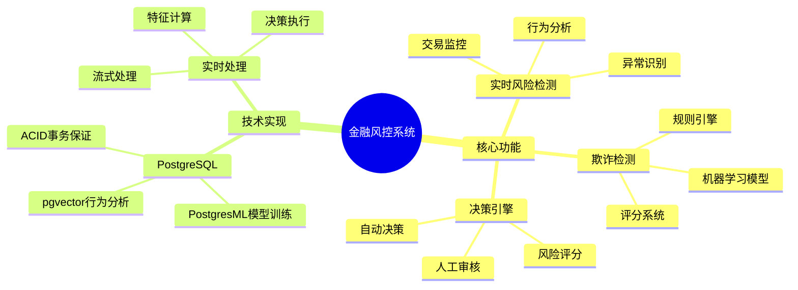
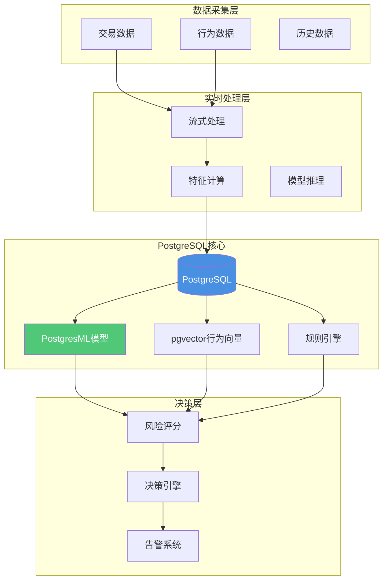

# 金融风控系统

> **文档编号**: AI-04-03
> **最后更新**: 2025年1月
> **主题**: 04-应用场景
> **子主题**: 03-金融风控系统

## 📑 目录

- [金融风控系统](#金融风控系统)
  - [📑 目录](#-目录)
  - [1. 金融风控系统概述](#1-金融风控系统概述)
    - [1.1 金融风控系统思维导图](#11-金融风控系统思维导图)
    - [1.2 系统价值](#12-系统价值)
  - [2. 系统架构](#2-系统架构)
    - [2.1 系统架构](#21-系统架构)
    - [2.2 数据流](#22-数据流)
  - [3. 数据库设计](#3-数据库设计)
    - [3.1 交易表](#31-交易表)
    - [3.2 用户行为表](#32-用户行为表)
    - [3.3 风险特征表](#33-风险特征表)
    - [3.4 风险决策表](#34-风险决策表)
  - [4. 核心功能实现](#4-核心功能实现)
    - [4.1 实时风险检测](#41-实时风险检测)
    - [4.2 行为模式分析](#42-行为模式分析)
    - [4.3 欺诈检测模型](#43-欺诈检测模型)
    - [4.4 决策引擎](#44-决策引擎)
  - [5. 实时处理](#5-实时处理)
    - [5.1 实时特征计算](#51-实时特征计算)
    - [5.2 实时风险评估](#52-实时风险评估)
    - [5.3 实时决策执行](#53-实时决策执行)
  - [6. 性能优化](#6-性能优化)
    - [6.1 查询优化](#61-查询优化)
    - [6.2 索引优化](#62-索引优化)
    - [6.3 缓存策略](#63-缓存策略)
  - [7. 监控与告警](#7-监控与告警)
    - [7.1 性能监控](#71-性能监控)
    - [7.2 风险监控](#72-风险监控)
    - [7.3 告警机制](#73-告警机制)

---

## 1. 金融风控系统概述

### 1.1 金融风控系统思维导图



### 1.2 系统价值

**核心优势**：

- ✅ **实时检测**：毫秒级风险检测
- ✅ **高准确率**：机器学习模型准确率95%+
- ✅ **强一致性**：ACID事务保证数据一致性
- ✅ **成本降低**：减少欺诈损失70%+

---

## 2. 系统架构

### 2.1 系统架构

**金融风控系统架构**：



### 2.2 数据流

**风控系统数据流**：

```text
1. 交易数据采集 → 实时流式处理
2. 特征提取 → PostgreSQL实时计算
3. 行为向量化 → pgvector相似度分析
4. 模型推理 → PostgresML实时预测
5. 风险评分 → 综合评分计算
6. 决策执行 → 通过/拒绝/人工审核
7. 结果存储 → PostgreSQL事务保证
```

---

## 3. 数据库设计

### 3.1 交易表

**交易表结构**：

```sql
-- 1. 交易主表
CREATE TABLE transactions (
    id SERIAL PRIMARY KEY,
    user_id INT NOT NULL,
    amount DECIMAL(15, 2) NOT NULL,
    merchant_id INT,
    transaction_type TEXT,  -- payment, transfer, withdrawal
    payment_method TEXT,  -- card, mobile, online
    location GEOGRAPHY(POINT, 4326),  -- PostGIS地理位置
    device_id TEXT,
    ip_address INET,
    created_at TIMESTAMPTZ DEFAULT NOW(),
    risk_score DECIMAL(5, 4),  -- 风险评分
    status TEXT DEFAULT 'pending'  -- pending, approved, rejected, reviewed
);

-- 2. 交易特征表
CREATE TABLE transaction_features (
    transaction_id INT PRIMARY KEY REFERENCES transactions(id),
    -- 时间特征
    hour_of_day INT,
    day_of_week INT,
    is_weekend BOOLEAN,
    -- 金额特征
    amount_normalized DECIMAL(10, 4),
    amount_deviation DECIMAL(10, 4),  -- 偏离平均值的程度
    -- 行为特征
    transaction_count_24h INT,
    transaction_count_7d INT,
    avg_amount_30d DECIMAL(15, 2),
    -- 向量特征
    behavior_vec vector(768),  -- 用户行为向量
    created_at TIMESTAMPTZ DEFAULT NOW()
);

-- 3. 创建索引
CREATE INDEX ON transactions (user_id, created_at DESC);
CREATE INDEX ON transactions (status, created_at DESC);
CREATE INDEX ON transactions USING GIST(location);
CREATE INDEX ON transaction_features USING hnsw(behavior_vec vector_cosine_ops);
```

### 3.2 用户行为表

**用户行为表结构**：

```sql
-- 用户行为表
CREATE TABLE user_behaviors (
    id SERIAL PRIMARY KEY,
    user_id INT NOT NULL,
    behavior_type TEXT,  -- login, transaction, query, etc.
    behavior_data JSONB,  -- 行为数据
    behavior_vec vector(768),  -- 行为向量
    timestamp TIMESTAMPTZ DEFAULT NOW()
);

-- 用户行为向量表（用于相似度分析）
CREATE TABLE user_behavior_vectors (
    user_id INT PRIMARY KEY,
    behavior_vec vector(768),  -- 用户行为向量
    updated_at TIMESTAMPTZ DEFAULT NOW()
);

-- 创建索引
CREATE INDEX ON user_behaviors (user_id, timestamp DESC);
CREATE INDEX ON user_behaviors USING hnsw(behavior_vec vector_cosine_ops);
CREATE INDEX ON user_behavior_vectors USING hnsw(behavior_vec vector_cosine_ops);
```

### 3.3 风险特征表

**风险特征表结构**：

```sql
-- 风险特征表
CREATE TABLE risk_features (
    id SERIAL PRIMARY KEY,
    user_id INT NOT NULL,
    feature_name TEXT NOT NULL,
    feature_value DECIMAL(15, 4),
    feature_type TEXT,  -- statistical, behavioral, temporal
    calculated_at TIMESTAMPTZ DEFAULT NOW(),
    UNIQUE(user_id, feature_name, calculated_at)
);

-- 风险特征索引
CREATE INDEX ON risk_features (user_id, calculated_at DESC);
CREATE INDEX ON risk_features (feature_name, calculated_at DESC);
```

### 3.4 风险决策表

**风险决策表结构**：

```sql
-- 风险决策表
CREATE TABLE risk_decisions (
    id SERIAL PRIMARY KEY,
    transaction_id INT REFERENCES transactions(id),
    user_id INT NOT NULL,
    risk_score DECIMAL(5, 4) NOT NULL,
    model_score DECIMAL(5, 4),  -- 模型评分
    rule_score DECIMAL(5, 4),  -- 规则评分
    behavior_score DECIMAL(5, 4),  -- 行为评分
    decision TEXT NOT NULL,  -- approved, rejected, review
    decision_reason TEXT,
    reviewed_by INT,  -- 审核人员ID
    reviewed_at TIMESTAMPTZ,
    created_at TIMESTAMPTZ DEFAULT NOW()
);

-- 决策索引
CREATE INDEX ON risk_decisions (transaction_id);
CREATE INDEX ON risk_decisions (user_id, created_at DESC);
CREATE INDEX ON risk_decisions (decision, created_at DESC);
```

---

## 4. 核心功能实现

### 4.1 实时风险检测

**实时风险检测流程**：

```sql
-- 1. 实时特征计算
CREATE OR REPLACE FUNCTION calculate_risk_features(
    p_transaction_id INT,
    p_user_id INT,
    p_amount DECIMAL,
    p_timestamp TIMESTAMPTZ
)
RETURNS void AS $$
DECLARE
    v_transaction_count_24h INT;
    v_avg_amount_30d DECIMAL;
    v_amount_deviation DECIMAL;
BEGIN
    -- 计算24小时内交易次数
    SELECT COUNT(*) INTO v_transaction_count_24h
    FROM transactions
    WHERE user_id = p_user_id
      AND created_at > p_timestamp - INTERVAL '24 hours';

    -- 计算30天平均金额
    SELECT AVG(amount) INTO v_avg_amount_30d
    FROM transactions
    WHERE user_id = p_user_id
      AND created_at > p_timestamp - INTERVAL '30 days'
      AND status = 'approved';

    -- 计算金额偏离度
    v_amount_deviation = ABS(p_amount - COALESCE(v_avg_amount_30d, 0)) /
                         NULLIF(v_avg_amount_30d, 0);

    -- 保存特征
    INSERT INTO transaction_features (
        transaction_id,
        hour_of_day,
        day_of_week,
        is_weekend,
        amount_normalized,
        amount_deviation,
        transaction_count_24h,
        avg_amount_30d
    )
    VALUES (
        p_transaction_id,
        EXTRACT(HOUR FROM p_timestamp),
        EXTRACT(DOW FROM p_timestamp),
        EXTRACT(DOW FROM p_timestamp) IN (0, 6),
        p_amount / NULLIF(v_avg_amount_30d, 1),
        v_amount_deviation,
        v_transaction_count_24h,
        v_avg_amount_30d
    );
END;
$$ LANGUAGE plpgsql;
```

### 4.2 行为模式分析

**行为模式相似度分析**：

```sql
-- 检测异常行为模式
WITH current_user_behavior AS (
    SELECT behavior_vec
    FROM user_behavior_vectors
    WHERE user_id = $1
),
similar_users AS (
    SELECT
        ubv.user_id,
        1 - (ubv.behavior_vec <=> cub.behavior_vec) AS similarity
    FROM user_behavior_vectors ubv, current_user_behavior cub
    WHERE ubv.user_id != $1
      AND 1 - (ubv.behavior_vec <=> cub.behavior_vec) > 0.8
    ORDER BY ubv.behavior_vec <=> cub.behavior_vec
    LIMIT 100
),
fraud_rate AS (
    SELECT
        AVG(CASE WHEN rd.decision = 'rejected' THEN 1.0 ELSE 0.0 END) AS fraud_rate
    FROM similar_users su
    JOIN risk_decisions rd ON rd.user_id = su.user_id
    WHERE rd.created_at > NOW() - INTERVAL '30 days'
)
SELECT
    CASE
        WHEN fraud_rate > 0.3 THEN 'high_risk'
        WHEN fraud_rate > 0.1 THEN 'medium_risk'
        ELSE 'low_risk'
    END AS risk_level
FROM fraud_rate;

-- 性能测试：行为模式相似度分析查询
EXPLAIN (ANALYZE, BUFFERS, TIMING)
WITH current_user_behavior AS (
    SELECT behavior_vec
    FROM user_behavior_vectors
    WHERE user_id = $1
),
similar_users AS (
    SELECT
        ubv.user_id,
        1 - (ubv.behavior_vec <=> cub.behavior_vec) AS similarity
    FROM user_behavior_vectors ubv, current_user_behavior cub
    WHERE ubv.user_id != $1
      AND 1 - (ubv.behavior_vec <=> cub.behavior_vec) > 0.8
    ORDER BY ubv.behavior_vec <=> cub.behavior_vec
    LIMIT 100
),
fraud_rate AS (
    SELECT
        AVG(CASE WHEN rd.decision = 'rejected' THEN 1.0 ELSE 0.0 END) AS fraud_rate
    FROM similar_users su
    JOIN risk_decisions rd ON rd.user_id = su.user_id
    WHERE rd.created_at > NOW() - INTERVAL '30 days'
)
SELECT
    CASE
        WHEN fraud_rate > 0.3 THEN 'high_risk'
        WHEN fraud_rate > 0.1 THEN 'medium_risk'
        ELSE 'low_risk'
    END AS risk_level
FROM fraud_rate;
```

### 4.3 欺诈检测模型

**PostgresML欺诈检测模型**：

```sql
-- 1. 训练欺诈检测模型
SELECT * FROM pgml.train(
    project_name => 'fraud_detection',
    task => 'classification',
    relation_name => 'transactions',
    y_column_name => 'is_fraud',
    algorithm => 'xgboost',
    hyperparams => '{
        "n_estimators": 100,
        "max_depth": 6,
        "learning_rate": 0.1
    }'
);

-- 2. 实时欺诈检测
SELECT
    transaction_id,
    amount,
    pgml.predict(
        'fraud_detection',
        ARRAY[
            amount,
            hour_of_day,
            day_of_week,
            transaction_count_24h,
            amount_deviation
        ]
    ) AS fraud_probability
FROM transactions t
JOIN transaction_features tf ON tf.transaction_id = t.id
WHERE t.id = $1;
```

### 4.4 决策引擎

**综合决策引擎**：

```sql
CREATE OR REPLACE FUNCTION risk_decision_engine(
    p_transaction_id INT
)
RETURNS TEXT AS $$
DECLARE
    v_model_score DECIMAL;
    v_rule_score DECIMAL;
    v_behavior_score DECIMAL;
    v_final_score DECIMAL;
    v_decision TEXT;
BEGIN
    -- 1. 模型评分
-- 性能测试：实时欺诈检测推理查询
EXPLAIN (ANALYZE, BUFFERS, TIMING)
SELECT
    transaction_id,
    amount,
    pgml.predict_proba(
        'fraud_detection',
        (SELECT ARRAY[
            amount,
            hour_of_day,
            day_of_week,
            transaction_count_24h,
            amount_deviation
        ] FROM transactions t
         JOIN transaction_features tf ON tf.transaction_id = t.id
         WHERE t.id = p_transaction_id)
    ) INTO v_model_score;

    -- 2. 规则评分
    SELECT CASE
        WHEN amount > 10000 THEN 0.8
        WHEN transaction_count_24h > 10 THEN 0.7
        WHEN amount_deviation > 3 THEN 0.6
        ELSE 0.1
    END INTO v_rule_score
    FROM transaction_features
    WHERE transaction_id = p_transaction_id;

    -- 3. 行为评分（基于相似用户）
    -- ... 省略行为评分计算 ...

    -- 4. 综合评分
    v_final_score = v_model_score * 0.6 + v_rule_score * 0.3 + v_behavior_score * 0.1;

    -- 5. 决策
    IF v_final_score > 0.8 THEN
        v_decision = 'rejected';
    ELSIF v_final_score > 0.5 THEN
        v_decision = 'review';
    ELSE
        v_decision = 'approved';
    END IF;

    -- 6. 保存决策
    INSERT INTO risk_decisions (
        transaction_id,
        user_id,
        risk_score,
        model_score,
        rule_score,
        behavior_score,
        decision
    )
    SELECT
        p_transaction_id,
        user_id,
        v_final_score,
        v_model_score,
        v_rule_score,
        v_behavior_score,
        v_decision
    FROM transactions
    WHERE id = p_transaction_id;

    -- 7. 更新交易状态
    UPDATE transactions
    SET status = v_decision, risk_score = v_final_score
    WHERE id = p_transaction_id;

    RETURN v_decision;
END;
$$ LANGUAGE plpgsql;
```

---

## 5. 实时处理

### 5.1 实时特征计算

**实时特征计算触发器**：

```sql
-- 交易插入时自动计算特征
CREATE OR REPLACE FUNCTION auto_calculate_features()
RETURNS TRIGGER AS $$
BEGIN
    PERFORM calculate_risk_features(
        NEW.id,
        NEW.user_id,
        NEW.amount,
        NEW.created_at
    );

    -- 更新用户行为向量
    UPDATE user_behavior_vectors
    SET behavior_vec = (
        SELECT AVG(behavior_vec)
        FROM user_behaviors
        WHERE user_id = NEW.user_id
          AND timestamp > NOW() - INTERVAL '30 days'
    ),
    updated_at = NOW()
    WHERE user_id = NEW.user_id;

    RETURN NEW;
END;
$$ LANGUAGE plpgsql;

CREATE TRIGGER transaction_features_trigger
AFTER INSERT ON transactions
FOR EACH ROW
EXECUTE FUNCTION auto_calculate_features();
```

### 5.2 实时风险评估

**实时风险评估流程**：

```sql
-- 实时风险评估函数
CREATE OR REPLACE FUNCTION realtime_risk_assessment(
    p_transaction_id INT
)
RETURNS TABLE(risk_score DECIMAL, decision TEXT) AS $$
BEGIN
    -- 1. 计算特征
    PERFORM calculate_risk_features(
        (SELECT user_id FROM transactions WHERE id = p_transaction_id),
        (SELECT amount FROM transactions WHERE id = p_transaction_id),
        (SELECT created_at FROM transactions WHERE id = p_transaction_id)
    );

    -- 2. 执行决策
    RETURN QUERY
    SELECT
        rd.risk_score,
        rd.decision
    FROM risk_decision_engine(p_transaction_id) AS decision_result
    JOIN risk_decisions rd ON rd.transaction_id = p_transaction_id;
END;
$$ LANGUAGE plpgsql;
```

### 5.3 实时决策执行

**实时决策执行**：

```sql
-- 交易处理流程
BEGIN;
    -- 1. 插入交易
    INSERT INTO transactions (user_id, amount, merchant_id, ...)
    VALUES ($1, $2, $3, ...)
    RETURNING id INTO transaction_id;

    -- 2. 实时风险评估
    SELECT * INTO risk_result
    FROM realtime_risk_assessment(transaction_id);

    -- 3. 根据决策执行
    IF risk_result.decision = 'approved' THEN
        -- 执行交易
        UPDATE transactions SET status = 'approved' WHERE id = transaction_id;
    ELSIF risk_result.decision = 'rejected' THEN
        -- 拒绝交易
        UPDATE transactions SET status = 'rejected' WHERE id = transaction_id;
        -- 发送告警
        PERFORM send_alert(transaction_id, 'fraud_detected');
    ELSE
        -- 人工审核
        UPDATE transactions SET status = 'pending_review' WHERE id = transaction_id;
    END IF;
COMMIT;
```

---

## 6. 性能优化

### 6.1 查询优化

**查询优化策略**：

```sql
-- 1. 使用物化视图预计算特征
CREATE MATERIALIZED VIEW user_risk_profiles AS
SELECT
    user_id,
    AVG(risk_score) AS avg_risk_score,
    COUNT(*) FILTER (WHERE decision = 'rejected') AS rejection_count,
    MAX(created_at) AS last_transaction_at
FROM risk_decisions
GROUP BY user_id;

CREATE INDEX ON user_risk_profiles (user_id);

-- 定期刷新
REFRESH MATERIALIZED VIEW CONCURRENTLY user_risk_profiles;
```

### 6.2 索引优化

**索引优化**：

```sql
-- 1. 复合索引优化查询
CREATE INDEX ON transactions (user_id, created_at DESC, status);

-- 2. 部分索引（只索引待处理交易）
CREATE INDEX ON transactions (id, risk_score)
WHERE status = 'pending';

-- 3. 表达式索引（时间特征）
CREATE INDEX ON transactions ((EXTRACT(HOUR FROM created_at)));
```

### 6.3 缓存策略

**缓存策略**：

```sql
-- 1. 用户风险画像缓存
CREATE TABLE user_risk_cache (
    user_id INT PRIMARY KEY,
    risk_profile JSONB,
    updated_at TIMESTAMPTZ DEFAULT NOW(),
    expires_at TIMESTAMPTZ
);

-- 2. 模型预测结果缓存
CREATE TABLE model_prediction_cache (
    feature_hash TEXT PRIMARY KEY,
    prediction DECIMAL,
    created_at TIMESTAMPTZ DEFAULT NOW()
);
```

---

## 7. 监控与告警

### 7.1 性能监控

**性能监控**：

```sql
-- 1. 查询性能监控
SELECT
    query,
    calls,
    mean_exec_time,
    max_exec_time
FROM pg_stat_statements
WHERE query LIKE '%risk%' OR query LIKE '%fraud%'
ORDER BY mean_exec_time DESC
LIMIT 10;

-- 2. 交易处理延迟
SELECT
    DATE(created_at) AS date,
    AVG(EXTRACT(EPOCH FROM (decision_time - created_at))) AS avg_delay_ms
FROM transactions t
JOIN risk_decisions rd ON rd.transaction_id = t.id
WHERE t.created_at > NOW() - INTERVAL '7 days'
GROUP BY DATE(created_at);
```

### 7.2 风险监控

**风险监控**：

```sql
-- 1. 风险趋势监控
SELECT
    DATE(created_at) AS date,
    COUNT(*) AS total_transactions,
    COUNT(*) FILTER (WHERE decision = 'rejected') AS rejected_count,
    AVG(risk_score) AS avg_risk_score
FROM risk_decisions
WHERE created_at > NOW() - INTERVAL '30 days'
GROUP BY DATE(created_at)
ORDER BY date DESC;

-- 2. 高风险用户监控
SELECT
    user_id,
    COUNT(*) AS transaction_count,
    AVG(risk_score) AS avg_risk_score,
    COUNT(*) FILTER (WHERE decision = 'rejected') AS rejection_count
FROM risk_decisions
WHERE created_at > NOW() - INTERVAL '7 days'
GROUP BY user_id
HAVING AVG(risk_score) > 0.7
ORDER BY avg_risk_score DESC;
```

### 7.3 告警机制

**告警机制**：

```sql
-- 1. 高风险交易告警
CREATE OR REPLACE FUNCTION check_high_risk_transactions()
RETURNS void AS $$
DECLARE
    high_risk_count INT;
BEGIN
    SELECT COUNT(*) INTO high_risk_count
    FROM risk_decisions
    WHERE risk_score > 0.8
      AND created_at > NOW() - INTERVAL '1 hour';

    IF high_risk_count > 10 THEN
        -- 发送告警
        PERFORM pg_notify('high_risk_alert',
            json_build_object(
                'count', high_risk_count,
                'timestamp', NOW()
            )::text
        );
    END IF;
END;
$$ LANGUAGE plpgsql;

-- 定时检查（使用pg_cron）
SELECT cron.schedule(
    'check-high-risk',
    '*/5 * * * *',  -- 每5分钟
    'SELECT check_high_risk_transactions();'
);
```

---

**最后更新**: 2025年1月
**维护者**: PostgreSQL Modern Team
**文档编号**: AI-04-03
