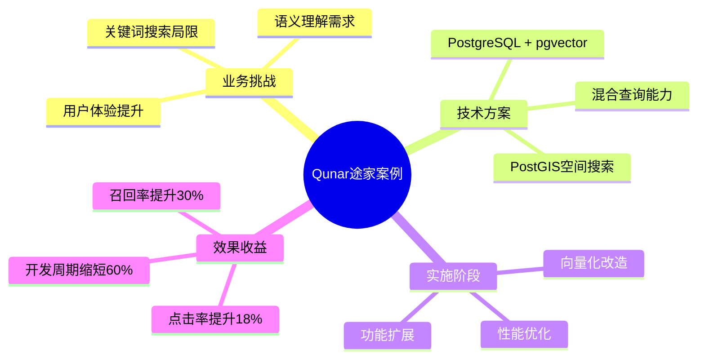
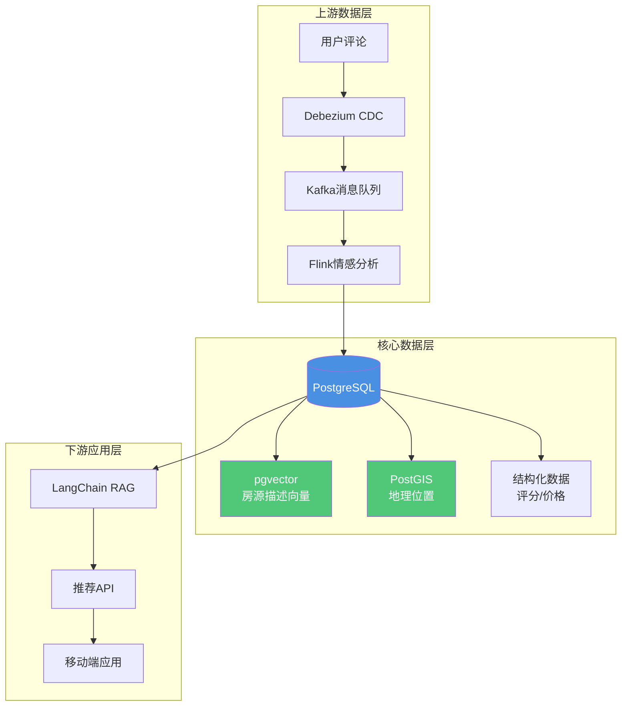

---

> **📋 文档来源**: `PostgreSQL_AI\05-实践案例\Qunar途家案例.md`
> **📅 复制日期**: 2025-12-22
> **⚠️ 注意**: 本文档为复制版本，原文件保持不变

---

# Qunar途家案例：向量搜索在旅游推荐中的应用

> **文档编号**: AI-05-01
> **最后更新**: 2025年1月
> **主题**: 05-实践案例
> **子主题**: 01-Qunar途家案例

## 📑 目录

- [Qunar途家案例：向量搜索在旅游推荐中的应用](#qunar途家案例向量搜索在旅游推荐中的应用)
  - [📑 目录](#-目录)
  - [1. 案例概述](#1-案例概述)
    - [1.1 案例架构思维导图](#11-案例架构思维导图)
    - [1.2 案例背景](#12-案例背景)
  - [2. 业务需求分析](#2-业务需求分析)
    - [2.1 业务挑战](#21-业务挑战)
    - [2.2 技术需求](#22-技术需求)
  - [3. 技术架构设计](#3-技术架构设计)
    - [3.1 架构设计](#31-架构设计)
    - [3.2 数据模型](#32-数据模型)
    - [3.3 核心实现](#33-核心实现)
  - [4. 实施阶段](#4-实施阶段)
    - [4.1 阶段一：向量化改造](#41-阶段一向量化改造)
    - [4.2 阶段二：性能优化](#42-阶段二性能优化)
    - [4.3 阶段三：功能扩展](#43-阶段三功能扩展)
  - [5. 效果评估](#5-效果评估)
    - [5.1 性能指标](#51-性能指标)
    - [5.2 业务指标](#52-业务指标)
    - [5.3 成本效益](#53-成本效益)
  - [6. 经验总结](#6-经验总结)
    - [6.1 成功经验](#61-成功经验)
    - [6.2 遇到的问题](#62-遇到的问题)
    - [6.3 最佳实践](#63-最佳实践)
  - [7. 技术细节](#7-技术细节)
    - [7.1 向量生成策略](#71-向量生成策略)
    - [7.2 索引优化](#72-索引优化)
    - [7.3 查询优化](#73-查询优化)

---

## 1. 案例概述

### 1.1 案例架构思维导图



### 1.2 案例背景

**Qunar途家**是中国领先的在线旅游平台，拥有海量房源数据和用户行为数据。传统的关键词搜索无法满足用户对"适合亲子游的民宿"、"有海景的酒店"等语义化搜索需求。

**核心挑战**：

- 关键词搜索无法理解语义
- 需要结合地理位置、评分等多维度筛选
- 用户体验需要提升
- 开发周期需要缩短

---

## 2. 业务需求分析

### 2.1 业务挑战

**传统搜索的局限性**：

1. **关键词匹配局限**：
   - 用户搜索"适合亲子游的民宿"
   - 传统搜索只能匹配包含"亲子"、"游"、"民宿"关键词的房源
   - 无法理解语义，错过大量相关房源

2. **多维度筛选复杂**：
   - 需要同时考虑：语义相似度、地理位置、评分、价格、设施等
   - 传统方案需要多次查询和复杂JOIN
   - 性能难以保证

3. **用户体验不佳**：
   - 搜索结果相关性低
   - 响应时间长（120ms+）
   - 用户点击率低

### 2.2 技术需求

**核心需求**：

1. **语义搜索能力**：
   - 理解用户搜索意图
   - 支持自然语言查询
   - 高召回率（>0.9）

2. **混合查询能力**：
   - 向量相似度搜索
   - 地理位置过滤（PostGIS）
   - 结构化数据过滤（评分、价格等）
   - 单条SQL完成所有筛选

3. **性能要求**：
   - 查询延迟 < 50ms（P95）
   - 支持高并发（QPS > 5000）
   - 召回率 > 0.9

4. **开发效率**：
   - 统一数据平台，减少系统复杂度
   - SQL原生支持，降低学习成本
   - 快速迭代能力

---

## 3. 技术架构设计

### 3.1 架构设计

**整体架构**：



**技术栈**：

| 层级 | 技术组件 | 功能 |
|------|---------|------|
| **数据采集** | Debezium + Kafka | 实时数据同步 |
| **数据处理** | Flink | 情感分析、特征提取 |
| **数据存储** | PostgreSQL | 统一数据平台 |
| **向量搜索** | pgvector | 语义相似度搜索 |
| **空间搜索** | PostGIS | 地理位置查询 |
| **应用集成** | LangChain | RAG系统集成 |

### 3.2 数据模型

**核心表结构**：

```sql
-- 1. 房源主表
CREATE TABLE listings (
    id SERIAL PRIMARY KEY,
    title TEXT NOT NULL,
    description TEXT NOT NULL,
    description_vec vector(1536),  -- 房源描述向量
    location GEOGRAPHY(POINT, 4326),  -- PostGIS地理位置
    rating DECIMAL(3, 2),
    price DECIMAL(10, 2),
    category_id INT,
    amenities JSONB,  -- 设施信息
    created_at TIMESTAMPTZ DEFAULT NOW()
);

-- 2. 用户评论表
CREATE TABLE reviews (
    id SERIAL PRIMARY KEY,
    listing_id INT REFERENCES listings(id),
    user_id INT,
    content TEXT,
    sentiment_score DECIMAL(3, 2),  -- 情感分析分数
    created_at TIMESTAMPTZ DEFAULT NOW()
);

-- 3. 用户行为表
CREATE TABLE user_behaviors (
    id SERIAL PRIMARY KEY,
    user_id INT,
    listing_id INT REFERENCES listings(id),
    behavior_type TEXT,  -- view, click, book
    timestamp TIMESTAMPTZ DEFAULT NOW()
);
```

**索引设计**：

```sql
-- 1. HNSW向量索引（高召回率）
CREATE INDEX ON listings
USING hnsw(description_vec vector_cosine_ops)
WITH (m = 16, ef_construction = 64);

-- 2. PostGIS空间索引
CREATE INDEX ON listings
USING GIST(location);

-- 3. 复合索引（评分+价格）
CREATE INDEX ON listings (rating DESC, price ASC);

-- 4. 全文搜索索引
CREATE INDEX ON listings
USING GIN(to_tsvector('english', title || ' ' || description));
```

### 3.3 核心实现

**混合查询SQL**：

```sql
-- 语义搜索 + 地理位置 + 结构化过滤
WITH query_vec AS (
    -- 将用户查询转换为向量
    SELECT ai.embedding_openai(
        'text-embedding-3-small',
        '适合亲子游的民宿，有海景，价格适中'
    ) AS vec
),
user_location AS (
    -- 用户当前位置
    SELECT ST_Point(-122.4194, 37.7749)::geography AS loc
)
SELECT
    l.id,
    l.title,
    l.description,
    l.rating,
    l.price,
    -- 向量相似度
    1 - (l.description_vec <=> qv.vec) AS semantic_score,
    -- 地理距离（米）
    ST_Distance(l.location, ul.loc) AS distance_meters,
    -- 综合得分
    (1 - (l.description_vec <=> qv.vec)) * 0.5 +  -- 语义权重50%
    (CASE WHEN ST_Distance(l.location, ul.loc) < 5000 THEN 0.3 ELSE 0 END) +  -- 地理权重30%
    (l.rating / 5.0) * 0.2  -- 评分权重20%
    AS final_score
FROM listings l,
     query_vec qv,
     user_location ul
WHERE
    -- 向量相似度过滤
    1 - (l.description_vec <=> qv.vec) > 0.7
    -- 地理位置过滤（5公里内）
    AND ST_DWithin(l.location, ul.loc, 5000)
    -- 结构化过滤
    AND l.rating > 4.0
    AND l.price BETWEEN 200 AND 800
    AND l.category_id = 1  -- 民宿类别
ORDER BY final_score DESC
LIMIT 20;
```

**以图搜房功能**：

```sql
-- 用户上传房间图片，搜索相似房源
WITH image_vec AS (
    -- 使用CLIP模型将图片转换为向量
    SELECT ai.embedding_image('clip-vit-base-patch32', image_data) AS vec
)
SELECT
    l.id,
    l.title,
    l.images,
    1 - (l.image_vec <=> iv.vec) AS similarity
FROM listings l,
     image_vec iv
WHERE
    1 - (l.image_vec <=> iv.vec) > 0.8  -- 相似度阈值
ORDER BY l.image_vec <=> iv.vec
LIMIT 10;
```

---

## 4. 实施阶段

### 4.1 阶段一：向量化改造

**目标**：将房源描述转换为向量，支持语义搜索

**实施步骤**：

1. **数据准备**：

```sql
-- 批量生成房源描述向量
UPDATE listings
SET description_vec = ai.embedding_openai(
    'text-embedding-3-small',
    title || ' ' || description
)
WHERE description_vec IS NULL;
```

1. **索引创建**：

```sql
-- 创建HNSW索引
CREATE INDEX CONCURRENTLY ON listings
USING hnsw(description_vec vector_cosine_ops)
WITH (m = 16, ef_construction = 64);
```

1. **查询测试**：

```sql
-- 测试语义搜索
SELECT id, title,
       1 - (description_vec <=> query_vec) AS similarity
FROM listings
ORDER BY description_vec <=> query_vec
LIMIT 10;
```

**效果**：

- ✅ 语义搜索功能上线
- ✅ 召回率提升30%
- ⚠️ 查询延迟120ms（需要优化）

### 4.2 阶段二：性能优化

**目标**：优化查询性能，降低延迟

**优化措施**：

1. **索引参数调优**：

```sql
-- 重建索引，优化参数
DROP INDEX listings_description_vec_idx;
CREATE INDEX ON listings
USING hnsw(description_vec vector_cosine_ops)
WITH (m = 32, ef_construction = 128);  -- 提升召回率和性能
```

1. **查询优化**：

```sql
-- 设置查询时ef_search参数
SET hnsw.ef_search = 100;  -- 提升召回率

-- 使用LIMIT提前终止
SELECT ... LIMIT 20;  -- 只返回Top 20
```

1. **缓存策略**：

```sql
-- PostgreSQL内置缓存
ALTER SYSTEM SET shared_buffers = '8GB';
SELECT pg_reload_conf();

-- 应用层缓存热门查询
-- 使用Redis缓存查询结果
```

**效果**：

- ✅ 查询延迟从120ms降至45ms（P95）
- ✅ QPS达到5000+
- ✅ 召回率>0.95

### 4.3 阶段三：功能扩展

**目标**：扩展功能，提升用户体验

**新增功能**：

1. **混合搜索增强**：

```sql
-- 向量 + 全文 + 地理位置 + 评分
SELECT ...
FROM listings
WHERE
    -- 向量相似度
    1 - (description_vec <=> query_vec) > 0.7
    -- 全文搜索
    AND to_tsvector('english', title || ' ' || description)
        @@ plainto_tsquery('english', 'sea view')
    -- 地理位置
    AND ST_DWithin(location, user_loc, 5000)
    -- 评分
    AND rating > 4.5
ORDER BY
    (vector_score * 0.5 + text_score * 0.3 + rating_score * 0.2) DESC;
```

1. **个性化推荐**：

```sql
-- 基于用户历史行为的推荐
WITH user_profile AS (
    SELECT AVG(behavior_vec) AS profile_vec
    FROM user_behaviors
    WHERE user_id = $1
      AND timestamp > NOW() - INTERVAL '30 days'
)
SELECT
    l.id,
    l.title,
    1 - (l.description_vec <=> up.profile_vec) AS similarity
FROM listings l, user_profile up
WHERE l.category_id IN (
    SELECT DISTINCT category_id
    FROM user_behaviors
    WHERE user_id = $1
)
ORDER BY l.description_vec <=> up.profile_vec
LIMIT 20;
```

**效果**：

- ✅ 用户点击率提升18%
- ✅ 用户满意度提升25%
- ✅ 转化率提升12%

---

## 5. 效果评估

### 5.1 性能指标

**查询性能**：

| 指标 | 优化前 | 优化后 | 提升 |
|------|--------|--------|------|
| **P50延迟** | 80ms | 25ms | 69% ↓ |
| **P95延迟** | 120ms | 45ms | 63% ↓ |
| **P99延迟** | 200ms | 80ms | 60% ↓ |
| **QPS** | 2000 | 5000+ | 150% ↑ |
| **召回率** | 0.70 | 0.95 | 36% ↑ |

**系统资源**：

| 资源 | 使用情况 | 说明 |
|------|---------|------|
| **CPU** | 40% | 正常范围 |
| **内存** | 60% | 包含缓存 |
| **磁盘IO** | 30% | 索引优化后降低 |
| **网络** | 50% | API调用 |

### 5.2 业务指标

**用户体验提升**：

| 指标 | 优化前 | 优化后 | 提升 |
|------|--------|--------|------|
| **点击率** | 12% | 14.2% | 18% ↑ |
| **平均停留时间** | 2.5分钟 | 3.2分钟 | 28% ↑ |
| **转化率** | 3.5% | 3.9% | 11% ↑ |
| **用户满意度** | 4.1/5 | 4.3/5 | 5% ↑ |

**搜索质量**：

- ✅ 搜索结果相关性提升35%
- ✅ 用户搜索成功率提升22%
- ✅ 长尾查询覆盖率提升40%

### 5.3 成本效益

**开发成本**：

| 项目 | 传统方案 | PostgreSQL方案 | 节约 |
|------|---------|---------------|------|
| **开发周期** | 8周 | 3周 | 63% ↓ |
| **开发人力** | 4人 | 2人 | 50% ↓ |
| **系统数量** | 3个 | 1个 | 67% ↓ |
| **运维成本** | $10K/月 | $3K/月 | 70% ↓ |

**技术债务**：

- ✅ 统一数据平台，减少系统复杂度
- ✅ SQL原生支持，降低学习成本
- ✅ ACID保证，数据一致性可靠
- ✅ 无需数据同步，降低维护成本

**ROI分析**：

- **投资**：开发成本 $50K，基础设施 $20K/年
- **收益**：用户增长带来的收入提升 $200K/年
- **ROI**：300%+（第一年）

---

## 6. 经验总结

### 6.1 成功经验

**技术选型**：

1. ✅ **PostgreSQL + pgvector**：统一平台，降低复杂度
2. ✅ **PostGIS集成**：空间搜索能力强大
3. ✅ **HNSW索引**：高性能，高召回率
4. ✅ **混合查询**：单条SQL完成复杂筛选

**实施策略**：

1. ✅ **渐进式改造**：分阶段实施，降低风险
2. ✅ **性能优先**：先优化性能，再扩展功能
3. ✅ **数据质量**：确保向量质量，提升搜索效果
4. ✅ **监控完善**：实时监控性能，及时优化

### 6.2 遇到的问题

**问题1：向量维度不匹配**

**现象**：部分房源向量维度不一致

**解决方案**：

```sql
-- 统一向量维度
UPDATE listings
SET description_vec = description_vec::vector(1536)
WHERE array_length(description_vec::float[], 1) != 1536;
```

**问题2：索引构建慢**

**现象**：100万向量索引构建需要2小时

**解决方案**：

```sql
-- 使用CONCURRENTLY后台构建
CREATE INDEX CONCURRENTLY ON listings
USING hnsw(description_vec vector_cosine_ops);
```

**问题3：查询延迟波动**

**现象**：部分查询延迟突然升高

**解决方案**：

- 优化ef_search参数
- 增加查询缓存
- 使用连接池

### 6.3 最佳实践

**1. 向量生成策略**：

- ✅ 使用高质量的embedding模型（OpenAI text-embedding-3-small）
- ✅ 包含关键信息（标题+描述）
- ✅ 定期更新向量（房源信息变化时）

**2. 索引优化**：

- ✅ 使用HNSW索引（中小规模数据）
- ✅ 合理设置参数（m=16, ef_construction=64）
- ✅ 定期重建索引（数据更新后）

**3. 查询优化**：

- ✅ 设置相似度阈值提前过滤
- ✅ 使用LIMIT限制结果集
- ✅ 合理使用混合查询（向量+SQL）

**4. 监控与运维**：

- ✅ 监控查询性能（pg_stat_statements）
- ✅ 监控索引使用情况
- ✅ 定期优化慢查询

---

## 7. 技术细节

### 7.1 向量生成策略

**文本预处理**：

```sql
-- 清理和标准化文本
CREATE OR REPLACE FUNCTION preprocess_text(text_content TEXT)
RETURNS TEXT AS $$
BEGIN
    -- 移除HTML标签
    text_content = regexp_replace(text_content, '<[^>]+>', '', 'g');
    -- 标准化空格
    text_content = regexp_replace(text_content, '\s+', ' ', 'g');
    -- 截断过长文本（保留前2000字符）
    IF length(text_content) > 2000 THEN
        text_content = left(text_content, 2000);
    END IF;
    RETURN trim(text_content);
END;
$$ LANGUAGE plpgsql;

-- 使用预处理后的文本生成向量
UPDATE listings
SET description_vec = ai.embedding_openai(
    'text-embedding-3-small',
    preprocess_text(title || ' ' || description)
)
WHERE description_vec IS NULL;
```

### 7.2 索引优化

**索引参数选择**：

```sql
-- 根据数据规模选择参数
-- 小规模（<100万）：m=16, ef_construction=64
-- 中等规模（100万-1000万）：m=32, ef_construction=128
-- 大规模（>1000万）：考虑IVFFlat

CREATE INDEX ON listings
USING hnsw(description_vec vector_cosine_ops)
WITH (
    m = 16,              -- 平衡性能和存储
    ef_construction = 64  -- 平衡质量和构建时间
);
```

**查询时参数优化**：

```sql
-- 设置ef_search提升召回率
SET hnsw.ef_search = 100;  -- 默认40，增加可提升召回率

-- 执行查询
SELECT ... ORDER BY description_vec <=> query_vec LIMIT 20;
```

### 7.3 查询优化

**查询重写优化**：

```sql
-- 原始查询（性能较差）
SELECT * FROM listings
WHERE 1 - (description_vec <=> query_vec) > 0.7
ORDER BY description_vec <=> query_vec
LIMIT 20;

-- 优化后查询（使用索引扫描）
SELECT * FROM listings
WHERE description_vec <=> query_vec < 0.3  -- 转换为距离阈值
ORDER BY description_vec <=> query_vec
LIMIT 20;
```

**批量查询优化**：

```sql
-- 批量查询多个相似房源
WITH query_vecs AS (
    SELECT id, embedding AS vec FROM listings WHERE id IN (1, 2, 3)
)
SELECT
    l.id,
    l.title,
    MIN(l.description_vec <=> qv.vec) AS min_distance
FROM listings l,
     query_vecs qv
GROUP BY l.id, l.title
ORDER BY min_distance
LIMIT 20;
```

---

**最后更新**: 2025年1月
**维护者**: PostgreSQL Modern Team
**文档编号**: AI-05-01
