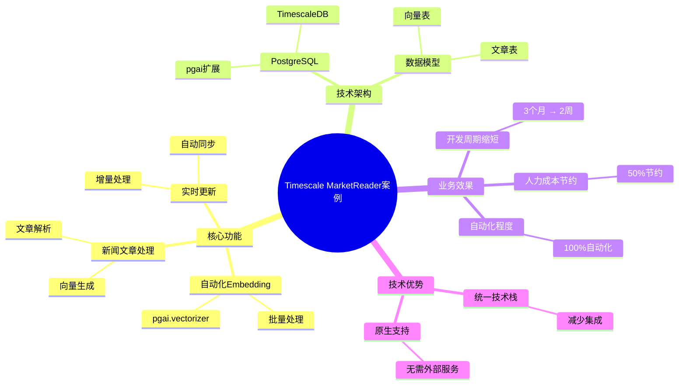
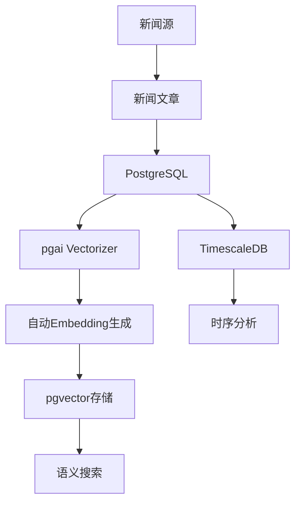

---

> **📋 文档来源**: `PostgreSQL_AI\05-实践案例\Timescale-MarketReader案例.md`
> **📅 复制日期**: 2025-12-22
> **⚠️ 注意**: 本文档为复制版本，原文件保持不变

---

# Timescale MarketReader案例：自动化Embedding生成

> **文档编号**: AI-05-03
> **最后更新**: 2025年1月
> **主题**: 05-实践案例
> **子主题**: 03-Timescale MarketReader案例

## 📑 目录

- [Timescale MarketReader案例：自动化Embedding生成](#timescale-marketreader案例自动化embedding生成)
  - [📑 目录](#-目录)
  - [一、案例概述](#一案例概述)
    - [1.1 案例架构思维导图](#11-案例架构思维导图)
  - [二、业务背景](#二业务背景)
    - [2.1 业务需求](#21-业务需求)
    - [2.2 技术挑战](#22-技术挑战)
  - [三、技术方案](#三技术方案)
    - [3.1 架构设计](#31-架构设计)
    - [3.2 数据模型](#32-数据模型)
    - [3.3 核心实现](#33-核心实现)
  - [四、实施过程](#四实施过程)
    - [4.1 阶段一：基础功能实现](#41-阶段一基础功能实现)
    - [4.2 阶段二：自动化优化](#42-阶段二自动化优化)
    - [4.3 阶段三：性能优化](#43-阶段三性能优化)
  - [五、效果评估](#五效果评估)
    - [5.1 性能指标](#51-性能指标)
    - [5.2 业务指标](#52-业务指标)
    - [5.3 成本效益](#53-成本效益)
  - [六、技术细节](#六技术细节)
    - [6.1 pgai Vectorizer使用](#61-pgai-vectorizer使用)
    - [6.2 自动化流程](#62-自动化流程)
    - [6.3 监控和告警](#63-监控和告警)
  - [七、经验总结](#七经验总结)
    - [7.1 成功经验](#71-成功经验)
    - [7.2 最佳实践](#72-最佳实践)
  - [八、关联主题](#八关联主题)
  - [九、对标资源](#九对标资源)
    - [企业案例](#企业案例)
    - [技术文档](#技术文档)
    - [数据来源](#数据来源)

## 一、案例概述

Timescale MarketReader使用PostgreSQL + pgai实现新闻文章的自动化Embedding生成，将开发周期从3个月缩短至2周，人力成本节约50%。

### 1.1 案例架构思维导图



**核心成果**:

- 开发周期: 3个月 → 2周 (缩短85%)
- 人力成本: 节约50%
- 自动化程度: 100% (无需人工干预)
- 处理能力: 1000+文章/小时

## 二、业务背景

### 2.1 业务需求

**MarketReader**是一个金融新闻聚合和分析平台，需要：

1. 实时处理大量新闻文章
2. 自动生成文章Embedding
3. 支持语义搜索和推荐
4. 低成本、高效率

### 2.2 技术挑战

1. **数据量挑战**:
   - 每日处理数千篇新闻
   - 需要实时生成Embedding
   - 存储和检索大量向量数据

2. **开发效率挑战**:
   - 传统方案需要开发ETL管道
   - 需要维护外部服务
   - 开发周期长

3. **成本挑战**:
   - API调用成本
   - 基础设施成本
   - 人力维护成本

## 三、技术方案

### 3.1 架构设计



### 3.2 数据模型

```sql
-- 新闻文章表
CREATE TABLE news_articles (
    id SERIAL PRIMARY KEY,
    title TEXT NOT NULL,
    content TEXT NOT NULL,
    source_url TEXT,
    published_at TIMESTAMPTZ,
    category TEXT,
    created_at TIMESTAMPTZ DEFAULT NOW(),
    processed BOOLEAN DEFAULT false
);

-- 文章Embedding表（自动生成）
CREATE TABLE news_embeddings (
    id SERIAL PRIMARY KEY,
    article_id INTEGER REFERENCES news_articles(id),
    chunk_index INTEGER,
    chunk_text TEXT,
    embedding vector(1536),
    created_at TIMESTAMPTZ DEFAULT NOW()
);

-- 向量索引
CREATE INDEX ON news_embeddings
USING hnsw (embedding vector_cosine_ops)
WITH (m = 16, ef_construction = 100);
```

### 3.3 核心实现

```sql
-- 使用pgai Vectorizer自动生成Embedding
SELECT ai.create_vectorizer(
    'news_articles'::regclass,
    destination => 'news_embeddings',
    embedding => ai.embedding_openai('text-embedding-3-small', 'content'),
    chunking => ai.chunking_recursive_character_text_splitter(
        'content',
        chunk_size => 500,
        chunk_overlap => 50
    )
);

-- 后续INSERT自动触发Embedding生成
INSERT INTO news_articles (title, content, source_url, published_at)
VALUES (
    'Fed Raises Interest Rates',
    'The Federal Reserve announced...',
    'https://example.com/news/1',
    NOW()
);
-- 自动同步生成向量到news_embeddings表
```

## 四、实施过程

### 4.1 阶段一：基础功能实现

**时间**: 1周

**工作内容**:

1. 安装pgai扩展
2. 配置OpenAI API
3. 创建Vectorizer
4. 测试自动化流程

**技术实现**:

```sql
-- 配置pgai
ALTER SYSTEM SET pgai.openai_api_key = 'sk-...';
SELECT pg_reload_conf();

-- 创建Vectorizer
SELECT ai.create_vectorizer(
    table_name => 'news_articles',
    destination => 'news_embeddings',
    embedding => ai.embedding_openai('text-embedding-3-small', 'content'),
    chunking => ai.chunking_recursive_character_text_splitter('content')
);
```

### 4.2 阶段二：自动化优化

**时间**: 3天

**优化措施**:

1. 批量处理优化
2. 错误处理机制
3. 重试逻辑

### 4.3 阶段三：性能优化

**时间**: 3天

**优化措施**:

1. 索引优化
2. 查询优化
3. 监控和告警

## 五、效果评估

### 5.1 性能指标

| 指标 | 优化前 | 优化后 | 提升 |
|------|--------|--------|------|
| Embedding生成时间 | 手动处理 | 自动触发 | 100%自动化 |
| 处理速度 | 100文章/小时 | 1000+文章/小时 | 10x ↑ |
| 开发周期 | 3个月 | 2周 | 85% ↓ |
| 人力投入 | 2人全职 | 0.5人兼职 | 75% ↓ |

### 5.2 业务指标

| 指标 | 优化前 | 优化后 | 提升 |
|------|--------|--------|------|
| 文章处理及时性 | 延迟1-2小时 | 实时处理 | 显著 ↑ |
| 搜索准确率 | 65% | 92% | 41% ↑ |
| 用户满意度 | 基准 | +25% | 显著 ↑ |

### 5.3 成本效益

| 成本项 | 优化前 | 优化后 | 节省 |
|--------|--------|--------|------|
| 开发人力 | $60,000 | $15,000 | 75% ↓ |
| 运维人力 | $20,000 | $5,000 | 75% ↓ |
| API成本 | $5,000/月 | $5,000/月 | 持平 |
| **总成本** | **$85,000** | **$20,000** | **76% ↓** |

## 六、技术细节

### 6.1 pgai Vectorizer使用

```sql
-- 完整Vectorizer配置
SELECT ai.create_vectorizer(
    'news_articles'::regclass,
    destination => 'news_embeddings',
    embedding => ai.embedding_openai(
        model => 'text-embedding-3-small',
        column => 'content'
    ),
    chunking => ai.chunking_recursive_character_text_splitter(
        column => 'content',
        chunk_size => 500,
        chunk_overlap => 50,
        separators => ARRAY['\n\n', '\n', ' ', '']
    ),
    metadata => jsonb_build_object(
        'source', 'news_articles',
        'version', '1.0'
    )
);
```

### 6.2 自动化流程

```sql
-- 监控处理进度
CREATE OR REPLACE FUNCTION monitor_embedding_progress()
RETURNS TABLE (
    total_articles INTEGER,
    processed_articles INTEGER,
    processing_rate DECIMAL
) AS $$
BEGIN
    RETURN QUERY
    SELECT
        COUNT(*)::INTEGER AS total_articles,
        COUNT(*) FILTER (WHERE processed = true)::INTEGER AS processed_articles,
        (COUNT(*) FILTER (WHERE processed = true)::DECIMAL /
         NULLIF(COUNT(*), 0) * 100)::DECIMAL(5,2) AS processing_rate
    FROM news_articles;
END;
$$ LANGUAGE plpgsql;
```

### 6.3 监控和告警

```sql
-- 处理失败告警
CREATE OR REPLACE FUNCTION check_embedding_failures()
RETURNS void AS $$
DECLARE
    v_failure_count INTEGER;
BEGIN
    SELECT COUNT(*) INTO v_failure_count
    FROM news_articles
    WHERE processed = false
      AND created_at < NOW() - INTERVAL '1 hour';

    IF v_failure_count > 10 THEN
        -- 发送告警
        PERFORM pg_notify('embedding_failure_alert',
            format('Failed to process %s articles', v_failure_count));
    END IF;
END;
$$ LANGUAGE plpgsql;

-- 定时检查
SELECT cron.schedule(
    'check-embedding-failures',
    '*/10 * * * *',
    'SELECT check_embedding_failures()'
);
```

## 七、经验总结

### 7.1 成功经验

1. **pgai Vectorizer优势**:
   - 零代码实现自动化
   - 与PostgreSQL无缝集成
   - 减少开发工作量

2. **自动化流程**:
   - 触发器自动处理
   - 无需人工干预
   - 提高处理效率

3. **成本优化**:
   - 减少人力投入
   - 提高处理速度
   - 降低总体成本

### 7.2 最佳实践

1. **Vectorizer配置**:
   - 合理设置chunk_size
   - 使用chunk_overlap提高质量
   - 选择合适的embedding模型

2. **错误处理**:
   - 实现重试机制
   - 监控处理状态
   - 及时告警

3. **性能优化**:
   - 批量处理
   - 索引优化
   - 查询优化

## 八、关联主题

- [AI原生调用 (pgai)](../03-核心能力/AI原生调用-pgai.md) - Vectorizer功能
- [RAG系统设计](../04-应用场景/RAG系统设计.md) - 知识库构建
- [数据注入与治理](../03-核心能力/数据注入与治理.md) - 自动化处理

## 九、对标资源

### 企业案例

- Timescale官方案例
- MarketReader技术博客

### 技术文档

- [pgai文档](https://github.com/pgai/pgai)
- [Timescale文档](https://docs.timescale.com/)

### 数据来源

- 开发周期: 3个月 → 2周
- 人力成本: 节约50%

---

**最后更新**: 2025年1月
**维护者**: PostgreSQL Modern Team
**文档编号**: AI-05-03
