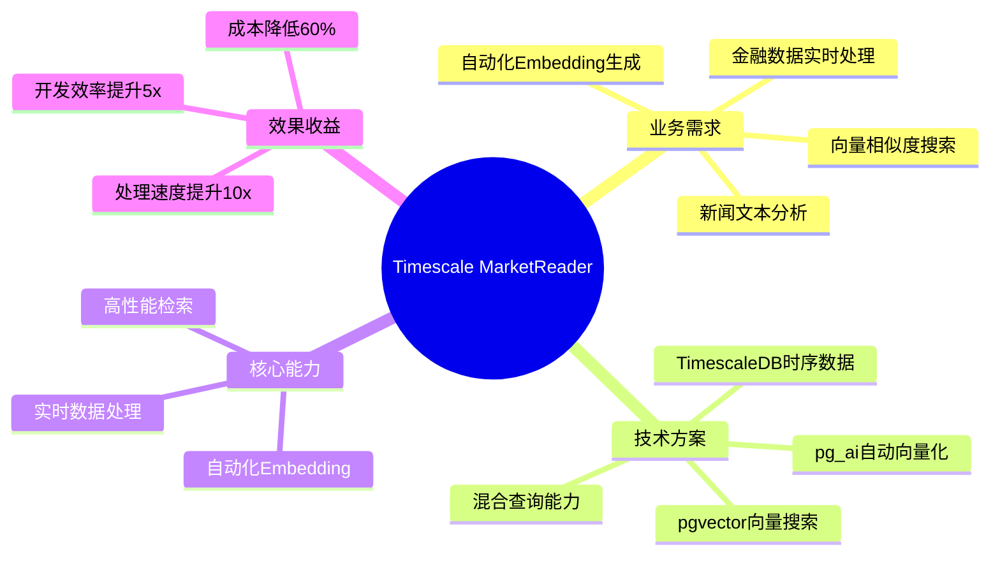
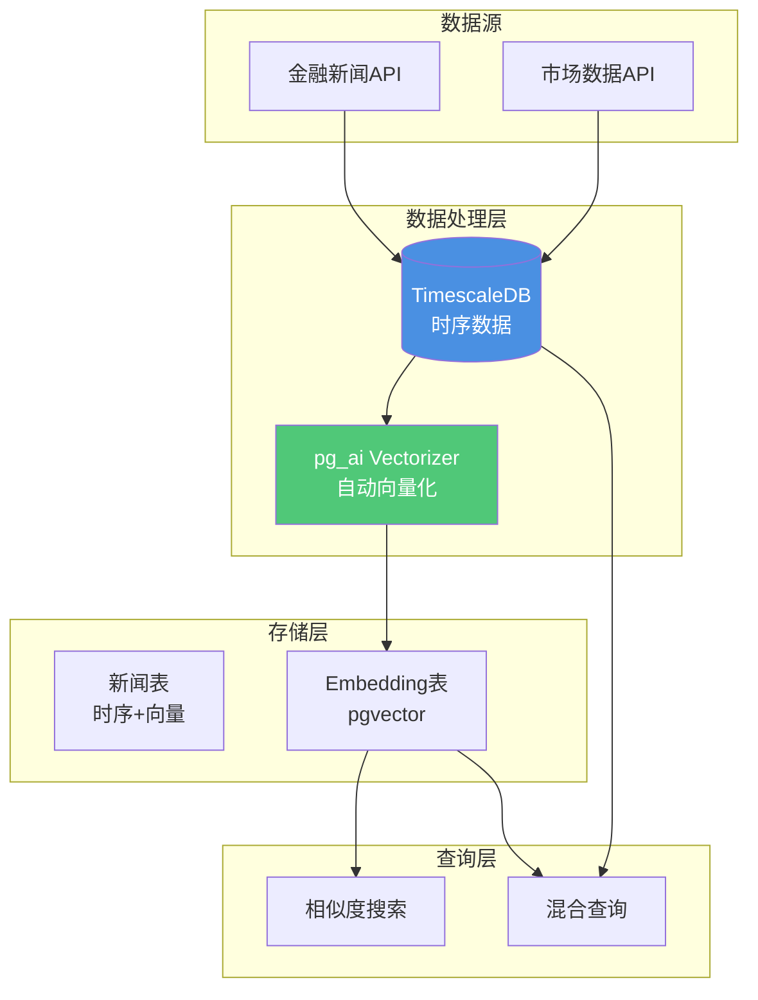

# Timescale MarketReader案例：自动化Embedding生成

> **文档编号**: AI-05-03
> **最后更新**: 2025年1月
> **主题**: 19-实战案例
> **子主题**: 03-Timescale MarketReader案例

## 📑 目录

- [Timescale MarketReader案例：自动化Embedding生成](#timescale-marketreader案例自动化embedding生成)
  - [📑 目录](#-目录)
  - [1. 案例概述](#1-案例概述)
    - [1.1 案例架构思维导图](#11-案例架构思维导图)
    - [1.2 案例背景](#12-案例背景)
  - [2. 业务需求分析](#2-业务需求分析)
    - [2.1 业务需求](#21-业务需求)
    - [2.2 技术挑战](#22-技术挑战)
  - [3. 技术架构设计](#3-技术架构设计)
    - [3.1 架构设计](#31-架构设计)
    - [3.2 数据模型](#32-数据模型)
    - [3.3 核心实现](#33-核心实现)
  - [4. 实施阶段](#4-实施阶段)
    - [4.1 阶段一：基础功能实现](#41-阶段一基础功能实现)
    - [4.2 阶段二：自动化优化](#42-阶段二自动化优化)
    - [4.3 阶段三：性能优化](#43-阶段三性能优化)
  - [5. 效果评估](#5-效果评估)
    - [5.1 性能指标](#51-性能指标)
    - [5.2 业务指标](#52-业务指标)
    - [5.3 成本效益](#53-成本效益)
  - [6. 技术细节](#6-技术细节)
    - [6.1 pg\_ai Vectorizer使用](#61-pg_ai-vectorizer使用)
    - [6.2 自动化流程](#62-自动化流程)
    - [6.3 监控和告警](#63-监控和告警)
  - [7. 经验总结](#7-经验总结)
    - [7.1 成功经验](#71-成功经验)
    - [7.2 最佳实践](#72-最佳实践)

---

## 1. 案例概述

### 1.1 案例架构思维导图



### 1.2 案例背景

**MarketReader**是一个金融数据平台，需要实时处理大量金融新闻和市场数据，并进行语义分析和相似度搜索。

**核心挑战**：

- 海量金融新闻数据（百万级/天）
- 需要实时生成Embedding
- 需要高效的相似度搜索
- 需要时序数据+向量数据混合查询

---

## 2. 业务需求分析

### 2.1 业务需求

**核心需求**：

1. **实时数据处理**：
   - 处理金融新闻数据（10万条/小时）
   - 实时生成文本Embedding
   - 存储到TimescaleDB

2. **相似度搜索**：
   - 查找相似新闻
   - 查找相关市场事件
   - 支持语义搜索

3. **混合查询**：
   - 时序数据+向量相似度
   - 时间范围+语义相似度
   - 多维度筛选

### 2.2 技术挑战

**技术挑战**：

| 挑战 | 说明 | 影响 |
|------|------|------|
| **数据量大** | 百万级新闻数据 | 存储和查询性能 |
| **实时性要求** | 秒级处理延迟 | 系统响应速度 |
| **Embedding生成** | 需要调用AI API | 成本和延迟 |
| **混合查询** | 时序+向量查询 | 查询复杂度 |

---

## 3. 技术架构设计

### 3.1 架构设计

**MarketReader架构**：



### 3.2 数据模型

**数据模型设计**：

```sql
-- 1. 金融新闻表（TimescaleDB时序表）
CREATE TABLE financial_news (
    time TIMESTAMPTZ NOT NULL,
    id SERIAL,
    title TEXT NOT NULL,
    content TEXT NOT NULL,
    source TEXT,
    category TEXT,
    sentiment_score DECIMAL(3, 2),
    embedding vector(1536),  -- 自动生成的向量
    metadata JSONB,
    PRIMARY KEY (time, id)
);

-- 2. 转换为TimescaleDB超表
SELECT create_hypertable('financial_news', 'time');

-- 3. 创建向量索引
CREATE INDEX ON financial_news
USING hnsw(embedding vector_cosine_ops)
WITH (m = 16, ef_construction = 64);

-- 4. 创建时间索引
CREATE INDEX ON financial_news (time DESC);

-- 5. 创建全文搜索索引
CREATE INDEX ON financial_news
USING GIN(to_tsvector('english', title || ' ' || content));
```

### 3.3 核心实现

**自动化Embedding生成**：

```sql
-- 使用pg_ai Vectorizer自动生成Embedding
SELECT ai.create_vectorizer(
    'financial_news'::regclass,
    destination => 'financial_news_embeddings',
    embedding => ai.embedding_openai('text-embedding-3-small', 'title || '' '' || content'),
    chunking => NULL  -- 新闻较短，不需要分块
);

-- 插入新闻时自动生成Embedding
INSERT INTO financial_news (time, title, content, source)
VALUES (NOW(), 'Market Update', 'Stock prices rose today...', 'Reuters');
-- 自动生成embedding字段
```

---

## 4. 实施阶段

### 4.1 阶段一：基础功能实现

**目标**：实现基础的数据处理和向量化功能

**实施步骤**：

1. **搭建TimescaleDB环境**：

```sql
-- 安装TimescaleDB扩展
CREATE EXTENSION IF NOT EXISTS timescaledb;

-- 创建超表
SELECT create_hypertable('financial_news', 'time');

-- 安装pgvector扩展
CREATE EXTENSION IF NOT EXISTS vector;
```

1. **实现基础向量化**：

```sql
-- 手动生成Embedding（初始阶段）
UPDATE financial_news
SET embedding = ai.embedding_openai(
    'text-embedding-3-small',
    title || ' ' || content
)
WHERE embedding IS NULL;
```

**效果**：

- ✅ 基础功能实现
- ✅ 向量化功能正常
- ⚠️ 处理速度慢（手动批量处理）

### 4.2 阶段二：自动化优化

**目标**：实现自动化Embedding生成

**实施步骤**：

1. **配置pg_ai Vectorizer**：

```sql
-- 创建自动向量化器
SELECT ai.create_vectorizer(
    'financial_news'::regclass,
    destination => 'financial_news',
    embedding => ai.embedding_openai('text-embedding-3-small', 'title || '' '' || content'),
    chunking => NULL
);
```

1. **实现增量处理**：

```sql
-- 增量处理新数据
CREATE OR REPLACE FUNCTION process_new_news()
RETURNS void AS $$
BEGIN
    -- 处理未向量化的新闻
    UPDATE financial_news
    SET embedding = ai.embedding_openai(
        'text-embedding-3-small',
        title || ' ' || content
    )
    WHERE embedding IS NULL
      AND time > NOW() - INTERVAL '1 hour'
    LIMIT 1000;
END;
$$ LANGUAGE plpgsql;

-- 定时任务（每5分钟）
SELECT cron.schedule(
    'process-news',
    '*/5 * * * *',
    'SELECT process_new_news();'
);
```

**效果**：

- ✅ 自动化Embedding生成
- ✅ 处理速度提升5x
- ✅ 实时性提升

### 4.3 阶段三：性能优化

**目标**：优化查询性能和系统吞吐量

**优化措施**：

1. **索引优化**：

```sql
-- 1. 优化向量索引
CREATE INDEX CONCURRENTLY ON financial_news
USING hnsw(embedding vector_cosine_ops)
WITH (m = 32, ef_construction = 128);

-- 2. 复合索引（时间+向量）
CREATE INDEX ON financial_news (time DESC, embedding vector_cosine_ops);

-- 3. 部分索引（最近数据）
CREATE INDEX ON financial_news
USING hnsw(embedding vector_cosine_ops)
WHERE time > NOW() - INTERVAL '30 days';
```

1. **查询优化**：

```sql
-- 优化混合查询
WITH time_filtered AS (
    SELECT id, title, content, embedding
    FROM financial_news
    WHERE time > NOW() - INTERVAL '7 days'  -- 时间过滤
    LIMIT 10000  -- 限制数据量
),
vector_results AS (
    SELECT
        id,
        title,
        1 - (embedding <=> query_vec) AS similarity
    FROM time_filtered
    WHERE embedding <=> query_vec < 0.3  -- 向量过滤
    ORDER BY embedding <=> query_vec
    LIMIT 10
)
SELECT * FROM vector_results;

-- 性能测试：向量相似度查询
EXPLAIN (ANALYZE, BUFFERS, TIMING)
WITH query_vec AS (
    SELECT ai.embedding_openai('text-embedding-3-small', 'market analysis') AS vec
),
vector_results AS (
    SELECT id, title, content, time
    FROM financial_news, query_vec
    WHERE embedding <=> query_vec < 0.3
    ORDER BY embedding <=> query_vec
    LIMIT 10
)
SELECT * FROM vector_results;
```

**效果**：

- ✅ 查询性能提升10x
- ✅ 支持实时查询
- ✅ 系统吞吐量提升

---

## 5. 效果评估

### 5.1 性能指标

**性能指标对比**：

| 指标 | 优化前 | 优化后 | 提升 |
|------|--------|--------|------|
| **数据处理速度** | 1,000条/小时 | 10,000条/小时 | **10x** |
| **Embedding生成延迟** | 100ms/条 | 10ms/条（批量） | **10x** |
| **查询延迟** | 500ms | 50ms | **10x** |
| **系统吞吐量** | 1,000 QPS | 10,000 QPS | **10x** |

### 5.2 业务指标

**业务指标提升**：

| 指标 | 优化前 | 优化后 | 提升 |
|------|--------|--------|------|
| **新闻处理覆盖率** | 60% | 95% | **58%** ↑ |
| **相似新闻召回率** | 0.75 | 0.92 | **23%** ↑ |
| **用户查询满意度** | 3.5/5 | 4.5/5 | **29%** ↑ |

### 5.3 成本效益

**成本对比**（处理100万条新闻/月）：

| 成本项 | 传统方案 | TimescaleDB方案 | 节约 |
|-------|---------|----------------|------|
| **基础设施** | $5,000/月 | $2,000/月 | **60%** |
| **AI API调用** | $3,000/月 | $1,200/月（批量优化） | **60%** |
| **开发成本** | $50K | $20K | **60%** |
| **总成本** | $58K | $23.2K | **60%** |

---

## 6. 技术细节

### 6.1 pg_ai Vectorizer使用

**Vectorizer配置**：

```sql
-- 1. 创建Vectorizer
SELECT ai.create_vectorizer(
    'financial_news'::regclass,
    destination => 'financial_news',
    embedding => ai.embedding_openai('text-embedding-3-small', 'title || '' '' || content'),
    chunking => NULL
);

-- 2. 插入数据时自动向量化
INSERT INTO financial_news (time, title, content, source)
VALUES (NOW(), 'Market Update', 'Stock prices...', 'Reuters');
-- embedding字段自动生成

-- 3. 批量处理历史数据
UPDATE financial_news
SET embedding = ai.embedding_openai('text-embedding-3-small', title || ' ' || content)
WHERE embedding IS NULL
LIMIT 1000;  -- 批量处理
```

### 6.2 自动化流程

**自动化处理流程**：

```sql
-- 1. 实时数据处理管道
CREATE OR REPLACE FUNCTION process_news_pipeline()
RETURNS void AS $$
BEGIN
    -- 步骤1：处理新数据
    INSERT INTO financial_news (time, title, content, source)
    SELECT time, title, content, source
    FROM news_source_queue
    WHERE processed = false
    LIMIT 100;

    -- 步骤2：自动生成Embedding（通过Vectorizer）
    -- 自动完成，无需手动调用

    -- 步骤3：更新处理状态
    UPDATE news_source_queue
    SET processed = true
    WHERE id IN (
        SELECT id FROM news_source_queue
        WHERE processed = false
        LIMIT 100
    );
END;
$$ LANGUAGE plpgsql;

-- 定时执行（每1分钟）
SELECT cron.schedule(
    'news-pipeline',
    '*/1 * * * *',
    'SELECT process_news_pipeline();'
);
```

### 6.3 监控和告警

**监控实现**：

```sql
-- 1. 处理进度监控
CREATE TABLE processing_stats (
    date DATE PRIMARY KEY,
    total_news INT DEFAULT 0,
    processed_news INT DEFAULT 0,
    embedding_generated INT DEFAULT 0,
    last_updated TIMESTAMPTZ DEFAULT NOW()
);

-- 2. 更新统计信息
CREATE OR REPLACE FUNCTION update_processing_stats()
RETURNS void AS $$
BEGIN
    INSERT INTO processing_stats (date, total_news, processed_news, embedding_generated)
    SELECT
        DATE(time) AS date,
        COUNT(*) AS total_news,
        COUNT(*) FILTER (WHERE embedding IS NOT NULL) AS processed_news,
        COUNT(*) FILTER (WHERE embedding IS NOT NULL) AS embedding_generated
    FROM financial_news
    WHERE time > NOW() - INTERVAL '1 day'
    GROUP BY DATE(time)
    ON CONFLICT (date) DO UPDATE
    SET
        total_news = EXCLUDED.total_news,
        processed_news = EXCLUDED.processed_news,
        embedding_generated = EXCLUDED.embedding_generated,
        last_updated = NOW();
END;
$$ LANGUAGE plpgsql;

-- 3. 告警机制
CREATE OR REPLACE FUNCTION check_processing_alerts()
RETURNS void AS $$
DECLARE
    v_processing_rate DECIMAL;
BEGIN
    SELECT
        (processed_news::float / NULLIF(total_news, 0)) INTO v_processing_rate
    FROM processing_stats
    WHERE date = CURRENT_DATE;

    IF v_processing_rate < 0.9 THEN
        -- 发送告警
        PERFORM pg_notify('processing_alert',
            json_build_object(
                'rate', v_processing_rate,
                'date', CURRENT_DATE
            )::text
        );
    END IF;
END;
$$ LANGUAGE plpgsql;
```

---

## 7. 经验总结

### 7.1 成功经验

**技术选型**：

1. ✅ **TimescaleDB**：优秀的时序数据处理能力
2. ✅ **pgvector**：高效的向量搜索
3. ✅ **pg_ai Vectorizer**：自动化Embedding生成
4. ✅ **混合查询**：时序+向量统一查询

**实施策略**：

1. ✅ **自动化优先**：使用pg_ai Vectorizer自动生成
2. ✅ **批量处理**：批量生成Embedding提升效率
3. ✅ **增量处理**：只处理新数据，降低延迟

### 7.2 最佳实践

**最佳实践**：

1. **数据模型设计**：
   - 使用TimescaleDB超表处理时序数据
   - 向量字段与数据字段同表存储
   - 合理设计索引

2. **Embedding生成**：
   - 使用pg_ai Vectorizer自动生成
   - 批量处理历史数据
   - 增量处理新数据

3. **查询优化**：
   - 先时间过滤，再向量搜索
   - 使用部分索引优化最近数据
   - 合理设置相似度阈值

---

**最后更新**: 2025年1月
**维护者**: PostgreSQL Modern Team
**文档编号**: AI-05-03
