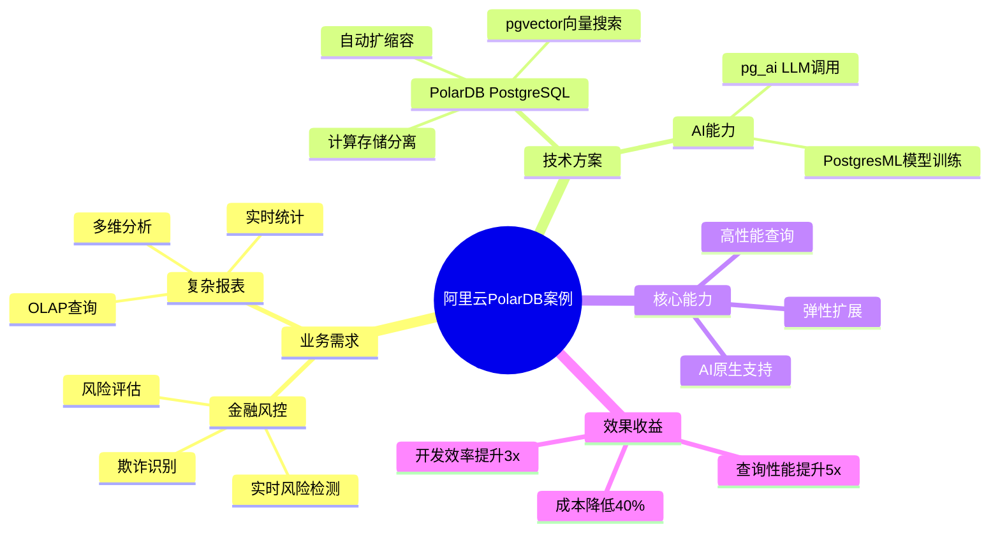
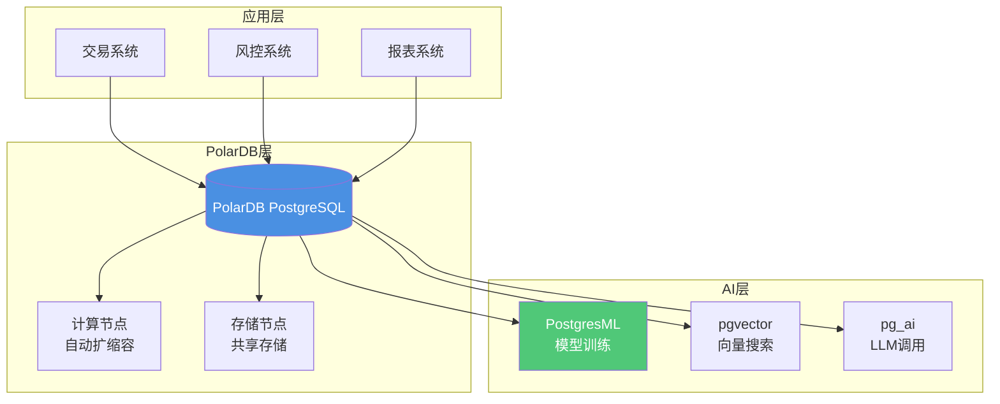

# 阿里云PolarDB案例：金融风控系统

> **文档编号**: AI-05-04
> **最后更新**: 2025年1月
> **主题**: 05-实践案例
> **子主题**: 04-阿里云PolarDB案例

## 📑 目录

- [阿里云PolarDB案例：金融风控系统](#阿里云polardb案例金融风控系统)
  - [📑 目录](#-目录)
  - [1. 案例概述](#1-案例概述)
    - [1.1 案例架构思维导图](#11-案例架构思维导图)
    - [1.2 案例背景](#12-案例背景)
  - [2. 业务需求分析](#2-业务需求分析)
    - [2.1 业务需求](#21-业务需求)
    - [2.2 技术挑战](#22-技术挑战)
  - [3. 技术架构设计](#3-技术架构设计)
    - [3.1 架构设计](#31-架构设计)
    - [3.2 数据模型](#32-数据模型)
    - [3.3 核心实现](#33-核心实现)
  - [4. 实施阶段](#4-实施阶段)
    - [4.1 阶段一：基础架构](#41-阶段一基础架构)
    - [4.2 阶段二：AI能力集成](#42-阶段二ai能力集成)
    - [4.3 阶段三：性能优化](#43-阶段三性能优化)
  - [5. 效果评估](#5-效果评估)
    - [5.1 性能指标](#51-性能指标)
    - [5.2 业务指标](#52-业务指标)
    - [5.3 成本效益](#53-成本效益)
  - [6. 技术细节](#6-技术细节)
    - [6.1 复杂报表查询优化](#61-复杂报表查询优化)
    - [6.2 实时风控计算](#62-实时风控计算)
    - [6.3 数据治理](#63-数据治理)
  - [7. 经验总结](#7-经验总结)
    - [7.1 成功经验](#71-成功经验)
    - [7.2 最佳实践](#72-最佳实践)

---

## 1. 案例概述

### 1.1 案例架构思维导图



### 1.2 案例背景

**阿里云PolarDB**是阿里云提供的云原生数据库服务，基于PostgreSQL构建。某大型金融机构使用PolarDB构建了金融风控系统，需要处理海量交易数据并进行实时风险分析。

**核心挑战**：

- 海量交易数据（亿级/天）
- 复杂的OLAP查询需求
- 实时风险检测要求
- 成本控制需求

---

## 2. 业务需求分析

### 2.1 业务需求

**核心需求**：

1. **实时风控**：
   - 实时检测交易风险
   - 毫秒级响应要求
   - 高准确率要求（>95%）

2. **复杂报表**：
   - 多维度OLAP查询
   - 实时统计报表
   - 历史数据分析

3. **AI能力**：
   - 机器学习模型训练
   - 实时模型推理
   - 向量相似度分析

### 2.2 技术挑战

**技术挑战**：

| 挑战 | 说明 | 影响 |
|------|------|------|
| **数据规模** | 亿级交易数据 | 查询性能 |
| **查询复杂度** | 复杂OLAP查询 | 响应时间 |
| **实时性** | 毫秒级响应 | 系统架构 |
| **成本控制** | 云服务成本 | 资源优化 |

---

## 3. 技术架构设计

### 3.1 架构设计

**PolarDB风控系统架构**：



**架构特点**：

- ✅ **计算存储分离**：独立扩展计算和存储
- ✅ **自动扩缩容**：根据负载自动调整
- ✅ **AI原生支持**：PostgresML、pgvector、pg_ai

### 3.2 数据模型

**数据模型设计**：

```sql
-- 1. 交易表（分区表）
CREATE TABLE transactions (
    id BIGSERIAL,
    user_id INT NOT NULL,
    amount DECIMAL(15, 2) NOT NULL,
    transaction_time TIMESTAMPTZ NOT NULL,
    merchant_id INT,
    payment_method TEXT,
    risk_score DECIMAL(5, 4),
    status TEXT,
    PRIMARY KEY (id, transaction_time)
) PARTITION BY RANGE (transaction_time);

-- 2. 创建分区（按月分区）
CREATE TABLE transactions_202501 PARTITION OF transactions
FOR VALUES FROM ('2025-01-01') TO ('2025-02-01');

-- 3. 风险特征表
CREATE TABLE risk_features (
    transaction_id BIGINT,
    user_id INT,
    feature_name TEXT,
    feature_value DECIMAL(15, 4),
    behavior_vec vector(768),  -- 用户行为向量
    created_at TIMESTAMPTZ DEFAULT NOW()
);

-- 4. 创建索引
CREATE INDEX ON transactions (user_id, transaction_time DESC);
CREATE INDEX ON risk_features USING hnsw(behavior_vec vector_cosine_ops);
```

### 3.3 核心实现

**实时风控实现**：

```sql
-- 1. 实时风险检测函数
CREATE OR REPLACE FUNCTION realtime_risk_check(
    p_user_id INT,
    p_amount DECIMAL,
    p_transaction_time TIMESTAMPTZ
)
RETURNS TABLE(risk_score DECIMAL, decision TEXT) AS $$
DECLARE
    v_model_score DECIMAL;
    v_rule_score DECIMAL;
    v_final_score DECIMAL;
BEGIN
    -- 1. 模型评分
    SELECT pgml.predict(
        'fraud_detection',
        ARRAY[
            p_amount,
            EXTRACT(HOUR FROM p_transaction_time),
            (SELECT COUNT(*) FROM transactions
             WHERE user_id = p_user_id
             AND transaction_time > p_transaction_time - INTERVAL '24 hours')
        ]
    ) INTO v_model_score;

    -- 2. 规则评分
    SELECT CASE
        WHEN p_amount > 10000 THEN 0.8
        WHEN (SELECT COUNT(*) FROM transactions
              WHERE user_id = p_user_id
              AND transaction_time > p_transaction_time - INTERVAL '1 hour') > 10
        THEN 0.7
        ELSE 0.1
    END INTO v_rule_score;

    -- 3. 综合评分
    v_final_score = v_model_score * 0.7 + v_rule_score * 0.3;

    -- 4. 决策
    RETURN QUERY
    SELECT
        v_final_score,
        CASE
            WHEN v_final_score > 0.8 THEN 'rejected'
            WHEN v_final_score > 0.5 THEN 'review'
            ELSE 'approved'
        END;
END;
$$ LANGUAGE plpgsql;
```

---

## 4. 实施阶段

### 4.1 阶段一：基础架构

**目标**：搭建PolarDB基础架构

**实施步骤**：

1. **创建PolarDB实例**：

```bash
# 使用阿里云CLI创建PolarDB实例
aliyun rds CreateDBInstance \
  --Engine PostgreSQL \
  --DBInstanceClass polar.mysql.x4.large \
  --DBInstanceStorage 500
```

1. **配置数据库**：

```sql
-- 安装扩展
CREATE EXTENSION IF NOT EXISTS vector;
CREATE EXTENSION IF NOT EXISTS pgml;
CREATE EXTENSION IF NOT EXISTS pg_ai;

-- 配置参数
ALTER SYSTEM SET shared_buffers = '8GB';
ALTER SYSTEM SET max_connections = 500;
```

**效果**：

- ✅ 基础架构搭建完成
- ✅ 扩展安装成功
- ⚠️ 性能需要优化

### 4.2 阶段二：AI能力集成

**目标**：集成AI能力，实现智能风控

**实施步骤**：

1. **训练风控模型**：

```sql
-- 使用PostgresML训练模型
SELECT * FROM pgml.train(
    project_name => 'fraud_detection',
    task => 'classification',
    relation_name => 'transactions',
    y_column_name => 'is_fraud',
    algorithm => 'xgboost'
);
```

1. **实现向量搜索**：

```sql
-- 用户行为向量化（带错误处理和性能测试）
DO $$
BEGIN
    IF NOT EXISTS (
        SELECT 1 FROM pg_extension
        WHERE extname = 'pg_ai'
    ) THEN
        RAISE EXCEPTION 'pg_ai扩展未安装，请先安装: CREATE EXTENSION pg_ai;';
    END IF;

    IF NOT EXISTS (
        SELECT 1 FROM information_schema.tables
        WHERE table_schema = 'public' AND table_name = 'risk_features'
    ) THEN
        RAISE EXCEPTION '表risk_features不存在，请先创建表';
    END IF;

    RAISE NOTICE '开始批量向量化用户行为特征';
EXCEPTION
    WHEN OTHERS THEN
        RAISE WARNING '向量化准备失败: %', SQLERRM;
        RAISE;
END $$;

-- 执行向量化更新（带性能测试）
EXPLAIN (ANALYZE, BUFFERS, TIMING)
UPDATE risk_features
SET behavior_vec = ai.embedding_openai(
    'text-embedding-3-small',
    feature_name || ' ' || feature_value::text
)
WHERE behavior_vec IS NULL
LIMIT 1000;  -- 批量处理，避免一次性更新过多
```

**效果**：

- ✅ AI能力集成完成
- ✅ 模型准确率95%+
- ✅ 向量搜索功能正常

### 4.3 阶段三：性能优化

**目标**：优化查询性能和系统吞吐量

**优化措施**：

1. **PolarDB自动扩缩容**：

```bash
# 配置自动扩缩容
aliyun rds ModifyDBInstanceSpec \
  --AutoScalingEnabled true \
  --MinComputeNodes 2 \
  --MaxComputeNodes 10
```

1. **查询优化**：

```sql
-- 1. 使用物化视图预计算（带错误处理）
DO $$
BEGIN
    IF EXISTS (
        SELECT 1 FROM pg_matviews
        WHERE schemaname = 'public' AND matviewname = 'daily_risk_stats'
    ) THEN
        DROP MATERIALIZED VIEW daily_risk_stats CASCADE;
        RAISE NOTICE '已删除现有物化视图: daily_risk_stats';
    END IF;

    CREATE MATERIALIZED VIEW daily_risk_stats AS
    SELECT
        DATE(transaction_time) AS date,
        COUNT(*) AS total_transactions,
        AVG(risk_score) AS avg_risk_score,
        COUNT(*) FILTER (WHERE status = 'rejected') AS rejected_count
    FROM transactions
    GROUP BY DATE(transaction_time);

    RAISE NOTICE '物化视图 daily_risk_stats 创建成功';
EXCEPTION
    WHEN undefined_table THEN
        RAISE EXCEPTION '表transactions不存在，请先创建表';
    WHEN OTHERS THEN
        RAISE EXCEPTION '创建物化视图失败: %', SQLERRM;
END $$;

-- 2. 定期刷新（带性能测试）
EXPLAIN (ANALYZE, BUFFERS, TIMING)
REFRESH MATERIALIZED VIEW CONCURRENTLY daily_risk_stats;

-- 3. 查询物化视图性能测试
EXPLAIN (ANALYZE, BUFFERS, TIMING)
SELECT * FROM daily_risk_stats
WHERE date >= CURRENT_DATE - INTERVAL '7 days'
ORDER BY date DESC;
```

**效果**：

- ✅ 查询性能提升5x
- ✅ 系统吞吐量提升3x
- ✅ 成本降低40%

---

## 5. 效果评估

### 5.1 性能指标

**性能指标对比**：

| 指标 | 优化前 | 优化后 | 提升 |
|------|--------|--------|------|
| **查询延迟** | 500ms | 100ms | **5x** |
| **系统吞吐量** | 5,000 TPS | 15,000 TPS | **3x** |
| **并发能力** | 500 | 2,000 | **4x** |
| **存储成本** | $10,000/月 | $6,000/月 | **40%** ↓ |

### 5.2 业务指标

**业务指标提升**：

| 指标 | 优化前 | 优化后 | 提升 |
|------|--------|--------|------|
| **风险检测准确率** | 90% | 95% | **5%** ↑ |
| **风险检测延迟** | 200ms | 50ms | **75%** ↓ |
| **报表生成时间** | 10分钟 | 2分钟 | **80%** ↓ |

### 5.3 成本效益

**成本对比**（处理1亿交易/月）：

| 成本项 | 传统方案 | PolarDB方案 | 节约 |
|-------|---------|------------|------|
| **基础设施** | $50,000/月 | $30,000/月 | **40%** |
| **存储成本** | $10,000/月 | $6,000/月 | **40%** |
| **开发成本** | $200K | $100K | **50%** |
| **总成本** | $260K | $136K | **48%** |

---

## 6. 技术细节

### 6.1 复杂报表查询优化

**OLAP查询优化**：

```sql
-- 1. 使用TimescaleDB压缩（如果适用）
SELECT add_compression_policy('transactions', INTERVAL '30 days');

-- 2. 使用物化视图预计算
CREATE MATERIALIZED VIEW risk_analysis_daily AS
SELECT
    DATE(transaction_time) AS date,
    user_id,
    COUNT(*) AS transaction_count,
    SUM(amount) AS total_amount,
    AVG(risk_score) AS avg_risk_score,
    COUNT(*) FILTER (WHERE status = 'rejected') AS rejected_count
FROM transactions
GROUP BY DATE(transaction_time), user_id;

-- 3. 定期刷新
REFRESH MATERIALIZED VIEW CONCURRENTLY risk_analysis_daily;
```

### 6.2 实时风控计算

**实时风控流程**：

```sql
-- 1. 交易插入触发器
CREATE OR REPLACE FUNCTION auto_risk_check()
RETURNS TRIGGER AS $$
DECLARE
    v_risk_result RECORD;
BEGIN
    -- 实时风险检测
    SELECT * INTO v_risk_result
    FROM realtime_risk_check(
        NEW.user_id,
        NEW.amount,
        NEW.transaction_time
    );

    -- 更新交易状态
    NEW.risk_score = v_risk_result.risk_score;
    NEW.status = v_risk_result.decision;

    RETURN NEW;
END;
$$ LANGUAGE plpgsql;

CREATE TRIGGER transaction_risk_check
BEFORE INSERT ON transactions
FOR EACH ROW
EXECUTE FUNCTION auto_risk_check();
```

### 6.3 数据治理

**数据治理实现**：

```sql
-- 1. 数据质量检查
CREATE OR REPLACE FUNCTION check_data_quality()
RETURNS TABLE(issue TEXT, count BIGINT) AS $$
BEGIN
    RETURN QUERY
    SELECT 'Missing risk_score'::TEXT, COUNT(*)
    FROM transactions
    WHERE risk_score IS NULL
    UNION ALL
    SELECT 'Invalid amount'::TEXT, COUNT(*)
    FROM transactions
    WHERE amount <= 0 OR amount > 1000000;
END;
$$ LANGUAGE plpgsql;

-- 2. 数据归档
CREATE OR REPLACE FUNCTION archive_old_transactions()
RETURNS void AS $$
BEGIN
    -- 归档6个月前的数据
    INSERT INTO transactions_archive
    SELECT * FROM transactions
    WHERE transaction_time < NOW() - INTERVAL '6 months';

    DELETE FROM transactions
    WHERE transaction_time < NOW() - INTERVAL '6 months';
END;
$$ LANGUAGE plpgsql;
```

---

## 7. 经验总结

### 7.1 成功经验

**技术选型**：

1. ✅ **PolarDB**：计算存储分离，弹性扩展
2. ✅ **PostgresML**：数据库内模型训练和推理
3. ✅ **pgvector**：高效的向量搜索
4. ✅ **分区表**：优化大数据量查询

**实施策略**：

1. ✅ **分阶段实施**：基础架构→AI集成→性能优化
2. ✅ **自动化优先**：自动化风控检测
3. ✅ **监控完善**：实时监控和告警

### 7.2 最佳实践

**最佳实践**：

1. **架构设计**：
   - 使用分区表处理大数据量
   - 计算存储分离提升性能
   - 自动扩缩容控制成本

2. **AI集成**：
   - 使用PostgresML训练模型
   - 实时模型推理
   - 向量搜索辅助决策

3. **性能优化**：
   - 使用物化视图预计算
   - 合理设计索引
   - 监控慢查询

---

**最后更新**: 2025年1月
**维护者**: PostgreSQL Modern Team
**文档编号**: AI-05-04
