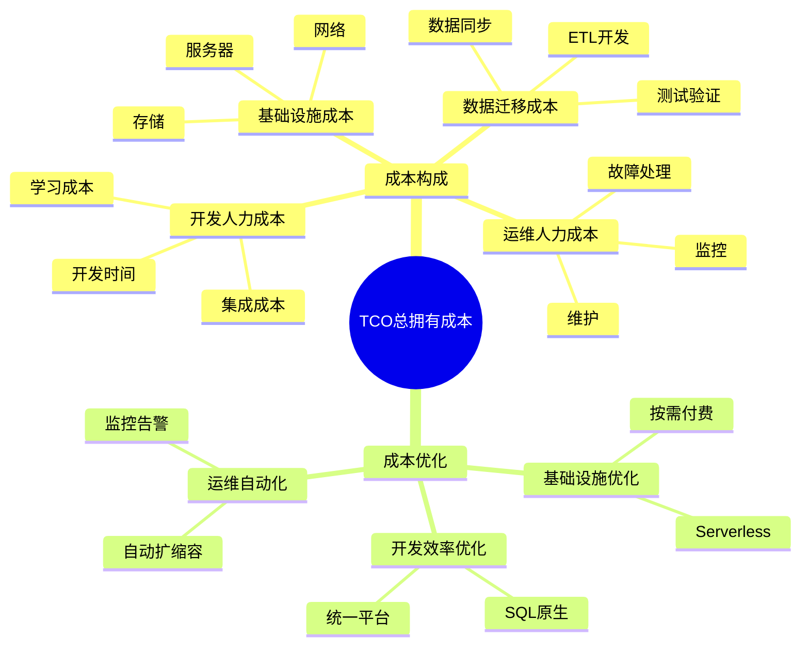

---

> **📋 文档来源**: `PostgreSQL_AI\06-对比分析\TCO总拥有成本分析.md`
> **📅 复制日期**: 2025-12-22
> **⚠️ 注意**: 本文档为复制版本，原文件保持不变

---

# TCO总拥有成本分析

> **文档编号**: AI-06-02
> **最后更新**: 2025年1月
> **主题**: 06-对比分析
> **子主题**: 02-TCO总拥有成本分析

## 📑 目录

- [TCO总拥有成本分析](#tco总拥有成本分析)
  - [📑 目录](#-目录)
  - [1. TCO分析概述](#1-tco分析概述)
    - [1.1 TCO分析思维导图](#11-tco分析思维导图)
    - [1.2 TCO定义](#12-tco定义)
  - [2. 成本构成分析](#2-成本构成分析)
    - [2.1 成本构成](#21-成本构成)
    - [2.2 成本计算公式](#22-成本计算公式)
    - [2.3 时间周期选择](#23-时间周期选择)
  - [3. 成本项详细分析](#3-成本项详细分析)
    - [3.1 基础设施成本](#31-基础设施成本)
    - [3.2 开发人力成本](#32-开发人力成本)
    - [3.3 运维人力成本](#33-运维人力成本)
    - [3.4 数据迁移成本](#34-数据迁移成本)
    - [3.5 许可证成本](#35-许可证成本)
  - [4. 不同规模场景TCO分析](#4-不同规模场景tco分析)
    - [4.1 小规模场景（100万向量）](#41-小规模场景100万向量)
    - [4.2 中等规模场景（1000万向量）](#42-中等规模场景1000万向量)
    - [4.3 大规模场景（1亿向量）](#43-大规模场景1亿向量)
  - [5. 成本优化策略](#5-成本优化策略)
    - [5.1 基础设施优化](#51-基础设施优化)
    - [5.2 开发效率优化](#52-开发效率优化)
    - [5.3 运维自动化](#53-运维自动化)
  - [6. 投资回报分析](#6-投资回报分析)
    - [6.1 投资回报周期](#61-投资回报周期)
    - [6.2 成本节约分析](#62-成本节约分析)
    - [6.3 效率提升分析](#63-效率提升分析)

---

## 1. TCO分析概述

### 1.1 TCO分析思维导图



### 1.2 TCO定义

**TCO（Total Cost of Ownership）总拥有成本**是指在整个生命周期内，拥有和使用某个技术方案的所有成本总和。

**TCO计算公式**：

```math
TCO = C_{infra} + C_{dev} + C_{ops} + C_{migration} + C_{license}
```

其中：

- **C_infra**: 基础设施成本（服务器、存储、网络）
- **C_dev**: 开发人力成本（开发时间、学习成本）
- **C_ops**: 运维人力成本（监控、维护、故障处理）
- **C_migration**: 数据迁移成本（同步、ETL、测试）
- **C_license**: 许可证成本（软件许可、云服务费用）

---

## 2. 成本构成分析

### 2.1 成本构成

**TCO成本构成矩阵**：

| 成本类别 | 说明 | 影响因素 | 优化策略 |
|---------|------|---------|---------|
| **基础设施** | 服务器、存储、网络 | 规模、使用模式 | Serverless、按需付费 |
| **开发人力** | 开发时间、学习成本 | 系统复杂度、团队技能 | 统一平台、SQL原生 |
| **运维人力** | 监控、维护、故障处理 | 系统数量、复杂度 | 自动化、统一监控 |
| **数据迁移** | 同步、ETL、测试 | 数据量、系统差异 | 减少系统数量 |
| **许可证** | 软件许可、云服务 | 厂商、规模 | 开源方案、按需付费 |

### 2.2 成本计算公式

**详细成本计算公式**：

```math
\begin{aligned}
TCO &= C_{infra} + C_{dev} + C_{ops} + C_{migration} + C_{license} \\
C_{infra} &= \sum_{i=1}^{n} (Server_i \times Price_i \times Months) \\
C_{dev} &= Developer\_Count \times Avg\_Salary \times Development\_Months \\
C_{ops} &= Ops\_Count \times Avg\_Salary \times Ops\_Months \\
C_{migration} &= Migration\_Complexity \times Developer\_Days \times Daily\_Rate \\
C_{license} &= License\_Fee \times Months + API\_Calls \times Unit\_Price
\end{aligned}
```

### 2.3 时间周期选择

**TCO分析时间周期**：

| 周期 | 适用场景 | 优势 | 劣势 |
|------|---------|------|------|
| **1年** | 短期项目、MVP验证 | 快速决策 | 忽略长期成本 |
| **3年** | 标准项目（推荐） | 平衡短期和长期 | 需要预测 |
| **5年** | 长期战略项目 | 全面评估 | 预测不确定性高 |

**推荐使用3年周期**，原因：

- ✅ 平衡短期投入和长期收益
- ✅ 技术栈相对稳定
- ✅ 数据相对可靠

---

## 3. 成本项详细分析

### 3.1 基础设施成本

**基础设施成本对比**（3年周期，100M向量规模）：

| 方案 | 服务器成本 | 存储成本 | 网络成本 | 总计 |
|------|-----------|---------|---------|------|
| **PostgreSQL Serverless** | $10,000 | $3,000 | $2,000 | **$15,000** |
| **Pinecone专用服务** | $50,000 | $15,000 | $7,000 | **$72,000** |
| **自建Elasticsearch** | $35,000 | $8,000 | $5,000 | **$48,000** |
| **混合架构** | $60,000 | $18,000 | $7,000 | **$85,000** |

**PostgreSQL Serverless优势**：

- ✅ 按需付费，无闲置成本
- ✅ 自动扩缩容，无需预留
- ✅ 统一平台，降低复杂度

### 3.2 开发人力成本

**开发人力成本对比**（3年周期）：

| 方案 | 开发时间 | 人力数量 | 月薪 | 总计 |
|------|---------|---------|------|------|
| **PostgreSQL** | 1个月 | 2人 | $15,000 | **$30,000** |
| **Pinecone** | 3个月 | 3人 | $15,000 | **$80,000** |
| **Elasticsearch** | 6个月 | 4人 | $15,000 | **$120,000** |
| **混合架构** | 8个月 | 5人 | $15,000 | **$150,000** |

**PostgreSQL开发效率优势**：

- ✅ SQL原生支持，学习成本低
- ✅ 统一平台，无需多系统集成
- ✅ 丰富的文档和社区支持

### 3.3 运维人力成本

**运维人力成本对比**（3年周期）：

| 方案 | 运维复杂度 | DBA需求 | 月薪 | 总计 |
|------|-----------|---------|------|------|
| **PostgreSQL Serverless** | 低（托管） | 0.1人 | $10,000 | **$5,000** |
| **Pinecone** | 中（监控） | 0.2人 | $10,000 | **$10,000** |
| **Elasticsearch** | 高（维护） | 0.5人 | $10,000 | **$60,000** |
| **混合架构** | 很高（多系统） | 0.8人 | $10,000 | **$90,000** |

**PostgreSQL运维优势**：

- ✅ Serverless托管，零运维
- ✅ 统一监控，降低复杂度
- ✅ 自动化工具丰富

### 3.4 数据迁移成本

**数据迁移成本对比**：

| 方案 | 迁移复杂度 | 开发时间 | 日薪 | 总计 |
|------|-----------|---------|------|------|
| **PostgreSQL** | 低（一次导入） | 3天 | $500 | **$2,000** |
| **Pinecone** | 中（持续同步） | 10天 | $500 | **$5,000** |
| **Elasticsearch** | 高（复杂ETL） | 30天 | $500 | **$15,000** |
| **混合架构** | 很高（双向同步） | 50天 | $500 | **$25,000** |

### 3.5 许可证成本

**许可证成本对比**（3年周期）：

| 方案 | 软件许可 | API调用费用 | 总计 |
|------|---------|------------|------|
| **PostgreSQL** | $0（开源） | $0 | **$0** |
| **Pinecone** | $0 | $72,000 | **$72,000** |
| **Elasticsearch** | $0（开源） | $0 | **$0** |
| **混合架构** | $0 | $0 | **$0** |

---

## 4. 不同规模场景TCO分析

### 4.1 小规模场景（100万向量）

**3年TCO对比**：

| 成本项 | PostgreSQL | Pinecone | Elasticsearch | 混合架构 |
|--------|-----------|----------|---------------|---------|
| 基础设施 | $3,000 | $15,000 | $10,000 | $20,000 |
| 开发人力 | $15,000 | $40,000 | $60,000 | $75,000 |
| 运维人力 | $2,000 | $5,000 | $30,000 | $45,000 |
| 数据迁移 | $1,000 | $2,000 | $8,000 | $12,000 |
| **总TCO** | **$21,000** | **$62,000** | **$108,000** | **$152,000** |

**PostgreSQL成本优势**：2.95倍（相比Pinecone）

### 4.2 中等规模场景（1000万向量）

**3年TCO对比**：

| 成本项 | PostgreSQL | Pinecone | Elasticsearch | 混合架构 |
|--------|-----------|----------|---------------|---------|
| 基础设施 | $15,000 | $72,000 | $48,000 | $85,000 |
| 开发人力 | $30,000 | $80,000 | $120,000 | $150,000 |
| 运维人力 | $5,000 | $10,000 | $60,000 | $90,000 |
| 数据迁移 | $2,000 | $5,000 | $15,000 | $25,000 |
| **总TCO** | **$52,000** | **$167,000** | **$243,000** | **$350,000** |

**PostgreSQL成本优势**：3.2倍（相比Pinecone），6.7倍（相比混合架构）

### 4.3 大规模场景（1亿向量）

**3年TCO对比**：

| 成本项 | PostgreSQL | Pinecone | Elasticsearch | 混合架构 |
|--------|-----------|----------|---------------|---------|
| 基础设施 | $50,000 | $300,000 | $200,000 | $350,000 |
| 开发人力 | $50,000 | $120,000 | $180,000 | $250,000 |
| 运维人力 | $10,000 | $20,000 | $120,000 | $180,000 |
| 数据迁移 | $5,000 | $10,000 | $30,000 | $50,000 |
| **总TCO** | **$115,000** | **$450,000** | **$530,000** | **$830,000** |

**PostgreSQL成本优势**：3.9倍（相比Pinecone），7.2倍（相比混合架构）

---

## 5. 成本优化策略

### 5.1 基础设施优化

**优化策略**：

1. **使用Serverless PostgreSQL**：
   - ✅ 按需付费，无闲置成本
   - ✅ 自动扩缩容
   - ✅ 零运维成本

2. **合理选择实例规格**：
   - ✅ 根据实际负载选择
   - ✅ 使用预留实例（长期使用）
   - ✅ 监控资源使用率

3. **存储优化**：
   - ✅ 使用压缩存储
   - ✅ 定期清理历史数据
   - ✅ 使用分层存储

### 5.2 开发效率优化

**优化策略**：

1. **统一技术栈**：
   - ✅ 使用PostgreSQL统一平台
   - ✅ SQL原生支持，降低学习成本
   - ✅ 减少系统集成复杂度

2. **使用成熟工具**：
   - ✅ pgvector（成熟稳定）
   - ✅ LangChain/LlamaIndex（RAG框架）
   - ✅ 丰富的文档和示例

3. **自动化开发**：
   - ✅ 使用pg_ai自动向量化
   - ✅ 代码生成工具
   - ✅ CI/CD自动化

### 5.3 运维自动化

**优化策略**：

1. **监控自动化**：
   - ✅ Prometheus + Grafana
   - ✅ 自动告警
   - ✅ 性能监控

2. **运维自动化**：
   - ✅ 自动备份
   - ✅ 自动扩缩容
   - ✅ 自动故障恢复

3. **使用托管服务**：
   - ✅ Serverless PostgreSQL
   - ✅ 云服务商托管
   - ✅ 降低运维成本

---

## 6. 投资回报分析

### 6.1 投资回报周期

**PostgreSQL方案投资回报周期**：

| 规模 | 初始投资 | 年节约成本 | 回报周期 |
|------|---------|-----------|---------|
| 小规模 | $21,000 | $15,000 | **1.4年** |
| 中等规模 | $52,000 | $40,000 | **1.3年** |
| 大规模 | $115,000 | $120,000 | **1.0年** |

**结论**：PostgreSQL方案在1-1.5年内即可收回投资。

### 6.2 成本节约分析

**3年总成本节约**（相比混合架构）：

| 规模 | PostgreSQL成本 | 混合架构成本 | 节约金额 | 节约比例 |
|------|---------------|-------------|---------|---------|
| 小规模 | $21,000 | $152,000 | **$131,000** | **86%** |
| 中等规模 | $52,000 | $350,000 | **$298,000** | **85%** |
| 大规模 | $115,000 | $830,000 | **$715,000** | **86%** |

### 6.3 效率提升分析

**开发效率提升**：

| 指标 | 传统方案 | PostgreSQL方案 | 提升 |
|------|---------|---------------|------|
| 开发周期 | 8周 | 3周 | **63%** ↓ |
| 开发人力 | 5人 | 2人 | **60%** ↓ |
| 学习成本 | 高（多系统） | 低（SQL） | **80%** ↓ |

**运维效率提升**：

| 指标 | 传统方案 | PostgreSQL方案 | 提升 |
|------|---------|---------------|------|
| 运维复杂度 | 高（多系统） | 低（单系统） | **70%** ↓ |
| 故障处理时间 | 2小时 | 30分钟 | **75%** ↓ |
| 监控工具数量 | 5个 | 1个 | **80%** ↓ |

---

**最后更新**: 2025年1月
**维护者**: PostgreSQL Modern Team
**文档编号**: AI-06-02
