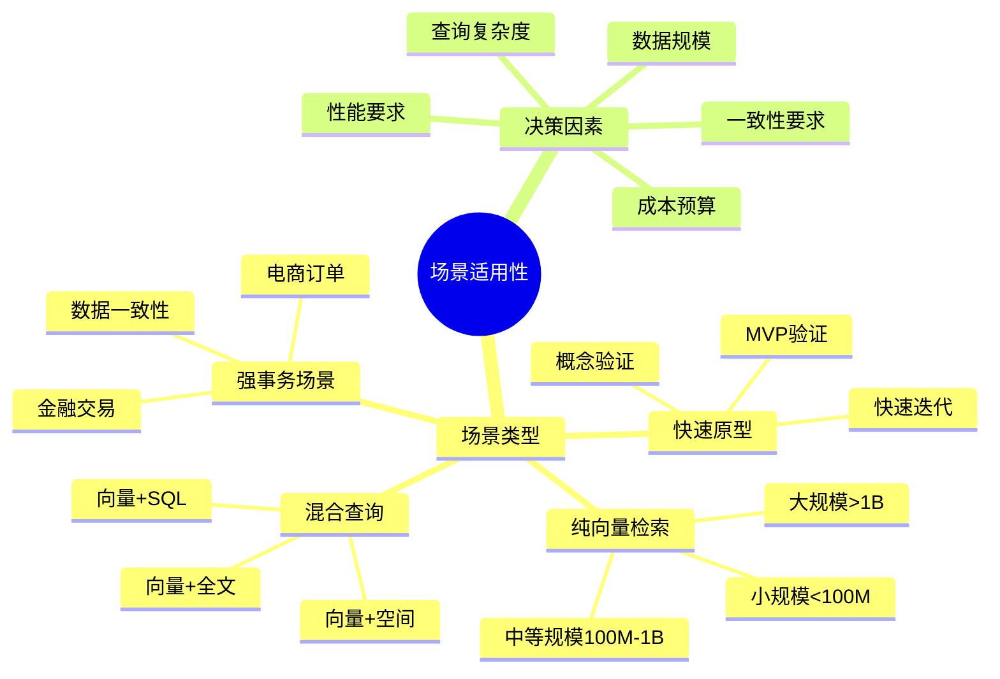
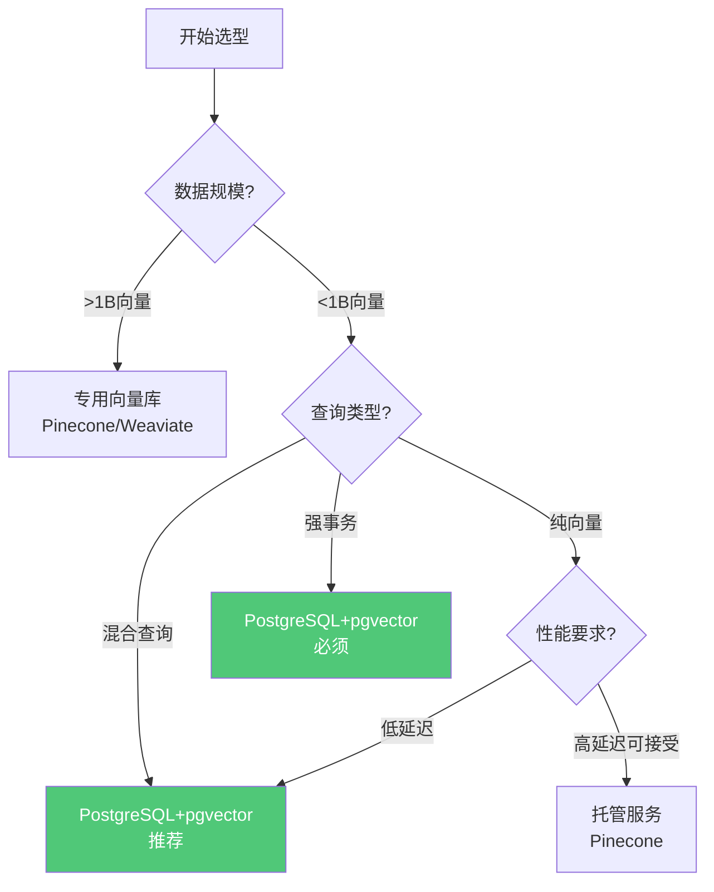

# 场景适用性决策矩阵

> **文档编号**: AI-06-03
> **最后更新**: 2025年1月
> **主题**: 06-对比分析
> **子主题**: 03-场景适用性决策矩阵

## 📑 目录

- [1.1 场景分类思维导图](#11-场景分类思维导图)
- [1.2 决策流程](#12-决策流程)
- [2.1 纯向量检索场景](#21-纯向量检索场景)
- [2.2 混合查询场景](#22-混合查询场景)
- [2.3 强事务场景](#23-强事务场景)
- [2.4 快速原型场景](#24-快速原型场景)
- [3.1 数据规模决策](#31-数据规模决策)
- [3.2 查询复杂度决策](#32-查询复杂度决策)
- [3.3 一致性要求决策](#33-一致性要求决策)
- [4.1 推荐方案矩阵](#41-推荐方案矩阵)
- [4.2 方案对比](#42-方案对比)

---

## 1. 场景适用性概述

### 1.1 场景分类思维导图

### 1.2 决策流程

**场景选型决策流程**：

---

## 2. 典型场景分析

### 2.1 纯向量检索场景

**场景特征**：

- 只需要向量相似度搜索
- 无结构化数据查询需求
- 无强事务要求

**方案对比**：

| 方案 | 适用条件 | 优势 | 劣势 |
|------|---------|------|------|
| **PostgreSQL+pgvector** | <1B向量 | 性能最优，成本最低 | 水平扩展有限 |
| **Pinecone** | 任意规模 | 自动扩展，零运维 | 成本高，延迟高 |
| **Weaviate** | <10B向量 | 开源，性能好 | 需要运维 |
| **Qdrant** | <1B向量 | 性能好，开源 | 功能有限 |

**推荐决策**：

- ✅ **<100M向量**：PostgreSQL+pgvector（性能最优）
- ✅ **100M-1B向量**：PostgreSQL+pgvector（成本最优）
- ⚠️ **>1B向量**：考虑Pinecone或Weaviate（水平扩展）

### 2.2 混合查询场景

**场景特征**：

- 需要向量+结构化数据查询
- 需要向量+全文搜索
- 需要向量+地理空间查询

**方案对比**：

| 方案 | 向量+SQL | 向量+全文 | 向量+空间 | 综合评分 |
|------|---------|---------|---------|---------|
| **PostgreSQL+pgvector** | ✅ 原生 | ✅ 原生 | ✅ PostGIS | ⭐⭐⭐⭐⭐ |
| **Pinecone+PostgreSQL** | ⚠️ 跨系统 | ⚠️ 跨系统 | ⚠️ 跨系统 | ⭐⭐ |
| **Weaviate+PostgreSQL** | ⚠️ 跨系统 | ⚠️ 跨系统 | ⚠️ 跨系统 | ⭐⭐ |
| **Elasticsearch** | ⚠️ 有限 | ✅ 原生 | ⚠️ 有限 | ⭐⭐⭐ |

**推荐决策**：

- ✅ **所有混合查询场景**：PostgreSQL+pgvector（唯一推荐）
- ✅ 单条SQL完成所有查询
- ✅ 无需跨系统数据同步
- ✅ 性能最优，成本最低

### 2.3 强事务场景

**场景特征**：

- 需要ACID事务保证
- 数据一致性要求高
- 金融、电商等关键业务

**方案对比**：

| 方案 | ACID支持 | 一致性 | 适用性 |
|------|---------|--------|--------|
| **PostgreSQL+pgvector** | ✅ 完整 | ✅ 强一致性 | ✅ 推荐 |
| **Pinecone** | ❌ 无 | ⚠️ 最终一致性 | ❌ 不适用 |
| **Weaviate** | ⚠️ 部分 | ⚠️ 最终一致性 | ❌ 不适用 |
| **Elasticsearch** | ⚠️ 部分 | ⚠️ 最终一致性 | ❌ 不适用 |

**推荐决策**：

- ✅ **强事务场景**：PostgreSQL+pgvector（唯一选择）
- ✅ 完整ACID支持
- ✅ 强数据一致性保证
- ✅ 适合关键业务场景

### 2.4 快速原型场景

**场景特征**：

- MVP验证
- 概念验证
- 快速迭代

**方案对比**：

| 方案 | 启动成本 | 学习成本 | 开发速度 | 综合评分 |
|------|---------|---------|---------|---------|
| **PostgreSQL+pgvector** | ✅ 零（Serverless） | ✅ 低（SQL） | ✅ 快 | ⭐⭐⭐⭐⭐ |
| **Pinecone** | ✅ 零 | ⚠️ 中（API） | ⚠️ 中 | ⭐⭐⭐ |
| **Weaviate** | ⚠️ 中（部署） | ⚠️ 中（GraphQL） | ⚠️ 中 | ⭐⭐⭐ |
| **Elasticsearch** | ⚠️ 中（部署） | ⚠️ 中（DSL） | ⚠️ 中 | ⭐⭐⭐ |

**推荐决策**：

- ✅ **快速原型**：PostgreSQL+pgvector（推荐）
- ✅ Serverless零成本启动
- ✅ SQL原生支持，学习成本低
- ✅ 统一平台，开发速度快

---

## 3. 决策因素分析

### 3.1 数据规模决策

**数据规模决策矩阵**：

| 数据规模 | 推荐方案 | 原因 | 备选方案 |
|---------|---------|------|---------|
| **<100M向量** | PostgreSQL+pgvector | 性能最优，成本最低 | - |
| **100M-1B向量** | PostgreSQL+pgvector | 成本最优，性能好 | Weaviate |
| **1B-10B向量** | Weaviate/Pinecone | 水平扩展能力强 | PostgreSQL分片 |
| **>10B向量** | Pinecone | 自动扩展，无限制 | - |

**决策建议**：

- ✅ 大多数场景（<1B向量）：PostgreSQL+pgvector
- ✅ 超大规模（>10B向量）：考虑Pinecone
- ⚠️ 中等规模（1B-10B向量）：根据成本预算选择

### 3.2 查询复杂度决策

**查询复杂度决策矩阵**：

| 查询类型 | 推荐方案 | 原因 |
|---------|---------|------|
| **纯向量检索** | PostgreSQL+pgvector | 性能最优（<1B向量） |
| **向量+SQL** | PostgreSQL+pgvector | 唯一原生支持 |
| **向量+全文** | PostgreSQL+pgvector | 原生支持，性能最优 |
| **向量+空间** | PostgreSQL+pgvector | PostGIS原生支持 |
| **向量+JSON** | PostgreSQL+pgvector | JSONB原生支持 |

**决策建议**：

- ✅ 所有混合查询场景：PostgreSQL+pgvector
- ✅ 单系统完成所有查询
- ✅ 无需跨系统数据同步

### 3.3 一致性要求决策

**一致性要求决策矩阵**：

| 一致性要求 | 推荐方案 | 原因 |
|-----------|---------|------|
| **强一致性（ACID）** | PostgreSQL+pgvector | 唯一完整ACID支持 |
| **最终一致性** | 任意方案 | 根据其他因素选择 |
| **无一致性要求** | 任意方案 | 根据性能成本选择 |

**决策建议**：

- ✅ 强一致性场景：PostgreSQL+pgvector（唯一选择）
- ✅ 金融、电商等关键业务：必须使用PostgreSQL
- ⚠️ 其他场景：根据性能成本选择

---

## 4. 综合推荐矩阵

### 4.1 推荐方案矩阵

**场景×方案推荐矩阵**：

| 场景 | PostgreSQL+pgvector | Pinecone | Weaviate | Elasticsearch |
|------|-------------------|----------|----------|---------------|
| **纯向量检索（<1B）** | ✅ 推荐 | ⚠️ 可选 | ⚠️ 可选 | ❌ 不推荐 |
| **纯向量检索（>1B）** | ⚠️ 可选 | ✅ 推荐 | ✅ 推荐 | ❌ 不推荐 |
| **向量+SQL** | ✅ 推荐 | ❌ 不适用 | ❌ 不适用 | ❌ 不适用 |
| **向量+全文** | ✅ 推荐 | ❌ 不适用 | ⚠️ 有限 | ✅ 可选 |
| **向量+空间** | ✅ 推荐 | ❌ 不适用 | ❌ 不适用 | ❌ 不适用 |
| **强事务场景** | ✅ 推荐 | ❌ 不适用 | ❌ 不适用 | ❌ 不适用 |
| **快速原型** | ✅ 推荐 | ⚠️ 可选 | ⚠️ 可选 | ⚠️ 可选 |

### 4.2 方案对比

**综合对比总结**：

| 维度 | PostgreSQL+pgvector | Pinecone | Weaviate | Elasticsearch |
|------|-------------------|----------|----------|---------------|
| **适用场景数** | **7/7** | 2/7 | 3/7 | 2/7 |
| **推荐场景数** | **6/7** | 1/7 | 1/7 | 1/7 |
| **综合得分** | **最高** | 中 | 中 | 中 |

**结论**：

- ✅ PostgreSQL+pgvector适用场景最广（7/7）
- ✅ PostgreSQL+pgvector推荐场景最多（6/7）
- ✅ 大多数场景都推荐PostgreSQL+pgvector

---

**最后更新**: 2025年1月
**维护者**: PostgreSQL Modern Team
**文档编号**: AI-06-03
