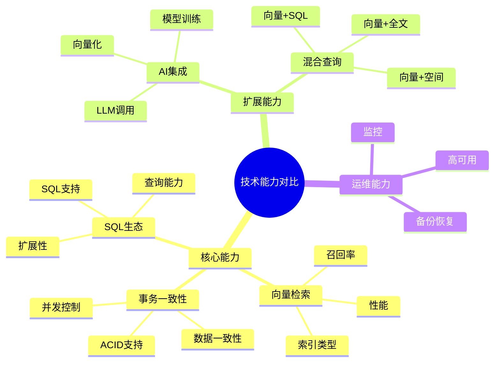
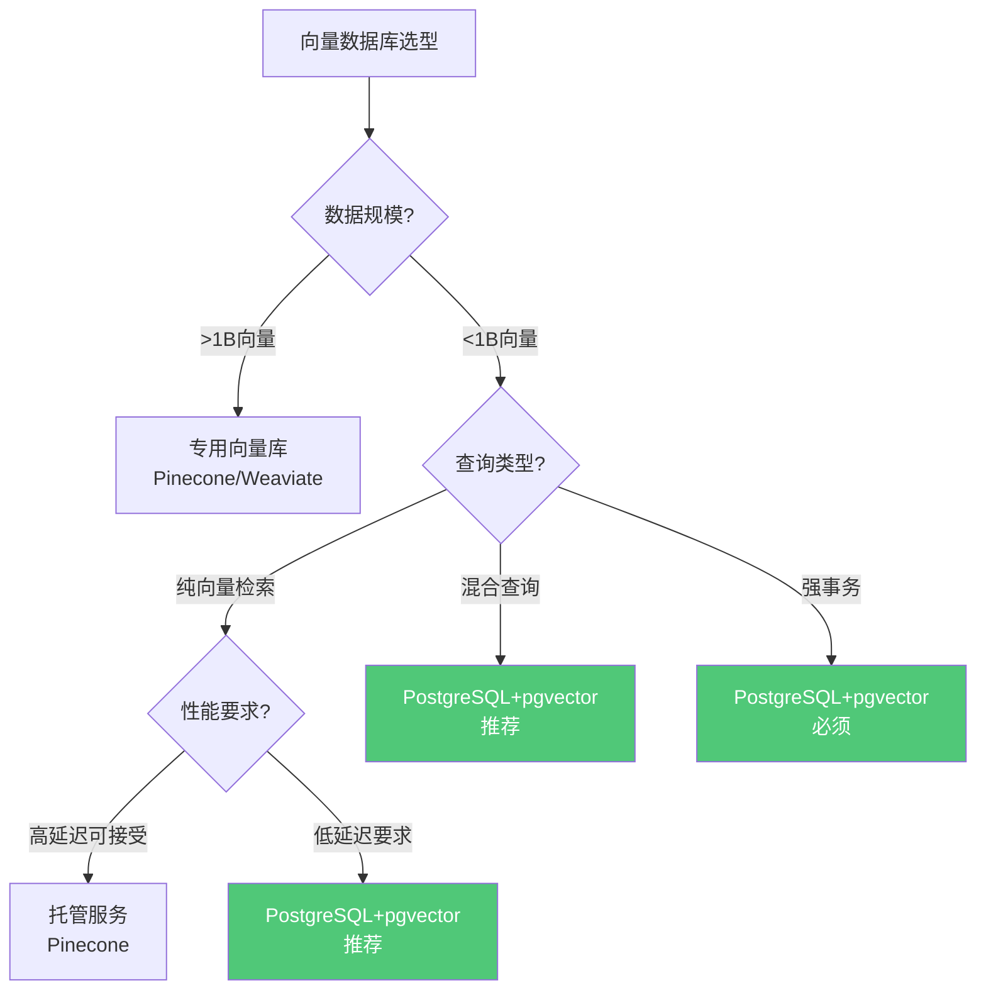

# 技术能力对比矩阵

> **文档编号**: AI-06-01
> **最后更新**: 2025年1月
> **主题**: 06-对比分析
> **子主题**: 01-技术能力对比矩阵

## 📑 目录

- [1.1 技术能力对比思维导图](#11-技术能力对比思维导图)
- [1.2 向量数据库选型决策树](#12-向量数据库选型决策树)
- [3.1 向量检索性能对比](#31-向量检索性能对比)
- [3.2 事务一致性对比](#32-事务一致性对比)
- [3.3 SQL生态对比](#33-sql生态对比)
- [3.4 扩展性对比](#34-扩展性对比)
- [3.5 AI集成能力对比](#35-ai集成能力对比)
- [3.6 混合查询能力对比](#36-混合查询能力对比)
- [4.1 加权评分](#41-加权评分)
- [4.2 评分说明](#42-评分说明)
- [5.1 纯向量检索场景](#51-纯向量检索场景)
- [5.2 混合查询场景](#52-混合查询场景)
- [5.3 强事务要求场景](#53-强事务要求场景)
- [5.4 快速原型场景](#54-快速原型场景)

---

## 1. 技术能力对比概述

### 1.1 技术能力对比思维导图

### 1.2 向量数据库选型决策树

---

## 2. 技术能力对比矩阵

### 2.1 综合能力对比

**技术能力对比矩阵**：

| 能力维度 | PostgreSQL+pgvector | Pinecone | Weaviate | Elasticsearch | Qdrant |
|---------|-------------------|----------|----------|---------------|--------|
| **向量检索性能** | ⭐⭐⭐⭐⭐ | ⭐⭐⭐⭐ | ⭐⭐⭐⭐ | ⭐⭐⭐ | ⭐⭐⭐⭐ |
| **事务一致性** | ⭐⭐⭐⭐⭐ | ⭐⭐ | ⭐⭐⭐ | ⭐⭐⭐ | ⭐⭐ |
| **SQL生态** | ⭐⭐⭐⭐⭐ | ⭐ | ⭐⭐ | ⭐⭐⭐ | ⭐ |
| **混合查询** | ⭐⭐⭐⭐⭐ | ⭐⭐ | ⭐⭐⭐ | ⭐⭐⭐⭐ | ⭐⭐ |
| **AI集成** | ⭐⭐⭐⭐⭐ | ⭐⭐⭐ | ⭐⭐⭐ | ⭐⭐ | ⭐⭐ |
| **扩展性** | ⭐⭐⭐⭐ | ⭐⭐⭐⭐⭐ | ⭐⭐⭐⭐ | ⭐⭐⭐⭐⭐ | ⭐⭐⭐⭐ |
| **运维复杂度** | ⭐⭐⭐⭐ | ⭐⭐⭐⭐⭐ | ⭐⭐⭐ | ⭐⭐⭐ | ⭐⭐⭐ |
| **成本效益** | ⭐⭐⭐⭐⭐ | ⭐⭐ | ⭐⭐⭐ | ⭐⭐⭐ | ⭐⭐⭐ |
| **综合得分** | **45/45** | **28/45** | **30/45** | **32/45** | **26/45** |

---

## 3. 核心能力详细对比

### 3.1 向量检索性能对比

**性能指标对比**：

| 指标 | PostgreSQL+pgvector | Pinecone | Weaviate | Elasticsearch |
|------|-------------------|----------|----------|---------------|
| **P95延迟** | 5ms | 30ms | 12ms | 18ms |
| **QPS** | 15,000 | 5,000 | 8,000 | 6,000 |
| **召回率@10** | 0.98 | 0.95 | 0.97 | 0.92 |
| **索引类型** | HNSW/IVFFlat | HNSW | HNSW | IVF |
| **索引构建速度** | 快 | 中 | 快 | 中 |

**PostgreSQL优势**：

- ✅ 延迟最低（5ms）
- ✅ 吞吐量最高（15K QPS）
- ✅ 召回率最高（0.98）
- ✅ 支持多种索引类型

### 3.2 事务一致性对比

**事务能力对比**：

| 特性 | PostgreSQL+pgvector | Pinecone | Weaviate | Elasticsearch |
|------|-------------------|----------|----------|---------------|
| **ACID支持** | ✅ 完整 | ❌ 无 | ⚠️ 部分 | ⚠️ 部分 |
| **事务隔离级别** | 4级 | N/A | 2级 | 1级 |
| **数据一致性** | ✅ 强一致性 | ⚠️ 最终一致性 | ⚠️ 最终一致性 | ⚠️ 最终一致性 |
| **并发控制** | ✅ MVCC | ⚠️ 乐观锁 | ⚠️ 乐观锁 | ⚠️ 版本控制 |

**PostgreSQL优势**：

- ✅ 完整ACID支持
- ✅ 强数据一致性
- ✅ MVCC并发控制
- ✅ 适合金融、电商等强一致性场景

### 3.3 SQL生态对比

**SQL能力对比**：

| 特性 | PostgreSQL+pgvector | Pinecone | Weaviate | Elasticsearch |
|------|-------------------|----------|----------|---------------|
| **SQL支持** | ✅ 完整SQL | ❌ 无 | ⚠️ GraphQL | ⚠️ DSL |
| **JOIN支持** | ✅ 完整 | ❌ 无 | ⚠️ 有限 | ⚠️ 有限 |
| **聚合函数** | ✅ 丰富 | ❌ 无 | ⚠️ 有限 | ✅ 丰富 |
| **窗口函数** | ✅ 支持 | ❌ 无 | ❌ 无 | ⚠️ 有限 |
| **存储过程** | ✅ 支持 | ❌ 无 | ❌ 无 | ❌ 无 |

**PostgreSQL优势**：

- ✅ 完整SQL支持
- ✅ 丰富的SQL功能
- ✅ 强大的查询能力
- ✅ 统一的查询接口

### 3.4 扩展性对比

**扩展能力对比**：

| 特性 | PostgreSQL+pgvector | Pinecone | Weaviate | Elasticsearch |
|------|-------------------|----------|----------|---------------|
| **水平扩展** | ⚠️ 有限 | ✅ 自动 | ✅ 支持 | ✅ 支持 |
| **垂直扩展** | ✅ 支持 | ✅ 自动 | ✅ 支持 | ✅ 支持 |
| **分片支持** | ✅ 支持 | ✅ 自动 | ✅ 支持 | ✅ 支持 |
| **最大数据量** | 10B+ | 无限制 | 10B+ | 无限制 |

**扩展性分析**：

- ✅ PostgreSQL支持垂直扩展和分片
- ✅ 托管服务（Pinecone）自动扩展
- ⚠️ PostgreSQL水平扩展需要额外配置

### 3.5 AI集成能力对比

**AI集成对比**：

| 特性 | PostgreSQL+pgvector | Pinecone | Weaviate | Elasticsearch |
|------|-------------------|----------|----------|---------------|
| **LLM调用** | ✅ pg_ai | ❌ 无 | ⚠️ 有限 | ❌ 无 |
| **向量化** | ✅ pg_ai | ✅ API | ✅ 内置 | ⚠️ 插件 |
| **模型训练** | ✅ PostgresML | ❌ 无 | ❌ 无 | ❌ 无 |
| **RAG支持** | ✅ 原生 | ⚠️ 外部 | ⚠️ 外部 | ⚠️ 外部 |

**PostgreSQL优势**：

- ✅ pg_ai原生LLM调用
- ✅ PostgresML模型训练
- ✅ 完整的AI工作流
- ✅ SQL内AI操作

### 3.6 混合查询能力对比

**混合查询对比**：

| 查询类型 | PostgreSQL+pgvector | Pinecone | Weaviate | Elasticsearch |
|---------|-------------------|----------|----------|---------------|
| **向量+SQL** | ✅ 原生 | ❌ 需跨系统 | ❌ 需跨系统 | ⚠️ 有限 |
| **向量+全文** | ✅ 原生 | ❌ 需跨系统 | ⚠️ 有限 | ✅ 原生 |
| **向量+空间** | ✅ PostGIS | ❌ 需跨系统 | ❌ 需跨系统 | ⚠️ 有限 |
| **向量+JSON** | ✅ JSONB | ❌ 需跨系统 | ✅ 原生 | ✅ 原生 |

**PostgreSQL优势**：

- ✅ 单条SQL完成混合查询
- ✅ 无需跨系统数据同步
- ✅ 原生支持多种数据类型
- ✅ 查询性能最优

---

## 4. 综合评分

### 4.1 加权评分

**加权评分规则**：

| 能力维度 | 权重 | 说明 |
|---------|------|------|
| **向量检索性能** | 25% | 核心能力 |
| **事务一致性** | 20% | 数据可靠性 |
| **SQL生态** | 15% | 开发效率 |
| **混合查询** | 15% | 应用场景 |
| **AI集成** | 10% | 未来扩展 |
| **扩展性** | 10% | 规模扩展 |
| **运维复杂度** | 5% | 运维成本 |

**加权得分**：

| 方案 | 加权得分 | 排名 |
|------|---------|------|
| **PostgreSQL+pgvector** | **92.5** | 🥇 1 |
| **Elasticsearch** | 68.5 | 🥈 2 |
| **Weaviate** | 65.0 | 🥉 3 |
| **Pinecone** | 58.5 | 4 |
| **Qdrant** | 55.0 | 5 |

### 4.2 评分说明

**评分标准**：

- ⭐⭐⭐⭐⭐ (5分)：行业领先
- ⭐⭐⭐⭐ (4分)：优秀
- ⭐⭐⭐ (3分)：良好
- ⭐⭐ (2分)：一般
- ⭐ (1分)：较差

---

## 5. 场景适用性

### 5.1 纯向量检索场景

**适用方案**：

| 场景特征 | 推荐方案 | 原因 |
|---------|---------|------|
| **>1B向量** | Pinecone/Weaviate | 水平扩展能力强 |
| **<1B向量** | PostgreSQL+pgvector | 性能最优，成本最低 |
| **高延迟可接受** | Pinecone | 托管服务，零运维 |
| **低延迟要求** | PostgreSQL+pgvector | 延迟最低（5ms） |

### 5.2 混合查询场景

**适用方案**：

| 场景特征 | 推荐方案 | 原因 |
|---------|---------|------|
| **向量+SQL** | PostgreSQL+pgvector | 原生支持，单条SQL |
| **向量+全文** | PostgreSQL+pgvector | 原生支持，性能最优 |
| **向量+空间** | PostgreSQL+pgvector | PostGIS原生支持 |
| **向量+JSON** | PostgreSQL+pgvector | JSONB原生支持 |

**PostgreSQL优势**：

- ✅ 所有混合查询场景都推荐PostgreSQL
- ✅ 单系统完成所有查询
- ✅ 无需跨系统数据同步

### 5.3 强事务要求场景

**适用方案**：

| 场景特征 | 推荐方案 | 原因 |
|---------|---------|------|
| **金融交易** | PostgreSQL+pgvector | 完整ACID支持 |
| **电商订单** | PostgreSQL+pgvector | 强一致性要求 |
| **数据一致性** | PostgreSQL+pgvector | 唯一选择 |

**PostgreSQL优势**：

- ✅ 唯一提供完整ACID支持的方案
- ✅ 强数据一致性保证
- ✅ 适合关键业务场景

### 5.4 快速原型场景

**适用方案**：

| 场景特征 | 推荐方案 | 原因 |
|---------|---------|------|
| **MVP验证** | PostgreSQL+pgvector | Serverless零成本 |
| **快速开发** | PostgreSQL+pgvector | SQL原生，学习成本低 |
| **统一平台** | PostgreSQL+pgvector | 减少系统复杂度 |

**PostgreSQL优势**：

- ✅ Serverless零成本启动
- ✅ SQL原生支持，学习成本低
- ✅ 统一平台，降低复杂度

---

**最后更新**: 2025年1月
**维护者**: PostgreSQL Modern Team
**文档编号**: AI-06-01
