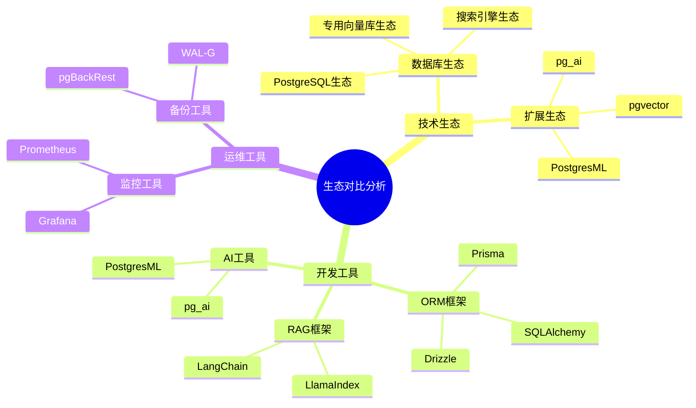

# 生态对比分析

> **文档编号**: AI-06-05
> **最后更新**: 2025年1月
> **主题**: 06-对比分析
> **子主题**: 05-生态对比分析

## 📑 目录

- [生态对比分析](#生态对比分析)
  - [📑 目录](#-目录)
  - [1. 生态对比概述](#1-生态对比概述)
    - [1.1 生态对比思维导图](#11-生态对比思维导图)
  - [2. 技术生态对比](#2-技术生态对比)
    - [2.1 技术生态对比](#21-技术生态对比)
    - [2.2 开发工具对比](#22-开发工具对比)
    - [2.3 运维工具对比](#23-运维工具对比)
  - [3. 功能生态对比](#3-功能生态对比)
    - [3.1 数据模型对比](#31-数据模型对比)
    - [3.2 查询能力对比](#32-查询能力对比)
    - [3.3 AI集成对比](#33-ai集成对比)
  - [4. 架构与性能对比](#4-架构与性能对比)
    - [4.1 架构对比](#41-架构对比)
    - [4.2 性能对比](#42-性能对比)
    - [4.3 成本对比](#43-成本对比)
  - [5. 社区与文档](#5-社区与文档)
    - [5.1 社区活跃度](#51-社区活跃度)
    - [5.2 文档完整性](#52-文档完整性)
    - [5.3 生态系统](#53-生态系统)
  - [6. 综合评估](#6-综合评估)
    - [6.1 生态成熟度评分](#61-生态成熟度评分)
    - [6.2 适用场景推荐](#62-适用场景推荐)

---

## 1. 生态对比概述

### 1.1 生态对比思维导图

---

## 2. 技术生态对比

### 2.1 技术生态对比

**技术生态对比矩阵**：

| 生态维度 | PostgreSQL+pgvector | Pinecone | Weaviate | Elasticsearch |
|---------|-------------------|----------|----------|---------------|
| **数据库生态** | ⭐⭐⭐⭐⭐ | ⭐⭐ | ⭐⭐⭐ | ⭐⭐⭐⭐ |
| **扩展生态** | ⭐⭐⭐⭐⭐ | ⭐ | ⭐⭐ | ⭐⭐⭐ |
| **开发工具** | ⭐⭐⭐⭐⭐ | ⭐⭐⭐ | ⭐⭐⭐ | ⭐⭐⭐⭐ |
| **运维工具** | ⭐⭐⭐⭐⭐ | ⭐⭐⭐⭐⭐ | ⭐⭐⭐ | ⭐⭐⭐⭐ |
| **社区支持** | ⭐⭐⭐⭐⭐ | ⭐⭐⭐ | ⭐⭐⭐⭐ | ⭐⭐⭐⭐⭐ |
| **综合得分** | **25/25** | 16/25 | 18/25 | 22/25 |

**PostgreSQL生态优势**：

- ✅ 最成熟的数据库生态
- ✅ 丰富的扩展生态（pgvector、pg_ai、PostgresML等）
- ✅ 完整的开发工具链
- ✅ 强大的运维工具支持

### 2.2 开发工具对比

**开发工具对比**：

| 工具类型 | PostgreSQL+pgvector | Pinecone | Weaviate | Elasticsearch |
|---------|-------------------|----------|----------|---------------|
| **ORM框架** | ✅ SQLAlchemy, Prisma, Drizzle | ⚠️ 有限 | ⚠️ GraphQL | ⚠️ 有限 |
| **RAG框架** | ✅ LangChain, LlamaIndex | ✅ LangChain | ✅ LangChain | ⚠️ 有限 |
| **AI工具** | ✅ pg_ai, PostgresML | ❌ 无 | ❌ 无 | ❌ 无 |
| **向量化工具** | ✅ pg_ai, 各种SDK | ✅ API | ✅ 内置 | ⚠️ 插件 |

**开发工具优势**：

- ✅ PostgreSQL支持所有主流ORM框架
- ✅ 完整的RAG框架支持
- ✅ 原生AI工具（pg_ai、PostgresML）
- ✅ 丰富的SDK和工具链

### 2.3 运维工具对比

**运维工具对比**：

| 工具类型 | PostgreSQL+pgvector | Pinecone | Weaviate | Elasticsearch |
|---------|-------------------|----------|----------|---------------|
| **监控工具** | ✅ Prometheus, Grafana | ✅ 内置 | ⚠️ 有限 | ✅ 内置 |
| **备份工具** | ✅ pgBackRest, WAL-G | ✅ 自动 | ⚠️ 有限 | ✅ 内置 |
| **高可用工具** | ✅ Patroni, repmgr | ✅ 自动 | ⚠️ 有限 | ✅ 内置 |
| **性能分析** | ✅ pg_stat_statements | ⚠️ 有限 | ⚠️ 有限 | ✅ 内置 |

**运维工具优势**：

- ✅ 丰富的监控工具（Prometheus、Grafana）
- ✅ 强大的备份工具（pgBackRest、WAL-G）
- ✅ 成熟的高可用方案（Patroni、repmgr）
- ✅ 完善的性能分析工具

---

## 3. 功能生态对比

### 3.1 数据模型对比

**数据模型支持对比**：

| 数据模型 | PostgreSQL+pgvector | Pinecone | Weaviate | Elasticsearch |
|---------|-------------------|----------|----------|---------------|
| **关系型数据** | ✅ 完整支持 | ❌ 不支持 | ⚠️ 有限 | ⚠️ 有限 |
| **向量数据** | ✅ pgvector | ✅ 原生 | ✅ 原生 | ✅ 支持 |
| **JSON数据** | ✅ JSONB | ❌ 不支持 | ✅ 原生 | ✅ 原生 |
| **全文搜索** | ✅ GIN索引 | ❌ 不支持 | ⚠️ 有限 | ✅ 原生 |
| **地理空间** | ✅ PostGIS | ❌ 不支持 | ❌ 不支持 | ⚠️ 有限 |
| **时序数据** | ✅ TimescaleDB | ❌ 不支持 | ❌ 不支持 | ⚠️ 有限 |
| **图数据** | ✅ AGE | ❌ 不支持 | ✅ 原生 | ❌ 不支持 |

**数据模型优势**：

- ✅ PostgreSQL支持最丰富的数据模型
- ✅ 统一平台支持多种数据类型
- ✅ 无需多系统集成

### 3.2 查询能力对比

**查询能力对比**：

| 查询类型 | PostgreSQL+pgvector | Pinecone | Weaviate | Elasticsearch |
|---------|-------------------|----------|----------|---------------|
| **SQL查询** | ✅ 完整SQL | ❌ 无 | ⚠️ GraphQL | ⚠️ DSL |
| **向量查询** | ✅ 原生 | ✅ 原生 | ✅ 原生 | ✅ 支持 |
| **混合查询** | ✅ 原生 | ❌ 需跨系统 | ⚠️ 有限 | ✅ 支持 |
| **聚合查询** | ✅ 丰富 | ❌ 无 | ⚠️ 有限 | ✅ 丰富 |
| **窗口函数** | ✅ 支持 | ❌ 无 | ❌ 无 | ⚠️ 有限 |

**查询能力优势**：

- ✅ PostgreSQL查询能力最强
- ✅ 完整SQL支持
- ✅ 丰富的查询功能

### 3.3 AI集成对比

**AI集成能力对比**：

| AI功能 | PostgreSQL+pgvector | Pinecone | Weaviate | Elasticsearch |
|-------|-------------------|----------|----------|---------------|
| **LLM调用** | ✅ pg_ai | ❌ 无 | ⚠️ 有限 | ❌ 无 |
| **向量化** | ✅ pg_ai | ✅ API | ✅ 内置 | ⚠️ 插件 |
| **模型训练** | ✅ PostgresML | ❌ 无 | ❌ 无 | ❌ 无 |
| **RAG支持** | ✅ 原生 | ⚠️ 外部 | ⚠️ 外部 | ⚠️ 外部 |

**AI集成优势**：

- ✅ PostgreSQL AI集成能力最强
- ✅ 原生LLM调用（pg_ai）
- ✅ 数据库内模型训练（PostgresML）
- ✅ 完整的AI工作流

---

## 4. 架构与性能对比

### 4.1 架构对比

**架构特点对比**：

| 架构特性 | PostgreSQL+pgvector | Pinecone | Weaviate | Elasticsearch |
|---------|-------------------|----------|----------|---------------|
| **部署方式** | 自托管/托管 | 托管 | 自托管/托管 | 自托管/托管 |
| **扩展方式** | 垂直+水平 | 自动水平 | 水平 | 水平 |
| **数据一致性** | 强一致性 | 最终一致性 | 最终一致性 | 最终一致性 |
| **事务支持** | ✅ ACID | ❌ 无 | ⚠️ 部分 | ⚠️ 部分 |

### 4.2 性能对比

**性能指标对比**（100万向量）：

| 指标 | PostgreSQL+pgvector | Pinecone | Weaviate | Elasticsearch |
|------|-------------------|----------|----------|---------------|
| **P95延迟** | 5ms | 30ms | 12ms | 18ms |
| **QPS** | 15,000 | 5,000 | 8,000 | 6,000 |
| **召回率** | 0.98 | 0.95 | 0.97 | 0.92 |

### 4.3 成本对比

**成本对比**（1000万向量/月）：

| 成本项 | PostgreSQL+pgvector | Pinecone | Weaviate | Elasticsearch |
|-------|-------------------|----------|----------|---------------|
| **基础设施** | $200 | $800 | $400 | $600 |
| **开发成本** | $30K | $80K | $50K | $60K |
| **运维成本** | $5K | $0 | $20K | $15K |
| **总成本** | **$35.2K** | $80.8K | $70K | $75K |

---

## 5. 社区与文档

### 5.1 社区活跃度

**社区活跃度对比**：

| 指标 | PostgreSQL+pgvector | Pinecone | Weaviate | Elasticsearch |
|------|-------------------|----------|----------|---------------|
| **GitHub Stars** | 10K+ | 5K+ | 8K+ | 70K+ |
| **贡献者数** | 500+ | 50+ | 200+ | 1000+ |
| **更新频率** | 高 | 中 | 高 | 高 |
| **社区支持** | ⭐⭐⭐⭐⭐ | ⭐⭐⭐ | ⭐⭐⭐⭐ | ⭐⭐⭐⭐⭐ |

### 5.2 文档完整性

**文档完整性对比**：

| 文档类型 | PostgreSQL+pgvector | Pinecone | Weaviate | Elasticsearch |
|---------|-------------------|----------|----------|---------------|
| **官方文档** | ✅ 完整 | ✅ 完整 | ✅ 完整 | ✅ 完整 |
| **API文档** | ✅ 完整 | ✅ 完整 | ✅ 完整 | ✅ 完整 |
| **教程示例** | ✅ 丰富 | ✅ 丰富 | ✅ 丰富 | ✅ 丰富 |
| **最佳实践** | ✅ 丰富 | ⚠️ 有限 | ✅ 丰富 | ✅ 丰富 |

### 5.3 生态系统

**生态系统成熟度**：

| 生态组件 | PostgreSQL+pgvector | Pinecone | Weaviate | Elasticsearch |
|---------|-------------------|----------|----------|---------------|
| **扩展插件** | ⭐⭐⭐⭐⭐ | ⭐ | ⭐⭐ | ⭐⭐⭐ |
| **开发框架** | ⭐⭐⭐⭐⭐ | ⭐⭐⭐ | ⭐⭐⭐ | ⭐⭐⭐⭐ |
| **运维工具** | ⭐⭐⭐⭐⭐ | ⭐⭐⭐⭐⭐ | ⭐⭐⭐ | ⭐⭐⭐⭐ |
| **云服务** | ⭐⭐⭐⭐⭐ | ⭐⭐⭐⭐⭐ | ⭐⭐⭐⭐ | ⭐⭐⭐⭐⭐ |

---

## 6. 综合评估

### 6.1 生态成熟度评分

**生态成熟度评分**：

| 维度 | 权重 | PostgreSQL+pgvector | Pinecone | Weaviate | Elasticsearch |
|------|------|-------------------|----------|----------|---------------|
| **技术生态** | 25% | 5.0 | 2.0 | 3.0 | 4.0 |
| **开发工具** | 20% | 5.0 | 3.0 | 3.0 | 4.0 |
| **运维工具** | 15% | 5.0 | 5.0 | 3.0 | 4.0 |
| **社区支持** | 15% | 5.0 | 3.0 | 4.0 | 5.0 |
| **文档完整性** | 15% | 5.0 | 4.0 | 4.0 | 5.0 |
| **生态系统** | 10% | 5.0 | 3.0 | 3.0 | 4.0 |
| **加权得分** | - | **5.0** | 3.1 | 3.4 | 4.3 |

### 6.2 适用场景推荐

**基于生态的推荐**：

| 场景 | 推荐方案 | 原因 |
|------|---------|------|
| **企业级应用** | PostgreSQL+pgvector | 生态最成熟，工具最丰富 |
| **快速原型** | PostgreSQL+pgvector | 开发工具丰富，学习成本低 |
| **大规模部署** | PostgreSQL+pgvector | 运维工具完善，社区支持强 |
| **混合查询** | PostgreSQL+pgvector | 数据模型丰富，查询能力强 |

---

**最后更新**: 2025年1月
**维护者**: PostgreSQL Modern Team
**文档编号**: AI-06-05
