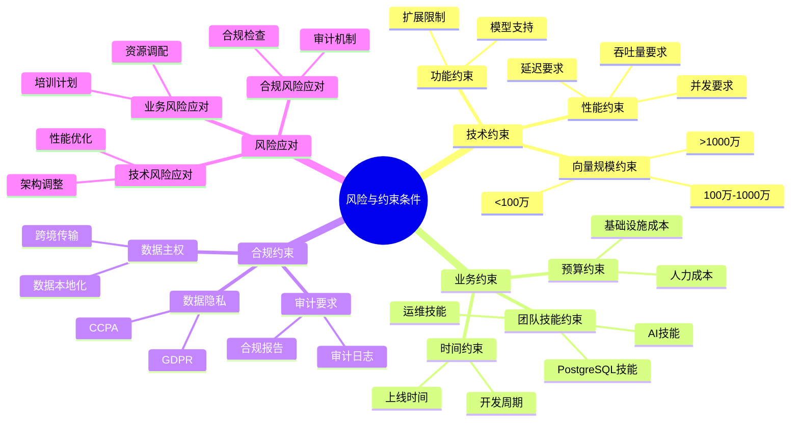
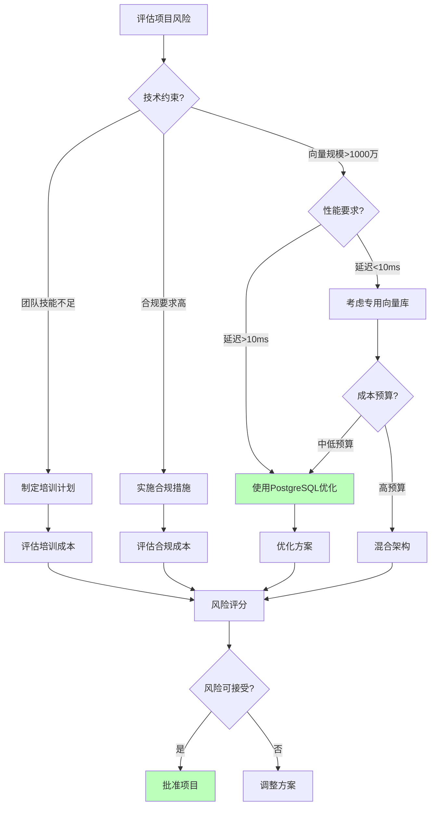

---

> **📋 文档来源**: `PostgreSQL_AI\06-对比分析\风险与约束条件.md`
> **📅 复制日期**: 2025-12-22
> **⚠️ 注意**: 本文档为复制版本，原文件保持不变

---

# 风险与约束条件

> **文档编号**: AI-06-06
> **最后更新**: 2025年1月
> **主题**: 06-对比分析
> **子主题**: 06-风险与约束条件

## 📑 目录

- [风险与约束条件](#风险与约束条件)
  - [📑 目录](#-目录)
  - [一、概述](#一概述)
    - [1.1 风险与约束思维导图](#11-风险与约束思维导图)
    - [1.2 风险决策树](#12-风险决策树)
  - [二、技术约束](#二技术约束)
    - [2.1 向量规模约束](#21-向量规模约束)
    - [2.2 性能约束](#22-性能约束)
    - [2.3 功能约束](#23-功能约束)
  - [三、业务约束](#三业务约束)
    - [3.1 团队技能约束](#31-团队技能约束)
    - [3.2 时间约束](#32-时间约束)
    - [3.3 预算约束](#33-预算约束)
  - [四、合规约束](#四合规约束)
    - [4.1 数据隐私](#41-数据隐私)
    - [4.2 数据主权](#42-数据主权)
    - [4.3 审计要求](#43-审计要求)
  - [五、风险决策矩阵](#五风险决策矩阵)
    - [5.1 技术风险矩阵](#51-技术风险矩阵)
    - [5.2 业务风险矩阵](#52-业务风险矩阵)
    - [5.3 综合风险评分](#53-综合风险评分)
  - [六、约束应对策略](#六约束应对策略)
    - [6.1 技术约束应对](#61-技术约束应对)
    - [6.2 业务约束应对](#62-业务约束应对)
    - [6.3 合规约束应对](#63-合规约束应对)
  - [七、最佳实践](#七最佳实践)
  - [八、关联主题](#八关联主题)
  - [九、对标资源](#九对标资源)
    - [技术文档](#技术文档)
    - [标准](#标准)

## 一、概述

PostgreSQL AI应用实施过程中的风险识别和约束条件分析，包括技术约束、业务约束、合规约束等，为项目决策提供风险评估和应对策略。

### 1.1 风险与约束思维导图



### 1.2 风险决策树



## 二、技术约束

### 2.1 向量规模约束

| 向量规模 | PostgreSQL适用性 | 约束说明 | 应对措施 |
|---------|:---------------:|:--------|:--------|
| **<100万** | ⭐⭐⭐⭐⭐ | 无约束 | 标准配置 |
| **100万-1000万** | ⭐⭐⭐⭐ | 需要优化 | 调整索引参数，增加内存 |
| **1000万-1亿** | ⭐⭐⭐ | 需要Citus | 使用Citus水平扩展 |
| **>1亿** | ⭐⭐ | 性能下降 | 考虑专用向量库或混合架构 |

**应对策略**:

```sql
-- 大规模数据使用Citus
CREATE EXTENSION citus;

-- 创建分布式表
SELECT create_distributed_table('documents', 'id');

-- 调整索引参数
CREATE INDEX ON documents
USING hnsw (embedding vector_cosine_ops)
WITH (m = 32, ef_construction = 200);
```

### 2.2 性能约束

| 性能指标 | 约束值 | 说明 |
|---------|:------:|:----|
| **查询延迟** | <100ms | P95延迟要求 |
| **吞吐量** | >1000 QPS | 最小吞吐量要求 |
| **召回率** | >0.95 | 最小召回率要求 |
| **并发连接** | <200 | 单实例连接数限制 |

**应对策略**:

```sql
-- 优化查询延迟
SET hnsw.ef_search = 200;  -- 提升召回率
SET work_mem = '512MB';    -- 增加工作内存

-- 提升吞吐量
-- 使用连接池
-- PgBouncer配置
pool_mode = transaction
max_client_conn = 10000
default_pool_size = 50
```

### 2.3 功能约束

| 功能 | 约束说明 | 应对措施 |
|------|:--------|:--------|
| **向量维度** | 最大16,000维 | 使用降维或分块 |
| **索引类型** | HNSW/IVFFlat | 根据场景选择 |
| **事务大小** | 受内存限制 | 分批处理 |
| **扩展兼容性** | 需要PostgreSQL 12+ | 升级PostgreSQL |

**应对策略**:

```sql
-- 处理高维向量
-- 使用PCA降维或分块存储
CREATE TABLE high_dim_vectors (
    id SERIAL PRIMARY KEY,
    embedding_part1 vector(8000),
    embedding_part2 vector(8000)
);
```

## 三、业务约束

### 3.1 团队技能约束

| 技能要求 | 必需技能 | 培训时间 | 应对措施 |
|---------|:--------|:--------|:--------|
| **PostgreSQL** | SQL, 索引优化 | 2-4周 | 提供培训，使用工具简化 |
| **向量检索** | 向量索引原理 | 1-2周 | 提供文档，代码示例 |
| **AI集成** | LLM API调用 | 1周 | 使用pgai简化 |

**应对策略**:

- 提供完整文档和教程
- 使用自动化工具（pgai Vectorizer）
- 提供代码模板和最佳实践

### 3.2 时间约束

| 阶段 | 标准时间 | 快速路径 | 应对措施 |
|------|:--------|:--------|:--------|
| **阶段1: 向量能力** | 1-2周 | 3-5天 | 使用Serverless快速部署 |
| **阶段2: AI集成** | 2-4周 | 1周 | 使用pgai简化集成 |
| **阶段3: AI Agent** | 4-6周 | 2-3周 | 使用Neon Branching |

**应对策略**:

```bash
# 快速部署（Neon Serverless）
neon projects create my-app
# 5分钟内完成部署
```

### 3.3 预算约束

| 预算范围 | 推荐方案 | 说明 |
|---------|:--------|:----|
| **<$10,000/年** | PostgreSQL Serverless | 按需付费，成本低 |
| **$10,000-$50,000/年** | 标准PostgreSQL | 自建或托管 |
| **>$50,000/年** | 高可用PostgreSQL | 企业级方案 |

**应对策略**:

- 使用Serverless降低初始成本
- 使用缓存减少API调用
- 优化资源使用

## 四、合规约束

### 4.1 数据隐私

| 要求 | PostgreSQL支持 | 说明 |
|------|:--------------:|:----|
| **数据加密** | ✅ pgcrypto | 传输和存储加密 |
| **访问控制** | ✅ RLS | 行级安全策略 |
| **数据脱敏** | ✅ 函数支持 | 自定义脱敏函数 |
| **GDPR合规** | ✅ 完整支持 | 数据删除、导出 |

**应对策略**:

```sql
-- 启用行级安全
ALTER TABLE documents ENABLE ROW LEVEL SECURITY;

-- 创建策略
CREATE POLICY user_data_access ON documents
    FOR ALL
    TO app_user
    USING (user_id = current_setting('app.user_id')::INTEGER);

-- 数据加密
CREATE EXTENSION pgcrypto;
UPDATE users SET email = pgp_sym_encrypt(email, 'key');
```

### 4.2 数据主权

| 要求 | PostgreSQL支持 | 说明 |
|------|:--------------:|:----|
| **本地部署** | ✅ 完全支持 | 可完全本地部署 |
| **数据不出境** | ✅ 支持 | 控制数据位置 |
| **云服务选择** | ✅ 多选择 | 国内外云服务商 |

**应对策略**:

- 使用本地部署或国内云服务
- 配置数据存储位置
- 使用VPN或专线

### 4.3 审计要求

| 要求 | PostgreSQL支持 | 说明 |
|------|:--------------:|:----|
| **操作审计** | ✅ pg_audit | 完整审计日志 |
| **访问审计** | ✅ 日志记录 | 连接和查询日志 |
| **变更审计** | ✅ 触发器 | 数据变更追踪 |

**应对策略**:

```sql
-- 启用审计
CREATE EXTENSION pg_audit;

ALTER TABLE documents ENABLE AUDIT;

-- 查看审计日志
SELECT * FROM pg_audit_log
WHERE table_name = 'documents'
ORDER BY timestamp DESC;
```

## 五、风险决策矩阵

### 5.1 技术风险矩阵

| 风险 | 概率 | 影响 | 风险等级 | 应对优先级 |
|------|:----:|:----:|:--------|:----------|
| 向量索引构建失败 | 中 | 高 | 中高 | 高 |
| 性能不达标 | 中 | 中 | 中 | 中 |
| 数据迁移失败 | 低 | 高 | 中 | 高 |
| 扩展不兼容 | 低 | 中 | 低 | 中 |

### 5.2 业务风险矩阵

| 风险 | 概率 | 影响 | 风险等级 | 应对优先级 |
|------|:----:|:----:|:--------|:----------|
| 服务中断 | 低 | 极高 | 高 | 极高 |
| 数据丢失 | 极低 | 极高 | 高 | 极高 |
| 成本超支 | 中 | 中 | 中 | 中 |
| 合规违规 | 低 | 极高 | 高 | 极高 |

### 5.3 综合风险评分

| 方案 | 技术风险 | 业务风险 | 合规风险 | **综合风险** |
|------|:--------:|:--------:|:--------:|:-----------:|
| **PostgreSQL方案** | 低 | 低 | 低 | **低** |
| **专用向量库** | 中 | 中 | 中 | **中** |
| **混合架构** | 高 | 高 | 中 | **高** |

**结论**: PostgreSQL方案综合风险最低。

## 六、约束应对策略

### 6.1 技术约束应对

```sql
-- 大规模数据：使用Citus
CREATE EXTENSION citus;
SELECT create_distributed_table('documents', 'id');

-- 高维向量：降维或分块
CREATE TABLE vectors_part1 (
    id INTEGER,
    embedding vector(8000)
);
CREATE TABLE vectors_part2 (
    id INTEGER,
    embedding vector(8000)
);

-- 性能优化：调整参数
SET hnsw.ef_search = 200;
SET work_mem = '512MB';
```

### 6.2 业务约束应对

```sql
-- 使用自动化工具减少技能要求
SELECT ai.create_vectorizer(
    'documents'::regclass,
    destination => 'embeddings',
    embedding => ai.embedding_openai('text-embedding-3-small', 'content')
);

-- 使用模板快速开发
SELECT create_vector_table('my_table', 1536);
```

### 6.3 合规约束应对

```sql
-- 数据加密
CREATE EXTENSION pgcrypto;
ALTER TABLE users
ADD COLUMN email_encrypted BYTEA;

-- 行级安全
ALTER TABLE documents ENABLE ROW LEVEL SECURITY;
CREATE POLICY data_access ON documents
    FOR ALL
    USING (user_id = current_setting('app.user_id')::INTEGER);

-- 审计日志
CREATE EXTENSION pg_audit;
ALTER TABLE documents ENABLE AUDIT;
```

## 七、最佳实践

1. **技术约束应对**:
   - 提前评估数据规模
   - 选择合适的索引类型
   - 优化查询和参数

2. **业务约束应对**:
   - 提供培训和文档
   - 使用自动化工具
   - 提供代码模板

3. **合规约束应对**:
   - 启用数据加密
   - 配置访问控制
   - 启用审计日志

## 八、关联主题

- [风险应对措施](../07-实施路径/风险应对措施.md) - 详细风险应对
- [场景适用性决策矩阵](./场景适用性决策矩阵.md) - 场景选择
- [TCO总拥有成本分析](./TCO总拥有成本分析.md) - 成本约束

## 九、对标资源

### 技术文档

- [PostgreSQL约束文档](https://www.postgresql.org/docs/current/ddl-constraints.html)
- [合规最佳实践](https://www.postgresql.org/docs/current/security.html)

### 标准

- GDPR合规指南
- SOC 2合规要求

---

**最后更新**: 2025年1月
**维护者**: PostgreSQL Modern Team
**文档编号**: AI-06-06
