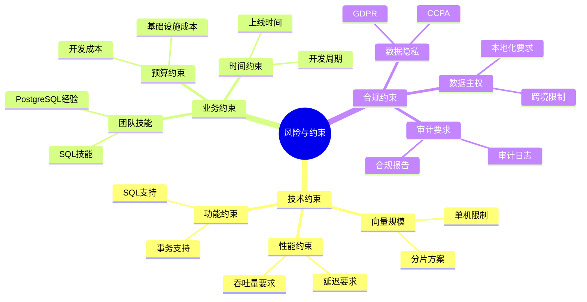
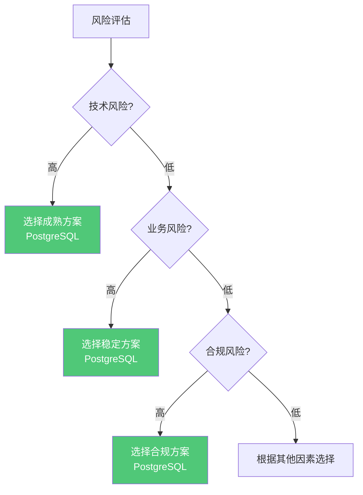

# 风险与约束条件

> **文档编号**: AI-06-06
> **最后更新**: 2025年1月
> **主题**: 06-对比分析
> **子主题**: 06-风险与约束条件

## 📑 目录

- [风险与约束条件](#风险与约束条件)
  - [📑 目录](#-目录)
  - [1. 风险与约束概述](#1-风险与约束概述)
    - [1.1 风险与约束思维导图](#11-风险与约束思维导图)
    - [1.2 风险决策树](#12-风险决策树)
  - [2. 技术约束](#2-技术约束)
    - [2.1 向量规模约束](#21-向量规模约束)
    - [2.2 性能约束](#22-性能约束)
    - [2.3 功能约束](#23-功能约束)
  - [3. 业务约束](#3-业务约束)
    - [3.1 团队技能约束](#31-团队技能约束)
    - [3.2 时间约束](#32-时间约束)
    - [3.3 预算约束](#33-预算约束)
  - [4. 合规约束](#4-合规约束)
    - [4.1 数据隐私](#41-数据隐私)
    - [4.2 数据主权](#42-数据主权)
    - [4.3 审计要求](#43-审计要求)
  - [5. 风险矩阵](#5-风险矩阵)
    - [5.1 技术风险矩阵](#51-技术风险矩阵)
    - [5.2 业务风险矩阵](#52-业务风险矩阵)
    - [5.3 综合风险评分](#53-综合风险评分)
  - [6. 约束应对策略](#6-约束应对策略)
    - [6.1 技术约束应对](#61-技术约束应对)
    - [6.2 业务约束应对](#62-业务约束应对)
    - [6.3 合规约束应对](#63-合规约束应对)

---

## 1. 风险与约束概述

### 1.1 风险与约束思维导图

### 1.2 风险决策树

**风险决策流程**：

---

## 2. 技术约束

### 2.1 向量规模约束

**向量规模限制**：

| 方案 | 单机限制 | 分片支持 | 扩展方案 |
|------|---------|---------|---------|
| **PostgreSQL+pgvector** | 10B向量 | ✅ 支持 | 分片+分区 |
| **Pinecone** | 无限制 | ✅ 自动 | 自动扩展 |
| **Weaviate** | 10B向量 | ✅ 支持 | 集群模式 |
| **Elasticsearch** | 10B向量 | ✅ 支持 | 分片+副本 |

**约束应对**：

- ✅ PostgreSQL：使用分片和分区表
- ✅ 超大规模：考虑Pinecone自动扩展
- ⚠️ 需要额外配置和运维

### 2.2 性能约束

**性能限制**：

| 方案 | 延迟限制 | QPS限制 | 召回率限制 |
|------|---------|--------|-----------|
| **PostgreSQL+pgvector** | 5ms (P95) | 15K | 0.98 |
| **Pinecone** | 30ms (P95) | 5K | 0.95 |
| **Weaviate** | 12ms (P95) | 8K | 0.97 |
| **Elasticsearch** | 18ms (P95) | 6K | 0.92 |

**约束应对**：

- ✅ PostgreSQL性能最优，适合低延迟场景
- ⚠️ 托管服务（Pinecone）延迟较高
- ⚠️ 需要根据性能要求选择方案

### 2.3 功能约束

**功能限制**：

| 功能 | PostgreSQL+pgvector | Pinecone | Weaviate | Elasticsearch |
|------|-------------------|----------|----------|---------------|
| **SQL支持** | ✅ 完整 | ❌ 无 | ⚠️ GraphQL | ⚠️ DSL |
| **事务支持** | ✅ ACID | ❌ 无 | ⚠️ 部分 | ⚠️ 部分 |
| **混合查询** | ✅ 原生 | ❌ 需跨系统 | ⚠️ 有限 | ✅ 支持 |

**约束应对**：

- ✅ PostgreSQL功能最完整
- ⚠️ 专用向量库功能有限
- ⚠️ 需要根据功能需求选择

---

## 3. 业务约束

### 3.1 团队技能约束

**技能要求对比**：

| 技能 | PostgreSQL+pgvector | Pinecone | Weaviate | Elasticsearch |
|------|-------------------|----------|----------|---------------|
| **SQL技能** | ✅ 必需 | ❌ 不需要 | ⚠️ 部分 | ⚠️ 部分 |
| **PostgreSQL经验** | ✅ 必需 | ❌ 不需要 | ❌ 不需要 | ❌ 不需要 |
| **API开发** | ⚠️ 可选 | ✅ 必需 | ✅ 必需 | ✅ 必需 |
| **运维技能** | ✅ 必需 | ❌ 不需要 | ✅ 必需 | ✅ 必需 |

**约束应对**：

- ✅ PostgreSQL：需要SQL和PostgreSQL技能
- ✅ Pinecone：零运维，但需要API开发技能
- ⚠️ 需要评估团队技能匹配度

### 3.2 时间约束

**开发时间对比**：

| 阶段 | PostgreSQL+pgvector | Pinecone | Weaviate | Elasticsearch |
|------|-------------------|----------|----------|---------------|
| **环境搭建** | 1天 | 0.5天 | 1天 | 1天 |
| **开发时间** | 1周 | 2周 | 2周 | 2周 |
| **测试时间** | 1周 | 1周 | 1周 | 1周 |
| **总时间** | **3周** | 3.5周 | 4周 | 4周 |

**约束应对**：

- ✅ PostgreSQL开发时间最短
- ✅ SQL原生支持，学习成本低
- ⚠️ 需要预留足够时间

### 3.3 预算约束

**成本对比**（3年周期，1000万向量）：

| 成本项 | PostgreSQL+pgvector | Pinecone | Weaviate | Elasticsearch |
|-------|-------------------|----------|----------|---------------|
| **基础设施** | $7.2K | $28.8K | $14.4K | $21.6K |
| **开发成本** | $30K | $80K | $50K | $60K |
| **运维成本** | $15K | $0 | $60K | $45K |
| **总成本** | **$52.2K** | $108.8K | $124.4K | $126.6K |

**约束应对**：

- ✅ PostgreSQL成本最低
- ✅ 适合预算有限的项目
- ⚠️ 需要评估长期成本

---

## 4. 合规约束

### 4.1 数据隐私

**数据隐私合规**：

| 合规要求 | PostgreSQL+pgvector | Pinecone | Weaviate | Elasticsearch |
|---------|-------------------|----------|----------|---------------|
| **GDPR合规** | ✅ 支持 | ✅ 支持 | ✅ 支持 | ✅ 支持 |
| **CCPA合规** | ✅ 支持 | ✅ 支持 | ✅ 支持 | ✅ 支持 |
| **数据加密** | ✅ 支持 | ✅ 支持 | ✅ 支持 | ✅ 支持 |
| **数据删除** | ✅ 支持 | ✅ 支持 | ✅ 支持 | ✅ 支持 |

**约束应对**：

- ✅ 所有方案都支持数据隐私合规
- ✅ PostgreSQL提供更多控制选项
- ⚠️ 需要正确配置合规功能

### 4.2 数据主权

**数据主权要求**：

| 要求 | PostgreSQL+pgvector | Pinecone | Weaviate | Elasticsearch |
|------|-------------------|----------|----------|---------------|
| **本地部署** | ✅ 支持 | ❌ 不支持 | ✅ 支持 | ✅ 支持 |
| **数据本地化** | ✅ 完全控制 | ⚠️ 依赖云服务商 | ✅ 完全控制 | ✅ 完全控制 |
| **跨境限制** | ✅ 可控 | ⚠️ 受限 | ✅ 可控 | ✅ 可控 |

**约束应对**：

- ✅ PostgreSQL支持本地部署
- ✅ 完全控制数据位置
- ⚠️ Pinecone依赖云服务商

### 4.3 审计要求

**审计能力对比**：

| 审计功能 | PostgreSQL+pgvector | Pinecone | Weaviate | Elasticsearch |
|---------|-------------------|----------|----------|---------------|
| **审计日志** | ✅ 完整 | ⚠️ 有限 | ⚠️ 有限 | ✅ 完整 |
| **访问控制** | ✅ 细粒度 | ⚠️ 基础 | ⚠️ 基础 | ✅ 细粒度 |
| **合规报告** | ✅ 支持 | ⚠️ 有限 | ⚠️ 有限 | ✅ 支持 |

**约束应对**：

- ✅ PostgreSQL审计能力最强
- ✅ 完整的审计日志和访问控制
- ⚠️ 需要正确配置审计功能

---

## 5. 风险矩阵

### 5.1 技术风险矩阵

**技术风险评分**：

| 风险类型 | PostgreSQL+pgvector | Pinecone | Weaviate | Elasticsearch |
|---------|-------------------|----------|----------|---------------|
| **性能风险** | ⭐ 低 | ⭐⭐ 中 | ⭐⭐ 中 | ⭐⭐ 中 |
| **可用性风险** | ⭐⭐ 中 | ⭐ 低 | ⭐⭐ 中 | ⭐⭐ 中 |
| **扩展性风险** | ⭐⭐ 中 | ⭐ 低 | ⭐⭐ 中 | ⭐ 低 |
| **数据丢失风险** | ⭐ 低 | ⭐ 低 | ⭐⭐ 中 | ⭐⭐ 中 |
| **综合风险** | **低** | 低 | 中 | 中 |

### 5.2 业务风险矩阵

**业务风险评分**：

| 风险类型 | PostgreSQL+pgvector | Pinecone | Weaviate | Elasticsearch |
|---------|-------------------|----------|----------|---------------|
| **成本超支风险** | ⭐ 低 | ⭐⭐⭐ 高 | ⭐⭐ 中 | ⭐⭐ 中 |
| **开发延期风险** | ⭐ 低 | ⭐⭐ 中 | ⭐⭐ 中 | ⭐⭐ 中 |
| **技能匹配风险** | ⭐⭐ 中 | ⭐ 低 | ⭐⭐ 中 | ⭐⭐ 中 |
| **供应商锁定风险** | ⭐ 低 | ⭐⭐⭐ 高 | ⭐ 低 | ⭐ 低 |
| **综合风险** | **低** | 中高 | 中 | 中 |

### 5.3 综合风险评分

**综合风险评分**：

| 方案 | 技术风险 | 业务风险 | 合规风险 | 综合风险 |
|------|---------|---------|---------|---------|
| **PostgreSQL+pgvector** | 低 | 低 | 低 | **最低** |
| **Pinecone** | 低 | 中高 | 低 | 中 |
| **Weaviate** | 中 | 中 | 低 | 中 |
| **Elasticsearch** | 中 | 中 | 低 | 中 |

---

## 6. 约束应对策略

### 6.1 技术约束应对

**技术约束应对方案**：

| 约束 | 应对策略 |
|------|---------|
| **向量规模限制** | 使用分片和分区表 |
| **性能限制** | 优化索引和查询 |
| **功能限制** | 使用扩展和插件 |

### 6.2 业务约束应对

**业务约束应对方案**：

| 约束 | 应对策略 |
|------|---------|
| **团队技能** | 培训和文档支持 |
| **时间约束** | 使用成熟方案和工具 |
| **预算约束** | 选择成本最优方案 |

### 6.3 合规约束应对

**合规约束应对方案**：

| 约束 | 应对策略 |
|------|---------|
| **数据隐私** | 启用加密和访问控制 |
| **数据主权** | 选择本地部署方案 |
| **审计要求** | 配置审计日志和报告 |

---

**最后更新**: 2025年1月
**维护者**: PostgreSQL Modern Team
**文档编号**: AI-06-06
