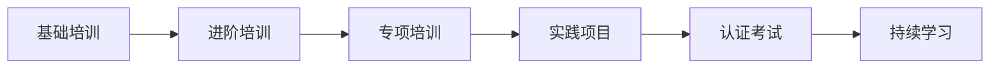
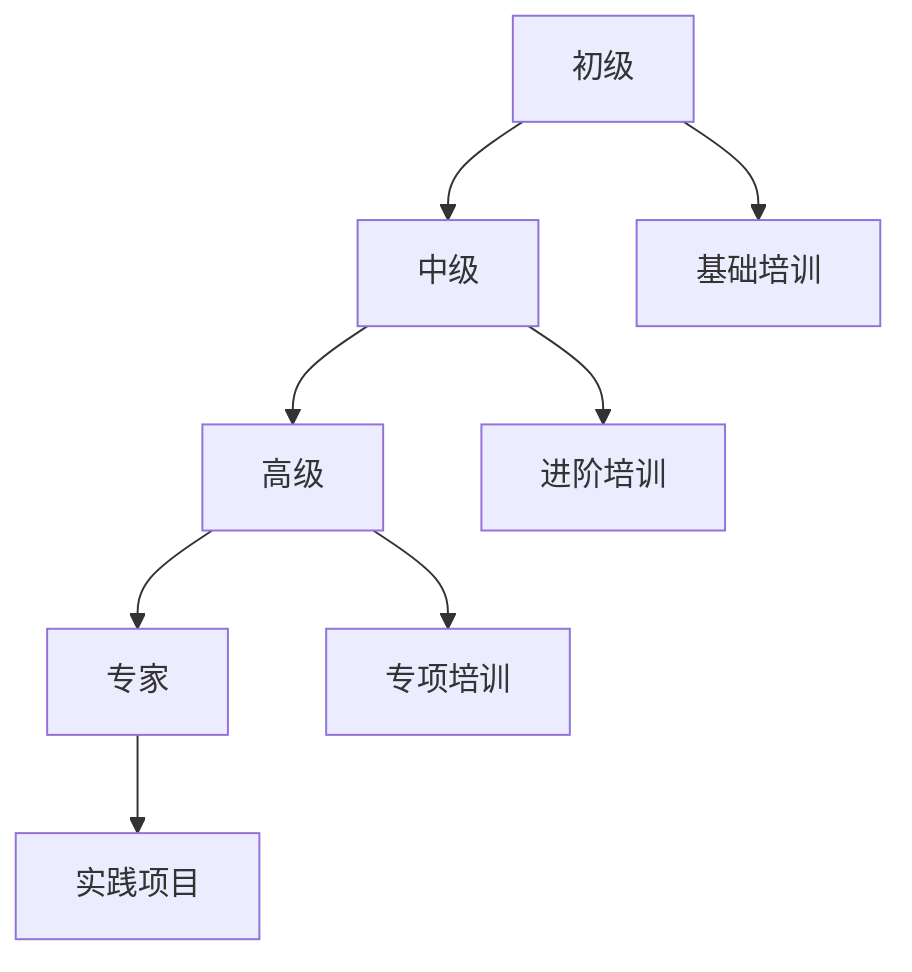

# 团队能力建设

> **文档编号**: AI-07-06
> **最后更新**: 2025年1月
> **主题**: 07-实施路径
> **子主题**: 06-团队能力建设

## 📑 目录

- [团队能力建设](#团队能力建设)
  - [📑 目录](#-目录)
  - [1. 团队能力建设概述](#1-团队能力建设概述)
  - [2. 核心技能要求](#2-核心技能要求)
    - [2.1 核心技能要求](#21-核心技能要求)
    - [2.2 角色分工](#22-角色分工)
    - [2.3 技能矩阵](#23-技能矩阵)
  - [3. 培训计划](#3-培训计划)
    - [3.1 基础培训](#31-基础培训)
    - [3.2 进阶培训](#32-进阶培训)
    - [3.3 专项培训](#33-专项培训)
  - [4. 学习资源](#4-学习资源)
    - [4.1 官方文档](#41-官方文档)
    - [4.2 教程资源](#42-教程资源)
    - [4.3 实践项目](#43-实践项目)
  - [5. 技能评估与认证](#5-技能评估与认证)
    - [5.1 技能评估](#51-技能评估)
    - [5.2 认证考试](#52-认证考试)
    - [5.3 持续学习](#53-持续学习)
  - [6. 培训实施](#6-培训实施)
    - [6.1 培训计划](#61-培训计划)
    - [6.2 培训方式](#62-培训方式)

---

## 1. 团队能力建设概述

**能力建设目标**：

- ✅ 掌握PostgreSQL 18核心功能
- ✅ 熟练使用pgvector、pg_ai、PostgresML
- ✅ 具备AI应用开发能力
- ✅ 具备性能优化和故障诊断能力

**能力建设路径**：

---

## 2. 核心技能要求

### 2.1 核心技能要求

**PostgreSQL基础技能**：

| 技能 | 级别 | 说明 |
|------|------|------|
| **SQL查询** | 高级 | 复杂查询、窗口函数、CTE |
| **索引优化** | 高级 | B-tree、GIN、BRIN索引 |
| **性能调优** | 高级 | EXPLAIN (ANALYZE, BUFFERS, TIMING)、查询优化 |
| **高可用** | 中级 | 主从复制、故障转移 |
| **备份恢复** | 中级 | pg_dump、PITR |

**AI/ML技能**：

| 技能 | 级别 | 说明 |
|------|------|------|
| **向量搜索** | 高级 | pgvector、HNSW、IVFFlat |
| **AI集成** | 中级 | pg_ai、LLM调用 |
| **机器学习** | 中级 | PostgresML、模型训练 |
| **RAG系统** | 中级 | 检索增强生成 |

**DevOps技能**：

| 技能 | 级别 | 说明 |
|------|------|------|
| **Docker** | 中级 | 容器化部署 |
| **Kubernetes** | 中级 | K8s部署和管理 |
| **监控告警** | 中级 | Prometheus、Grafana |
| **CI/CD** | 中级 | 自动化部署 |

### 2.2 角色分工

**数据库管理员（DBA）**：

**职责**：

- PostgreSQL安装、配置、维护
- 性能监控和优化
- 备份恢复
- 安全配置

**技能要求**：

- PostgreSQL高级技能
- 性能调优经验
- 故障诊断能力

**数据库开发工程师**：

**职责**：

- 数据库设计
- SQL开发
- 存储过程和函数
- 数据迁移

**技能要求**：

- SQL高级技能
- 数据库设计经验
- 编程能力（PL/pgSQL、Python）

**AI工程师**：

**职责**：

- AI模型集成
- 向量搜索优化
- RAG系统开发
- AI Agent开发

**技能要求**：

- AI/ML基础知识
- pgvector、pg_ai使用经验
- Python编程能力

**DevOps工程师**：

**职责**：

- 容器化部署
- Kubernetes管理
- 监控告警
- CI/CD

**技能要求**：

- Docker、Kubernetes经验
- 监控工具使用
- 自动化脚本编写

### 2.3 技能矩阵

**技能评估矩阵**：

| 技能 | 初级 | 中级 | 高级 | 专家 |
|------|------|------|------|------|
| **PostgreSQL基础** | ✅ | ✅ | ✅ | ✅ |
| **SQL查询** | ✅ | ✅ | ✅ | ✅ |
| **索引优化** | ✅ | ✅ | ✅ | ✅ |
| **性能调优** | ✅ | ✅ | ✅ | ✅ |
| **pgvector** | ✅ | ✅ | ✅ | ✅ |
| **pg_ai** | ✅ | ✅ | ✅ | ✅ |
| **PostgresML** | ✅ | ✅ | ✅ | ✅ |
| **RAG系统** | ✅ | ✅ | ✅ | ✅ |
| **Docker** | ✅ | ✅ | ✅ | ✅ |
| **Kubernetes** | ✅ | ✅ | ✅ | ✅ |

**技能提升路径**：

---

## 3. 培训计划

### 3.1 基础培训

**PostgreSQL基础培训**（2周）

**Week 1：SQL基础**

- SQL查询语法
- 数据类型
- 表操作
- 索引基础

**Week 2：PostgreSQL特性**

- 窗口函数
- CTE（公共表表达式）
- JSON/JSONB操作
- 全文搜索

**培训资源**：

- PostgreSQL官方文档
- 在线教程
- 实践练习

**pgvector基础培训**（1周）

**Day 1-2：向量基础**

- 向量数据类型
- 相似度计算
- 基础查询

**Day 3-4：索引**

- HNSW索引
- IVFFlat索引
- 索引参数调优

**Day 5：实践项目**

- 构建向量搜索系统

### 3.2 进阶培训

**性能优化培训**（1周）

**Day 1-2：查询优化**

- EXPLAIN (ANALYZE, BUFFERS, TIMING)
- 查询计划分析
- 索引优化

**Day 3-4：系统优化**

- PostgreSQL 18异步I/O
- 内存配置
- 并发优化

**Day 5：实践项目**

- 性能调优实战

**AI集成培训**（1周）

**Day 1-2：pg_ai**

- pg_ai扩展使用
- Vectorizer配置
- LLM调用

**Day 3-4：PostgresML**

- 模型训练
- 实时推理
- 模型管理

**Day 5：实践项目**

- RAG系统开发

### 3.3 专项培训

**RAG系统开发**（2周）

**Week 1：理论基础**

- RAG架构
- 向量检索
- 上下文管理

**Week 2：实践开发**

- 构建RAG系统
- 性能优化
- 测试部署

**AI Agent开发**（2周）

**Week 1：Agent基础**

- Agent架构
- 记忆管理
- 工具调用

**Week 2：MCP集成**

- MCP Server开发
- Agent部署
- 测试验证

---

## 4. 学习资源

### 4.1 官方文档

**PostgreSQL官方文档**：

- [PostgreSQL 18官方文档](https://www.postgresql.org/docs/18/)
- [pgvector文档](https://github.com/pgvector/pgvector)
- [pg_ai文档](https://github.com/cloudquery/pg_ai)
- [PostgresML文档](https://postgresml.org/)

**推荐阅读顺序**：

1. PostgreSQL基础教程
2. pgvector使用指南
3. pg_ai集成指南
4. PostgresML教程

### 4.2 教程资源

**在线课程**：

- PostgreSQL官方培训
- Udemy PostgreSQL课程
- Coursera数据库课程

**视频教程**：

- YouTube PostgreSQL频道
- 技术会议录像
- 在线研讨会

**书籍推荐**：

- 《PostgreSQL即学即用》
- 《高性能PostgreSQL实战》
- 《PostgreSQL数据库内核分析》

### 4.3 实践项目

**项目1：向量搜索系统**

**目标**：构建一个文档向量搜索系统

**要求**：

- 使用pgvector存储向量
- 实现相似度搜索
- 优化查询性能

**项目2：RAG系统**

**目标**：构建一个RAG问答系统

**要求**：

- 使用pg_ai Vectorizer
- 实现文档检索
- 集成LLM生成答案

**项目3：AI Agent**

**目标**：构建一个AI Agent应用

**要求**：

- Agent记忆管理
- 工具调用
- MCP Server集成

---

## 5. 技能评估与认证

### 5.1 技能评估

**评估方式**：

1. **理论测试**：
   - PostgreSQL基础
   - SQL查询
   - 性能优化

2. **实践测试**：
   - 数据库设计
   - 查询优化
   - 故障诊断

3. **项目评估**：
   - 完成实际项目
   - 代码审查
   - 性能测试

**评估标准**：

| 级别 | 理论测试 | 实践测试 | 项目评估 |
|------|---------|---------|---------|
| **初级** | 60% | 60% | 完成基础项目 |
| **中级** | 75% | 75% | 完成进阶项目 |
| **高级** | 85% | 85% | 完成复杂项目 |
| **专家** | 95% | 95% | 完成企业级项目 |

### 5.2 认证考试

**PostgreSQL认证**：

1. **PostgreSQL Professional Certification**：
   - 官方认证
   - 全球认可
   - 持续更新

2. **AWS Certified Database**：
   - AWS RDS PostgreSQL
   - 云数据库管理

3. **Google Cloud Database Certification**：
   - Cloud SQL PostgreSQL
   - 云数据库管理

**认证路径**：

### 5.3 持续学习

**学习计划**：

1. **每周学习**：
   - 阅读技术博客
   - 观看技术视频
   - 参与技术讨论

2. **每月学习**：
   - 参加技术会议
   - 完成在线课程
   - 阅读技术书籍

3. **每季度学习**：
   - 参加培训课程
   - 获得认证
   - 完成项目

**学习资源更新**：

- ✅ 关注PostgreSQL官方博客
- ✅ 订阅技术 newsletter
- ✅ 参与开源项目
- ✅ 参加技术社区活动

---

## 6. 培训实施

### 6.1 培训计划

**第一阶段：基础培训**（4周）

| 周 | 内容 | 交付物 |
|----|------|--------|
| 第1周 | PostgreSQL基础 | 基础测试通过 |
| 第2周 | SQL高级特性 | SQL测试通过 |
| 第3周 | pgvector基础 | 向量搜索项目 |
| 第4周 | 性能优化基础 | 优化测试通过 |

**第二阶段：进阶培训**（4周）

| 周 | 内容 | 交付物 |
|----|------|--------|
| 第1周 | 性能优化进阶 | 性能调优项目 |
| 第2周 | pg_ai集成 | AI集成项目 |
| 第3周 | PostgresML | ML项目 |
| 第4周 | RAG系统开发 | RAG项目 |

**第三阶段：专项培训**（4周）

| 周 | 内容 | 交付物 |
|----|------|--------|
| 第1-2周 | AI Agent开发 | Agent项目 |
| 第3-4周 | 生产部署 | 部署项目 |

### 6.2 培训方式

**线上培训**：

- 视频课程
- 在线直播
- 互动讨论

**线下培训**：

- 集中培训
- 实践操作
- 面对面交流

**混合培训**：

- 线上理论学习
- 线下实践操作
- 灵活安排

---

**最后更新**: 2025年1月
**维护者**: PostgreSQL Modern Team
**文档编号**: AI-07-06
