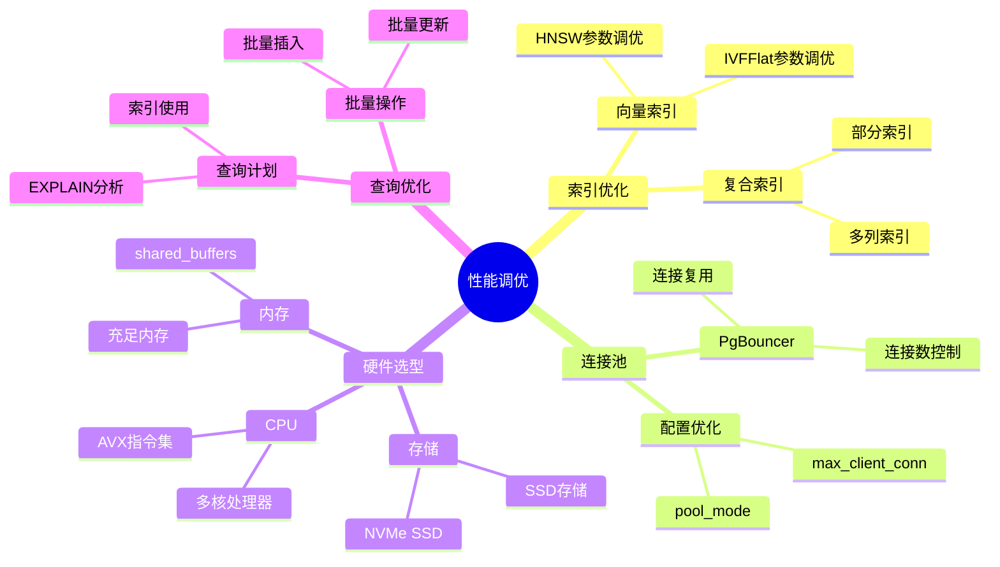

---

> **📋 文档来源**: `PostgreSQL_AI\07-实施路径\性能调优黄金法则.md`
> **📅 复制日期**: 2025-12-22
> **⚠️ 注意**: 本文档为复制版本，原文件保持不变

---

# 性能调优黄金法则

> **文档编号**: AI-07-02
> **最后更新**: 2025年1月
> **主题**: 07-实施路径
> **子主题**: 02-性能调优黄金法则

## 📑 目录

- [性能调优黄金法则](#性能调优黄金法则)
  - [📑 目录](#-目录)
  - [一、概述](#一概述)
    - [1.1 性能调优思维导图](#11-性能调优思维导图)
  - [二、调优原则](#二调优原则)
    - [2.1 测量优先](#21-测量优先)
    - [2.2 瓶颈识别](#22-瓶颈识别)
    - [2.3 渐进优化](#23-渐进优化)
  - [三、向量查询优化](#三向量查询优化)
    - [3.1 索引参数调优](#31-索引参数调优)
    - [3.2 查询参数优化](#32-查询参数优化)
    - [3.3 混合查询优化](#33-混合查询优化)
  - [四、SQL查询优化](#四sql查询优化)
    - [4.1 查询计划分析](#41-查询计划分析)
    - [4.2 索引使用优化](#42-索引使用优化)
    - [4.3 连接优化](#43-连接优化)
  - [五、系统参数优化](#五系统参数优化)
    - [5.1 内存参数](#51-内存参数)
    - [5.2 并发参数](#52-并发参数)
    - [5.3 向量专用参数](#53-向量专用参数)
  - [六、硬件优化](#六硬件优化)
    - [6.1 CPU优化](#61-cpu优化)
    - [6.2 内存优化](#62-内存优化)
    - [6.3 存储优化](#63-存储优化)
  - [七、监控与诊断](#七监控与诊断)
    - [7.1 性能监控](#71-性能监控)
    - [7.2 瓶颈诊断](#72-瓶颈诊断)
    - [7.3 持续优化](#73-持续优化)
  - [八、最佳实践](#八最佳实践)
  - [九、关联主题](#九关联主题)
  - [十、对标资源](#十对标资源)
    - [技术文档](#技术文档)
    - [基准测试](#基准测试)

## 一、概述

PostgreSQL AI应用的性能调优黄金法则，提供系统化的优化方法和最佳实践，确保AI应用在高并发、大规模数据场景下的最佳性能。

### 1.1 性能调优思维导图



## 二、调优原则

### 2.1 测量优先

**原则**: 先测量，后优化

```sql
-- 启用性能监控
CREATE EXTENSION pg_stat_statements;

-- 查看慢查询
SELECT
    query,
    calls,
    mean_exec_time,
    max_exec_time,
    total_exec_time
FROM pg_stat_statements
WHERE mean_exec_time > 100  -- 超过100ms
ORDER BY total_exec_time DESC
LIMIT 10;
```

### 2.2 瓶颈识别

**原则**: 识别真正的瓶颈

```sql
-- 检查等待事件
SELECT
    wait_event_type,
    wait_event,
    COUNT(*) AS count
FROM pg_stat_activity
WHERE wait_event IS NOT NULL
GROUP BY wait_event_type, wait_event
ORDER BY count DESC;

-- 检查I/O瓶颈
SELECT
    schemaname,
    tablename,
    heap_blks_read,
    heap_blks_hit,
    ROUND(100.0 * heap_blks_hit / NULLIF(heap_blks_read + heap_blks_hit, 0), 2) AS hit_ratio
FROM pg_statio_user_tables
ORDER BY heap_blks_read DESC;
```

### 2.3 渐进优化

**原则**: 逐步优化，验证效果

1. 基线测量
2. 识别瓶颈
3. 应用优化
4. 验证效果
5. 重复迭代

## 三、向量查询优化

### 3.1 索引参数调优

```sql
-- 小规模数据（<100万向量）
CREATE INDEX ON documents
USING hnsw (embedding vector_cosine_ops)
WITH (
    m = 16,              -- 每个节点连接数
    ef_construction = 100  -- 构建时搜索宽度
);

-- 大规模数据（>100万向量）
CREATE INDEX ON documents
USING hnsw (embedding vector_cosine_ops)
WITH (
    m = 32,              -- 增加连接数提升召回率
    ef_construction = 200  -- 增加构建宽度提升质量
);

-- 查询时优化
SET hnsw.ef_search = 200;  -- 提升召回率（默认40）
```

### 3.2 查询参数优化

```sql
-- 优化查询顺序
-- 先过滤条件，再向量搜索
SELECT * FROM (
    SELECT * FROM products
    WHERE category = 'electronics'
      AND price < 1000
) filtered
WHERE embedding <=> query_vector < 0.8
ORDER BY embedding <=> query_vector
LIMIT 20;

-- 使用LIMIT减少计算
-- 向量距离计算成本高，尽早使用LIMIT
SELECT * FROM documents
WHERE embedding <=> query_vector < 0.8
ORDER BY embedding <=> query_vector
LIMIT 10;  -- 尽早限制结果集
```

### 3.3 混合查询优化

```sql
-- 使用物化视图预计算
CREATE MATERIALIZED VIEW product_search_cache AS
SELECT
    p.id,
    p.title,
    p.category,
    p.price,
    p.embedding <=> query_vector AS distance
FROM products p
CROSS JOIN (SELECT ai.embedding('text-embedding-3-small', 'electronics') AS query_vector) q
WHERE p.category = 'electronics'
ORDER BY p.embedding <=> q.query_vector
LIMIT 100;

-- 定期刷新
REFRESH MATERIALIZED VIEW CONCURRENTLY product_search_cache;
```

## 四、SQL查询优化

### 4.1 查询计划分析

```sql
-- 分析查询计划
EXPLAIN (ANALYZE, BUFFERS, VERBOSE)
SELECT * FROM documents
WHERE category = 'technology'
  AND embedding <=> query_vector < 0.8
ORDER BY embedding <=> query_vector
LIMIT 20;

-- 关键指标：
-- - Seq Scan vs Index Scan
-- - 过滤条件顺序
-- - 连接方式
-- - 缓冲区使用
```

### 4.2 索引使用优化

```sql
-- 创建复合索引
CREATE INDEX ON products
USING btree (category, price, (embedding <=> query_vector))
INCLUDE (title, description);

-- 使用部分索引
CREATE INDEX ON documents
USING hnsw (embedding vector_cosine_ops)
WHERE status = 'active'
  AND created_at > NOW() - INTERVAL '1 year';

-- 检查索引使用情况
SELECT
    schemaname,
    tablename,
    indexname,
    idx_scan,
    idx_tup_read
FROM pg_stat_user_indexes
WHERE schemaname = 'public'
ORDER BY idx_scan DESC;
```

### 4.3 连接优化

```sql
-- 优化JOIN顺序
-- 小表在前，大表在后
SELECT * FROM small_table s
JOIN large_table l ON s.id = l.small_id;

-- 使用INNER JOIN替代WHERE子句
-- 优化前
SELECT * FROM a, b WHERE a.id = b.id;

-- 优化后
SELECT * FROM a INNER JOIN b ON a.id = b.id;
```

## 五、系统参数优化

### 5.1 内存参数

```sql
-- postgresql.conf优化
shared_buffers = 25% of RAM          # 共享缓冲区
effective_cache_size = 75% of RAM    # 有效缓存大小
work_mem = 256MB                    # 工作内存（每个操作）
maintenance_work_mem = 1GB          # 维护操作内存

-- 向量查询专用
-- 大规模向量查询需要更多内存
SET work_mem = '512MB';
```

### 5.2 并发参数

```sql
-- 并发配置
max_connections = 200
max_worker_processes = 16
max_parallel_workers_per_gather = 4
max_parallel_workers = 8

-- 向量查询并行
SET max_parallel_workers_per_gather = 4;
```

### 5.3 向量专用参数

```sql
-- HNSW查询参数
SET hnsw.ef_search = 200;  -- 提升召回率（默认40）

-- IVFFlat查询参数
SET ivfflat.probes = 10;  -- 搜索聚类数（默认1）

-- 向量距离计算
-- 使用余弦相似度（默认）
-- 使用欧氏距离：<-> 操作符
-- 使用内积：<#> 操作符
```

## 六、硬件优化

### 6.1 CPU优化

| 场景 | CPU核心数 | 推荐配置 |
|------|:---------:|:--------|
| OLTP+向量 | 16+ | Intel Xeon / AMD EPYC |
| 纯向量检索 | 8+ | Intel Xeon |
| AI训练 | 32+ | Intel Xeon / NVIDIA GPU |

### 6.2 内存优化

```sql
-- 内存配置建议
-- 向量数据需要大量内存
-- 建议：至少32GB RAM（中等规模）
-- 大规模场景：128GB+

-- 监控内存使用
SELECT
    setting,
    unit,
    source
FROM pg_settings
WHERE name IN ('shared_buffers', 'work_mem', 'effective_cache_size');
```

### 6.3 存储优化

| 场景 | 存储类型 | IOPS要求 |
|------|:--------:|:--------|
| 向量数据 | NVMe SSD | 10,000+ |
| 日志文件 | SSD | 5,000+ |
| 备份 | 对象存储 | - |

## 七、监控与诊断

### 7.1 性能监控

```sql
-- 启用pg_stat_statements
CREATE EXTENSION pg_stat_statements;

-- 查看慢查询
SELECT
    query,
    calls,
    mean_exec_time,
    max_exec_time,
    total_exec_time
FROM pg_stat_statements
WHERE mean_exec_time > 100
ORDER BY total_exec_time DESC
LIMIT 10;

-- 向量查询性能
SELECT
    query,
    calls,
    mean_exec_time
FROM pg_stat_statements
WHERE query LIKE '%<=>%'  -- 向量相似度查询
ORDER BY mean_exec_time DESC;
```

### 7.2 瓶颈诊断

```sql
-- 检查等待事件
SELECT
    wait_event_type,
    wait_event,
    COUNT(*) AS count
FROM pg_stat_activity
WHERE wait_event IS NOT NULL
GROUP BY wait_event_type, wait_event
ORDER BY count DESC;

-- 检查I/O瓶颈
SELECT
    schemaname,
    tablename,
    heap_blks_read,
    heap_blks_hit,
    ROUND(100.0 * heap_blks_hit / NULLIF(heap_blks_read + heap_blks_hit, 0), 2) AS hit_ratio
FROM pg_statio_user_tables
WHERE heap_blks_read > 1000
ORDER BY heap_blks_read DESC;
```

### 7.3 持续优化

```sql
-- 定期分析表统计信息
ANALYZE documents;

-- 更新特定列统计信息
ALTER TABLE documents
ALTER COLUMN embedding SET STATISTICS 1000;

ANALYZE documents (embedding);

-- 监控索引使用
SELECT
    schemaname,
    tablename,
    indexname,
    idx_scan,
    idx_tup_read
FROM pg_stat_user_indexes
WHERE idx_scan = 0  -- 未使用的索引
ORDER BY pg_relation_size(indexrelid) DESC;
```

## 八、最佳实践

1. **测量优先**:
   - 先测量性能基线
   - 识别真正的瓶颈
   - 验证优化效果

2. **索引策略**:
   - 小规模数据使用IVFFlat
   - 大规模数据使用HNSW
   - 合理设置索引参数

3. **查询优化**:
   - 先过滤条件，再向量搜索
   - 使用LIMIT减少计算
   - 合理使用物化视图

4. **系统调优**:
   - 根据硬件配置参数
   - 监控资源使用情况
   - 持续优化调整

5. **硬件选型**:
   - 优先考虑内存容量
   - 使用NVMe SSD存储
   - 根据场景选择CPU

## 九、关联主题

- [性能优化技术](../03-核心能力/性能优化技术.md) - 详细优化技术
- [混合查询能力](../03-核心能力/混合查询能力.md) - 混合查询优化
- [渐进式演进路线](./渐进式演进路线.md) - 实施路径

## 十、对标资源

### 技术文档

- [PostgreSQL性能调优指南](https://www.postgresql.org/docs/current/performance-tips.html)
- [pgvector性能优化](https://github.com/pgvector/pgvector#performance)

### 基准测试

- [TPC Benchmarks](http://www.tpc.org/)
- [pgvector基准测试](https://github.com/pgvector/pgvector/tree/master/bench)

---

**最后更新**: 2025年1月
**维护者**: PostgreSQL Modern Team
**文档编号**: AI-07-02
