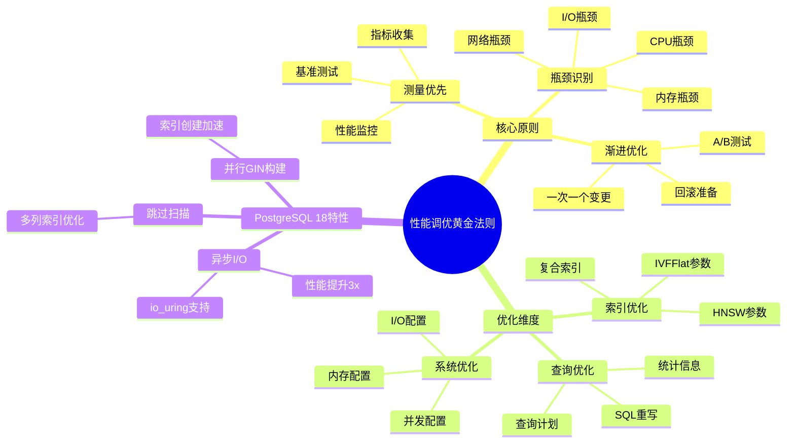
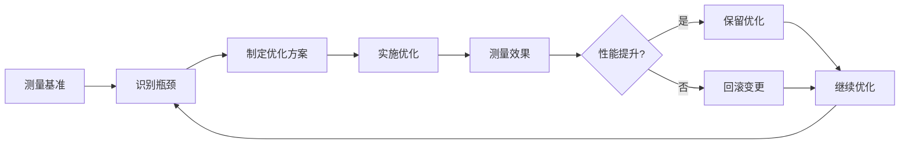
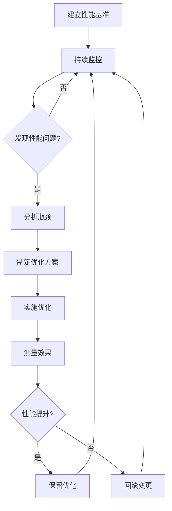

# 性能调优黄金法则

> **文档编号**: AI-07-02
> **最后更新**: 2025年1月
> **主题**: 07-实施路径
> **子主题**: 02-性能调优黄金法则

## 📑 目录

- [性能调优黄金法则](#性能调优黄金法则)
  - [📑 目录](#-目录)
  - [1. 性能调优概述](#1-性能调优概述)
    - [1.1 性能调优思维导图](#11-性能调优思维导图)
  - [2. 核心原则](#2-核心原则)
    - [2.1 测量优先](#21-测量优先)
    - [2.2 瓶颈识别](#22-瓶颈识别)
    - [2.3 渐进优化](#23-渐进优化)
  - [3. 索引优化](#3-索引优化)
    - [3.1 索引参数调优](#31-索引参数调优)
    - [3.2 查询参数优化](#32-查询参数优化)
    - [3.3 混合查询优化](#33-混合查询优化)
  - [4. 查询优化](#4-查询优化)
    - [4.1 查询计划分析](#41-查询计划分析)
    - [4.2 索引使用优化](#42-索引使用优化)
    - [4.3 连接优化](#43-连接优化)
  - [5. 系统参数优化](#5-系统参数优化)
    - [5.1 内存参数](#51-内存参数)
    - [5.2 并发参数](#52-并发参数)
    - [5.3 向量专用参数](#53-向量专用参数)
  - [6. 硬件优化](#6-硬件优化)
    - [6.1 CPU优化](#61-cpu优化)
    - [6.2 内存优化](#62-内存优化)
    - [6.3 存储优化](#63-存储优化)
  - [7. 监控与诊断](#7-监控与诊断)
    - [7.1 性能监控](#71-性能监控)
    - [7.2 瓶颈诊断](#72-瓶颈诊断)
    - [7.3 持续优化](#73-持续优化)

---

## 1. 性能调优概述

### 1.1 性能调优思维导图



---

## 2. 核心原则

### 2.1 测量优先

**黄金法则**：**永远先测量，再优化**

**性能基准测试**：

```sql
-- 1. 创建测试表
CREATE TABLE performance_test (
    id SERIAL PRIMARY KEY,
    content TEXT,
    embedding vector(1536)
);

-- 2. 插入测试数据
INSERT INTO performance_test (content, embedding)
SELECT
    'Test content ' || generate_series(1, 100000),
    (SELECT array_agg(random())::vector(1536) FROM generate_series(1, 1536))
FROM generate_series(1, 100000);

-- 3. 基准测试查询
\timing on
EXPLAIN (ANALYZE, BUFFERS, VERBOSE)
SELECT id, content, embedding <=> query_vec AS distance
FROM performance_test
ORDER BY embedding <=> query_vec
LIMIT 10;
```

**关键性能指标**：

```sql
-- 1. 查询执行时间
SELECT
    query,
    calls,
    total_exec_time,
    mean_exec_time,
    max_exec_time
FROM pg_stat_statements
ORDER BY total_exec_time DESC
LIMIT 10;

-- 2. 索引使用情况
SELECT
    schemaname,
    tablename,
    indexname,
    idx_scan,
    idx_tup_read,
    idx_tup_fetch
FROM pg_stat_user_indexes
ORDER BY idx_scan DESC;

-- 3. 表访问统计
SELECT
    schemaname,
    tablename,
    seq_scan,
    seq_tup_read,
    idx_scan,
    idx_tup_fetch,
    n_tup_ins,
    n_tup_upd,
    n_tup_del
FROM pg_stat_user_tables
ORDER BY seq_scan DESC;
```

### 2.2 瓶颈识别

**常见瓶颈类型**：

| 瓶颈类型 | 症状 | 诊断方法 |
|---------|------|---------|
| **CPU瓶颈** | CPU使用率>80% | `top`, `htop`, `pg_stat_activity` |
| **内存瓶颈** | 频繁swap | `free -h`, `vmstat` |
| **I/O瓶颈** | 磁盘I/O等待高 | `iostat`, `iotop` |
| **网络瓶颈** | 网络延迟高 | `ping`, `traceroute` |
| **锁竞争** | 大量等待锁 | `pg_locks`, `pg_stat_activity` |

**瓶颈诊断SQL**：

```sql
-- 1. 识别慢查询
SELECT
    pid,
    now() - pg_stat_activity.query_start AS duration,
    query,
    state
FROM pg_stat_activity
WHERE (now() - pg_stat_activity.query_start) > interval '5 minutes'
ORDER BY duration DESC;

-- 2. 锁等待分析
SELECT
    blocked_locks.pid AS blocked_pid,
    blocking_locks.pid AS blocking_pid,
    blocked_activity.query AS blocked_query,
    blocking_activity.query AS blocking_query
FROM pg_catalog.pg_locks blocked_locks
JOIN pg_catalog.pg_stat_activity blocked_activity ON blocked_activity.pid = blocked_locks.pid
JOIN pg_catalog.pg_locks blocking_locks ON blocking_locks.locktype = blocked_locks.locktype
JOIN pg_catalog.pg_stat_activity blocking_activity ON blocking_activity.pid = blocking_locks.pid
WHERE NOT blocked_locks.granted;

-- 3. I/O统计
SELECT
    datname,
    blks_read,
    blks_hit,
    round(100.0 * blks_hit / (blks_hit + blks_read), 2) AS cache_hit_ratio
FROM pg_stat_database
WHERE blks_read > 0;
```

### 2.3 渐进优化

**优化流程**：



**优化检查清单**：

1. ✅ **建立基准**：记录优化前的性能指标
2. ✅ **一次一个变更**：避免同时进行多个优化
3. ✅ **A/B测试**：对比优化前后的效果
4. ✅ **准备回滚**：确保可以快速回滚
5. ✅ **文档记录**：记录优化过程和效果

---

## 3. 索引优化

### 3.1 索引参数调优

**HNSW索引参数优化**：

```sql
-- 1. 基础HNSW索引
CREATE INDEX ON documents
USING hnsw(embedding vector_cosine_ops)
WITH (m = 16, ef_construction = 64);

-- 2. 高性能HNSW索引（查询优先）
CREATE INDEX ON documents
USING hnsw(embedding vector_cosine_ops)
WITH (m = 32, ef_construction = 128);

-- 3. 快速构建HNSW索引（构建优先）
CREATE INDEX ON documents
USING hnsw(embedding vector_cosine_ops)
WITH (m = 16, ef_construction = 32);

-- 4. 查询时调整ef_search
SET hnsw.ef_search = 100;  -- 默认40，提高召回率
```

**参数选择指南**：

| 参数 | 默认值 | 推荐范围 | 说明 |
|------|--------|---------|------|
| **m** | 16 | 16-64 | 每个节点的连接数，越大索引越大但查询更快 |
| **ef_construction** | 64 | 32-200 | 构建时的候选数，越大构建越慢但质量更高 |
| **ef_search** | 40 | 40-200 | 查询时的候选数，越大查询越慢但召回率更高 |

**IVFFlat索引参数优化**：

```sql
-- 1. 基础IVFFlat索引
CREATE INDEX ON documents
USING ivfflat(embedding vector_cosine_ops)
WITH (lists = 100);

-- 2. 优化lists参数
-- lists = sqrt(rows) / 1000 (推荐)
-- 例如：100万行 -> lists = 1000
CREATE INDEX ON documents
USING ivfflat(embedding vector_cosine_ops)
WITH (lists = 1000);
```

### 3.2 查询参数优化

**向量查询优化**：

```sql
-- 1. 使用LIMIT减少计算量
SELECT id, content, embedding <=> query_vec AS distance
FROM documents
ORDER BY embedding <=> query_vec
LIMIT 10;  -- 只返回Top 10

-- 2. 使用阈值过滤
SELECT id, content, embedding <=> query_vec AS distance
FROM documents
WHERE embedding <=> query_vec < 0.3  -- 提前过滤
ORDER BY embedding <=> query_vec
LIMIT 10;

-- 3. 调整ef_search参数
SET LOCAL hnsw.ef_search = 100;
SELECT id, content, embedding <=> query_vec AS distance
FROM documents
ORDER BY embedding <=> query_vec
LIMIT 10;
```

**PostgreSQL 18跳过扫描优化**：

```sql
-- 多列索引跳过扫描（PostgreSQL 18新特性）
CREATE INDEX idx_multi ON documents (category_id, status, embedding vector_cosine_ops);

-- 即使省略category_id，仍可使用索引
SELECT id, content
FROM documents
WHERE status = 'active'
ORDER BY embedding <=> query_vec
LIMIT 10;
```

### 3.3 混合查询优化

**向量+SQL过滤优化**：

```sql
-- 1. 先SQL过滤，再向量搜索（推荐）
WITH filtered AS (
    SELECT id, content, embedding
    FROM documents
    WHERE category_id = 1
      AND status = 'active'
      AND created_at > NOW() - INTERVAL '30 days'
    LIMIT 10000  -- 限制候选集
)
SELECT id, content, embedding <=> query_vec AS distance
FROM filtered
ORDER BY embedding <=> query_vec
LIMIT 10;

-- 2. 使用复合索引
CREATE INDEX ON documents (category_id, status, created_at, embedding vector_cosine_ops);
```

**向量+全文搜索优化**：

```sql
-- 1. 分别查询，然后融合
WITH vector_results AS (
    SELECT id, 1 - (embedding <=> query_vec) AS vector_score
    FROM documents
    WHERE embedding <=> query_vec < 0.3
    ORDER BY embedding <=> query_vec
    LIMIT 20
),
text_results AS (
    SELECT id, ts_rank(to_tsvector('english', content), query) AS text_score
    FROM documents
    WHERE to_tsvector('english', content) @@ query
    ORDER BY text_score DESC
    LIMIT 20
)
SELECT
    COALESCE(v.id, t.id) AS id,
    COALESCE(v.vector_score, 0) * 0.7 + COALESCE(t.text_score, 0) * 0.3 AS combined_score
FROM vector_results v
FULL OUTER JOIN text_results t ON v.id = t.id
ORDER BY combined_score DESC
LIMIT 10;
```

---

## 4. 查询优化

### 4.1 查询计划分析

**EXPLAIN (ANALYZE, BUFFERS, TIMING)详解**：

```sql
-- 1. 基础查询计划
EXPLAIN SELECT * FROM documents WHERE embedding <=> query_vec < 0.3 LIMIT 10;

-- 2. 详细查询计划（推荐）
EXPLAIN (ANALYZE, BUFFERS, VERBOSE, COSTS, TIMING)
SELECT id, content, embedding <=> query_vec AS distance
FROM documents
ORDER BY embedding <=> query_vec
LIMIT 10;

-- 3. JSON格式查询计划（便于分析）
EXPLAIN (ANALYZE, BUFFERS, FORMAT JSON)
SELECT * FROM documents WHERE embedding <=> query_vec < 0.3 LIMIT 10;
```

**查询计划关键指标**：

| 指标 | 说明 | 优化目标 |
|------|------|---------|
| **Execution Time** | 执行时间 | <100ms |
| **Planning Time** | 计划时间 | <10ms |
| **Buffers: shared hit** | 缓存命中 | >90% |
| **Buffers: shared read** | 磁盘读取 | 最小化 |
| **Rows Removed by Filter** | 过滤行数 | 最小化 |

### 4.2 索引使用优化

**强制使用索引**：

```sql
-- 1. 检查索引使用情况
EXPLAIN (ANALYZE, BUFFERS)
SELECT * FROM documents WHERE embedding <=> query_vec < 0.3 LIMIT 10;

-- 2. 如果未使用索引，检查原因
SELECT
    schemaname,
    tablename,
    indexname,
    idx_scan,
    idx_tup_read
FROM pg_stat_user_indexes
WHERE tablename = 'documents';

-- 3. 更新统计信息
ANALYZE documents;

-- 4. 如果仍不使用索引，检查查询条件
-- 确保查询条件与索引匹配
```

**部分索引优化**：

```sql
-- 1. 只对活跃数据创建索引
CREATE INDEX ON documents
USING hnsw(embedding vector_cosine_ops)
WHERE status = 'active' AND created_at > NOW() - INTERVAL '30 days';

-- 2. 减少索引大小，提升查询性能
```

### 4.3 连接优化

**连接池配置（PgBouncer）**：

```ini
# pgbouncer.ini
[databases]
ai_db = host=localhost port=5432 dbname=ai_db

[pgbouncer]
pool_mode = transaction  # 事务级连接池
max_client_conn = 1000
default_pool_size = 25
reserve_pool_size = 5
```

**连接数优化**：

```sql
-- 1. 检查连接数
SELECT count(*) FROM pg_stat_activity;

-- 2. 检查连接数按状态
SELECT state, count(*)
FROM pg_stat_activity
GROUP BY state;

-- 3. 限制连接数
ALTER SYSTEM SET max_connections = 200;
SELECT pg_reload_conf();
```

---

## 5. 系统参数优化

### 5.1 内存参数

**PostgreSQL 18内存配置**：

```conf
# postgresql.conf

# 共享内存（25% of RAM）
shared_buffers = 8GB

# 有效缓存大小（75% of RAM）
effective_cache_size = 24GB

# 工作内存（用于排序和哈希）
work_mem = 64MB

# 维护工作内存（用于VACUUM等）
maintenance_work_mem = 1GB

# WAL缓冲区（PostgreSQL 18优化）
wal_buffers = 16MB
```

**内存参数计算**：

```bash
# 1. 获取系统内存
free -h

# 2. 计算推荐配置
# shared_buffers = RAM * 0.25
# effective_cache_size = RAM * 0.75
# work_mem = (RAM - shared_buffers) / (max_connections * 2)
```

### 5.2 并发参数

**并发配置**：

```conf
# postgresql.conf

# 最大连接数
max_connections = 200

# 并行工作进程
max_parallel_workers_per_gather = 4
max_parallel_workers = 8
max_parallel_maintenance_workers = 4  # PostgreSQL 18：支持GIN并行构建

# 并行查询阈值
parallel_tuple_cost = 0.1
parallel_setup_cost = 1000.0
min_parallel_table_scan_size = 8MB
min_parallel_index_scan_size = 512KB
```

### 5.3 向量专用参数

**向量查询优化参数**：

```sql
-- 1. HNSW查询参数
SET hnsw.ef_search = 100;  -- 提高召回率

-- 2. 向量距离计算优化
-- PostgreSQL 18异步I/O可以加速向量计算
ALTER SYSTEM SET io_method = 'io_uring';  -- Linux only
```

---

## 6. 硬件优化

### 6.1 CPU优化

**CPU配置**：

```bash
# 1. 检查CPU信息
lscpu

# 2. CPU亲和性设置（PostgreSQL 18支持）
# 绑定PostgreSQL进程到特定CPU核心
taskset -c 0-7 /usr/bin/postgres

# 3. CPU频率优化
# 设置为性能模式
sudo cpupower frequency-set -g performance
```

**PostgreSQL 18硬件加速**：

```sql
-- ARM NEON和SVE支持（PostgreSQL 18新特性）
-- 自动启用，无需配置
-- 优化popcount等函数性能
```

### 6.2 内存优化

**内存配置**：

```bash
# 1. 检查内存使用
free -h

# 2. 禁用swap（生产环境）
sudo swapoff -a

# 3. 配置透明大页（THP）
echo never > /sys/kernel/mm/transparent_hugepage/enabled
```

**NUMA优化**：

```bash
# 1. 检查NUMA配置
numactl --hardware

# 2. 绑定PostgreSQL到特定NUMA节点
numactl --cpunodebind=0 --membind=0 /usr/bin/postgres
```

### 6.3 存储优化

**PostgreSQL 18异步I/O优化**：

```conf
# postgresql.conf
# PostgreSQL 18新特性：异步I/O子系统
io_method = 'io_uring'  # Linux only，性能提升3x

# 如果io_uring不可用，使用worker-based实现
# io_method = 'worker'  # 所有平台支持
```

**存储配置**：

```bash
# 1. 使用NVMe SSD（推荐）
# 2. 配置I/O调度器
echo deadline > /sys/block/nvme0n1/queue/scheduler

# 3. 文件系统优化（ext4）
# mount选项：noatime,data=writeback
mount -o noatime,data=writeback /dev/nvme0n1 /var/lib/postgresql
```

---

## 7. 监控与诊断

### 7.1 性能监控

**关键性能指标**：

```sql
-- 1. 查询性能统计（pg_stat_statements）
SELECT
    query,
    calls,
    total_exec_time,
    mean_exec_time,
    max_exec_time,
    stddev_exec_time
FROM pg_stat_statements
WHERE query LIKE '%embedding%'
ORDER BY total_exec_time DESC
LIMIT 10;

-- 2. 表访问统计
SELECT
    schemaname,
    tablename,
    seq_scan,
    seq_tup_read,
    idx_scan,
    idx_tup_fetch,
    n_live_tup,
    n_dead_tup,
    last_vacuum,
    last_autovacuum
FROM pg_stat_user_tables
ORDER BY seq_scan DESC;

-- 3. 索引使用统计
SELECT
    schemaname,
    tablename,
    indexname,
    idx_scan,
    idx_tup_read,
    idx_tup_fetch
FROM pg_stat_user_indexes
WHERE schemaname = 'public'
ORDER BY idx_scan DESC;
```

**Prometheus监控**：

```yaml
# postgres_exporter配置
- name: pg_stat_statements
  help: PostgreSQL query statistics
  values:
    - total_exec_time
    - mean_exec_time
    - calls
```

### 7.2 瓶颈诊断

**诊断工具**：

```sql
-- 1. 当前活动查询
SELECT
    pid,
    usename,
    application_name,
    client_addr,
    state,
    wait_event_type,
    wait_event,
    query_start,
    now() - query_start AS duration,
    query
FROM pg_stat_activity
WHERE state != 'idle'
ORDER BY duration DESC;

-- 2. 锁等待分析
SELECT
    blocked_locks.pid AS blocked_pid,
    blocking_locks.pid AS blocking_pid,
    blocked_activity.query AS blocked_query,
    blocking_activity.query AS blocking_query
FROM pg_catalog.pg_locks blocked_locks
JOIN pg_catalog.pg_stat_activity blocked_activity ON blocked_activity.pid = blocked_locks.pid
JOIN pg_catalog.pg_locks blocking_locks ON blocking_locks.locktype = blocked_locks.locktype
JOIN pg_catalog.pg_stat_activity blocking_activity ON blocking_activity.pid = blocking_locks.pid
WHERE NOT blocked_locks.granted;

-- 3. I/O统计
SELECT
    datname,
    blks_read,
    blks_hit,
    round(100.0 * blks_hit / NULLIF(blks_hit + blks_read, 0), 2) AS cache_hit_ratio
FROM pg_stat_database
WHERE datname = current_database();
```

### 7.3 持续优化

**优化流程**：



**优化检查清单**：

1. ✅ **定期性能审查**：每周/每月审查性能指标
2. ✅ **慢查询分析**：识别并优化慢查询
3. ✅ **索引维护**：定期重建索引，更新统计信息
4. ✅ **容量规划**：预测未来性能需求
5. ✅ **文档记录**：记录优化过程和效果

---

**最后更新**: 2025年1月
**维护者**: PostgreSQL Modern Team
**文档编号**: AI-07-02
