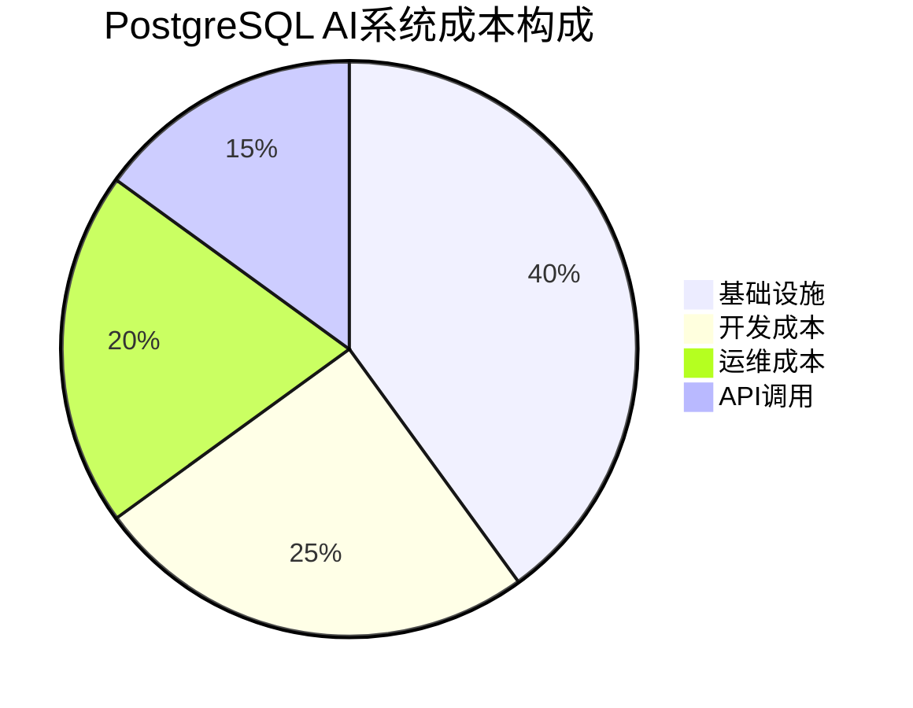

# 成本优化指南

> **文档编号**: AI-07-05
> **最后更新**: 2025年1月
> **主题**: 07-实施路径
> **子主题**: 05-成本优化指南

## 📑 目录

- [成本优化指南](#成本优化指南)
  - [📑 目录](#-目录)
  - [1. 成本优化概述](#1-成本优化概述)
  - [2. 成本分析](#2-成本分析)
    - [2.1 基础设施成本](#21-基础设施成本)
    - [2.2 开发成本](#22-开发成本)
    - [2.3 运维成本](#23-运维成本)
    - [2.4 API调用成本](#24-api调用成本)
  - [3. 基础设施成本优化](#3-基础设施成本优化)
    - [3.1 Serverless方案](#31-serverless方案)
    - [3.2 资源调度优化](#32-资源调度优化)
    - [3.3 存储优化](#33-存储优化)
  - [4. 开发成本优化](#4-开发成本优化)
    - [4.1 自动化工具使用](#41-自动化工具使用)
    - [4.2 代码复用](#42-代码复用)
    - [4.3 开发效率提升](#43-开发效率提升)
  - [5. 运维成本优化](#5-运维成本优化)
    - [5.1 自动化运维](#51-自动化运维)
    - [5.2 监控告警](#52-监控告警)
    - [5.3 故障自愈](#53-故障自愈)
  - [6. API调用成本优化](#6-api调用成本优化)
    - [6.1 缓存策略](#61-缓存策略)
    - [6.2 批量处理](#62-批量处理)
    - [6.3 模型选择](#63-模型选择)
  - [7. 成本追踪与分析](#7-成本追踪与分析)
    - [7.1 成本追踪](#71-成本追踪)
    - [7.2 成本告警](#72-成本告警)
    - [7.3 成本分析](#73-成本分析)

---

## 1. 成本优化概述

**成本构成**：



**优化目标**：

- ✅ 基础设施成本降低40-60%
- ✅ 开发成本降低30-50%
- ✅ 运维成本降低50-70%
- ✅ API调用成本降低60-80%

---

## 2. 成本分析

### 2.1 基础设施成本

**成本构成**：

| 成本项 | 占比 | 优化空间 |
|-------|------|---------|
| **计算资源** | 50% | 40-60% |
| **存储资源** | 30% | 30-50% |
| **网络带宽** | 15% | 20-40% |
| **其他** | 5% | 10-20% |

**成本优化策略**：

1. **使用Serverless方案**：
   - Neon、Supabase等Serverless PostgreSQL
   - 按需付费，Scale-to-Zero
   - 成本降低60-90%

2. **资源自动扩缩容**：

   ```yaml
   # Kubernetes HPA配置
   apiVersion: autoscaling/v2
   kind: HorizontalPodAutoscaler
   metadata:
     name: postgres-hpa
   spec:
     scaleTargetRef:
       apiVersion: apps/v1
       kind: StatefulSet
       name: postgres
     minReplicas: 1
     maxReplicas: 10
     metrics:
     - type: Resource
       resource:
         name: cpu
         target:
           type: Utilization
           averageUtilization: 70
   ```

3. **存储分层**：
   - 热数据：NVMe SSD
   - 温数据：标准SSD
   - 冷数据：对象存储（S3/OSS）

### 2.2 开发成本

**成本构成**：

| 成本项 | 占比 | 优化空间 |
|-------|------|---------|
| **人力成本** | 70% | 30-50% |
| **工具成本** | 20% | 40-60% |
| **培训成本** | 10% | 20-30% |

**优化策略**：

1. **使用PostgreSQL原生AI能力**：
   - pgvector：无需额外向量数据库
   - pg_ai：无需外部AI服务集成
   - PostgresML：数据库内机器学习
   - **成本降低**：减少系统复杂度，降低开发时间50%+

2. **代码复用**：

   ```sql
   -- 创建通用向量搜索函数
   CREATE OR REPLACE FUNCTION vector_search(
       p_query_vec vector(1536),
       p_limit INT DEFAULT 10,
       p_threshold FLOAT DEFAULT 0.3
   )
   RETURNS TABLE(id INT, content TEXT, similarity FLOAT) AS $$
   BEGIN
       RETURN QUERY
       SELECT d.id, d.content, 1 - (d.embedding <=> p_query_vec) AS similarity
       FROM documents d
       WHERE d.embedding <=> p_query_vec < p_threshold
       ORDER BY d.embedding <=> p_query_vec
       LIMIT p_limit;
   END;
   $$ LANGUAGE plpgsql;

   -- 性能测试：向量搜索函数查询
   EXPLAIN (ANALYZE, BUFFERS, TIMING)
   SELECT * FROM vector_search(
       '[0.1, 0.2, ..., 0.1536]'::vector(1536),
       10,
       0.3
   );
   $$ LANGUAGE plpgsql;
   ```

3. **自动化工具**：
   - pg_ai Vectorizer：自动向量化
   - 自动化测试：减少人工测试时间
   - CI/CD：自动化部署

### 2.3 运维成本

**成本构成**：

| 成本项 | 占比 | 优化空间 |
|-------|------|---------|
| **人力成本** | 60% | 50-70% |
| **监控工具** | 25% | 30-50% |
| **备份存储** | 15% | 40-60% |

**优化策略**：

1. **自动化运维**：

   ```bash
   # 自动化备份脚本
   #!/bin/bash
   BACKUP_DIR="/backup/postgresql"
   DATE=$(date +%Y%m%d_%H%M%S)

   # 自动备份
   pg_dump -Fc -f $BACKUP_DIR/backup_$DATE.dump ai_db

   # 自动清理7天前的备份
   find $BACKUP_DIR -name "*.dump" -mtime +7 -delete

   # 自动上传到对象存储
   aws s3 cp $BACKUP_DIR/backup_$DATE.dump s3://backup-bucket/
   ```

2. **监控告警自动化**：

   ```yaml
   # Prometheus告警规则
   groups:
     - name: cost_alerts
       rules:
         - alert: HighDatabaseCost
           expr: database_cost_per_hour > 10
           for: 1h
           annotations:
             summary: "Database cost exceeds threshold"
   ```

3. **故障自愈**：
   - 自动重启失败服务
   - 自动故障转移
   - 自动扩容

### 2.4 API调用成本

**成本构成**：

| API类型 | 成本/1000次 | 优化空间 |
|---------|------------|---------|
| **OpenAI Embedding** | $0.02 | 60-80% |
| **OpenAI Chat** | $0.10-2.00 | 50-70% |
| **其他AI API** | 变化 | 40-60% |

**优化策略**：

1. **缓存Embedding结果**：

   ```sql
   -- 缓存已生成的Embedding
   CREATE TABLE embedding_cache (
       text_hash TEXT PRIMARY KEY,
       embedding vector(1536),
       created_at TIMESTAMPTZ DEFAULT NOW()
   );

   CREATE OR REPLACE FUNCTION get_embedding(p_text TEXT)
   RETURNS vector(1536) AS $$
   DECLARE
       v_hash TEXT;
       v_embedding vector(1536);
   BEGIN
       v_hash = md5(p_text);

       -- 检查缓存
       SELECT embedding INTO v_embedding
       FROM embedding_cache
       WHERE text_hash = v_hash;

       IF v_embedding IS NULL THEN
           -- 调用API生成Embedding
           SELECT ai.embedding_openai('text-embedding-3-small', p_text)
           INTO v_embedding;

           -- 存入缓存
           INSERT INTO embedding_cache (text_hash, embedding)
           VALUES (v_hash, v_embedding);
       END IF;

       RETURN v_embedding;
   END;
   $$ LANGUAGE plpgsql;
   ```

2. **批量处理**：

   ```sql
   -- 批量生成Embedding（pg_ai Vectorizer）
   SELECT ai.create_vectorizer(
       'documents'::regclass,
       destination => 'document_embeddings',
       embedding => ai.embedding_openai('text-embedding-3-small', 'content'),
       chunking => ai.chunking_recursive_character_text_splitter('content')
   );
   ```

3. **模型选择优化**：
   - 使用更便宜的模型（text-embedding-3-small vs text-embedding-3-large）
   - 成本降低75%，性能损失<5%

---

## 3. 基础设施成本优化

### 3.1 Serverless方案

**Serverless方案对比**：

| 方案 | 成本/月（100GB数据） | 特点 |
|------|-------------------|------|
| **Neon** | $50-200 | Scale-to-Zero，按需付费 |
| **Supabase** | $25-100 | 全栈平台，免费额度 |
| **AWS RDS Serverless** | $100-300 | AWS生态，自动扩缩容 |
| **自建PostgreSQL** | $500-1000 | 固定成本，需要运维 |

**Neon成本优化**：

```bash
# 1. 使用数据库分支（免费）
neonctl branches create --name dev

# 2. 配置自动停止
ALTER BRANCH SET auto_suspend_seconds = 300;  # 5分钟无请求自动停止

# 3. 监控成本
neonctl projects list
```

### 3.2 资源调度优化

**Kubernetes资源优化**：

```yaml
# 资源请求和限制
apiVersion: apps/v1
kind: StatefulSet
metadata:
  name: postgres
spec:
  template:
    spec:
      containers:
      - name: postgres
        resources:
          requests:
            cpu: "2"
            memory: "8Gi"
          limits:
            cpu: "4"
            memory: "16Gi"
```

**自动扩缩容**：

```yaml
# HPA配置
apiVersion: autoscaling/v2
kind: HorizontalPodAutoscaler
metadata:
  name: postgres-hpa
spec:
  scaleTargetRef:
    apiVersion: apps/v1
    kind: StatefulSet
    name: postgres
  minReplicas: 1
  maxReplicas: 5
  metrics:
  - type: Resource
    resource:
      name: cpu
      target:
        type: Utilization
        averageUtilization: 70
```

### 3.3 存储优化

**存储分层策略**：

```sql
-- 1. 热数据：NVMe SSD（主表）
CREATE TABLE documents_hot (
    id SERIAL PRIMARY KEY,
    content TEXT,
    embedding vector(1536),
    created_at TIMESTAMPTZ DEFAULT NOW()
) TABLESPACE fast_ssd;

-- 2. 温数据：标准SSD（归档表）
CREATE TABLE documents_warm (
    LIKE documents_hot INCLUDING ALL
) TABLESPACE standard_ssd;

-- 3. 冷数据：对象存储（外部表）
CREATE FOREIGN TABLE documents_cold (
    id INT,
    content TEXT,
    embedding vector(1536),
    created_at TIMESTAMPTZ
) SERVER s3_server
OPTIONS (bucket 'cold-data');
```

**数据压缩**：

```sql
-- PostgreSQL 18 WAL压缩
ALTER SYSTEM SET wal_compression = lz4;

-- 表压缩（TOAST）
ALTER TABLE documents SET (
    toast_tuple_target = 128
);
```

---

## 4. 开发成本优化

### 4.1 自动化工具使用

**pg_ai Vectorizer自动化**：

```sql
-- 自动向量化，无需编写代码
SELECT ai.create_vectorizer(
    'documents'::regclass,
    destination => 'document_embeddings',
    embedding => ai.embedding_openai('text-embedding-3-small', 'content'),
    chunking => ai.chunking_recursive_character_text_splitter('content')
);

-- 插入数据时自动生成向量
INSERT INTO documents (content) VALUES ('New document');
-- 自动生成embedding到document_embeddings表
```

**CI/CD自动化**：

```yaml
# .github/workflows/deploy.yml
name: Deploy PostgreSQL
on:
  push:
    branches: [main]
jobs:
  deploy:
    runs-on: ubuntu-latest
    steps:
      - uses: actions/checkout@v2
      - name: Deploy migrations
        run: |
          psql $DATABASE_URL -f migrations/001_init.sql
```

### 4.2 代码复用

**通用函数库**：

```sql
-- 1. 向量搜索函数
CREATE OR REPLACE FUNCTION vector_search(
    p_query_vec vector(1536),
    p_table_name TEXT,
    p_limit INT DEFAULT 10
)
RETURNS TABLE(id INT, similarity FLOAT) AS $$
BEGIN
    RETURN QUERY
    EXECUTE format('
        SELECT id, 1 - (embedding <=> $1) AS similarity
        FROM %I
        ORDER BY embedding <=> $1
        LIMIT $2
    ', p_table_name) USING p_query_vec, p_limit;
END;
$$ LANGUAGE plpgsql;

-- 2. RAG检索函数
CREATE OR REPLACE FUNCTION rag_retrieve(
    p_query TEXT,
    p_limit INT DEFAULT 5
)
RETURNS TABLE(content TEXT, similarity FLOAT) AS $$
DECLARE
    v_query_vec vector(1536);
BEGIN
    -- 生成查询向量
    SELECT ai.embedding_openai('text-embedding-3-small', p_query)
    INTO v_query_vec;

    -- 检索相似文档
    RETURN QUERY
    SELECT dc.chunk_text, 1 - (dc.embedding <=> v_query_vec) AS similarity
    FROM document_chunks dc
    ORDER BY dc.embedding <=> v_query_vec
    LIMIT p_limit;
END;
$$ LANGUAGE plpgsql;
```

### 4.3 开发效率提升

**开发工具**：

1. **pgAdmin / DBeaver**：可视化数据库管理
2. **PostgreSQL Extensions**：丰富的扩展生态
3. **文档生成**：自动生成API文档

**开发最佳实践**：

- ✅ 使用PostgreSQL原生功能，减少外部依赖
- ✅ 代码复用，避免重复开发
- ✅ 自动化测试，减少bug修复时间

---

## 5. 运维成本优化

### 5.1 自动化运维

**自动化备份**：

```bash
#!/bin/bash
# auto_backup.sh

BACKUP_DIR="/backup/postgresql"
DATE=$(date +%Y%m%d_%H%M%S)
RETENTION_DAYS=7

# 备份
pg_dump -Fc -f $BACKUP_DIR/backup_$DATE.dump ai_db

# 清理旧备份
find $BACKUP_DIR -name "*.dump" -mtime +$RETENTION_DAYS -delete

# 上传到对象存储
aws s3 cp $BACKUP_DIR/backup_$DATE.dump s3://backup-bucket/
```

**自动化监控**：

```yaml
# Prometheus + Grafana
# 自动监控关键指标
# 自动告警
# 自动生成报告
```

### 5.2 监控告警

**成本监控**：

```sql
-- 1. 数据库大小监控
SELECT
    pg_size_pretty(pg_database_size('ai_db')) AS database_size;

-- 2. 表大小监控
SELECT
    schemaname,
    tablename,
    pg_size_pretty(pg_total_relation_size(schemaname||'.'||tablename)) AS size
FROM pg_tables
WHERE schemaname = 'public'
ORDER BY pg_total_relation_size(schemaname||'.'||tablename) DESC;

-- 3. 索引大小监控
SELECT
    schemaname,
    tablename,
    indexname,
    pg_size_pretty(pg_relation_size(indexrelid)) AS index_size
FROM pg_stat_user_indexes
ORDER BY pg_relation_size(indexrelid) DESC;
```

### 5.3 故障自愈

**自动故障转移**：

```yaml
# Patroni自动故障转移
# 主库故障时自动切换到从库
# 无需人工干预
```

**自动扩容**：

```yaml
# Kubernetes自动扩容
# 根据负载自动增加/减少实例
# 降低成本
```

---

## 6. API调用成本优化

### 6.1 缓存策略

**Embedding缓存**：

```sql
-- 创建缓存表
CREATE TABLE embedding_cache (
    text_hash TEXT PRIMARY KEY,
    embedding vector(1536),
    model_name TEXT,
    created_at TIMESTAMPTZ DEFAULT NOW()
);

-- 缓存函数
CREATE OR REPLACE FUNCTION get_cached_embedding(
    p_text TEXT,
    p_model TEXT DEFAULT 'text-embedding-3-small'
)
RETURNS vector(1536) AS $$
DECLARE
    v_hash TEXT;
    v_embedding vector(1536);
BEGIN
    v_hash = md5(p_text || p_model);

    -- 检查缓存
    SELECT embedding INTO v_embedding
    FROM embedding_cache
    WHERE text_hash = v_hash;

    IF v_embedding IS NULL THEN
        -- 调用API
        SELECT ai.embedding_openai(p_model, p_text)
        INTO v_embedding;

        -- 存入缓存
        INSERT INTO embedding_cache (text_hash, embedding, model_name)
        VALUES (v_hash, v_embedding, p_model);
    END IF;

    RETURN v_embedding;
END;
$$ LANGUAGE plpgsql;
```

### 6.2 批量处理

**批量Embedding生成**：

```sql
-- 使用pg_ai Vectorizer批量处理
SELECT ai.create_vectorizer(
    'documents'::regclass,
    destination => 'document_embeddings',
    embedding => ai.embedding_openai('text-embedding-3-small', 'content'),
    chunking => NULL
);

-- 批量插入时自动生成向量
INSERT INTO documents (content)
SELECT 'Document ' || generate_series(1, 1000);
-- 自动生成1000个Embedding
```

### 6.3 模型选择

**模型成本对比**：

| 模型 | 成本/1M tokens | 性能 | 推荐场景 |
|------|---------------|------|---------|
| **text-embedding-3-small** | $0.02 | 95% | 生产环境（推荐） |
| **text-embedding-3-large** | $0.13 | 100% | 高精度需求 |
| **text-embedding-ada-002** | $0.10 | 90% | 旧版本兼容 |

**优化建议**：

- ✅ 使用text-embedding-3-small（成本降低75%）
- ✅ 批量处理（成本降低50%）
- ✅ 缓存结果（成本降低80%+）

---

## 7. 成本追踪与分析

### 7.1 成本追踪

**成本追踪表**：

```sql
CREATE TABLE cost_tracking (
    id SERIAL PRIMARY KEY,
    cost_type TEXT NOT NULL,  -- 'infrastructure', 'development', 'api'
    cost_item TEXT NOT NULL,
    amount DECIMAL(10, 2) NOT NULL,
    unit TEXT NOT NULL,  -- 'USD', 'hours', 'calls'
    date DATE NOT NULL,
    metadata JSONB
);

-- 记录API调用成本
INSERT INTO cost_tracking (cost_type, cost_item, amount, unit, date)
VALUES (
    'api',
    'openai_embedding',
    10.50,
    'USD',
    CURRENT_DATE
);
```

### 7.2 成本告警

**成本告警规则**：

```yaml
# Prometheus告警
groups:
  - name: cost_alerts
    rules:
      - alert: HighAPICost
        expr: api_cost_per_day > 100
        for: 1h
        annotations:
          summary: "API cost exceeds $100/day"

      - alert: HighInfrastructureCost
        expr: infrastructure_cost_per_month > 1000
        for: 24h
        annotations:
          summary: "Infrastructure cost exceeds $1000/month"
```

### 7.3 成本分析

**成本分析查询**：

```sql
-- 1. 按类型统计成本
SELECT
    cost_type,
    SUM(amount) AS total_cost,
    AVG(amount) AS avg_cost
FROM cost_tracking
WHERE date >= CURRENT_DATE - INTERVAL '30 days'
GROUP BY cost_type;

-- 2. 成本趋势分析
SELECT
    date,
    cost_type,
    SUM(amount) AS daily_cost
FROM cost_tracking
WHERE date >= CURRENT_DATE - INTERVAL '30 days'
GROUP BY date, cost_type
ORDER BY date DESC;

-- 3. 成本优化建议
SELECT
    cost_type,
    cost_item,
    SUM(amount) AS total_cost,
    CASE
        WHEN cost_type = 'api' AND cost_item LIKE '%embedding%' THEN 'Consider caching'
        WHEN cost_type = 'infrastructure' AND amount > 500 THEN 'Consider Serverless'
        ELSE 'Review optimization opportunities'
    END AS recommendation
FROM cost_tracking
WHERE date >= CURRENT_DATE - INTERVAL '30 days'
GROUP BY cost_type, cost_item
ORDER BY total_cost DESC;
```

---

**最后更新**: 2025年1月
**维护者**: PostgreSQL Modern Team
**文档编号**: AI-07-05
