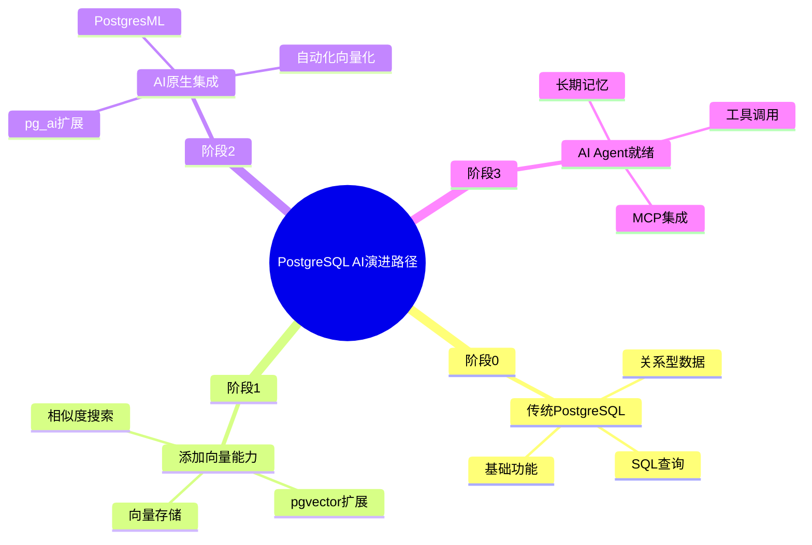
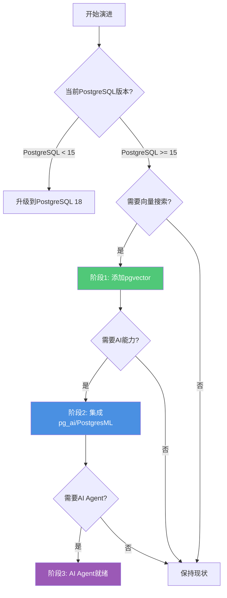

# 渐进式演进路线

> **文档编号**: AI-07-01
> **最后更新**: 2025年1月
> **主题**: 21-最佳实践
> **子主题**: 01-渐进式演进路线

## 📑 目录

- [渐进式演进路线](#渐进式演进路线)
  - [📑 目录](#-目录)
  - [1. 演进路径概述](#1-演进路径概述)
    - [1.1 演进路径思维导图](#11-演进路径思维导图)
    - [1.2 演进路径决策树](#12-演进路径决策树)
  - [2. 演进阶段详解](#2-演进阶段详解)
    - [2.1 阶段0：传统PostgreSQL](#21-阶段0传统postgresql)
    - [2.2 阶段1：添加向量能力](#22-阶段1添加向量能力)
    - [2.3 阶段2：AI原生集成](#23-阶段2ai原生集成)
    - [2.4 阶段3：AI Agent就绪](#24-阶段3ai-agent就绪)
  - [3. 实施步骤详解](#3-实施步骤详解)
    - [3.1 阶段1实施步骤](#31-阶段1实施步骤)
    - [3.2 阶段2实施步骤](#32-阶段2实施步骤)
    - [3.3 阶段3实施步骤](#33-阶段3实施步骤)
  - [4. 检查清单](#4-检查清单)
    - [4.1 阶段1检查清单](#41-阶段1检查清单)
    - [4.2 阶段2检查清单](#42-阶段2检查清单)
    - [4.3 阶段3检查清单](#43-阶段3检查清单)
  - [5. 风险与应对](#5-风险与应对)
    - [5.1 技术风险](#51-技术风险)
    - [5.2 业务风险](#52-业务风险)
    - [5.3 应对措施](#53-应对措施)
  - [6. 完整演进时间表](#6-完整演进时间表)
  - [7. 快速路径（最小可行方案）](#7-快速路径最小可行方案)

---

## 1. 演进路径概述

### 1.1 演进路径思维导图



### 1.2 演进路径决策树



---

## 2. 演进阶段详解

### 2.1 阶段0：传统PostgreSQL

**当前状态**：

- ✅ 运行PostgreSQL数据库
- ✅ 处理关系型数据
- ✅ 使用SQL查询
- ❌ 无向量搜索能力
- ❌ 无AI集成能力

**典型场景**：

- 传统Web应用
- 企业管理系统
- 数据分析系统

**技术栈**：

- PostgreSQL 15+
- 标准SQL
- 关系型数据模型

### 2.2 阶段1：添加向量能力

**目标**：添加向量搜索能力，支持相似度搜索

**新增能力**：

- ✅ pgvector扩展
- ✅ 向量数据类型
- ✅ 相似度搜索
- ✅ HNSW/IVFFlat索引

**实施步骤**：

```sql
-- 1. 安装pgvector扩展
CREATE EXTENSION IF NOT EXISTS vector;

-- 2. 创建向量列
ALTER TABLE documents ADD COLUMN embedding vector(1536);

-- 3. 生成向量（使用外部服务）
-- 使用OpenAI API生成embedding
UPDATE documents SET embedding = generate_embedding(content);

-- 4. 创建向量索引
CREATE INDEX ON documents
USING hnsw(embedding vector_cosine_ops)
WITH (m = 16, ef_construction = 64);

-- 5. 向量搜索查询
SELECT id, content, embedding <=> query_vec AS distance
FROM documents
ORDER BY embedding <=> query_vec
LIMIT 10;
```

**适用场景**：

- 推荐系统
- 相似内容检索
- 语义搜索

**时间估算**：1-2周

### 2.3 阶段2：AI原生集成

**目标**：集成AI能力，实现自动化AI处理

**新增能力**：

- ✅ pg_ai扩展（AI原生调用）
- ✅ PostgresML（内置机器学习）
- ✅ 自动化向量化（pg_ai Vectorizer）
- ✅ 数据库内LLM调用

**实施步骤**：

```sql
-- 1. 安装pg_ai扩展
CREATE EXTENSION IF NOT EXISTS pg_ai;

-- 2. 配置API密钥
ALTER SYSTEM SET pg_ai.openai_api_key = 'your-api-key';
SELECT pg_reload_conf();

-- 3. 使用pg_ai Vectorizer自动向量化
SELECT ai.create_vectorizer(
    'documents'::regclass,
    destination => 'document_embeddings',
    embedding => ai.embedding_openai('text-embedding-3-small', 'content'),
    chunking => ai.chunking_recursive_character_text_splitter('content')
);

-- 4. 插入数据时自动生成向量
INSERT INTO documents (content) VALUES ('New document');
-- 自动生成embedding到document_embeddings表

-- 5. 数据库内LLM调用
SELECT ai.chat_complete(
    'gpt-4',
    'Summarize this: ' || content
) AS summary
FROM documents
WHERE id = 1;
```

**PostgresML集成**：

```sql
-- 1. 安装PostgresML
CREATE EXTENSION IF NOT EXISTS pgml;

-- 2. 训练模型
SELECT * FROM pgml.train(
    project_name => 'sentiment_analysis',
    task => 'classification',
    relation_name => 'reviews',
    y_column_name => 'sentiment',
    algorithm => 'xgboost'
);

-- 3. 实时推理
SELECT
    id,
    content,
    pgml.predict('sentiment_analysis', features) AS sentiment
FROM reviews;
```

**适用场景**：

- RAG系统
- 智能推荐
- 实时AI处理

**时间估算**：2-4周

### 2.4 阶段3：AI Agent就绪

**目标**：支持AI Agent应用，提供长期记忆和工具调用能力

**新增能力**：

- ✅ Agent记忆管理
- ✅ 工具调用记录
- ✅ MCP Server集成
- ✅ 上下文管理

**实施步骤**：

```sql
-- 1. 创建Agent记忆表
CREATE TABLE agent_long_term_memory (
    id SERIAL PRIMARY KEY,
    agent_id TEXT NOT NULL,
    memory_type TEXT NOT NULL,
    content TEXT NOT NULL,
    embedding vector(1536),
    importance_score DECIMAL(3, 2),
    created_at TIMESTAMPTZ DEFAULT NOW()
);

CREATE INDEX ON agent_long_term_memory
USING hnsw(embedding vector_cosine_ops);

-- 2. 创建工具调用表
CREATE TABLE agent_tool_calls (
    id SERIAL PRIMARY KEY,
    agent_id TEXT NOT NULL,
    tool_name TEXT NOT NULL,
    arguments JSONB,
    result JSONB,
    execution_time_ms INT,
    created_at TIMESTAMPTZ DEFAULT NOW()
);

-- 3. Agent记忆检索函数
CREATE OR REPLACE FUNCTION retrieve_agent_memories(
    p_agent_id TEXT,
    p_query TEXT,
    p_limit INT DEFAULT 5
)
RETURNS TABLE(content TEXT, similarity FLOAT) AS $$
DECLARE
    v_query_vec vector(1536);
BEGIN
    -- 生成查询向量
    SELECT ai.embedding_openai('text-embedding-3-small', p_query)
    INTO v_query_vec;

    -- 检索相似记忆
    RETURN QUERY
    SELECT
        ltm.content,
        1 - (ltm.embedding <=> v_query_vec) AS similarity
    FROM agent_long_term_memory ltm
    WHERE ltm.agent_id = p_agent_id
    ORDER BY ltm.embedding <=> v_query_vec
    LIMIT p_limit;
END;
$$ LANGUAGE plpgsql;
```

**MCP Server集成**：

```python
# mcp_server.py
from mcp.server import Server
from mcp.types import Tool

server = Server("postgresql-mcp")

@server.tool()
async def query_database(query: str) -> str:
    """Execute SQL query on PostgreSQL database"""
    # 执行查询
    result = await execute_query(query)
    return result

@server.tool()
async def vector_search(query: str, limit: int = 10) -> list:
    """Perform vector similarity search"""
    # 向量搜索
    results = await vector_search_query(query, limit)
    return results
```

**适用场景**：

- AI Agent应用
- 长期记忆系统
- 工具调用系统

**时间估算**：4-6周

---

## 3. 实施步骤详解

### 3.1 阶段1实施步骤

**步骤1：环境准备**（1-2天）

```bash
# 1. 升级到PostgreSQL 18（如果未升级）
sudo apt-get install postgresql-18

# 2. 备份现有数据库
pg_dump -Fc -f backup.dump my_database

# 3. 验证PostgreSQL版本
psql -c "SELECT version();"
```

**步骤2：安装pgvector**（1天）

```sql
-- 1. 安装pgvector扩展
CREATE EXTENSION IF NOT EXISTS vector;

-- 2. 验证安装
SELECT * FROM pg_extension WHERE extname = 'vector';
```

**步骤3：数据迁移**（2-3天）

```sql
-- 1. 添加向量列
ALTER TABLE documents ADD COLUMN embedding vector(1536);

-- 2. 生成向量（批量处理）
-- 使用外部服务生成embedding
UPDATE documents
SET embedding = generate_embedding(content)
WHERE embedding IS NULL;

-- 3. 创建索引
CREATE INDEX CONCURRENTLY ON documents
USING hnsw(embedding vector_cosine_ops)
WITH (m = 16, ef_construction = 64);
```

**步骤4：测试验证**（1-2天）

```sql
-- 1. 测试向量搜索
SELECT id, content, embedding <=> query_vec AS distance
FROM documents
ORDER BY embedding <=> query_vec
LIMIT 10;

-- 2. 性能测试
EXPLAIN (ANALYZE, BUFFERS)
SELECT * FROM documents WHERE embedding <=> query_vec < 0.3 LIMIT 10;

-- 性能测试：向量相似度查询
EXPLAIN (ANALYZE, BUFFERS, TIMING)
SELECT * FROM documents WHERE embedding <=> query_vec < 0.3 LIMIT 10;
```

### 3.2 阶段2实施步骤

**步骤1：安装AI扩展**（1-2天）

```sql
-- 1. 安装pg_ai
CREATE EXTENSION IF NOT EXISTS pg_ai;

-- 2. 配置API密钥
ALTER SYSTEM SET pg_ai.openai_api_key = 'your-api-key';
SELECT pg_reload_conf();

-- 3. 安装PostgresML（可选）
CREATE EXTENSION IF NOT EXISTS pgml;
```

**步骤2：配置Vectorizer**（2-3天）

```sql
-- 1. 创建自动向量化器
SELECT ai.create_vectorizer(
    'documents'::regclass,
    destination => 'document_embeddings',
    embedding => ai.embedding_openai('text-embedding-3-small', 'content'),
    chunking => ai.chunking_recursive_character_text_splitter('content')
);

-- 2. 测试自动向量化
INSERT INTO documents (content) VALUES ('Test document');
-- 验证embedding是否自动生成
```

**步骤3：集成LLM调用**（2-3天）

```sql
-- 1. 创建LLM调用函数
CREATE OR REPLACE FUNCTION summarize_document(p_doc_id INT)
RETURNS TEXT AS $$
DECLARE
    v_content TEXT;
    v_summary TEXT;
BEGIN
    SELECT content INTO v_content
    FROM documents
    WHERE id = p_doc_id;

    SELECT ai.chat_complete(
        'gpt-4',
        'Summarize this document: ' || v_content
    ) INTO v_summary;

    RETURN v_summary;
END;
$$ LANGUAGE plpgsql;

-- 2. 测试LLM调用
SELECT summarize_document(1);
```

### 3.3 阶段3实施步骤

**步骤1：创建Agent数据模型**（2-3天）

```sql
-- 1. Agent记忆表
CREATE TABLE agent_long_term_memory (
    id SERIAL PRIMARY KEY,
    agent_id TEXT NOT NULL,
    memory_type TEXT NOT NULL,
    content TEXT NOT NULL,
    embedding vector(1536),
    importance_score DECIMAL(3, 2),
    created_at TIMESTAMPTZ DEFAULT NOW()
);

-- 2. 工具调用表
CREATE TABLE agent_tool_calls (
    id SERIAL PRIMARY KEY,
    agent_id TEXT NOT NULL,
    tool_name TEXT NOT NULL,
    arguments JSONB,
    result JSONB,
    execution_time_ms INT,
    created_at TIMESTAMPTZ DEFAULT NOW()
);

-- 3. 创建索引
CREATE INDEX ON agent_long_term_memory
USING hnsw(embedding vector_cosine_ops);
CREATE INDEX ON agent_long_term_memory (agent_id);
```

**步骤2：实现Agent功能**（3-4天）

```sql
-- 1. 记忆存储函数
CREATE OR REPLACE FUNCTION store_agent_memory(
    p_agent_id TEXT,
    p_content TEXT,
    p_memory_type TEXT DEFAULT 'episodic'
)
RETURNS INT AS $$
DECLARE
    v_embedding vector(1536);
    v_importance DECIMAL(3, 2);
    v_memory_id INT;
BEGIN
    -- 生成embedding
    SELECT ai.embedding_openai('text-embedding-3-small', p_content)
    INTO v_embedding;

    -- 计算重要性
    SELECT ai.chat_complete(
        'gpt-4',
        'Rate importance (0-1): ' || p_content
    )::DECIMAL INTO v_importance;

    -- 存储记忆
    INSERT INTO agent_long_term_memory
    (agent_id, memory_type, content, embedding, importance_score)
    VALUES (p_agent_id, p_memory_type, p_content, v_embedding, v_importance)
    RETURNING id INTO v_memory_id;

    RETURN v_memory_id;
END;
$$ LANGUAGE plpgsql;
```

**步骤3：MCP Server集成**（3-4天）

```python
# 实现MCP Server
# 提供数据库查询、向量搜索等工具
```

---

## 4. 检查清单

### 4.1 阶段1检查清单

**环境检查**：

- [ ] PostgreSQL版本 >= 15
- [ ] 数据库备份完成
- [ ] 测试环境准备就绪

**功能检查**：

- [ ] pgvector扩展安装成功
- [ ] 向量列创建成功
- [ ] 向量索引创建成功
- [ ] 向量搜索功能正常
- [ ] 性能满足要求

**测试检查**：

- [ ] 单元测试通过
- [ ] 集成测试通过
- [ ] 性能测试通过
- [ ] 文档更新完成

### 4.2 阶段2检查清单

**功能检查**：

- [ ] pg_ai扩展安装成功
- [ ] API密钥配置正确
- [ ] Vectorizer配置成功
- [ ] 自动向量化功能正常
- [ ] LLM调用功能正常
- [ ] PostgresML集成成功（如使用）

**测试检查**：

- [ ] 向量化测试通过
- [ ] LLM调用测试通过
- [ ] 性能测试通过
- [ ] 成本监控正常

### 4.3 阶段3检查清单

**功能检查**：

- [ ] Agent数据模型创建成功
- [ ] 记忆管理功能正常
- [ ] 工具调用功能正常
- [ ] MCP Server集成成功
- [ ] 上下文管理正常

**测试检查**：

- [ ] Agent功能测试通过
- [ ] 记忆检索测试通过
- [ ] 工具调用测试通过
- [ ] 端到端测试通过

---

## 5. 风险与应对

### 5.1 技术风险

**风险1：扩展兼容性**

- **风险**：pgvector/pg_ai与PostgreSQL版本不兼容
- **应对**：
  - 使用兼容版本
  - 在测试环境验证
  - 准备回滚方案

**风险2：性能问题**

- **风险**：向量索引构建慢，查询性能不达标
- **应对**：
  - 使用CONCURRENTLY创建索引
  - 优化索引参数
  - 分阶段迁移数据

**风险3：数据迁移风险**

- **风险**：大量数据迁移时间长，影响业务
- **应对**：
  - 使用增量迁移
  - 在低峰期迁移
  - 准备回滚方案

### 5.2 业务风险

**风险1：业务中断**

- **风险**：升级过程中服务中断
- **应对**：
  - 使用零停机升级方案
  - 准备回滚方案
  - 在测试环境充分测试

**风险2：成本超支**

- **风险**：AI API调用成本超出预算
- **应对**：
  - 实施缓存策略
  - 监控API调用
  - 设置成本告警

### 5.3 应对措施

**预防措施**：

- ✅ 充分测试
- ✅ 分阶段实施
- ✅ 准备回滚方案
- ✅ 监控告警

**应急预案**：

- ✅ 快速回滚流程
- ✅ 故障处理流程
- ✅ 数据恢复方案

---

## 6. 完整演进时间表

**阶段1：添加向量能力**（2-3周）

| 周 | 任务 | 交付物 |
|----|------|--------|
| 第1周 | 环境准备、安装pgvector | pgvector安装完成 |
| 第2周 | 数据迁移、创建索引 | 向量搜索功能可用 |
| 第3周 | 测试验证、性能优化 | 阶段1完成 |

**阶段2：AI原生集成**（3-4周）

| 周 | 任务 | 交付物 |
|----|------|--------|
| 第1周 | 安装AI扩展、配置API | AI扩展安装完成 |
| 第2周 | 配置Vectorizer、测试 | 自动向量化可用 |
| 第3周 | 集成LLM调用、测试 | LLM调用功能可用 |
| 第4周 | 性能优化、文档更新 | 阶段2完成 |

**阶段3：AI Agent就绪**（4-6周）

| 周 | 任务 | 交付物 |
|----|------|--------|
| 第1-2周 | 创建Agent数据模型 | 数据模型完成 |
| 第3-4周 | 实现Agent功能 | Agent功能可用 |
| 第5-6周 | MCP Server集成、测试 | 阶段3完成 |

---

## 7. 快速路径（最小可行方案）

**目标**：最快实现向量搜索能力（1周）

**步骤**：

```sql
-- 1. 安装pgvector（1天）
CREATE EXTENSION vector;

-- 2. 添加向量列（1天）
ALTER TABLE documents ADD COLUMN embedding vector(1536);

-- 3. 生成向量（2-3天，批量处理）
-- 使用外部服务批量生成

-- 4. 创建索引（1天）
CREATE INDEX ON documents
USING hnsw(embedding vector_cosine_ops);

-- 5. 测试（1天）
SELECT * FROM documents
ORDER BY embedding <=> query_vec
LIMIT 10;
```

**最小配置**：

- PostgreSQL 15+
- pgvector扩展
- 基础HNSW索引
- 简单向量搜索查询

---

**最后更新**: 2025年1月
**维护者**: PostgreSQL Modern Team
**文档编号**: AI-07-01
