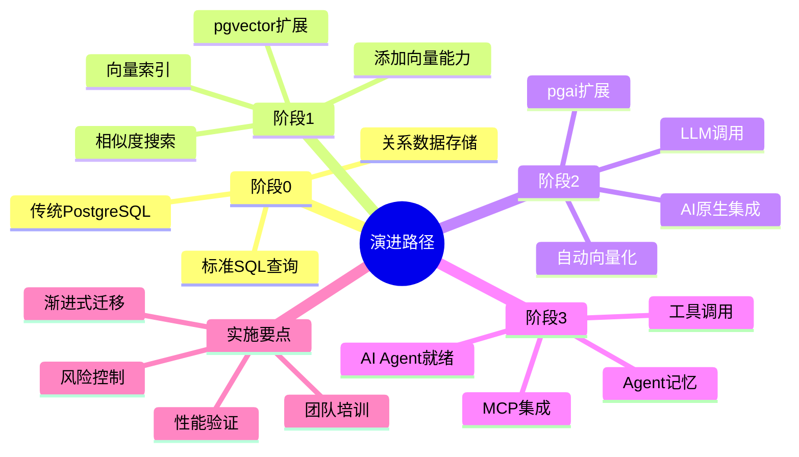
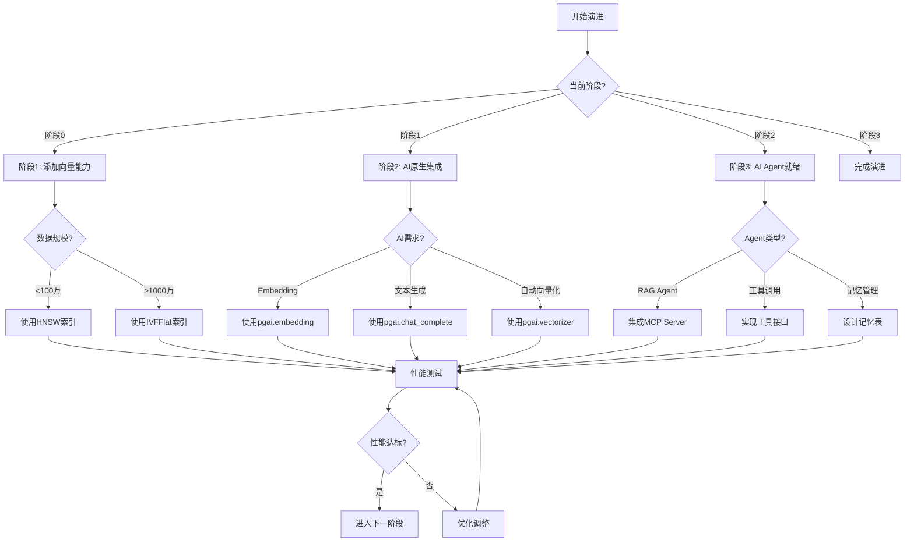

---

> **📋 文档来源**: `PostgreSQL_AI\07-实施路径\渐进式演进路线.md`
> **📅 复制日期**: 2025-12-22
> **⚠️ 注意**: 本文档为复制版本，原文件保持不变

---

# 渐进式演进路线

> **文档编号**: AI-07-01
> **最后更新**: 2025年1月
> **主题**: 07-实施路径
> **子主题**: 01-渐进式演进路线

## 📑 目录

- [渐进式演进路线](#渐进式演进路线)
  - [📑 目录](#-目录)
  - [一、概述](#一概述)
    - [1.1 演进路径思维导图](#11-演进路径思维导图)
    - [1.2 演进路径决策树](#12-演进路径决策树)
  - [二、演进阶段](#二演进阶段)
    - [2.1 阶段0：传统PostgreSQL](#21-阶段0传统postgresql)
    - [2.2 阶段1：添加向量能力](#22-阶段1添加向量能力)
    - [2.3 阶段2：AI原生集成](#23-阶段2ai原生集成)
    - [2.4 阶段3：AI Agent就绪](#24-阶段3ai-agent就绪)
  - [三、阶段详细实施](#三阶段详细实施)
    - [3.1 阶段1实施步骤](#31-阶段1实施步骤)
    - [3.2 阶段2实施步骤](#32-阶段2实施步骤)
    - [3.3 阶段3实施步骤](#33-阶段3实施步骤)
  - [四、迁移检查清单](#四迁移检查清单)
    - [4.1 阶段1检查清单](#41-阶段1检查清单)
    - [4.2 阶段2检查清单](#42-阶段2检查清单)
    - [4.3 阶段3检查清单](#43-阶段3检查清单)
  - [五、风险与应对](#五风险与应对)
    - [5.1 技术风险](#51-技术风险)
    - [5.2 业务风险](#52-业务风险)
    - [5.3 应对措施](#53-应对措施)
  - [六、时间规划](#六时间规划)
    - [完整演进时间表](#完整演进时间表)
    - [快速路径（最小可行方案）](#快速路径最小可行方案)
  - [七、关联主题](#七关联主题)
  - [八、对标资源](#八对标资源)
    - [技术文档](#技术文档)
    - [最佳实践](#最佳实践)

## 一、概述

从传统PostgreSQL到AI增强的渐进式演进路径，分4个阶段逐步实现，每个阶段都有明确的目标、实施步骤和验收标准，确保平滑过渡和风险可控。

### 1.1 演进路径思维导图



### 1.2 演进路径决策树



## 二、演进阶段

### 2.1 阶段0：传统PostgreSQL

**当前状态**: 仅支持结构化查询

**能力**:

- 标准SQL查询
- 事务处理
- 基本索引（B-tree）

**示例**:

```sql
-- 传统查询
SELECT * FROM products
WHERE category = 'electronics'
  AND price < 1000;
```

### 2.2 阶段1：添加向量能力

**目标**: 支持向量存储和相似性搜索

**新增能力**:

- pgvector扩展
- 向量数据类型
- HNSW/IVFFlat索引
- 向量相似度查询

**实施时间**: 1-2周

**示例**:

```sql
-- 安装扩展
CREATE EXTENSION vector;

-- 添加向量列
ALTER TABLE products
ADD COLUMN description_vector vector(1536);

-- 创建索引
CREATE INDEX ON products
USING hnsw (description_vector vector_cosine_ops);

-- 向量查询
SELECT * FROM products
WHERE description_vector <=> query_vector < 0.8;
```

### 2.3 阶段2：AI原生集成

**目标**: SQL内调用AI模型

**新增能力**:

- pgai扩展
- SQL内LLM调用
- 自动Embedding生成
- Vectorizer自动化

**实施时间**: 2-4周

**示例**:

```sql
-- 安装pgai
CREATE EXTENSION pgai;

-- 自动向量化
SELECT ai.create_vectorizer(
    'products'::regclass,
    destination => 'product_embeddings',
    embedding => ai.embedding_openai('text-embedding-3-small', 'description')
);

-- SQL内LLM调用
SELECT ai.chat_complete('gpt-4', '分析产品评论');
```

### 2.4 阶段3：AI Agent就绪

**目标**: 支持AI Agent完整功能

**新增能力**:

- MCP Server
- Agent记忆管理
- 工具调用接口
- 数据版本控制（Branching）

**实施时间**: 4-6周

**示例**:

```sql
-- Agent记忆管理
SELECT store_long_term_memory(
    'agent_001',
    '用户偏好数据',
    'knowledge'
);

-- 工具注册
SELECT register_agent_tool(
    'search_database',
    'search_database_tool',
    '数据库搜索工具'
);
```

## 三、阶段详细实施

### 3.1 阶段1实施步骤

**第1步：环境准备** (1天)

```bash
# 检查PostgreSQL版本（需要12+）
psql --version

# 安装pgvector扩展
# Ubuntu/Debian
sudo apt-get install postgresql-14-pgvector

# 或从源码编译
git clone https://github.com/pgvector/pgvector.git
cd pgvector
make
sudo make install
```

**第2步：扩展安装** (1天)

```sql
-- 创建扩展
CREATE EXTENSION vector;

-- 验证安装
SELECT * FROM pg_extension WHERE extname = 'vector';
```

**第3步：数据迁移** (3-5天)

```sql
-- 为现有表添加向量列
ALTER TABLE documents
ADD COLUMN embedding vector(1536);

-- 批量生成向量（使用Python脚本）
-- 或使用pgai自动生成
```

**第4步：索引创建** (1天)

```sql
-- 创建向量索引
CREATE INDEX ON documents
USING hnsw (embedding vector_cosine_ops)
WITH (m = 16, ef_construction = 100);
```

**第5步：测试验证** (2-3天)

```sql
-- 性能测试
EXPLAIN ANALYZE
SELECT * FROM documents
WHERE embedding <=> query_vector < 0.8
LIMIT 10;

-- 功能测试
-- 验证召回率、延迟等指标
```

### 3.2 阶段2实施步骤

**第1步：安装pgai** (1天)

```sql
-- 安装pgai扩展
CREATE EXTENSION pgai;

-- 配置API密钥
ALTER SYSTEM SET pgai.openai_api_key = 'sk-...';
SELECT pg_reload_conf();
```

**第2步：创建Vectorizer** (2-3天)

```sql
-- 为现有表创建自动向量化
SELECT ai.create_vectorizer(
    'news_articles'::regclass,
    destination => 'news_embeddings',
    embedding => ai.embedding_openai('text-embedding-3-small', 'content'),
    chunking => ai.chunking_recursive_character_text_splitter('content')
);
```

**第3步：测试AI功能** (2-3天)

```sql
-- 测试Embedding生成
SELECT ai.embedding('text-embedding-3-small', '测试文本');

-- 测试LLM调用
SELECT ai.chat_complete('gpt-4', 'Hello');
```

**第4步：集成到应用** (1周)

- 更新应用代码
- 集成pgai函数
- 测试端到端流程

### 3.3 阶段3实施步骤

**第1步：部署MCP Server** (1周)

```python
# 安装MCP Server
pip install mcp-server-postgres

# 配置MCP Server
# 连接到PostgreSQL
# 注册工具函数
```

**第2步：实现Agent记忆管理** (1周)

```sql
-- 创建记忆表
CREATE TABLE agent_long_term_memory (...);

-- 实现记忆存储和检索函数
CREATE FUNCTION store_long_term_memory(...);
CREATE FUNCTION retrieve_long_term_memory(...);
```

**第3步：实现工具调用** (1周)

```sql
-- 创建工具注册表
CREATE TABLE agent_tools (...);

-- 实现工具调用函数
CREATE FUNCTION call_agent_tool(...);
```

**第4步：集成Branching** (1周)

```sql
-- 使用Neon Branching
-- 为每个Agent创建独立分支
CREATE BRANCH agent_branch FROM main;
```

## 四、迁移检查清单

### 4.1 阶段1检查清单

- [ ] PostgreSQL版本 >= 12
- [ ] pgvector扩展安装成功
- [ ] 向量列添加完成
- [ ] 向量数据生成完成
- [ ] HNSW索引创建完成
- [ ] 向量查询功能测试通过
- [ ] 性能指标满足要求（延迟<100ms, 召回率>0.95）
- [ ] 应用集成测试通过

### 4.2 阶段2检查清单

- [ ] pgai扩展安装成功
- [ ] API密钥配置正确
- [ ] Vectorizer创建成功
- [ ] 自动Embedding生成测试通过
- [ ] SQL内LLM调用测试通过
- [ ] 应用集成完成
- [ ] 成本监控设置完成

### 4.3 阶段3检查清单

- [ ] MCP Server部署成功
- [ ] 工具注册功能正常
- [ ] Agent记忆管理功能正常
- [ ] 工具调用功能正常
- [ ] Branching功能测试通过
- [ ] 权限控制配置完成
- [ ] 审计日志启用
- [ ] 端到端测试通过

## 五、风险与应对

### 5.1 技术风险

| 风险 | 概率 | 影响 | 应对措施 |
|------|:----:|:----:|:--------|
| 向量索引构建失败 | 中 | 高 | 使用CONCURRENTLY，分批构建 |
| 性能不达标 | 中 | 中 | 调整索引参数，优化查询 |
| 数据迁移失败 | 低 | 高 | 备份数据，分阶段迁移 |

### 5.2 业务风险

| 风险 | 概率 | 影响 | 应对措施 |
|------|:----:|:----:|:--------|
| 服务中断 | 低 | 高 | 蓝绿部署，灰度发布 |
| 数据丢失 | 极低 | 极高 | 完整备份，事务保证 |
| 成本超支 | 中 | 中 | 监控成本，设置告警 |

### 5.3 应对措施

1. **技术风险应对**:
   - 充分测试
   - 分阶段实施
   - 保留回滚方案

2. **业务风险应对**:
   - 灰度发布
   - 监控告警
   - 应急预案

## 六、时间规划

### 完整演进时间表

| 阶段 | 时间 | 主要工作 | 交付物 |
|------|:----:|:--------|:--------|
| **阶段0** | 基线 | 传统PostgreSQL | 现有系统 |
| **阶段1** | 1-2周 | 添加向量能力 | pgvector集成 |
| **阶段2** | 2-4周 | AI原生集成 | pgai集成 |
| **阶段3** | 4-6周 | AI Agent就绪 | MCP Server |
| **总计** | **7-12周** | 完整演进 | AI增强PostgreSQL |

### 快速路径（最小可行方案）

| 阶段 | 时间 | 工作内容 |
|------|:----:|:--------|
| **阶段1** | 1周 | 仅安装pgvector，基础向量查询 |
| **总计** | **1周** | 最小可行方案 |

## 七、关联主题

- [性能调优黄金法则](./性能调优黄金法则.md) - 性能优化
- [部署方案设计](./部署方案设计.md) - 部署指南
- [风险应对措施](./风险应对措施.md) - 风险管理

## 八、对标资源

### 技术文档

- [PostgreSQL升级指南](https://www.postgresql.org/docs/current/upgrading.html)
- [pgvector安装文档](https://github.com/pgvector/pgvector#installation)

### 最佳实践

- 渐进式迁移最佳实践
- 数据库升级策略

---

**最后更新**: 2025年1月
**维护者**: PostgreSQL Modern Team
**文档编号**: AI-07-01
