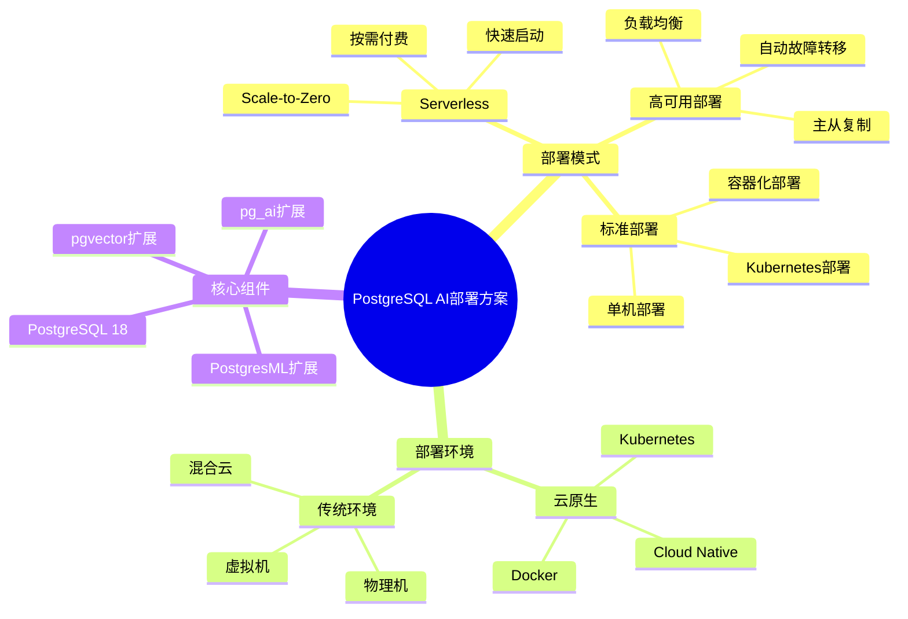
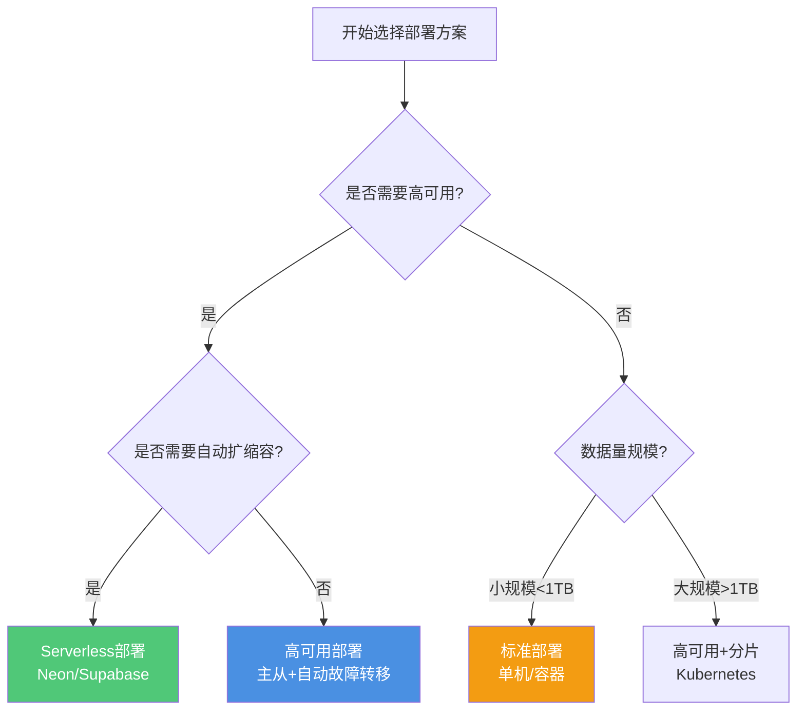
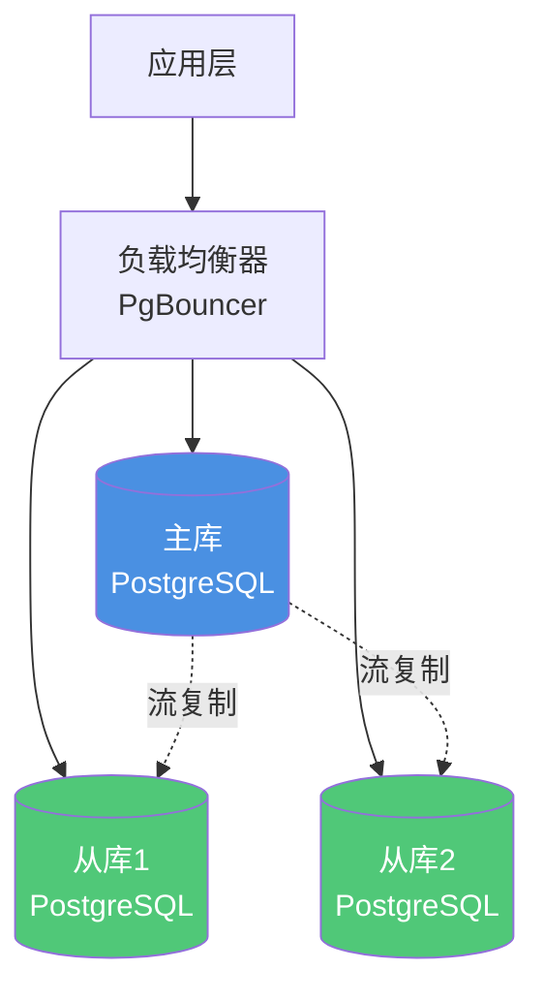
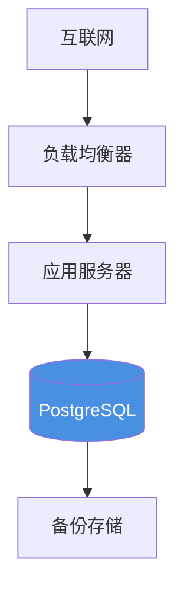

# 部署方案设计

> **文档编号**: AI-07-03
> **最后更新**: 2025年1月
> **主题**: 07-实施路径
> **子主题**: 03-部署方案设计

## 📑 目录

- [部署方案设计](#部署方案设计)
  - [📑 目录](#-目录)
  - [1. 部署方案概述](#1-部署方案概述)
    - [1.1 部署方案思维导图](#11-部署方案思维导图)
    - [1.2 部署方案选择决策树](#12-部署方案选择决策树)
  - [2. 部署模式详解](#2-部署模式详解)
    - [2.1 Serverless部署](#21-serverless部署)
    - [2.2 标准部署](#22-标准部署)
    - [2.3 高可用部署](#23-高可用部署)
  - [3. 环境要求](#3-环境要求)
    - [3.1 硬件要求](#31-硬件要求)
    - [3.2 软件要求](#32-软件要求)
    - [3.3 网络配置](#33-网络配置)
  - [4. 安装配置](#4-安装配置)
    - [4.1 PostgreSQL安装](#41-postgresql安装)
    - [4.2 扩展安装](#42-扩展安装)
    - [4.3 参数配置](#43-参数配置)
  - [5. 高可用配置](#5-高可用配置)
    - [5.1 主从复制](#51-主从复制)
    - [5.2 自动故障转移](#52-自动故障转移)
    - [5.3 负载均衡](#53-负载均衡)
  - [6. 监控告警](#6-监控告警)
    - [6.1 监控指标](#61-监控指标)
    - [6.2 告警规则](#62-告警规则)
    - [6.3 日志管理](#63-日志管理)
  - [7. 备份恢复](#7-备份恢复)
    - [7.1 备份策略](#71-备份策略)
    - [7.2 恢复测试](#72-恢复测试)
    - [7.3 灾难恢复](#73-灾难恢复)
  - [8. 安全配置](#8-安全配置)
    - [8.1 访问控制](#81-访问控制)
    - [8.2 数据加密](#82-数据加密)
    - [8.3 审计日志](#83-审计日志)

---

## 1. 部署方案概述

### 1.1 部署方案思维导图



### 1.2 部署方案选择决策树



---

## 2. 部署模式详解

### 2.1 Serverless部署

**适用场景**：

- 开发/测试环境
- 中小型应用（<100GB数据）
- 需要按需付费的场景
- 快速启动需求

**Serverless方案对比**：

| 方案 | 特点 | 适用场景 |
|------|------|---------|
| **Neon** | PostgreSQL Serverless，数据库分支 | AI Agent应用 |
| **Supabase** | 全栈Serverless平台 | 快速原型开发 |
| **AWS RDS Serverless** | 自动扩缩容 | AWS生态应用 |
| **Azure Database Flexible Server** | 按需付费 | Azure生态应用 |

**Neon部署示例**：

```bash
# 1. 安装Neon CLI
npm install -g neonctl

# 2. 创建项目
neonctl projects create --name ai-app

# 3. 创建数据库分支
neonctl branches create --name main

# 4. 安装扩展
neonctl sql "CREATE EXTENSION vector;"
neonctl sql "CREATE EXTENSION pg_ai;"
```

**Supabase部署示例**：

```bash
# 1. 创建Supabase项目
supabase init

# 2. 启动本地开发环境
supabase start

# 3. 安装扩展（在SQL Editor中）
CREATE EXTENSION vector;
CREATE EXTENSION pg_ai;
```

### 2.2 标准部署

**单机部署**：

```bash
# 1. 安装PostgreSQL 18
# Ubuntu/Debian
sudo apt-get update
sudo apt-get install postgresql-18

# CentOS/RHEL
sudo yum install postgresql18-server

# macOS
brew install postgresql@18

# 2. 初始化数据库
sudo postgresql-18-setup initdb

# 3. 启动服务
sudo systemctl start postgresql-18
sudo systemctl enable postgresql-18
```

**Docker部署**：

```yaml
# docker-compose.yml
version: '3.8'

services:
  postgres:
    image: pgvector/pgvector:pg18
    container_name: postgres-ai
    environment:
      POSTGRES_USER: postgres
      POSTGRES_PASSWORD: password
      POSTGRES_DB: ai_db
    ports:
      - "5432:5432"
    volumes:
      - postgres_data:/var/lib/postgresql/data
    command:
      - "postgres"
      - "-c"
      - "shared_preload_libraries=vector,pg_ai"
    healthcheck:
      test: ["CMD-SHELL", "pg_isready -U postgres"]
      interval: 10s
      timeout: 5s
      retries: 5

volumes:
  postgres_data:
```

**Kubernetes部署**：

```yaml
# postgresql-deployment.yaml
apiVersion: apps/v1
kind: StatefulSet
metadata:
  name: postgres-ai
spec:
  serviceName: postgres-ai
  replicas: 1
  selector:
    matchLabels:
      app: postgres-ai
  template:
    metadata:
      labels:
        app: postgres-ai
    spec:
      containers:
      - name: postgres
        image: pgvector/pgvector:pg18
        env:
        - name: POSTGRES_USER
          value: postgres
        - name: POSTGRES_PASSWORD
          valueFrom:
            secretKeyRef:
              name: postgres-secret
              key: password
        - name: POSTGRES_DB
          value: ai_db
        ports:
        - containerPort: 5432
        volumeMounts:
        - name: postgres-data
          mountPath: /var/lib/postgresql/data
        command:
        - "postgres"
        - "-c"
        - "shared_preload_libraries=vector,pg_ai"
  volumeClaimTemplates:
  - metadata:
      name: postgres-data
    spec:
      accessModes: [ "ReadWriteOnce" ]
      resources:
        requests:
          storage: 100Gi
```

### 2.3 高可用部署

**主从复制架构**：



**配置主从复制**：

```sql
-- 主库配置 (postgresql.conf)
wal_level = replica
max_wal_senders = 3
max_replication_slots = 3

-- 主库创建复制用户
CREATE ROLE replicator WITH REPLICATION LOGIN PASSWORD 'password';

-- 主库配置 (pg_hba.conf)
host replication replicator 0.0.0.0/0 md5

-- 从库配置 (postgresql.conf)
primary_conninfo = 'host=primary_host port=5432 user=replicator password=password'
```

**自动故障转移（Patroni）**：

```yaml
# patroni.yml
scope: postgres-cluster
namespace: /postgres/
name: postgres-node1

restapi:
  listen: 0.0.0.0:8008
  connect_address: localhost:8008

bootstrap:
  dcs:
    ttl: 30
    loop_wait: 10
    retry_timeout: 30
    maximum_lag_on_failover: 1048576
    postgresql:
      use_pg_rewind: true
      parameters:
        wal_level: replica
        hot_standby: "on"
        max_connections: 100
        max_wal_senders: 10
        max_replication_slots: 10

postgresql:
  listen: 0.0.0.0:5432
  connect_address: localhost:5432
  data_dir: /var/lib/postgresql/data
  pgpass: /tmp/pgpass
  authentication:
    replication:
      username: replicator
      password: password
    superuser:
      username: postgres
      password: password
  parameters:
    unix_socket_directories: '/var/run/postgresql'

tags:
  nofailover: false
  noloadbalance: false
  clonefrom: false
  nosync: false
```

---

## 3. 环境要求

### 3.1 硬件要求

**最小配置**（开发/测试）：

| 组件 | 配置 | 说明 |
|------|------|------|
| **CPU** | 2核心 | 基础查询处理 |
| **内存** | 4GB | 基本缓存需求 |
| **存储** | 50GB SSD | 数据存储 |
| **网络** | 100Mbps | 基础网络需求 |

**推荐配置**（生产环境）：

| 组件 | 配置 | 说明 |
|------|------|------|
| **CPU** | 8核心+ | 高并发查询 |
| **内存** | 32GB+ | 向量索引缓存 |
| **存储** | 500GB+ NVMe SSD | 高性能存储 |
| **网络** | 1Gbps+ | 高吞吐量 |

**大规模配置**（百万级向量）：

| 组件 | 配置 | 说明 |
|------|------|------|
| **CPU** | 32核心+ | 大规模并发 |
| **内存** | 128GB+ | 大型向量索引 |
| **存储** | 2TB+ NVMe SSD | 海量数据存储 |
| **网络** | 10Gbps | 高带宽需求 |

### 3.2 软件要求

**PostgreSQL版本**：

- **推荐**：PostgreSQL 18（最新版本，I/O性能提升3倍）
- **最低**：PostgreSQL 15（支持pgvector 0.5+）

**必需扩展**：

- `vector` (pgvector) >= 0.8.0
- `pg_ai` >= 0.1.0（可选，AI原生调用）
- `pgml` >= 3.0（可选，内置机器学习）

**操作系统**：

- Linux: Ubuntu 22.04+, CentOS 8+, RHEL 8+
- macOS: macOS 12+
- Windows: Windows Server 2019+（通过Docker）

### 3.3 网络配置

**网络架构**：



**防火墙配置**：

```bash
# 允许PostgreSQL端口（仅内网）
sudo ufw allow from 10.0.0.0/8 to any port 5432
sudo ufw allow from 172.16.0.0/12 to any port 5432

# 允许PgBouncer端口（应用服务器）
sudo ufw allow from 10.0.1.0/24 to any port 6432
```

---

## 4. 安装配置

### 4.1 PostgreSQL安装

**Ubuntu/Debian安装**：

```bash
# 1. 添加PostgreSQL官方仓库
sudo sh -c 'echo "deb http://apt.postgresql.org/pub/repos/apt $(lsb_release -cs)-pgdg main" > /etc/apt/sources.list.d/pgdg.list'
wget --quiet -O - https://www.postgresql.org/media/keys/ACCC4CF8.asc | sudo apt-key add -
sudo apt-get update

# 2. 安装PostgreSQL 18
sudo apt-get install postgresql-18 postgresql-contrib-18

# 3. 启动服务
sudo systemctl start postgresql-18
sudo systemctl enable postgresql-18

# 4. 验证安装
sudo -u postgres psql -c "SELECT version();"
```

**CentOS/RHEL安装**：

```bash
# 1. 安装PostgreSQL仓库
sudo yum install -y https://download.postgresql.org/pub/repos/yum/reporpms/EL-8-x86_64/pgdg-redhat-repo-latest.noarch.rpm

# 2. 安装PostgreSQL 18
sudo yum install -y postgresql18-server postgresql18

# 3. 初始化数据库
sudo /usr/pgsql-18/bin/postgresql-18-setup initdb

# 4. 启动服务
sudo systemctl start postgresql-18
sudo systemctl enable postgresql-18
```

### 4.2 扩展安装

**安装pgvector**：

```bash
# 1. 安装依赖
sudo apt-get install -y build-essential git postgresql-server-dev-18

# 2. 克隆pgvector仓库
git clone --branch v0.8.0 https://github.com/pgvector/pgvector.git
cd pgvector

# 3. 编译安装
make
sudo make install

# 4. 在数据库中启用扩展
sudo -u postgres psql -d postgres -c "CREATE EXTENSION vector;"
```

**安装pg_ai**：

```bash
# 1. 克隆pg_ai仓库
git clone https://github.com/cloudquery/pg_ai.git
cd pg_ai

# 2. 编译安装
make
sudo make install

# 3. 配置API密钥（在postgresql.conf中）
# pg_ai.openai_api_key = 'your-api-key'

# 4. 在数据库中启用扩展
sudo -u postgres psql -d postgres -c "CREATE EXTENSION pg_ai;"
```

**安装PostgresML**：

```bash
# 1. 使用Docker（推荐）
docker run -d \
  --name postgresml \
  -e POSTGRES_PASSWORD=password \
  -p 5432:5432 \
  ghcr.io/postgresml/postgresml:latest

# 2. 或从源码安装
git clone https://github.com/postgresml/postgresml.git
cd postgresml/pgml
make install
```

### 4.3 参数配置

**PostgreSQL 18优化配置**：

```conf
# postgresql.conf

# 内存配置
shared_buffers = 8GB                    # 25% of RAM
effective_cache_size = 24GB             # 75% of RAM
work_mem = 64MB                         # 用于排序和哈希
maintenance_work_mem = 1GB              # 用于VACUUM等维护操作

# 连接配置
max_connections = 200
superuser_reserved_connections = 3

# WAL配置（PostgreSQL 18优化）
wal_buffers = 16MB
min_wal_size = 1GB
max_wal_size = 4GB
wal_compression = lz4                   # PostgreSQL 18新特性

# 查询优化
random_page_cost = 1.1                  # SSD优化
effective_io_concurrency = 200           # SSD并发I/O
default_statistics_target = 100

# 向量扩展配置
shared_preload_libraries = 'vector,pg_ai'

# 日志配置
logging_collector = on
log_directory = 'log'
log_filename = 'postgresql-%Y-%m-%d_%H%M%S.log'
log_rotation_age = 1d
log_rotation_size = 100MB
log_min_duration_statement = 1000       # 记录慢查询（>1秒）
```

---

## 5. 高可用配置

### 5.1 主从复制

**流复制配置**：

```sql
-- 主库配置
-- postgresql.conf
wal_level = replica
max_wal_senders = 3
max_replication_slots = 3
hot_standby = on

-- 创建复制用户
CREATE ROLE replicator WITH REPLICATION LOGIN PASSWORD 'password';

-- pg_hba.conf
host replication replicator 0.0.0.0/0 md5

-- 创建复制槽
SELECT pg_create_physical_replication_slot('standby1');
SELECT pg_create_physical_replication_slot('standby2');
```

**从库配置**：

```bash
# 1. 基础备份
pg_basebackup -h primary_host -D /var/lib/postgresql/data \
  -U replicator -P -v -R -W

# 2. 配置recovery.conf（PostgreSQL 12+使用postgresql.conf）
# primary_conninfo = 'host=primary_host port=5432 user=replicator password=password'
# primary_slot_name = 'standby1'
```

### 5.2 自动故障转移

**使用Patroni实现自动故障转移**：

```bash
# 1. 安装Patroni
pip install patroni[etcd]

# 2. 启动etcd（协调器）
docker run -d --name etcd \
  -p 2379:2379 \
  quay.io/coreos/etcd:v3.5.0 \
  etcd -name etcd0 \
  -advertise-client-urls http://0.0.0.0:2379 \
  -listen-client-urls http://0.0.0.0:2379

# 3. 启动Patroni
patroni patroni.yml
```

**使用pg_auto_failover**：

```bash
# 1. 安装pg_auto_failover
sudo apt-get install postgresql-auto-failover-18

# 2. 初始化monitor节点
pg_autoctl create monitor --pgdata /var/lib/postgresql/monitor

# 3. 初始化主节点
pg_autoctl create postgres --pgdata /var/lib/postgresql/data \
  --monitor 'postgres://monitor@monitor_host:5432/pg_auto_failover'

# 4. 添加从节点
pg_autoctl create postgres --pgdata /var/lib/postgresql/data \
  --monitor 'postgres://monitor@monitor_host:5432/pg_auto_failover' \
  --name standby1
```

### 5.3 负载均衡

**PgBouncer配置**：

```ini
# pgbouncer.ini
[databases]
ai_db = host=primary_host port=5432 dbname=ai_db
ai_db_standby = host=standby_host port=5432 dbname=ai_db

[pgbouncer]
listen_addr = 0.0.0.0
listen_port = 6432
auth_type = md5
auth_file = /etc/pgbouncer/userlist.txt
pool_mode = transaction
max_client_conn = 1000
default_pool_size = 25
reserve_pool_size = 5
reserve_pool_timeout = 3
max_db_connections = 100
```

**HAProxy配置**：

```conf
# haproxy.cfg
global
    log /dev/log local0
    maxconn 1000

defaults
    log global
    mode tcp
    timeout connect 5000ms
    timeout client 50000ms
    timeout server 50000ms

frontend postgres_frontend
    bind *:5432
    default_backend postgres_backend

backend postgres_backend
    balance roundrobin
    option pgsql-check user postgres
    server postgres1 primary_host:5432 check
    server postgres2 standby_host:5432 check backup
```

---

## 6. 监控告警

### 6.1 监控指标

**关键指标**：

```sql
-- 1. 连接数监控
SELECT count(*) FROM pg_stat_activity;

-- 2. 慢查询监控
SELECT pid, now() - pg_stat_activity.query_start AS duration, query
FROM pg_stat_activity
WHERE (now() - pg_stat_activity.query_start) > interval '5 minutes';

-- 3. 数据库大小
SELECT pg_size_pretty(pg_database_size('ai_db'));

-- 4. 表大小
SELECT schemaname, tablename, pg_size_pretty(pg_total_relation_size(schemaname||'.'||tablename)) AS size
FROM pg_tables
WHERE schemaname = 'public'
ORDER BY pg_total_relation_size(schemaname||'.'||tablename) DESC;

-- 5. 索引使用情况
SELECT schemaname, tablename, indexname, idx_scan, idx_tup_read, idx_tup_fetch
FROM pg_stat_user_indexes
ORDER BY idx_scan DESC;
```

**Prometheus监控配置**：

```yaml
# prometheus.yml
scrape_configs:
  - job_name: 'postgres'
    static_configs:
      - targets: ['localhost:9187']
```

**PostgreSQL Exporter配置**：

```bash
# 安装postgres_exporter
wget https://github.com/prometheus-community/postgres_exporter/releases/download/v0.15.0/postgres_exporter-0.15.0.linux-amd64.tar.gz
tar xvfz postgres_exporter-0.15.0.linux-amd64.tar.gz
./postgres_exporter --extend.query-path=queries.yaml
```

### 6.2 告警规则

**Prometheus告警规则**：

```yaml
# alerts.yml
groups:
  - name: postgres_alerts
    rules:
      - alert: PostgreSQLDown
        expr: pg_up == 0
        for: 1m
        annotations:
          summary: "PostgreSQL instance is down"

      - alert: HighConnections
        expr: pg_stat_database_numbackends > 80
        for: 5m
        annotations:
          summary: "High number of database connections"

      - alert: SlowQueries
        expr: pg_stat_statements_mean_exec_time > 5000
        for: 5m
        annotations:
          summary: "Slow queries detected"

      - alert: DatabaseSize
        expr: pg_database_size_bytes > 100000000000
        for: 1h
        annotations:
          summary: "Database size exceeds 100GB"
```

### 6.3 日志管理

**日志配置**：

```conf
# postgresql.conf
logging_collector = on
log_directory = 'log'
log_filename = 'postgresql-%Y-%m-%d_%H%M%S.log'
log_rotation_age = 1d
log_rotation_size = 100MB
log_min_duration_statement = 1000
log_line_prefix = '%t [%p]: [%l-1] user=%u,db=%d,app=%a,client=%h '
log_checkpoints = on
log_connections = on
log_disconnections = on
log_lock_waits = on
log_temp_files = 0
```

**日志轮转（logrotate）**：

```conf
# /etc/logrotate.d/postgresql
/var/lib/postgresql/18/data/log/postgresql-*.log {
    daily
    rotate 7
    compress
    delaycompress
    notifempty
    create 0640 postgres postgres
    sharedscripts
    postrotate
        systemctl reload postgresql-18 > /dev/null 2>&1 || true
    endscript
}
```

---

## 7. 备份恢复

### 7.1 备份策略

**物理备份（pg_basebackup）**：

```bash
# 完整备份
pg_basebackup -D /backup/postgresql/full_$(date +%Y%m%d) \
  -Ft -z -P -U postgres

# 增量备份（使用WAL归档）
# postgresql.conf
archive_mode = on
archive_command = 'cp %p /backup/wal/%f'
```

**逻辑备份（pg_dump）**：

```bash
# 完整备份
pg_dump -Fc -f /backup/ai_db_$(date +%Y%m%d).dump ai_db

# 仅数据备份
pg_dump -Fc -a -f /backup/ai_db_data_$(date +%Y%m%d).dump ai_db

# 仅结构备份
pg_dump -Fc -s -f /backup/ai_db_schema_$(date +%Y%m%d).dump ai_db
```

**自动化备份脚本**：

```bash
#!/bin/bash
# backup.sh

BACKUP_DIR="/backup/postgresql"
DATE=$(date +%Y%m%d_%H%M%S)
DB_NAME="ai_db"

# 创建备份目录
mkdir -p $BACKUP_DIR

# 逻辑备份
pg_dump -Fc -f $BACKUP_DIR/${DB_NAME}_${DATE}.dump $DB_NAME

# 清理7天前的备份
find $BACKUP_DIR -name "*.dump" -mtime +7 -delete

# 发送备份到对象存储（可选）
# aws s3 cp $BACKUP_DIR/${DB_NAME}_${DATE}.dump s3://backup-bucket/
```

### 7.2 恢复测试

**恢复测试流程**：

```bash
# 1. 创建测试数据库
createdb test_restore

# 2. 恢复备份
pg_restore -d test_restore /backup/ai_db_20250101.dump

# 3. 验证数据完整性
psql -d test_restore -c "SELECT COUNT(*) FROM documents;"
psql -d test_restore -c "SELECT COUNT(*) FROM document_chunks;"

# 4. 清理测试数据库
dropdb test_restore
```

### 7.3 灾难恢复

**PITR（Point-in-Time Recovery）**：

```bash
# 1. 基础备份
pg_basebackup -D /backup/base -Ft -z

# 2. 配置恢复（postgresql.conf）
recovery_target_time = '2025-01-15 14:30:00'
restore_command = 'cp /backup/wal/%f %p'

# 3. 创建recovery.signal文件
touch /var/lib/postgresql/data/recovery.signal

# 4. 启动PostgreSQL（自动恢复）
systemctl start postgresql-18
```

---

## 8. 安全配置

### 8.1 访问控制

**用户权限管理**：

```sql
-- 1. 创建应用用户
CREATE USER app_user WITH PASSWORD 'strong_password';

-- 2. 授予最小权限
GRANT CONNECT ON DATABASE ai_db TO app_user;
GRANT USAGE ON SCHEMA public TO app_user;
GRANT SELECT, INSERT, UPDATE, DELETE ON ALL TABLES IN SCHEMA public TO app_user;

-- 3. 设置默认权限
ALTER DEFAULT PRIVILEGES IN SCHEMA public
GRANT SELECT, INSERT, UPDATE, DELETE ON TABLES TO app_user;

-- 4. 限制连接数
ALTER USER app_user WITH CONNECTION LIMIT 50;
```

**pg_hba.conf配置**：

```conf
# 仅允许内网连接
host    ai_db    app_user    10.0.0.0/8    md5
host    ai_db    app_user    172.16.0.0/12 md5

# 拒绝其他连接
host    all      all         0.0.0.0/0     reject
```

### 8.2 数据加密

**传输加密（SSL）**：

```conf
# postgresql.conf
ssl = on
ssl_cert_file = '/etc/ssl/certs/server.crt'
ssl_key_file = '/etc/ssl/private/server.key'
ssl_ca_file = '/etc/ssl/certs/ca.crt'
```

**静态加密（透明数据加密）**：

```bash
# 使用LUKS加密磁盘
sudo cryptsetup luksFormat /dev/sdb
sudo cryptsetup luksOpen /dev/sdb encrypted_postgres
sudo mkfs.ext4 /dev/mapper/encrypted_postgres
```

### 8.3 审计日志

**启用审计日志**：

```sql
-- 安装pgAudit扩展
CREATE EXTENSION pgaudit;

-- postgresql.conf
shared_preload_libraries = 'pgaudit'
pgaudit.log = 'all'
pgaudit.log_catalog = off
pgaudit.log_parameter = on
pgaudit.log_statement_once = off
```

**审计关键操作**：

```sql
-- 审计DDL操作
ALTER DATABASE ai_db SET pgaudit.log = 'ddl';

-- 审计数据修改
ALTER DATABASE ai_db SET pgaudit.log = 'write';
```

---

**最后更新**: 2025年1月
**维护者**: PostgreSQL Modern Team
**文档编号**: AI-07-03
