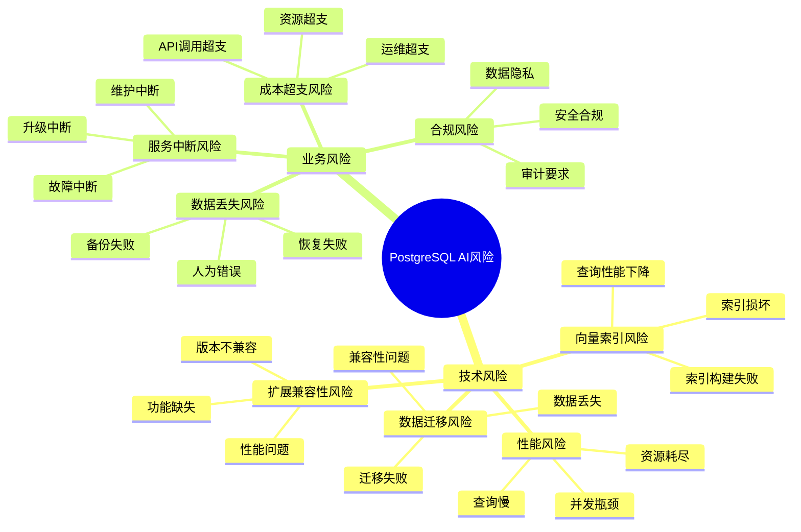
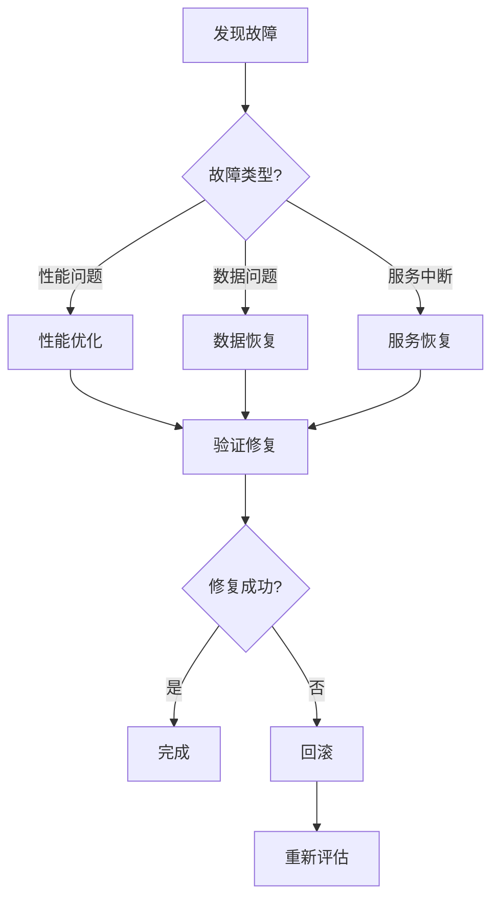

# 风险应对措施

> **文档编号**: AI-07-04
> **最后更新**: 2025年1月
> **主题**: 21-最佳实践
> **子主题**: 04-风险应对措施

## 📑 目录

- [风险应对措施](#风险应对措施)
  - [📑 目录](#-目录)
  - [1. 风险概述](#1-风险概述)
  - [2. 技术风险](#2-技术风险)
    - [2.1 向量索引风险](#21-向量索引风险)
    - [2.2 性能风险](#22-性能风险)
    - [2.3 数据迁移风险](#23-数据迁移风险)
    - [2.4 扩展兼容性风险](#24-扩展兼容性风险)
  - [3. 业务风险](#3-业务风险)
    - [3.1 服务中断风险](#31-服务中断风险)
    - [3.2 数据丢失风险](#32-数据丢失风险)
    - [3.3 成本超支风险](#33-成本超支风险)
    - [3.4 合规风险](#34-合规风险)
  - [4. 风险应对策略](#4-风险应对策略)
    - [4.1 预防措施](#41-预防措施)
    - [4.2 监控告警](#42-监控告警)
    - [4.3 应急预案](#43-应急预案)
    - [4.4 回滚方案](#44-回滚方案)
  - [5. 升级与迁移](#5-升级与迁移)
    - [5.1 版本兼容性](#51-版本兼容性)
    - [5.2 零停机升级](#52-零停机升级)
    - [5.3 数据迁移方案](#53-数据迁移方案)
    - [5.4 回滚策略](#54-回滚策略)

---

## 1. 风险概述

**风险分类**：



---

## 2. 技术风险

### 2.1 向量索引风险

**风险描述**：

- 索引构建失败
- 索引损坏
- 查询性能不达标

**预防措施**：

```sql
-- 1. 使用CONCURRENTLY创建索引（避免锁表）
CREATE INDEX CONCURRENTLY ON documents
USING hnsw(embedding vector_cosine_ops)
WITH (m = 16, ef_construction = 64);

-- 2. 检查索引状态
SELECT
    schemaname,
    tablename,
    indexname,
    indexdef
FROM pg_indexes
WHERE tablename = 'documents';

-- 3. 验证索引完整性
SELECT * FROM pg_stat_user_indexes
WHERE indexrelname = 'documents_embedding_idx';
```

**应急预案**：

```sql
-- 1. 索引损坏时重建
DROP INDEX CONCURRENTLY documents_embedding_idx;
CREATE INDEX CONCURRENTLY documents_embedding_idx
ON documents USING hnsw(embedding vector_cosine_ops);

-- 2. 使用REINDEX重建
REINDEX INDEX CONCURRENTLY documents_embedding_idx;
```

### 2.2 性能风险

**风险描述**：

- 查询响应时间过长
- 系统资源耗尽
- 并发性能下降

**预防措施**：

```sql
-- 1. 监控慢查询
SELECT
    pid,
    now() - query_start AS duration,
    query,
    state
FROM pg_stat_activity
WHERE (now() - query_start) > interval '5 minutes'
ORDER BY duration DESC;

-- 2. 设置查询超时
SET statement_timeout = '30s';

-- 3. 限制连接数
ALTER SYSTEM SET max_connections = 200;
```

**应急预案**：

```sql
-- 1. 终止慢查询
SELECT pg_terminate_backend(pid)
FROM pg_stat_activity
WHERE (now() - query_start) > interval '10 minutes'
  AND state = 'active';

-- 2. 紧急扩容
-- 增加计算资源
-- 使用连接池
```

### 2.3 数据迁移风险

**风险描述**：

- 数据丢失
- 迁移失败
- 数据不一致

**预防措施**：

```bash
# 1. 完整备份
pg_dump -Fc -f backup_$(date +%Y%m%d).dump ai_db

# 2. 验证备份
pg_restore --list backup_20250101.dump

# 3. 测试恢复
pg_restore -d test_db backup_20250101.dump
```

**应急预案**：

```bash
# 1. 回滚到备份
pg_restore -d ai_db backup_20250101.dump

# 2. 增量恢复
pg_restore -d ai_db --data-only backup_20250101.dump
```

### 2.4 扩展兼容性风险

**风险描述**：

- pgvector/pg_ai版本不兼容
- PostgreSQL版本不兼容
- 功能缺失

**预防措施**：

```sql
-- 1. 检查扩展版本
SELECT
    extname,
    extversion
FROM pg_extension
WHERE extname IN ('vector', 'pg_ai');

-- 2. 检查PostgreSQL版本
SELECT version();

-- 3. 测试兼容性
-- 在测试环境验证
```

**应急预案**：

```sql
-- 1. 降级扩展版本
ALTER EXTENSION vector UPDATE TO '0.7.0';

-- 2. 禁用扩展（如必要）
DROP EXTENSION IF EXISTS vector CASCADE;
```

---

## 3. 业务风险

### 3.1 服务中断风险

**风险描述**：

- 升级过程中服务中断
- 故障导致服务中断
- 维护导致服务中断

**预防措施**：

```bash
# 1. 使用零停机升级（PostgreSQL 18 pg_upgrade）
pg_upgrade \
  --old-bindir /usr/lib/postgresql/17/bin \
  --new-bindir /usr/lib/postgresql/18/bin \
  --old-datadir /var/lib/postgresql/17/data \
  --new-datadir /var/lib/postgresql/18/data \
  --check

# 2. 主从切换（高可用）
# 使用Patroni或pg_auto_failover
```

**应急预案**：

```bash
# 1. 快速回滚
# 切换到从库
pg_ctl promote -D /var/lib/postgresql/standby

# 2. 恢复主库
pg_ctl start -D /var/lib/postgresql/data
```

### 3.2 数据丢失风险

**风险描述**：

- 备份失败
- 恢复失败
- 人为误操作

**预防措施**：

```bash
# 1. 自动化备份
#!/bin/bash
BACKUP_DIR="/backup/postgresql"
DATE=$(date +%Y%m%d_%H%M%S)

# 完整备份
pg_dump -Fc -f $BACKUP_DIR/backup_$DATE.dump ai_db

# WAL归档
# postgresql.conf
archive_mode = on
archive_command = 'cp %p /backup/wal/%f'
```

**应急预案**：

```bash
# 1. PITR恢复
# 恢复到指定时间点
recovery_target_time = '2025-01-15 14:30:00'
restore_command = 'cp /backup/wal/%f %p'
```

### 3.3 成本超支风险

**风险描述**：

- AI API调用成本超支
- 基础设施成本超支
- 运维成本超支

**预防措施**：

```sql
-- 1. 成本监控
CREATE TABLE cost_tracking (
    id SERIAL PRIMARY KEY,
    cost_type TEXT NOT NULL,
    amount DECIMAL(10, 2) NOT NULL,
    date DATE NOT NULL
);

-- 2. API调用监控
SELECT
    COUNT(*) AS api_calls,
    SUM(cost) AS total_cost
FROM api_call_log
WHERE date >= CURRENT_DATE - INTERVAL '1 day';
```

**应急预案**：

```sql
-- 1. 限制API调用
ALTER SYSTEM SET pg_ai.rate_limit = 1000;  -- 每小时1000次

-- 2. 启用缓存
-- 使用embedding_cache表
```

### 3.4 合规风险

**风险描述**：

- 数据隐私违规
- 安全合规问题
- 审计要求不满足

**预防措施**：

```sql
-- 1. 数据加密
-- 传输加密（SSL）
ALTER SYSTEM SET ssl = on;

-- 2. 审计日志
CREATE EXTENSION pgaudit;
ALTER SYSTEM SET pgaudit.log = 'all';

-- 3. 访问控制
-- pg_hba.conf
host all all 10.0.0.0/8 md5
```

**应急预案**：

```sql
-- 1. 紧急禁用访问
-- 修改pg_hba.conf
host all all 0.0.0.0/0 reject

-- 2. 审计检查
SELECT * FROM pg_stat_statements
WHERE query LIKE '%sensitive_data%';
```

---

## 4. 风险应对策略

### 4.1 预防措施

**技术预防**：

- ✅ 充分测试
- ✅ 分阶段实施
- ✅ 监控告警
- ✅ 自动化备份

**流程预防**：

- ✅ 变更管理流程
- ✅ 代码审查
- ✅ 部署检查清单
- ✅ 回滚准备

### 4.2 监控告警

**监控指标**：

```sql
-- 1. 性能监控
SELECT
    datname,
    numbackends,
    xact_commit,
    xact_rollback,
    blks_read,
    blks_hit
FROM pg_stat_database
WHERE datname = 'ai_db';

-- 2. 连接监控
SELECT count(*) FROM pg_stat_activity;

-- 3. 锁监控
SELECT * FROM pg_locks WHERE NOT granted;
```

**告警规则**：

```yaml
# Prometheus告警
groups:
  - name: postgres_alerts
    rules:
      - alert: HighConnections
        expr: pg_stat_database_numbackends > 80
        for: 5m

      - alert: SlowQueries
        expr: pg_stat_statements_mean_exec_time > 5000
        for: 5m

      - alert: HighAPICost
        expr: api_cost_per_day > 100
        for: 1h
```

### 4.3 应急预案

**故障处理流程**：



**应急联系人**：

- DBA：24/7待命
- 开发团队：工作时间
- 运维团队：24/7待命

### 4.4 回滚方案

**回滚检查清单**：

1. ✅ 备份验证
2. ✅ 回滚脚本准备
3. ✅ 回滚测试
4. ✅ 回滚时间窗口
5. ✅ 回滚影响评估

**回滚步骤**：

```bash
# 1. 停止服务
systemctl stop postgresql-18

# 2. 恢复备份
pg_restore -d ai_db backup_20250101.dump

# 3. 验证数据
psql -d ai_db -c "SELECT COUNT(*) FROM documents;"

# 4. 重启服务
systemctl start postgresql-18
```

---

## 5. 升级与迁移

### 5.1 版本兼容性

**PostgreSQL 18兼容性**：

| 扩展 | 最低版本 | 推荐版本 | 状态 |
|------|---------|---------|------|
| **pgvector** | 0.5.0 | 0.8.0 | ✅ 兼容 |
| **pg_ai** | 0.1.0 | 最新 | ✅ 兼容 |
| **PostgresML** | 3.0 | 3.0+ | ✅ 兼容 |

**兼容性检查**：

```bash
# 1. 检查扩展兼容性
pg_upgrade --check

# 2. 检查数据兼容性
pg_upgrade --check --old-bindir /usr/lib/postgresql/17/bin \
  --new-bindir /usr/lib/postgresql/18/bin
```

### 5.2 零停机升级

**PostgreSQL 18升级**：

```bash
# 1. 使用pg_upgrade（PostgreSQL 18保留统计信息）
pg_upgrade \
  --old-bindir /usr/lib/postgresql/17/bin \
  --new-bindir /usr/lib/postgresql/18/bin \
  --old-datadir /var/lib/postgresql/17/data \
  --new-datadir /var/lib/postgresql/18/data \
  --check

# 2. 执行升级
pg_upgrade \
  --old-bindir /usr/lib/postgresql/17/bin \
  --new-bindir /usr/lib/postgresql/18/bin \
  --old-datadir /var/lib/postgresql/17/data \
  --new-datadir /var/lib/postgresql/18/data
```

**高可用升级**：

```bash
# 1. 升级从库
# 2. 切换主从
# 3. 升级原主库
# 4. 切换回来
```

### 5.3 数据迁移方案

**迁移策略**：

1. **全量迁移**：
   - 适用于小数据量
   - 停机时间短
   - 风险低

2. **增量迁移**：
   - 适用于大数据量
   - 停机时间短
   - 需要CDC

3. **双写迁移**：
   - 零停机
   - 风险最低
   - 复杂度高

**迁移步骤**：

```bash
# 1. 准备阶段
# - 备份数据
# - 验证环境
# - 准备迁移脚本

# 2. 执行阶段
# - 停止写入
# - 迁移数据
# - 验证数据

# 3. 切换阶段
# - 切换应用
# - 验证功能
# - 监控性能
```

### 5.4 回滚策略

**回滚条件**：

- 数据丢失
- 性能严重下降
- 功能异常
- 安全漏洞

**回滚步骤**：

```bash
# 1. 评估影响
# 2. 准备回滚
# 3. 执行回滚
# 4. 验证恢复
# 5. 总结问题
```

---

**最后更新**: 2025年1月
**维护者**: PostgreSQL Modern Team
**文档编号**: AI-07-04
