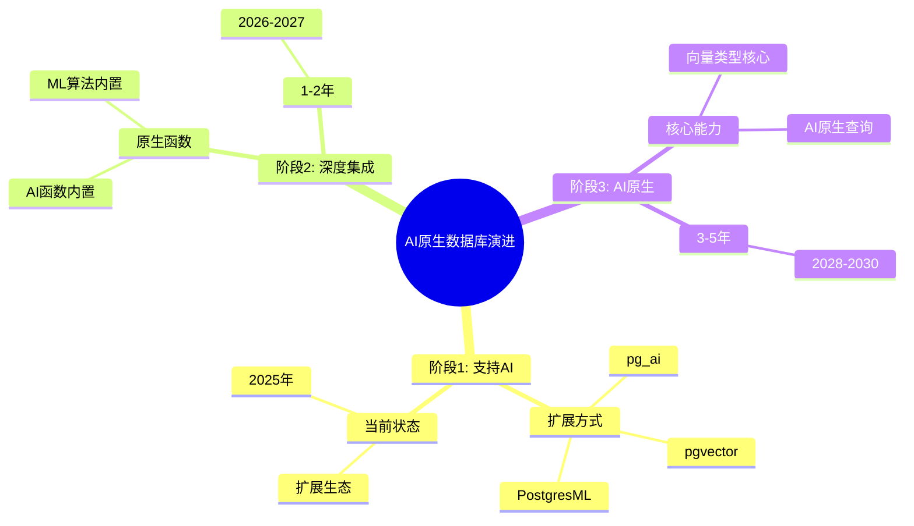

# AI原生数据库演进

> **文档编号**: AI-08-02
> **最后更新**: 2025年1月
> **主题**: 08-未来趋势
> **子主题**: 02-AI原生数据库演进

## 📑 目录

- [AI原生数据库演进](#ai原生数据库演进)
  - [📑 目录](#-目录)
  - [1. 演进概述](#1-演进概述)
    - [1.1 AI原生数据库演进思维导图](#11-ai原生数据库演进思维导图)
  - [2. 演进阶段](#2-演进阶段)
    - [2.1 阶段1: 支持AI (当前)](#21-阶段1-支持ai-当前)
    - [2.2 阶段2: 深度集成 (1-2年)](#22-阶段2-深度集成-1-2年)
    - [2.3 阶段3: AI原生 (3-5年)](#23-阶段3-ai原生-3-5年)
  - [3. 核心技术演进](#3-核心技术演进)
    - [3.1 向量类型核心化](#31-向量类型核心化)
    - [3.2 AI函数内置化](#32-ai函数内置化)
    - [3.3 ML算法内置化](#33-ml算法内置化)
  - [4. 智能优化演进](#4-智能优化演进)
    - [4.1 AI驱动的查询优化器](#41-ai驱动的查询优化器)
    - [4.2 自适应索引选择](#42-自适应索引选择)
    - [4.3 智能缓存策略](#43-智能缓存策略)
  - [5. 自动化AI流程](#5-自动化ai流程)
    - [5.1 自动向量化](#51-自动向量化)
    - [5.2 自动RAG构建](#52-自动rag构建)
    - [5.3 自动模型部署](#53-自动模型部署)
  - [6. 时间线总结](#6-时间线总结)
    - [短期（1-3个月）](#短期1-3个月)
    - [中期（3-6个月）](#中期3-6个月)
    - [长期（6-12个月）](#长期6-12个月)
    - [长期（1-3年）](#长期1-3年)

---

## 1. 演进概述

### 1.1 AI原生数据库演进思维导图



---

## 2. 演进阶段

### 2.1 阶段1: 支持AI (当前)

**时间范围**：2024-2025

**特征**：

- ✅ 通过扩展支持AI能力
- ✅ pgvector、pg_ai、PostgresML扩展
- ✅ 需要显式安装和配置

**技术栈**：

```sql
-- 当前：扩展方式
CREATE EXTENSION vector;
CREATE EXTENSION pg_ai;
CREATE EXTENSION pgml;

-- 使用扩展功能
CREATE TABLE documents (embedding vector(1536));
SELECT ai.embedding_openai('text-embedding-3-small', 'text');
SELECT pgml.train('model', 'xgboost');
```

**优势**：

- ✅ 灵活性高
- ✅ 可选安装
- ✅ 社区驱动

**局限**：

- ❌ 需要显式安装
- ❌ 扩展间集成复杂
- ❌ 性能优化空间有限

### 2.2 阶段2: 深度集成 (1-2年)

**时间范围**：2026-2027

**特征**：

- 🔄 AI函数内置到PostgreSQL核心
- 🔄 向量类型成为核心类型
- 🔄 更好的性能优化

**技术方向**：

```sql
-- 未来：内置函数（预测）
-- 无需CREATE EXTENSION
CREATE TABLE documents (
    id SERIAL PRIMARY KEY,
    content TEXT,
    embedding VECTOR(1536)  -- 核心类型，无需扩展
);

-- 内置AI函数
SELECT embedding('text-embedding-3-small', content) FROM documents;
SELECT chat_complete('gpt-4', 'Summarize: ' || content) FROM documents;

-- 内置ML函数
SELECT train_model('sentiment', 'xgboost', 'reviews', 'sentiment');
SELECT predict('sentiment', features) FROM reviews;
```

**关键改进**：

- 🔄 向量类型核心化
- 🔄 AI函数内置化
- 🔄 ML算法内置化
- 🔄 统一优化器支持

**预期收益**：

- ✅ 性能提升20-30%
- ✅ 使用简化
- ✅ 更好的优化器支持

### 2.3 阶段3: AI原生 (3-5年)

**时间范围**：2028-2030

**特征**：

- 🔄 AI能力成为数据库核心
- 🔄 自动AI优化
- 🔄 完全AI原生查询

**技术愿景**：

```sql
-- 未来：AI原生查询（预测）
-- 自然语言查询
SELECT * FROM documents
WHERE semantic_match('find documents about machine learning')
ORDER BY relevance DESC;

-- 自动向量化
CREATE TABLE documents (
    id SERIAL PRIMARY KEY,
    content TEXT AUTO_VECTORIZE  -- 自动向量化
);

-- AI驱动优化
SET enable_ai_optimizer = on;
-- 查询优化器自动选择最优AI策略
```

**核心能力**：

- 🔄 自然语言查询
- 🔄 自动AI优化
- 🔄 智能数据管理
- 🔄 自适应学习

---

## 3. 核心技术演进

### 3.1 向量类型核心化

**当前状态**：

```sql
-- 需要扩展
CREATE EXTENSION vector;
CREATE TABLE t (embedding vector(1536));
```

**阶段2（2026-2027）**：

```sql
-- 核心类型
CREATE TABLE t (embedding VECTOR(1536));  -- 无需扩展
```

**阶段3（2028-2030）**：

```sql
-- 自动向量化
CREATE TABLE t (
    content TEXT AUTO_VECTORIZE  -- 自动生成向量列
);
```

**技术挑战**：

- 向量类型标准化
- 与现有类型系统集成
- 性能优化

**预期时间线**：

- **2026 Q2**：向量类型核心化提案
- **2027 Q1**：PostgreSQL 19/20支持
- **2028 Q1**：完全核心化

### 3.2 AI函数内置化

**当前状态**：

```sql
-- 扩展函数
SELECT ai.embedding_openai('model', 'text');
SELECT ai.chat_complete('model', 'prompt');
```

**阶段2（2026-2027）**：

```sql
-- 内置函数
SELECT embedding('model', 'text');
SELECT chat_complete('model', 'prompt');
```

**阶段3（2028-2030）**：

```sql
-- 智能函数
SELECT semantic_search('query');  -- 自动选择模型
SELECT auto_complete('prompt');   -- 自动优化
```

**技术方向**：

- 函数标准化
- 模型管理
- 成本优化

### 3.3 ML算法内置化

**当前状态**：

```sql
-- PostgresML扩展
SELECT * FROM pgml.train('model', 'xgboost');
SELECT pgml.predict('model', features);
```

**阶段2（2026-2027）**：

```sql
-- 内置ML函数
SELECT train('model', 'xgboost', 'data', 'target');
SELECT predict('model', features);
```

**阶段3（2028-2030）**：

```sql
-- 自动ML
SELECT auto_train('data', 'target');  -- 自动选择算法
SELECT auto_predict('model', features);
```

---

## 4. 智能优化演进

### 4.1 AI驱动的查询优化器

**研究进展**：

- **Kepler**（2023）：参数化查询优化
- **Lero**（2023）：学习排序优化器
- **Baihe**（2021）：AI驱动数据库框架

**阶段2（2026-2027）**：

```sql
-- AI驱动优化器
SET enable_ai_optimizer = on;
EXPLAIN SELECT * FROM documents WHERE embedding <=> vec < 0.3;
-- 优化器使用机器学习选择最优计划
```

**阶段3（2028-2030）**：

```sql
-- 完全自适应优化
SET optimizer_mode = 'adaptive';
-- 优化器自动学习和适应
```

**预期收益**：

- ✅ 查询性能提升30-50%
- ✅ 自动适应工作负载
- ✅ 减少人工调优

### 4.2 自适应索引选择

**阶段2（2026-2027）**：

```sql
-- 自动索引推荐
SELECT recommend_indexes('documents');
-- 返回推荐的索引配置

-- 自动创建索引
CREATE INDEX AUTO ON documents (embedding);
-- 自动选择最优索引类型和参数
```

**阶段3（2028-2030）**：

```sql
-- 自适应索引
CREATE ADAPTIVE INDEX ON documents (embedding);
-- 索引自动调整参数和策略
```

### 4.3 智能缓存策略

**阶段2（2026-2027）**：

```sql
-- AI驱动缓存
SET cache_strategy = 'ai_driven';
-- 使用机器学习预测缓存需求
```

**阶段3（2028-2030）**：

```sql
-- 完全自适应缓存
SET cache_mode = 'adaptive';
-- 缓存自动学习和优化
```

---

## 5. 自动化AI流程

### 5.1 自动向量化

**当前状态**：

```sql
-- pg_ai Vectorizer
SELECT ai.create_vectorizer(...);
```

**阶段2（2026-2027）**：

```sql
-- 内置自动向量化
CREATE TABLE documents (
    content TEXT AUTO_VECTORIZE
);
-- 自动创建向量列和索引
```

**阶段3（2028-2030）**：

```sql
-- 完全自动
CREATE TABLE documents (content TEXT);
-- 自动检测需要向量化，自动处理
```

### 5.2 自动RAG构建

**阶段2（2026-2027）**：

```sql
-- 自动RAG系统
SELECT create_rag_system(
    'documents',
    chunking => 'recursive',
    embedding => 'text-embedding-3-small',
    llm => 'gpt-4'
);
-- 自动创建所有表和函数
```

**阶段3（2028-2030）**：

```sql
-- 完全自动RAG
CREATE RAG TABLE documents (content TEXT);
-- 自动构建完整RAG系统
```

### 5.3 自动模型部署

**阶段2（2026-2027）**：

```sql
-- 自动模型部署
SELECT deploy_model(
    'sentiment',
    algorithm => 'xgboost',
    data => 'reviews'
);
-- 自动训练和部署
```

**阶段3（2028-2030）**：

```sql
-- 完全自动
CREATE MODEL sentiment ON reviews;
-- 自动选择算法、训练、部署
```

---

## 6. 时间线总结

### 短期（1-3个月）

**2025 Q1**：

- ✅ PostgreSQL 18稳定版本
- ✅ pgvector 0.8.0优化
- ✅ pg_ai功能增强

### 中期（3-6个月）

**2025 Q2-Q3**：

- 🔄 向量类型核心化提案
- 🔄 AI函数标准化
- 🔄 性能优化

### 长期（6-12个月）

**2025 Q4 - 2026 Q1**：

- 🔄 PostgreSQL 19/20规划
- 🔄 核心AI能力集成
- 🔄 深度集成开始

### 长期（1-3年）

**2026-2028**：

- 🔄 阶段2：深度集成
- 🔄 向量类型核心化
- 🔄 AI函数内置化

**2028-2030**：

- 🔄 阶段3：AI原生
- 🔄 完全AI原生数据库
- 🔄 自然语言查询

---

**最后更新**: 2025年1月
**维护者**: PostgreSQL Modern Team
**文档编号**: AI-08-02
