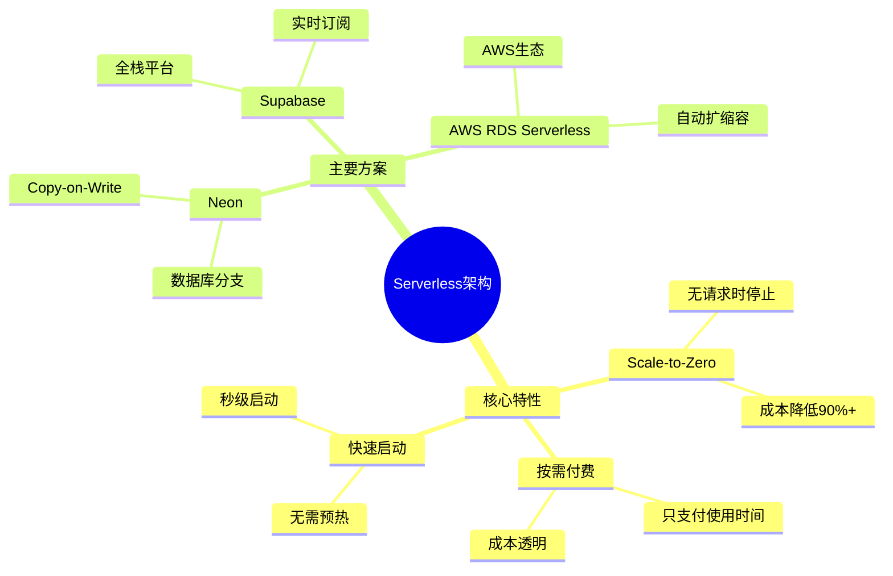
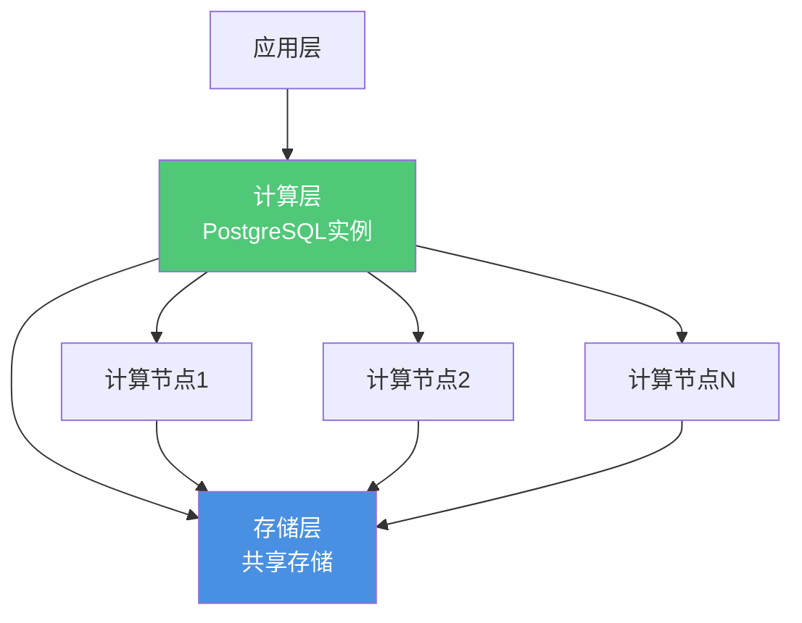
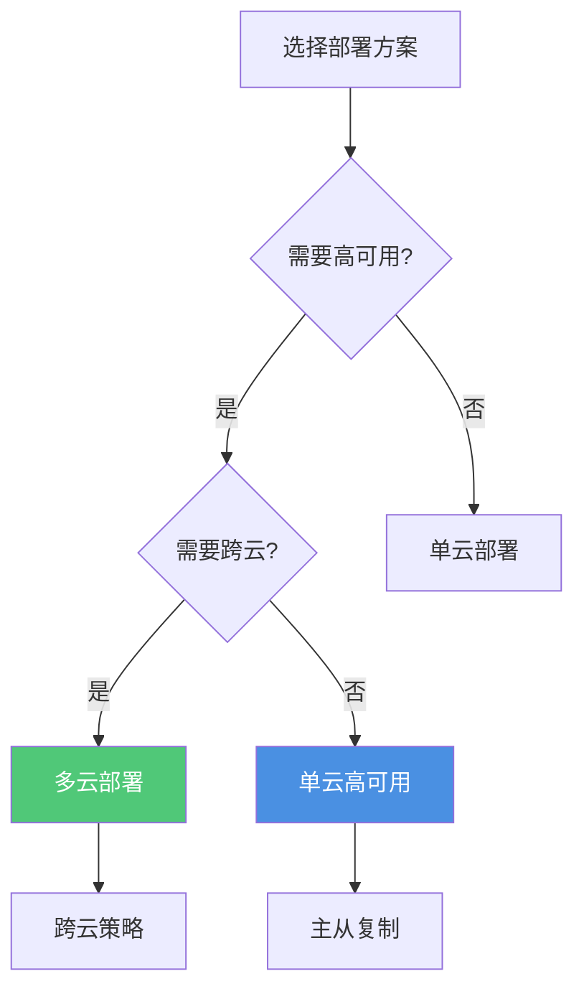
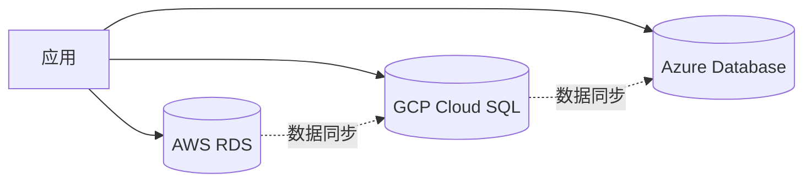
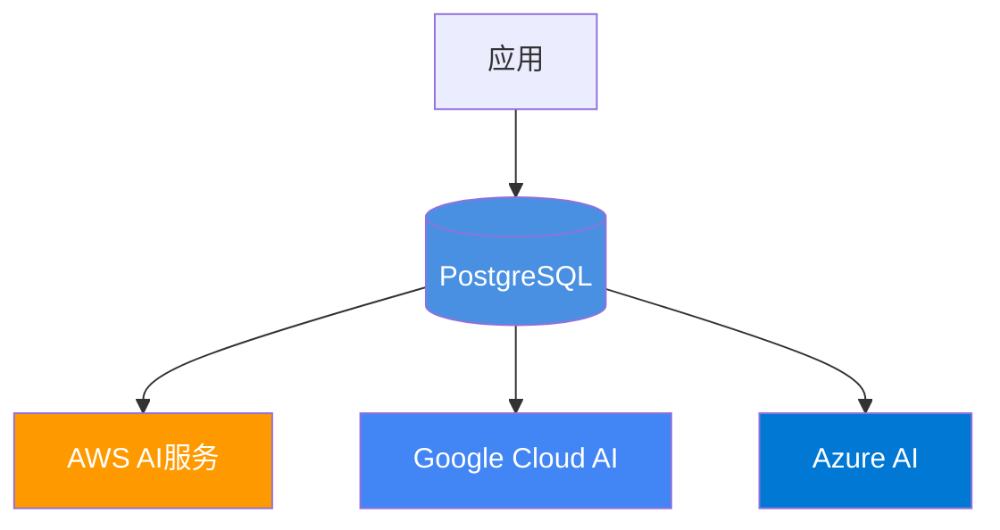

# 云原生集成趋势

> **文档编号**: AI-08-05
> **最后更新**: 2025年1月
> **主题**: 08-未来趋势
> **子主题**: 05-云原生集成趋势

## 📑 目录

- [2.1 Serverless架构思维导图](#21-serverless架构思维导图)
- [2.2 Neon Serverless架构](#22-neon-serverless架构)
- [2.3 Supabase Serverless](#23-supabase-serverless)
- [2.4 成本优化策略](#24-成本优化策略)
- [3.1 存算分离架构UML图](#31-存算分离架构uml图)
- [3.2 存储层设计](#32-存储层设计)
- [3.3 计算层设计](#33-计算层设计)
- [3.4 数据同步机制](#34-数据同步机制)
- [4.1 多云架构决策树](#41-多云架构决策树)
- [4.2 跨云部署方案](#42-跨云部署方案)
- [4.3 数据迁移策略](#43-数据迁移策略)
- [4.4 容灾备份方案](#44-容灾备份方案)
- [5.1 云AI服务集成架构图](#51-云ai服务集成架构图)
- [5.2 AWS AI服务集成](#52-aws-ai服务集成)
- [5.3 Google Cloud AI集成](#53-google-cloud-ai集成)
- [5.4 Azure AI服务集成](#54-azure-ai服务集成)

---

## 1. 云原生概述

**云原生趋势**：

- ✅ Serverless架构
- ✅ 存算分离
- ✅ 多云部署
- ✅ 云AI服务集成

**核心价值**：

- 弹性扩展
- 按需付费
- 降低运维成本
- 提升可用性

---

## 2. Serverless架构

### 2.1 Serverless架构思维导图



### 2.2 Neon Serverless架构

**架构特点**：

- ✅ 数据库分支（Database Branching）
- ✅ Copy-on-Write技术
- ✅ Scale-to-Zero
- ✅ 秒级分支创建

**使用场景**：

- AI Agent应用
- 开发测试环境
- 快速原型

**成本优势**：

- 成本降低90%+
- 按需付费
- 无闲置成本

**示例**：

```bash
# Neon CLI
neonctl projects create --name ai-app
neonctl branches create --name main

# 创建Agent分支（秒级）
neonctl branches create --name agent-123 FROM main
```

### 2.3 Supabase Serverless

**架构特点**：

- ✅ 全栈Serverless平台
- ✅ 实时订阅
- ✅ 自动API生成
- ✅ 内置认证

**使用场景**：

- 快速原型开发
- 中小型应用
- 全栈应用

**集成能力**：

- pgvector支持
- 实时数据同步
- Edge Functions

**示例**：

```sql
-- Supabase自动向量化
CREATE TABLE documents (
    id SERIAL PRIMARY KEY,
    content TEXT,
    embedding vector(1536) GENERATED ALWAYS AS (
        embedding('text-embedding-3-small', content)
    ) STORED
);
```

### 2.4 成本优化策略

**优化措施**：

1. **Scale-to-Zero配置**：

```sql
-- 自动停止配置
ALTER BRANCH SET auto_suspend_seconds = 300;  -- 5分钟无请求自动停止
```

1. **使用监控**：

```sql
-- 监控分支使用情况
SELECT branch_name, last_active_at, request_count
FROM branch_usage_stats;
```

1. **自动清理**：

```sql
-- 清理不活跃分支
DELETE FROM branches
WHERE last_active_at < NOW() - INTERVAL '30 days';
```

**成本对比**：

| 方案 | 1000分支/月 | 成本节约 |
|------|------------|---------|
| **传统方案** | $10,000 | - |
| **Serverless** | $1,000 | **90%** |

---

## 3. 存算分离架构

### 3.1 存算分离架构UML图



### 3.2 存储层设计

**存储架构**：

- 共享存储（S3/OSS）
- 数据分层（热/温/冷）
- 自动压缩
- 版本控制

**PostgreSQL 18优化**：

- WAL压缩（lz4）
- 异步I/O（性能提升3x）
- 存储优化

**实现**：

```sql
-- WAL压缩（PostgreSQL 18）
ALTER SYSTEM SET wal_compression = lz4;

-- 异步I/O（PostgreSQL 18）
ALTER SYSTEM SET io_method = 'io_uring';  -- Linux
```

### 3.3 计算层设计

**计算架构**：

- 独立计算节点
- 自动扩缩容
- 负载均衡
- 故障转移

**Kubernetes部署**：

```yaml
apiVersion: autoscaling/v2
kind: HorizontalPodAutoscaler
metadata:
  name: postgres-hpa
spec:
  scaleTargetRef:
    apiVersion: apps/v1
    kind: StatefulSet
    name: postgres
  minReplicas: 1
  maxReplicas: 10
  metrics:
  - type: Resource
    resource:
      name: cpu
      target:
        type: Utilization
        averageUtilization: 70
```

### 3.4 数据同步机制

**同步策略**：

- 实时同步（WAL流复制）
- 延迟同步（批量同步）
- 冲突解决（CRDT）

**实现**：

```sql
-- 流复制配置
ALTER SYSTEM SET wal_level = replica;
ALTER SYSTEM SET max_wal_senders = 10;

-- 创建复制槽
SELECT pg_create_physical_replication_slot('standby1');
```

---

## 4. 多云架构

### 4.1 多云架构决策树



### 4.2 跨云部署方案

**部署架构**：



**跨云同步**：

```sql
-- 逻辑复制跨云同步
CREATE PUBLICATION cross_cloud_pub FOR TABLE documents;

-- 在目标云创建订阅
CREATE SUBSCRIPTION cross_cloud_sub
CONNECTION 'host=target-cloud port=5432 dbname=ai_db'
PUBLICATION cross_cloud_pub;
```

### 4.3 数据迁移策略

**迁移方案**：

1. **全量迁移**：
   - pg_dump/pg_restore
   - 适用于小数据量

2. **增量迁移**：
   - 逻辑复制
   - 适用于大数据量

3. **双写迁移**：
   - 同时写入两个云
   - 零停机迁移

**迁移工具**：

- pg_dump/pg_restore
- pg_upgrade
- 逻辑复制
- 第三方工具（AWS DMS等）

### 4.4 容灾备份方案

**备份策略**：

- 跨云备份
- 多区域备份
- 自动备份
- 快速恢复

**实现**：

```bash
# 跨云备份脚本
#!/bin/bash
BACKUP_FILE="backup_$(date +%Y%m%d).dump"

# 备份到本地
pg_dump -Fc -f $BACKUP_FILE ai_db

# 上传到多个云
aws s3 cp $BACKUP_FILE s3://backup-bucket/
gsutil cp $BACKUP_FILE gs://backup-bucket/
az storage blob upload --file $BACKUP_FILE --container backups
```

---

## 5. 云AI服务集成

### 5.1 云AI服务集成架构图



### 5.2 AWS AI服务集成

**集成服务**：

- Amazon Bedrock
- Amazon SageMaker
- Amazon Comprehend
- Amazon Rekognition

**集成方式**：

```sql
-- AWS AI服务FDW（预测）
CREATE FOREIGN TABLE bedrock_embeddings (
    text TEXT,
    embedding vector(1536)
) SERVER aws_bedrock_server
OPTIONS (
    region 'us-east-1',
    model 'amazon.titan-embed-text-v1'
);

-- 查询AWS AI服务
SELECT embedding FROM bedrock_embeddings
WHERE text = 'query';
```

**使用场景**：

- AWS生态应用
- 企业级AI应用
- 大规模部署

### 5.3 Google Cloud AI集成

**集成服务**：

- Vertex AI
- Cloud AI Platform
- Cloud Natural Language
- Cloud Vision API

**集成方式**：

```sql
-- Google Cloud AI集成（预测）
CREATE FOREIGN TABLE vertex_ai_embeddings (
    text TEXT,
    embedding vector(768)
) SERVER gcp_vertex_ai_server
OPTIONS (
    project_id 'project-id',
    model 'textembedding-gecko@001'
);
```

**使用场景**：

- GCP生态应用
- 多模态AI应用
- 企业AI平台

### 5.4 Azure AI服务集成

**集成服务**：

- Azure OpenAI Service
- Azure Cognitive Services
- Azure Machine Learning
- Azure Form Recognizer

**集成方式**：

```sql
-- Azure AI服务集成（预测）
CREATE FOREIGN TABLE azure_openai_embeddings (
    text TEXT,
    embedding vector(1536)
) SERVER azure_openai_server
OPTIONS (
    endpoint 'https://xxx.openai.azure.com',
    api_key 'key',
    deployment_name 'text-embedding-ada-002'
);
```

**使用场景**：

- Azure生态应用
- 企业AI应用
- 混合云部署

---

## 6. 发展趋势

**2025年趋势**：

- ✅ Serverless成熟
- ✅ 存算分离普及
- ✅ 多云部署增长
- ✅ 云AI服务深度集成

**2026-2027年趋势**：

- 🔄 完全Serverless
- 🔄 边缘计算支持
- 🔄 AI原生云服务
- 🔄 自动化运维

---

**最后更新**: 2025年1月
**维护者**: PostgreSQL Modern Team
**文档编号**: AI-08-05
