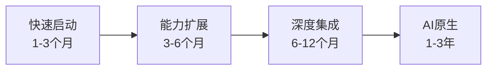
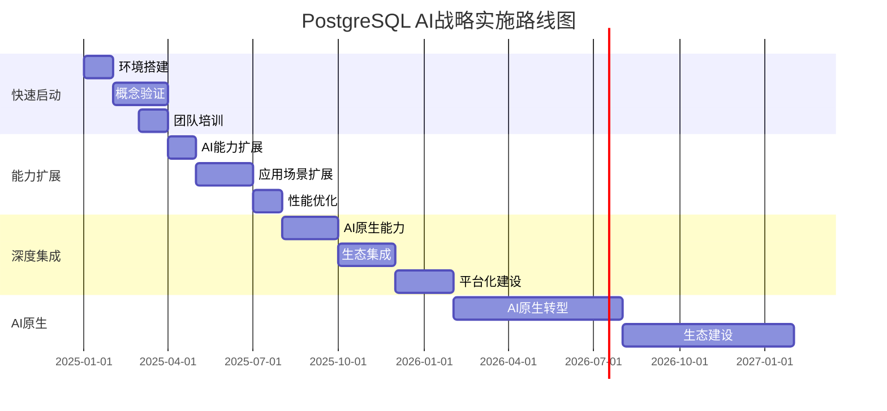

# PostgreSQL AI 战略实施建议

> **文档编号**: AI-08-03
> **最后更新**: 2025年1月
> **主题**: ROADMAP-2025.md
> **子主题**: 03-战略实施建议

## 📑 目录

- [PostgreSQL AI 战略实施建议](#postgresql-ai-战略实施建议)
  - [📑 目录](#-目录)
  - [1. 战略实施概述](#1-战略实施概述)
  - [2. 快速启动阶段（1-3个月）](#2-快速启动阶段1-3个月)
    - [2.1 快速启动阶段](#21-快速启动阶段)
    - [2.2 基础能力建设](#22-基础能力建设)
    - [2.3 试点项目](#23-试点项目)
  - [3. 能力扩展阶段（3-6个月）](#3-能力扩展阶段3-6个月)
    - [3.1 能力扩展阶段](#31-能力扩展阶段)
    - [3.2 系统优化](#32-系统优化)
    - [3.3 规模化应用](#33-规模化应用)
  - [4. 深度集成阶段（6-12个月）](#4-深度集成阶段6-12个月)
    - [4.1 深度集成阶段](#41-深度集成阶段)
    - [4.2 AI原生转型](#42-ai原生转型)
    - [4.3 生态建设](#43-生态建设)
  - [5. 路线图概览](#5-路线图概览)
    - [路线图概览](#路线图概览)
    - [关键技术节点](#关键技术节点)
  - [6. 风险与应对](#6-风险与应对)
    - [技术风险](#技术风险)
    - [业务风险](#业务风险)
    - [应对策略](#应对策略)
  - [7. 成功指标](#7-成功指标)
    - [技术指标](#技术指标)
    - [业务指标](#业务指标)

---

## 1. 战略实施概述

**实施原则**：

- ✅ **渐进式演进**：分阶段实施，降低风险
- ✅ **快速验证**：小步快跑，快速迭代
- ✅ **价值驱动**：以业务价值为导向
- ✅ **技术领先**：采用最新技术和最佳实践

**实施路径**：



---

## 2. 快速启动阶段（1-3个月）

### 2.1 快速启动阶段

**目标**：快速验证PostgreSQL AI能力，建立基础能力

**关键任务**：

1. **环境搭建**（1周）
   - 部署PostgreSQL 18
   - 安装pgvector扩展
   - 配置基础环境

2. **概念验证**（2周）
   - 实现基础向量搜索
   - 验证性能指标
   - 评估技术可行性

3. **团队培训**（1周）
   - PostgreSQL AI基础培训
   - pgvector使用培训
   - 最佳实践分享

**交付物**：

- ✅ PostgreSQL AI环境
- ✅ 概念验证项目
- ✅ 团队培训完成

### 2.2 基础能力建设

**核心能力**：

1. **向量搜索能力**：

```sql
-- 安装pgvector
CREATE EXTENSION vector;

-- 创建向量表
CREATE TABLE documents (
    id SERIAL PRIMARY KEY,
    content TEXT,
    embedding vector(1536)
);

-- 创建索引
CREATE INDEX ON documents
USING hnsw(embedding vector_cosine_ops);

-- 向量搜索
SELECT id, content, embedding <=> query_vec AS distance
FROM documents
ORDER BY embedding <=> query_vec
LIMIT 10;
```

1. **基础AI集成**：

```sql
-- 安装pg_ai
CREATE EXTENSION pg_ai;

-- 配置API密钥
ALTER SYSTEM SET pg_ai.openai_api_key = 'key';
SELECT pg_reload_conf();

-- AI函数调用
SELECT ai.embedding_openai('text-embedding-3-small', 'text');
```

**能力清单**：

- ✅ 向量存储和搜索
- ✅ 相似度计算
- ✅ 基础AI函数调用
- ✅ 性能监控

### 2.3 试点项目

**项目选择标准**：

- 业务价值明确
- 技术风险可控
- 快速见效

**典型试点项目**：

1. **文档搜索系统**：
   - 目标：提升文档检索效率
   - 技术：pgvector + 全文搜索
   - 预期：检索准确率提升30%

2. **推荐系统**：
   - 目标：提升推荐准确性
   - 技术：pgvector + 协同过滤
   - 预期：推荐点击率提升20%

**成功标准**：

- ✅ 功能正常
- ✅ 性能达标
- ✅ 用户满意
- ✅ 成本可控

---

## 3. 能力扩展阶段（3-6个月）

### 3.1 能力扩展阶段

**目标**：扩展AI能力，支持更多应用场景

**关键任务**：

1. **AI能力扩展**（1个月）
   - 集成pg_ai完整功能
   - 集成PostgresML
   - 实现自动化向量化

2. **应用场景扩展**（2个月）
   - RAG系统开发
   - 智能推荐系统
   - 智能客服系统

3. **性能优化**（1个月）
   - 查询性能优化
   - 索引优化
   - 系统调优

**新增能力**：

```sql
-- 自动向量化
SELECT ai.create_vectorizer(
    'documents'::regclass,
    destination => 'document_embeddings',
    embedding => ai.embedding_openai('text-embedding-3-small', 'content')
);

-- ML模型训练
SELECT * FROM pgml.train(
    project_name => 'sentiment',
    task => 'classification',
    relation_name => 'reviews',
    y_column_name => 'sentiment',
    algorithm => 'xgboost'
);

-- 实时推理
SELECT pgml.predict('sentiment', features) FROM reviews;
```

### 3.2 系统优化

**优化方向**：

1. **性能优化**：
   - HNSW索引参数调优
   - 查询计划优化
   - 缓存策略优化

2. **成本优化**：
   - API调用优化
   - 资源使用优化
   - 自动化运维

3. **可靠性优化**：
   - 高可用架构
   - 备份恢复策略
   - 监控告警

**优化指标**：

- ✅ 查询性能提升30%+
- ✅ 成本降低20%+
- ✅ 可用性99.9%+

### 3.3 规模化应用

**规模化策略**：

1. **数据规模扩展**：
   - 支持百万级向量
   - 支持TB级数据
   - 支持高并发查询

2. **应用扩展**：
   - 多个业务场景
   - 多个应用系统
   - 跨部门应用

3. **团队扩展**：
   - 扩大团队规模
   - 能力建设
   - 知识分享

**规模化指标**：

- ✅ 支持10+应用场景
- ✅ 处理1B+向量
- ✅ 支持1000+ QPS

---

## 4. 深度集成阶段（6-12个月）

### 4.1 深度集成阶段

**目标**：深度集成AI能力，实现AI原生应用

**关键任务**：

1. **AI原生能力**（2个月）
   - AI Agent支持
   - 长期记忆管理
   - 工具调用系统

2. **生态集成**（2个月）
   - LangChain集成
   - LlamaIndex集成
   - MCP Server开发

3. **平台化建设**（2个月）
   - AI平台建设
   - 统一API
   - 管理界面

**AI原生能力**：

```sql
-- Agent记忆管理
CREATE TABLE agent_memory (
    id SERIAL PRIMARY KEY,
    agent_id TEXT,
    content TEXT,
    embedding vector(1536),
    importance_score DECIMAL(3, 2)
);

-- 记忆检索
SELECT content FROM agent_memory
WHERE agent_id = 'agent_1'
  AND embedding <=> query_vec < 0.3
ORDER BY importance_score DESC;
```

### 4.2 AI原生转型

**转型方向**：

1. **数据模型转型**：
   - 向量优先设计
   - 多模态支持
   - 智能数据管理

2. **应用架构转型**：
   - AI原生架构
   - 智能决策系统
   - 自动化流程

3. **组织能力转型**：
   - AI团队建设
   - AI文化培养
   - AI能力认证

**转型指标**：

- ✅ 50%+应用使用AI能力
- ✅ AI原生应用占比30%+
- ✅ 团队AI能力提升50%+

### 4.3 生态建设

**生态建设方向**：

1. **技术生态**：
   - 扩展开发
   - 工具开发
   - 最佳实践

2. **社区生态**：
   - 社区贡献
   - 知识分享
   - 技术交流

3. **商业生态**：
   - 合作伙伴
   - 解决方案
   - 市场推广

**生态指标**：

- ✅ 贡献5+开源项目
- ✅ 发布10+技术文章
- ✅ 建立3+合作伙伴关系

---

## 5. 路线图概览

### 路线图概览

**三年路线图**：



### 关键技术节点

**关键里程碑**：

| 时间 | 里程碑 | 关键指标 |
|------|--------|---------|
| **2025 Q1** | 快速启动完成 | 概念验证成功 |
| **2025 Q2** | 能力扩展完成 | 3+应用场景 |
| **2025 Q3** | 性能优化完成 | 性能提升30%+ |
| **2025 Q4** | 深度集成完成 | AI原生能力 |
| **2026 Q2** | AI原生转型 | 50%+应用AI化 |
| **2027 Q1** | 生态建设完成 | 完整生态 |

---

## 6. 风险与应对

### 技术风险

**主要风险**：

- 技术不成熟
- 性能不达标
- 扩展兼容性

**应对策略**：

- ✅ 充分测试验证
- ✅ 分阶段实施
- ✅ 准备回滚方案

### 业务风险

**主要风险**：

- 业务价值不明确
- 用户接受度低
- 成本超支

**应对策略**：

- ✅ 明确业务价值
- ✅ 用户培训
- ✅ 成本监控

### 应对策略

**风险应对框架**：

- ✅ 风险识别
- ✅ 风险评估
- ✅ 风险应对
- ✅ 风险监控

---

## 7. 成功指标

### 技术指标

**性能指标**：

- 查询延迟 < 100ms
- 系统吞吐量 > 1000 QPS
- 可用性 > 99.9%

**能力指标**：

- 支持1B+向量
- 支持10+应用场景
- 支持多模态数据

### 业务指标

**业务价值指标**：

- 业务效率提升30%+
- 用户满意度提升20%+
- 成本降低20%+

**采用率指标**：

- 50%+应用使用AI能力
- 30%+应用AI原生
- 团队AI能力提升50%+

---

**最后更新**: 2025年1月
**维护者**: PostgreSQL Modern Team
**文档编号**: AI-08-03
