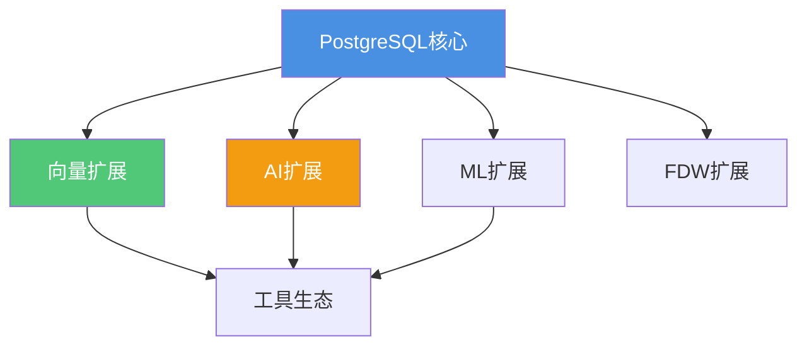
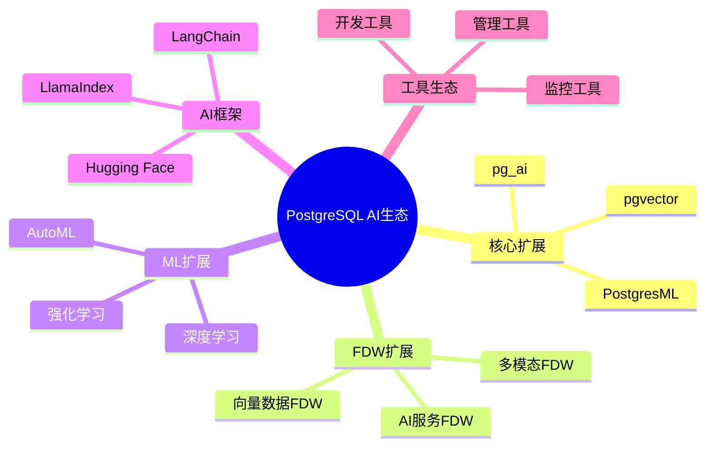

# 扩展生态完善方向

> **文档编号**: AI-08-04
> **最后更新**: 2025年1月
> **主题**: ROADMAP-2025.md
> **子主题**: 04-扩展生态完善方向

## 📑 目录

- [扩展生态完善方向](#扩展生态完善方向)
  - [📑 目录](#-目录)
  - [1. 扩展生态概述](#1-扩展生态概述)
  - [2. 核心扩展方向](#2-核心扩展方向)
  - [3. FDW扩展方向](#3-fdw扩展方向)
    - [3.1 向量数据FDW](#31-向量数据fdw)
    - [3.2 AI服务FDW](#32-ai服务fdw)
    - [3.3 多模态数据FDW](#33-多模态数据fdw)
  - [4. ML能力扩展](#4-ml能力扩展)
    - [4.1 深度学习支持](#41-深度学习支持)
    - [4.2 强化学习支持](#42-强化学习支持)
    - [4.3 自动ML (AutoML)](#43-自动ml-automl)
  - [5. AI框架集成](#5-ai框架集成)
    - [5.1 LangChain集成](#51-langchain集成)
    - [5.2 LlamaIndex集成](#52-llamaindex集成)
    - [5.3 Hugging Face集成](#53-hugging-face集成)
  - [6. 生态建设](#6-生态建设)
    - [6.1 扩展生态图谱](#61-扩展生态图谱)
    - [6.2 社区贡献趋势](#62-社区贡献趋势)
    - [6.3 最佳实践分享](#63-最佳实践分享)
  - [7. 发展路线图](#7-发展路线图)

---

## 1. 扩展生态概述

**生态建设目标**：

- ✅ 丰富扩展生态
- ✅ 提升集成能力
- ✅ 降低使用门槛
- ✅ 促进社区发展

**生态架构**：



---

## 2. 核心扩展方向

**当前核心扩展**：

| 扩展 | 功能 | 状态 |
|------|------|------|
| **pgvector** | 向量搜索 | ✅ 成熟 |
| **pg_ai** | AI调用 | ✅ 活跃 |
| **PostgresML** | ML训练 | ✅ 成熟 |

**扩展完善方向**：

- 🔄 更多向量索引算法
- 🔄 更多AI模型支持
- 🔄 更多ML算法

---

## 3. FDW扩展方向

### 3.1 向量数据FDW

**目标**：通过FDW访问外部向量数据库

**实现方向**：

```sql
-- 未来：向量数据FDW（预测）
CREATE FOREIGN TABLE pinecone_vectors (
    id TEXT,
    embedding vector(1536),
    metadata JSONB
) SERVER pinecone_server
OPTIONS (api_key 'key', index_name 'index');

-- 查询外部向量数据
SELECT * FROM pinecone_vectors
WHERE embedding <=> query_vec < 0.3;
```

**支持的数据源**：

- Pinecone
- Weaviate
- Qdrant
- Milvus

**预期时间**：2025 Q3

### 3.2 AI服务FDW

**目标**：通过FDW访问AI服务

**实现方向**：

```sql
-- 未来：AI服务FDW（预测）
CREATE FOREIGN TABLE openai_embeddings (
    text TEXT,
    embedding vector(1536)
) SERVER openai_server
OPTIONS (api_key 'key', model 'text-embedding-3-small');

-- 查询AI服务
SELECT embedding FROM openai_embeddings
WHERE text = 'query';
```

**支持的服务**：

- OpenAI
- Anthropic
- Google AI
- Azure AI

**预期时间**：2025 Q4

### 3.3 多模态数据FDW

**目标**：通过FDW访问多模态数据

**实现方向**：

```sql
-- 未来：多模态数据FDW（预测）
CREATE FOREIGN TABLE s3_images (
    id TEXT,
    image_url TEXT,
    image_embedding vector(1024)
) SERVER s3_server
OPTIONS (bucket 'images');

-- 查询图像数据
SELECT * FROM s3_images
WHERE image_embedding <=> query_vec < 0.3;
```

**支持的数据源**：

- S3/OSS对象存储
- 图像数据库
- 视频数据库

**预期时间**：2026 Q1

---

## 4. ML能力扩展

### 4.1 深度学习支持

**当前状态**：

- ✅ PostgresML（XGBoost、LightGBM等）
- ❌ 深度学习支持有限

**未来方向**：

```sql
-- 未来：深度学习支持（预测）
SELECT * FROM pgml.train(
    project_name => 'image_classification',
    task => 'classification',
    algorithm => 'pytorch',  -- PyTorch支持
    model_architecture => 'resnet50'
);

-- TensorFlow支持
SELECT * FROM pgml.train(
    algorithm => 'tensorflow',
    model_architecture => 'bert'
);
```

**技术方向**：

- PyTorch集成
- TensorFlow集成
- ONNX Runtime集成

**预期时间**：2025 Q4

### 4.2 强化学习支持

**应用场景**：

- 查询优化器
- 索引选择
- 缓存策略

**未来方向**：

```sql
-- 未来：强化学习支持（预测）
SELECT * FROM pgml.train_rl(
    project_name => 'query_optimizer',
    algorithm => 'dqn',
    reward_function => 'query_latency'
);
```

**预期时间**：2026 Q2

### 4.3 自动ML (AutoML)

**目标**：自动选择最优ML算法和参数

**未来方向**：

```sql
-- 未来：AutoML（预测）
SELECT * FROM pgml.auto_train(
    project_name => 'sentiment',
    relation_name => 'reviews',
    y_column_name => 'sentiment',
    time_budget => '1 hour'  -- 时间预算
);
-- 自动选择算法、调优参数
```

**功能**：

- 自动特征工程
- 自动算法选择
- 自动超参数调优

**预期时间**：2026 Q3

---

## 5. AI框架集成

### 5.1 LangChain集成

**当前状态**：

- ✅ LangChain支持PostgreSQL
- ✅ PostgreSQL作为向量存储

**完善方向**：

```python
# LangChain + PostgreSQL深度集成
from langchain.vectorstores import PGVector
from langchain.embeddings import OpenAIEmbeddings

# 使用pg_ai自动向量化
vectorstore = PGVector(
    connection_string=CONNECTION_STRING,
    embedding_function=OpenAIEmbeddings(),
    use_pg_ai=True  # 使用pg_ai自动向量化
)
```

**集成功能**：

- 自动向量化
- 统一API
- 性能优化

**预期时间**：2025 Q2

### 5.2 LlamaIndex集成

**当前状态**：

- ✅ LlamaIndex支持PostgreSQL
- ✅ PostgreSQL作为数据源

**完善方向**：

```python
# LlamaIndex + PostgreSQL深度集成
from llama_index.vector_stores import PGVectorStore
from llama_index.embeddings import OpenAIEmbedding

# 使用pg_ai Vectorizer
vector_store = PGVectorStore(
    connection_string=CONNECTION_STRING,
    use_pg_ai_vectorizer=True  # 自动向量化
)
```

**集成功能**：

- 自动索引构建
- 查询优化
- 数据同步

**预期时间**：2025 Q3

### 5.3 Hugging Face集成

**当前状态**：

- ✅ Hugging Face模型可用
- ❌ 深度集成有限

**完善方向**：

```sql
-- 未来：Hugging Face集成（预测）
CREATE EXTENSION huggingface;

-- 使用Hugging Face模型
SELECT huggingface.embed(
    model => 'sentence-transformers/all-MiniLM-L6-v2',
    text => 'query'
) AS embedding;

-- 使用Hugging Face模型进行推理
SELECT huggingface.predict(
    model => 'distilbert-base-uncased',
    input => 'text'
) AS prediction;
```

**集成功能**：

- 模型管理
- 自动下载
- 本地推理

**预期时间**：2025 Q4

---

## 6. 生态建设

### 6.1 扩展生态图谱

**生态结构**：



### 6.2 社区贡献趋势

**贡献方向**：

1. **扩展开发**：
   - 新扩展开发
   - 现有扩展改进
   - 文档完善

2. **工具开发**：
   - 管理工具
   - 监控工具
   - 开发工具

3. **最佳实践**：
   - 技术文章
   - 案例分享
   - 教程编写

**社区指标**：

- GitHub Stars增长
- 贡献者数量
- 问题解决速度

### 6.3 最佳实践分享

**分享内容**：

- 技术最佳实践
- 性能优化经验
- 故障处理案例
- 架构设计模式

**分享渠道**：

- 技术博客
- 技术会议
- 社区论坛
- 开源项目

---

## 7. 发展路线图

**2025年路线图**：

| 季度 | 重点方向 | 关键成果 |
|------|---------|---------|
| **Q1** | 核心扩展优化 | pgvector 0.8.0+ |
| **Q2** | LangChain集成 | 深度集成完成 |
| **Q3** | FDW扩展 | 向量数据FDW |
| **Q4** | 深度学习支持 | PyTorch集成 |

**2026年路线图**：

| 季度 | 重点方向 | 关键成果 |
|------|---------|---------|
| **Q1** | 多模态支持 | 图像/视频FDW |
| **Q2** | 强化学习 | RL支持 |
| **Q3** | AutoML | 自动ML功能 |
| **Q4** | 生态完善 | 完整生态 |

---

**最后更新**: 2025年1月
**维护者**: PostgreSQL Modern Team
**文档编号**: AI-08-04
