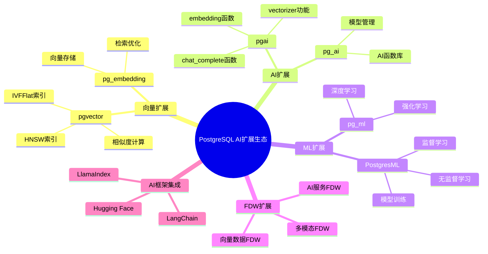
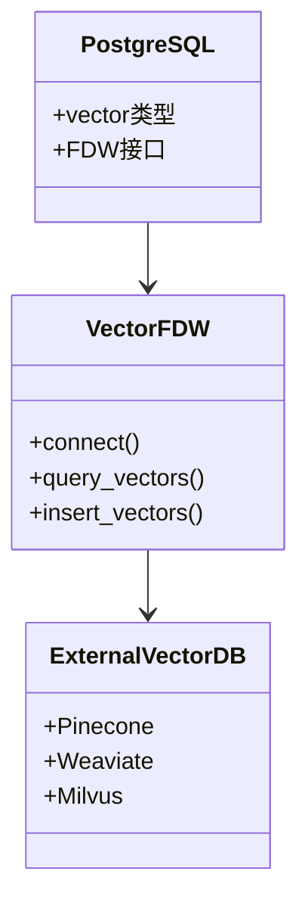
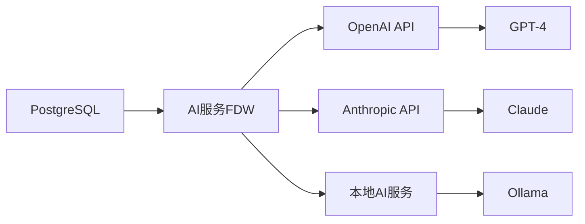
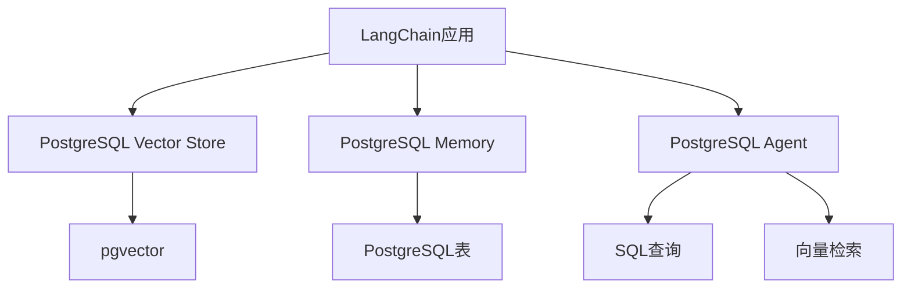
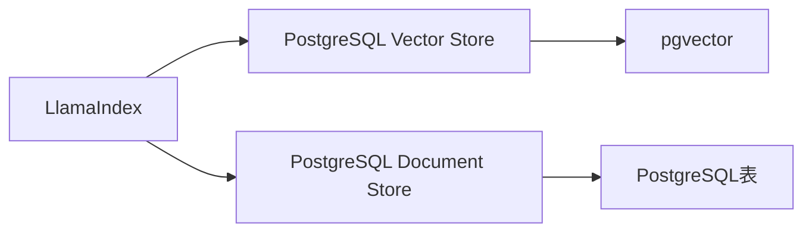
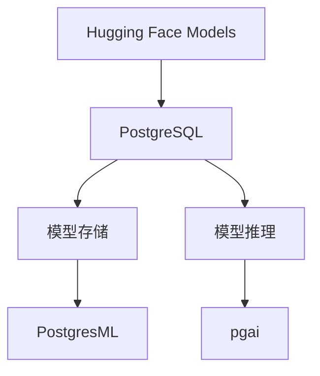
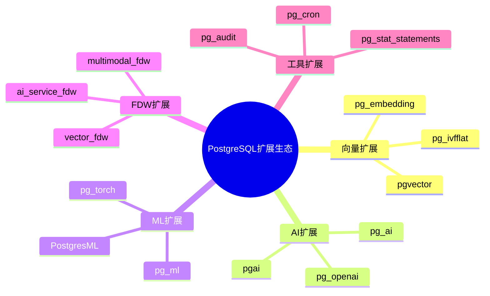
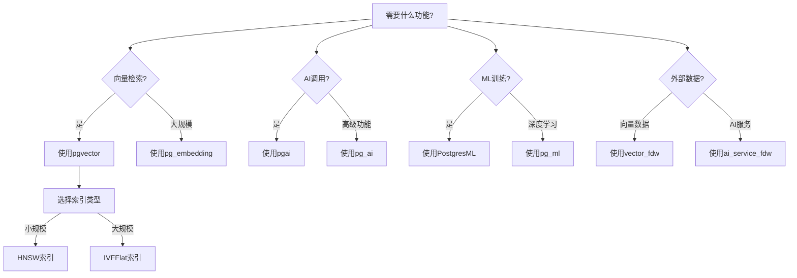

---

> **📋 文档来源**: `PostgreSQL_AI\08-未来趋势\扩展生态完善方向.md`
> **📅 复制日期**: 2025-12-22
> **⚠️ 注意**: 本文档为复制版本，原文件保持不变

---

# 扩展生态完善方向

> **文档编号**: AI-08-04
> **最后更新**: 2025年1月
> **主题**: 08-未来趋势
> **子主题**: 04-扩展生态完善方向

## 📑 目录

- [扩展生态完善方向](#扩展生态完善方向)
  - [📑 目录](#-目录)
  - [一、概述](#一概述)
  - [二、扩展生态思维导图](#二扩展生态思维导图)
  - [三、新FDW扩展](#三新fdw扩展)
    - [3.1 向量数据FDW](#31-向量数据fdw)
    - [3.2 AI服务FDW](#32-ai服务fdw)
    - [3.3 多模态数据FDW](#33-多模态数据fdw)
  - [四、更强大的ML功能](#四更强大的ml功能)
    - [4.1 深度学习支持](#41-深度学习支持)
    - [4.2 强化学习支持](#42-强化学习支持)
    - [4.3 自动ML (AutoML)](#43-自动ml-automl)
  - [五、深度集成AI框架](#五深度集成ai框架)
    - [5.1 LangChain集成](#51-langchain集成)
    - [5.2 LlamaIndex集成](#52-llamaindex集成)
    - [5.3 Hugging Face集成](#53-hugging-face集成)
  - [六、社区生态发展](#六社区生态发展)
    - [6.1 扩展生态图谱](#61-扩展生态图谱)
    - [6.2 社区贡献趋势](#62-社区贡献趋势)
    - [6.3 最佳实践分享](#63-最佳实践分享)
  - [七、扩展选择决策树](#七扩展选择决策树)
  - [八、扩展功能对比矩阵](#八扩展功能对比矩阵)
  - [九、关联主题](#九关联主题)
  - [十、对标资源](#十对标资源)
    - [技术文档](#技术文档)
    - [开源项目](#开源项目)

## 一、概述

PostgreSQL扩展生态的完善方向分析，包括新FDW扩展、更强大的ML功能、深度集成AI框架和社区生态发展等关键方向，为PostgreSQL AI生态的未来发展提供指导。

## 二、扩展生态思维导图



## 三、新FDW扩展

### 3.1 向量数据FDW

**功能描述**: 通过FDW访问外部向量数据库

**应用场景**:

- 跨数据库向量检索
- 向量数据联邦查询
- 混合向量存储

**架构设计**:



**实现示例**:

```sql
-- 创建向量数据FDW
CREATE EXTENSION vector_fdw;

-- 创建外部服务器
CREATE SERVER pinecone_server
FOREIGN DATA WRAPPER vector_fdw
OPTIONS (
    host 'api.pinecone.io',
    api_key 'your-api-key'
);

-- 创建外部表
CREATE FOREIGN TABLE pinecone_vectors (
    id TEXT,
    embedding vector(1536),
    metadata JSONB
)
SERVER pinecone_server
OPTIONS (
    index_name 'my-index'
);

-- 查询外部向量数据
SELECT * FROM pinecone_vectors
WHERE embedding <=> query_vector < 0.8
ORDER BY embedding <=> query_vector
LIMIT 10;
```

### 3.2 AI服务FDW

**功能描述**: 通过FDW访问外部AI服务

**应用场景**:

- OpenAI API集成
- Anthropic API集成
- 本地AI模型服务

**架构设计**:



**实现示例**:

```sql
-- 创建AI服务FDW
CREATE EXTENSION ai_service_fdw;

-- 创建外部服务器
CREATE SERVER openai_server
FOREIGN DATA WRAPPER ai_service_fdw
OPTIONS (
    provider 'openai',
    api_key 'your-api-key'
);

-- 创建外部函数
CREATE FOREIGN FUNCTION ai_complete(
    model TEXT,
    prompt TEXT
)
RETURNS TEXT
SERVER openai_server
OPTIONS (
    endpoint 'chat/completions'
);

-- 使用AI服务
SELECT ai_complete('gpt-4', 'What is PostgreSQL?');
```

### 3.3 多模态数据FDW

**功能描述**: 通过FDW访问多模态数据源

**应用场景**:

- 图像数据访问
- 音频数据访问
- 视频数据访问

**实现示例**:

```sql
-- 创建多模态FDW
CREATE EXTENSION multimodal_fdw;

-- 创建图像数据外部表
CREATE FOREIGN TABLE image_data (
    id TEXT,
    image_url TEXT,
    embedding vector(512),
    metadata JSONB
)
SERVER s3_server
OPTIONS (
    bucket 'my-images',
    region 'us-east-1'
);

-- 查询图像数据
SELECT * FROM image_data
WHERE embedding <=> query_embedding < 0.8;
```

## 四、更强大的ML功能

### 4.1 深度学习支持

**发展趋势**:

| 阶段 | 时间 | 功能 | 状态 |
|------|:----:|:----|:----|
| **基础支持** | 当前 | 简单神经网络 | ✅ |
| **扩展支持** | 1年 | 卷积神经网络 | ⏳ |
| **完整支持** | 2年 | Transformer模型 | ⏳ |
| **优化支持** | 3年 | GPU加速训练 | ⏳ |

**实现示例**:

```sql
-- 未来可能的深度学习语法
CREATE ML MODEL image_classifier
USING algorithm('deep_learning')
WITH (
    architecture = 'resnet50',
    pretrained = true,
    gpu_enabled = true
);

-- 训练模型
SELECT train_model(
    'image_classifier',
    features = ARRAY['image_vector'],
    target = 'category',
    epochs = 100
);

-- 预测
SELECT predict('image_classifier', image_vector) AS category
FROM images;
```

### 4.2 强化学习支持

**应用场景**:

- 查询优化策略学习
- 索引选择策略学习
- 缓存策略优化

**实现示例**:

```sql
-- 未来可能的强化学习语法
CREATE RL AGENT query_optimizer
USING algorithm('ppo')
WITH (
    state_space = 'query_features',
    action_space = 'optimization_strategies',
    reward_function = 'query_performance'
);

-- 训练Agent
SELECT train_agent(
    'query_optimizer',
    episodes = 10000
);

-- 使用Agent优化查询
SELECT * FROM documents
WHERE query_optimizer.optimize(query_vector);
```

### 4.3 自动ML (AutoML)

**功能描述**: 自动选择最优ML算法和参数

**实现示例**:

```sql
-- 未来可能的AutoML语法
CREATE ML MODEL auto_model
USING automl(
    target = 'revenue',
    max_trials = 100,
    time_budget = '1 hour'
);

-- 自动训练和选择
SELECT train_automl('auto_model', training_data);

-- 查看最佳模型
SELECT * FROM automl_models
WHERE model_id = 'auto_model'
ORDER BY performance_score DESC
LIMIT 1;
```

## 五、深度集成AI框架

### 5.1 LangChain集成

**集成方式**:



**实现示例**:

```python
from langchain.vectorstores import PGVector
from langchain.embeddings import OpenAIEmbeddings

# 使用PostgreSQL作为向量存储
vectorstore = PGVector(
    connection_string="postgresql://...",
    embedding_function=OpenAIEmbeddings(),
    collection_name="documents"
)

# 向量检索
docs = vectorstore.similarity_search("PostgreSQL AI", k=5)
```

### 5.2 LlamaIndex集成

**集成方式**:



**实现示例**:

```python
from llama_index.vector_stores import PGVectorStore
from llama_index import VectorStoreIndex

# 使用PostgreSQL作为向量存储
vector_store = PGVectorStore(
    connection_string="postgresql://...",
    table_name="documents"
)

# 创建索引
index = VectorStoreIndex.from_vector_store(vector_store)

# 查询
query_engine = index.as_query_engine()
response = query_engine.query("What is PostgreSQL?")
```

### 5.3 Hugging Face集成

**集成方式**:



**实现示例**:

```sql
-- 使用Hugging Face模型
SELECT ai.embedding(
    model = 'sentence-transformers/all-MiniLM-L6-v2',
    text = 'PostgreSQL AI'
);

-- 加载Hugging Face模型到PostgresML
SELECT pgml.load_model(
    model_name = 'bert-base-uncased',
    source = 'huggingface'
);
```

## 六、社区生态发展

### 6.1 扩展生态图谱

**扩展分类**:



### 6.2 社区贡献趋势

**发展趋势**:

| 指标 | 2024年 | 2025年预测 | 趋势 |
|------|:------:|:----------:|:----|
| **GitHub Stars** | 15,000+ | 25,000+ | ↗️ 上升 |
| **Contributors** | 1,000+ | 2,000+ | ↗️ 上升 |
| **扩展数量** | 200+ | 300+ | ↗️ 上升 |
| **AI相关扩展** | 20+ | 50+ | ↗️ 大幅上升 |

### 6.3 最佳实践分享

**社区资源**:

- PostgreSQL Wiki
- 技术博客
- 会议演讲
- 开源项目

## 七、扩展选择决策树



## 八、扩展功能对比矩阵

| 扩展 | 向量检索 | AI调用 | ML训练 | FDW支持 | 社区活跃度 |
|------|:--------:|:------:|:------:|:-------:|:----------|
| **pgvector** | ⭐⭐⭐⭐⭐ | ❌ | ❌ | ❌ | ⭐⭐⭐⭐⭐ |
| **pgai** | ⚠️ | ⭐⭐⭐⭐⭐ | ❌ | ❌ | ⭐⭐⭐⭐ |
| **PostgresML** | ❌ | ❌ | ⭐⭐⭐⭐⭐ | ❌ | ⭐⭐⭐⭐ |
| **vector_fdw** | ⭐⭐⭐⭐ | ❌ | ❌ | ⭐⭐⭐⭐⭐ | ⭐⭐⭐ |
| **pg_ml** | ❌ | ❌ | ⭐⭐⭐⭐ | ❌ | ⭐⭐⭐ |

## 九、关联主题

- [技术发展趋势](./技术发展趋势.md) - 整体趋势分析
- [02-技术架构](../02-技术架构/) - 架构设计
- [03-核心能力](../03-核心能力/) - 能力实现

## 十、对标资源

### 技术文档

- [PostgreSQL扩展文档](https://www.postgresql.org/docs/current/extend.html)
- [FDW开发文档](https://www.postgresql.org/docs/current/fdwhandler.html)
- [LangChain文档](https://python.langchain.com/)
- [LlamaIndex文档](https://docs.llamaindex.ai/)

### 开源项目

- [pgvector GitHub](https://github.com/pgvector/pgvector)
- [PostgresML GitHub](https://github.com/postgresml/postgresml)
- [pgai GitHub](https://github.com/pgai/pgai)

---

**最后更新**: 2025年1月
**维护者**: PostgreSQL Modern Team
**文档编号**: AI-08-04
