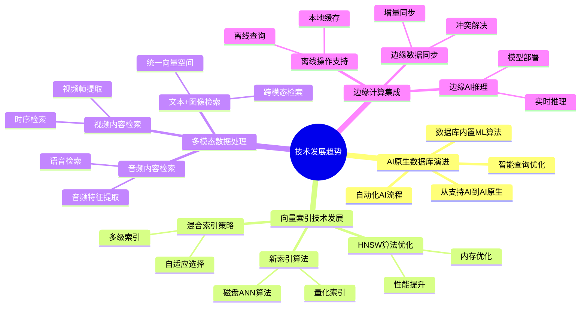

---

> **📋 文档来源**: `PostgreSQL_AI\08-未来趋势\技术发展趋势.md`
> **📅 复制日期**: 2025-12-22
> **⚠️ 注意**: 本文档为复制版本，原文件保持不变

---

# PostgreSQL AI 技术发展趋势

> **文档编号**: AI-08-01
> **最后更新**: 2025年1月
> **主题**: 08-未来趋势
> **子主题**: 01-技术发展趋势

## 📑 目录

- [PostgreSQL AI 技术发展趋势](#postgresql-ai-技术发展趋势)
  - [📑 目录](#-目录)
  - [一、概述](#一概述)
    - [1.1 技术发展趋势思维导图](#11-技术发展趋势思维导图)
  - [二、AI原生数据库演进](#二ai原生数据库演进)
    - [2.1 从"支持AI"到"AI原生"](#21-从支持ai到ai原生)
    - [2.2 数据库内置ML算法](#22-数据库内置ml算法)
    - [2.3 智能查询优化](#23-智能查询优化)
    - [2.4 自动化AI流程](#24-自动化ai流程)
  - [三、向量索引技术发展](#三向量索引技术发展)
    - [3.1 HNSW算法优化](#31-hnsw算法优化)
    - [3.2 新索引算法](#32-新索引算法)
    - [3.3 混合索引策略](#33-混合索引策略)
  - [四、多模态数据处理](#四多模态数据处理)
    - [4.1 文本+图像检索](#41-文本图像检索)
    - [4.2 视频内容检索](#42-视频内容检索)
    - [4.3 音频内容检索](#43-音频内容检索)
  - [五、边缘计算集成](#五边缘计算集成)
    - [5.1 边缘AI推理](#51-边缘ai推理)
    - [5.2 边缘数据同步](#52-边缘数据同步)
    - [5.3 离线操作支持](#53-离线操作支持)
  - [六、技术路线图](#六技术路线图)
    - [短期 (1-3个月)](#短期-1-3个月)
    - [中期 (3-6个月)](#中期-3-6个月)
    - [长期 (6-12个月)](#长期-6-12个月)
    - [长期 (1-3年)](#长期-1-3年)
  - [七、关联主题](#七关联主题)
  - [八、对标资源](#八对标资源)
    - [技术报告](#技术报告)
    - [学术论文](#学术论文)

## 一、概述

PostgreSQL AI技术发展趋势分析，涵盖AI原生数据库演进、向量索引技术发展、多模态数据处理和边缘计算集成等前沿方向。

### 1.1 技术发展趋势思维导图



## 二、AI原生数据库演进

### 2.1 从"支持AI"到"AI原生"

**演进路径**:

```text
阶段1: 支持AI (当前)
├── 通过扩展支持向量存储
├── 通过扩展支持AI调用
└── 通过扩展支持ML训练

阶段2: 深度集成 (1-2年)
├── 向量类型成为核心类型
├── AI函数成为内置函数
└── ML算法成为内置算法

阶段3: AI原生 (3-5年)
├── 智能查询优化器
├── 自动向量化
└── 自适应索引选择
```

**关键指标**:

| 指标 | 当前状态 | 目标状态 | 时间线 |
|------|:--------:|:--------:|:------:|
| **向量类型** | 扩展 | 核心类型 | 2-3年 |
| **AI函数** | 扩展 | 内置函数 | 1-2年 |
| **ML算法** | 扩展 | 内置算法 | 2-3年 |
| **智能优化** | 无 | 自动优化 | 3-5年 |

### 2.2 数据库内置ML算法

**发展趋势**:

1. **内置算法库扩展**
   - 当前: PostgresML提供20+算法
   - 未来: 内置50+算法，覆盖所有主流ML场景

2. **模型管理优化**
   - 当前: 手动管理模型
   - 未来: 自动模型版本管理、A/B测试

3. **实时训练支持**
   - 当前: 批量训练
   - 未来: 增量训练、在线学习

**示例**:

```sql
-- 未来可能的语法
CREATE ML MODEL sales_forecast
USING algorithm('xgboost')
WITH (
    auto_tune = true,
    incremental_learning = true,
    model_versioning = true
);

-- 自动训练和更新
SELECT train_model('sales_forecast',
    incremental = true,
    auto_schedule = 'daily'
);
```

### 2.3 智能查询优化

**发展趋势**:

1. **AI驱动的查询优化**
   - 当前: 基于规则的优化器
   - 未来: 基于ML的优化器，自动学习最优查询计划

2. **自适应索引选择**
   - 当前: 手动选择索引类型
   - 未来: 自动选择最优索引，动态调整

3. **智能缓存策略**
   - 当前: 固定缓存策略
   - 未来: 基于访问模式的智能缓存

**示例**:

```sql
-- 未来可能的智能优化
EXPLAIN (AI_OPTIMIZE = true)
SELECT * FROM documents
WHERE embedding <=> query_vector < 0.8
ORDER BY similarity DESC
LIMIT 10;

-- AI优化器自动选择:
-- - 最优索引类型 (HNSW vs IVFFlat)
-- - 最优查询参数 (ef_search)
-- - 最优执行计划
```

### 2.4 自动化AI流程

**发展趋势**:

1. **自动向量化**
   - 当前: 手动调用API生成向量
   - 未来: 自动检测文本字段，自动生成向量

2. **自动RAG构建**
   - 当前: 手动构建RAG系统
   - 未来: 一键创建RAG系统，自动优化

3. **自动模型部署**
   - 当前: 手动部署模型
   - 未来: 自动部署、监控、回滚

## 三、向量索引技术发展

### 3.1 HNSW算法优化

**优化方向**:

1. **内存优化**
   - 当前: HNSW索引占用内存较大
   - 未来: 压缩HNSW，减少50%内存占用

2. **构建速度优化**
   - 当前: 大规模数据构建慢
   - 未来: 并行构建，提升10倍速度

3. **查询性能优化**
   - 当前: 查询延迟10-50ms
   - 未来: 查询延迟<5ms

### 3.2 新索引算法

**新兴算法**:

1. **DiskANN**
   - 特点: 磁盘友好的向量索引
   - 适用: 超大规模向量（>10亿）
   - 时间线: 1-2年

2. **SPANN**
   - 特点: 可扩展的近似最近邻搜索
   - 适用: 分布式向量检索
   - 时间线: 2-3年

3. **Learned Index**
   - 特点: 基于ML的索引结构
   - 适用: 自适应索引选择
   - 时间线: 3-5年

### 3.3 混合索引策略

**发展趋势**:

```sql
-- 未来可能的混合索引
CREATE INDEX ON documents
USING hybrid_index (
    vector_column vector_cosine_ops WITH (algorithm = 'hnsw'),
    text_column text_ops WITH (algorithm = 'gin'),
    geospatial_column gist_ops
);

-- 自动选择最优索引组合
SELECT * FROM documents
WHERE
    vector_column <=> query_vector < 0.8 AND
    text_column @@ 'postgresql' AND
    ST_Within(location, boundary)
ORDER BY similarity DESC;
```

## 四、多模态数据处理

### 4.1 文本+图像检索

**发展趋势**:

1. **统一向量空间**
   - 当前: 文本和图像分别向量化
   - 未来: 统一向量空间，跨模态检索

2. **多模态Embedding**
   - 当前: 单模态Embedding
   - 未来: 多模态Embedding模型（CLIP等）

**示例**:

```sql
-- 未来可能的多模态检索
SELECT
    id,
    content_type,  -- 'text' or 'image'
    content,
    embedding <=> query_embedding AS similarity
FROM multimodal_content
WHERE embedding <=> query_embedding < 0.8
ORDER BY similarity DESC
LIMIT 10;

-- 支持跨模态检索:
-- - 文本查询图像
-- - 图像查询文本
-- - 图像查询图像
```

### 4.2 视频内容检索

**发展趋势**:

1. **视频帧提取**
   - 自动提取关键帧
   - 生成帧级向量

2. **时序检索**
   - 支持视频片段检索
   - 支持时序相似度计算

### 4.3 音频内容检索

**发展趋势**:

1. **音频特征提取**
   - 自动提取音频特征
   - 生成音频向量

2. **语音检索**
   - 支持语音转文本
   - 支持语音相似度检索

## 五、边缘计算集成

### 5.1 边缘AI推理

**发展趋势**:

1. **边缘模型部署**
   - 在边缘设备部署轻量级模型
   - 减少云端推理延迟

2. **边缘向量检索**
   - 边缘设备本地向量检索
   - 减少网络传输

### 5.2 边缘数据同步

**发展趋势**:

1. **增量同步**
   - 只同步变更数据
   - 减少同步带宽

2. **冲突解决**
   - 自动冲突检测和解决
   - 保证数据一致性

### 5.3 离线操作支持

**发展趋势**:

1. **离线向量检索**
   - 边缘设备离线检索
   - 同步后合并结果

2. **离线数据写入**
   - 离线写入数据
   - 连接后自动同步

## 六、技术路线图

### 短期 (1-3个月)

- ✅ pgvector性能优化
- ✅ pgai功能完善
- ✅ PostgresML算法扩展

### 中期 (3-6个月)

- ⏳ 向量类型核心化
- ⏳ AI函数内置化
- ⏳ 智能查询优化器原型

### 长期 (6-12个月)

- ⏳ AI原生数据库架构
- ⏳ 自动向量化
- ⏳ 自适应索引选择

### 长期 (1-3年)

- ⏳ 多模态数据处理
- ⏳ 边缘计算深度集成
- ⏳ 智能数据库系统

## 七、关联主题

- [AI原生数据库演进](./AI原生数据库演进.md) - 详细演进路径
- [02-技术架构](../02-技术架构/) - 架构演进方向
- [03-核心能力](../03-核心能力/) - 能力发展趋势

## 八、对标资源

### 技术报告

- [PostgreSQL Roadmap](https://www.postgresql.org/developer/roadmap/)
- [Gartner AI Database Trends](https://www.gartner.com/en/documents)
- [Vector Database Research](https://arxiv.org/list/cs.DB/recent)

### 学术论文

- DiskANN: Fast Accurate Billion-point Nearest Neighbor Search
- SPANN: Highly-efficient Billion-scale Approximate Nearest Neighbor Search
- Learned Index Structures

---

**最后更新**: 2025年1月
**维护者**: PostgreSQL Modern Team
**文档编号**: AI-08-01
