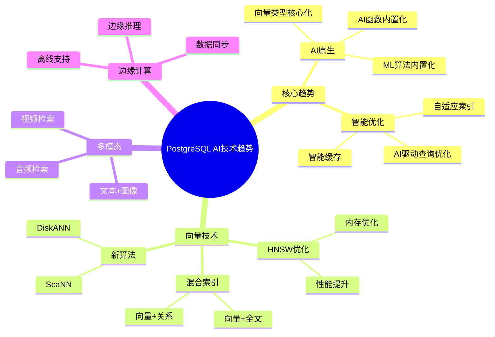
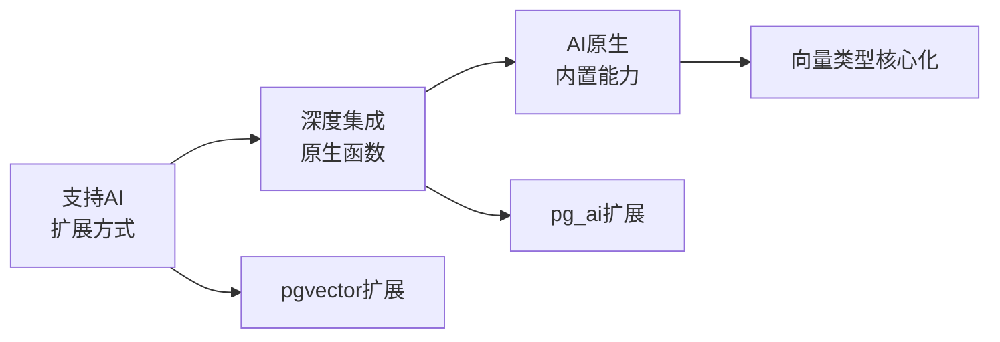

# PostgreSQL AI 技术发展趋势

> **文档编号**: AI-08-01
> **最后更新**: 2025年1月
> **主题**: 08-未来趋势
> **子主题**: 01-技术发展趋势

## 📑 目录

- [PostgreSQL AI 技术发展趋势](#postgresql-ai-技术发展趋势)
  - [📑 目录](#-目录)
  - [1. 技术发展趋势概述](#1-技术发展趋势概述)
    - [1.1 技术发展趋势思维导图](#11-技术发展趋势思维导图)
  - [2. 核心发展趋势](#2-核心发展趋势)
    - [2.1 从"支持AI"到"AI原生"](#21-从支持ai到ai原生)
    - [2.2 数据库内置ML算法](#22-数据库内置ml算法)
    - [2.3 智能查询优化](#23-智能查询优化)
    - [2.4 自动化AI流程](#24-自动化ai流程)
  - [3. 向量索引技术发展](#3-向量索引技术发展)
    - [3.1 HNSW算法优化](#31-hnsw算法优化)
    - [3.2 新索引算法](#32-新索引算法)
    - [3.3 混合索引策略](#33-混合索引策略)
  - [4. 多模态数据处理](#4-多模态数据处理)
    - [4.1 文本+图像检索](#41-文本图像检索)
    - [4.2 视频内容检索](#42-视频内容检索)
    - [4.3 音频内容检索](#43-音频内容检索)
  - [5. 边缘计算支持](#5-边缘计算支持)
    - [5.1 边缘AI推理](#51-边缘ai推理)
    - [5.2 边缘数据同步](#52-边缘数据同步)
    - [5.3 离线操作支持](#53-离线操作支持)
  - [6. 时间线预测](#6-时间线预测)
    - [短期（1-3个月）](#短期1-3个月)
    - [中期（3-6个月）](#中期3-6个月)
    - [长期（6-12个月）](#长期6-12个月)
    - [长期（1-3年）](#长期1-3年)

---

## 1. 技术发展趋势概述

### 1.1 技术发展趋势思维导图



---

## 2. 核心发展趋势

### 2.1 从"支持AI"到"AI原生"

**演进路径**：



**当前状态（2025）**：

- ✅ pgvector扩展（向量搜索）
- ✅ pg_ai扩展（AI调用）
- ✅ PostgresML（ML训练）

**未来方向（2026-2027）**：

- 🔄 向量类型成为PostgreSQL核心类型
- 🔄 AI函数内置到PostgreSQL核心
- 🔄 ML算法内置到PostgreSQL核心

**技术实现路径**：

```sql
-- 当前：扩展方式
CREATE EXTENSION vector;
CREATE TABLE documents (embedding vector(1536));

-- 未来：核心类型（预测）
CREATE TABLE documents (embedding VECTOR(1536));  -- 无需扩展
```

### 2.2 数据库内置ML算法

**当前状态**：

- ✅ PostgresML扩展（XGBoost、LightGBM等）
- ✅ 数据库内模型训练
- ✅ 实时推理

**未来趋势**：

- 🔄 更多ML算法内置
- 🔄 自动特征工程
- 🔄 自动模型选择

**预测时间线**：

| 时间 | 能力 | 说明 |
|------|------|------|
| **2025 Q2** | 深度学习支持 | TensorFlow/PyTorch集成 |
| **2025 Q4** | 自动特征工程 | 自动提取特征 |
| **2026 Q2** | AutoML | 自动模型选择和调优 |

### 2.3 智能查询优化

**PostgreSQL 18改进**：

- ✅ 异步I/O（性能提升3x）
- ✅ 跳过扫描（Skip Scan）
- ✅ 查询优化器改进

**未来趋势**：

- 🔄 AI驱动的查询优化器
- 🔄 自适应查询计划
- 🔄 学习型优化器

**技术方向**：

```sql
-- 未来：AI驱动查询优化（预测）
SET enable_ai_optimizer = on;
-- 查询优化器使用机器学习选择最优计划
EXPLAIN (ANALYZE, BUFFERS, TIMING)
SELECT * FROM documents WHERE embedding <=> query_vec < 0.3;
```

**研究进展**：

- **Kepler**：参数化查询优化（2023）
- **Lero**：学习排序优化器（2023）
- **Baihe**：AI驱动数据库框架（2021）

### 2.4 自动化AI流程

**当前能力**：

- ✅ pg_ai Vectorizer（自动向量化）
- ✅ 自动Embedding生成
- ✅ 自动分块

**未来趋势**：

- 🔄 自动RAG构建
- 🔄 自动模型部署
- 🔄 自动A/B测试

**预测实现**：

```sql
-- 未来：自动RAG构建（预测）
SELECT ai.create_rag_system(
    'documents'::regclass,
    chunking_strategy => 'recursive',
    embedding_model => 'text-embedding-3-small',
    llm_model => 'gpt-4'
);
-- 自动创建RAG系统所需的所有表和函数
```

---

## 3. 向量索引技术发展

### 3.1 HNSW算法优化

**当前状态**：

- ✅ HNSW索引（pgvector 0.8.0）
- ✅ 参数可调（m, ef_construction）
- ✅ 高性能相似度搜索

**优化方向**：

1. **内存优化**：
   - 压缩HNSW图结构
   - 减少内存占用30-50%

2. **构建优化**：
   - 并行构建（PostgreSQL 18支持）
   - 增量构建
   - 构建速度提升2-3x

3. **查询优化**：
   - 自适应ef_search
   - 查询缓存
   - 查询速度提升20-30%

**预测时间线**：

| 时间 | 优化 | 预期提升 |
|------|------|---------|
| **2025 Q2** | 内存优化 | 内存占用-30% |
| **2025 Q4** | 并行构建 | 构建速度+200% |
| **2026 Q2** | 查询优化 | 查询速度+30% |

### 3.2 新索引算法

**新兴算法**：

1. **DiskANN**：
   - 磁盘友好的向量索引
   - 适用于大规模数据（>1B向量）
   - 预测：2025 Q4集成

2. **ScaNN**：
   - Google开发的向量搜索
   - 量化优化
   - 预测：2026 Q1集成

3. **IVF-PQ**：
   - 乘积量化
   - 内存占用小
   - 预测：2025 Q3集成

**算法对比**：

| 算法 | 适用场景 | 优势 | 劣势 |
|------|---------|------|------|
| **HNSW** | 中小规模（<100M） | 查询快 | 内存占用大 |
| **IVFFlat** | 大规模（>100M） | 内存占用小 | 查询较慢 |
| **DiskANN** | 超大规模（>1B） | 磁盘友好 | 构建慢 |
| **ScaNN** | 大规模 | 量化优化 | 精度略降 |

### 3.3 混合索引策略

**当前能力**：

- ✅ 向量索引（HNSW/IVFFlat）
- ✅ 全文搜索索引（GIN）
- ✅ B-tree索引

**未来趋势**：

- 🔄 统一混合索引
- 🔄 自动索引选择
- 🔄 自适应索引策略

**预测实现**：

```sql
-- 未来：统一混合索引（预测）
CREATE INDEX hybrid_idx ON documents
USING hybrid(
    embedding vector_cosine_ops,  -- 向量索引
    content gin_trgm_ops,         -- 全文搜索
    category_id btree_ops         -- 关系索引
);
-- 自动选择最优索引策略
```

---

## 4. 多模态数据处理

### 4.1 文本+图像检索

**当前能力**：

- ✅ 文本向量（text-embedding-3-small）
- ✅ 图像向量（CLIP等）
- ✅ 跨模态检索

**未来趋势**：

- 🔄 统一多模态向量
- 🔄 自动模态识别
- 🔄 跨模态相似度计算

**技术方向**：

```sql
-- 未来：多模态统一检索（预测）
CREATE TABLE multi_modal_items (
    id SERIAL PRIMARY KEY,
    text_content TEXT,
    image_url TEXT,
    unified_embedding vector(1536)  -- 统一向量空间
);

-- 文本查询图像，或图像查询文本
SELECT * FROM multi_modal_items
WHERE unified_embedding <=> text_query_vec < 0.3
   OR unified_embedding <=> image_query_vec < 0.3;
```

### 4.2 视频内容检索

**技术挑战**：

- 视频帧提取
- 时序信息处理
- 大规模存储

**未来趋势**：

- 🔄 视频向量化扩展
- 🔄 关键帧提取
- 🔄 视频相似度搜索

**预测时间线**：

- **2025 Q3**：基础视频向量化
- **2026 Q1**：视频检索功能
- **2026 Q3**：视频+音频多模态

### 4.3 音频内容检索

**技术方向**：

- 音频特征提取
- 音频向量化
- 音频相似度搜索

**应用场景**：

- 音乐推荐
- 语音识别
- 音频内容检索

**预测时间线**：

- **2025 Q4**：基础音频向量化
- **2026 Q2**：音频检索功能

---

## 5. 边缘计算支持

### 5.1 边缘AI推理

**技术需求**：

- 边缘设备部署
- 轻量级模型
- 离线推理

**未来趋势**：

- 🔄 PostgreSQL Lite（边缘版本）
- 🔄 模型量化
- 🔄 边缘推理优化

**技术方向**：

```sql
-- 未来：边缘推理（预测）
-- 轻量级PostgreSQL + 量化模型
CREATE MODEL edge_model AS
SELECT pgml.train(
    algorithm => 'lightgbm',
    quantization => 'int8'  -- 量化到8位
);
```

### 5.2 边缘数据同步

**技术需求**：

- 边缘-云端同步
- 冲突解决
- 离线支持

**未来趋势**：

- 🔄 边缘数据同步扩展
- 🔄 CRDT支持
- 🔄 自动冲突解决

**预测时间线**：

- **2025 Q4**：基础边缘同步
- **2026 Q2**：CRDT支持
- **2026 Q4**：自动冲突解决

### 5.3 离线操作支持

**技术需求**：

- 离线写入
- 离线查询
- 数据同步

**未来趋势**：

- 🔄 本地数据库缓存
- 🔄 离线操作队列
- 🔄 自动同步机制

---

## 6. 时间线预测

### 短期（1-3个月）

**2025 Q1**：

- ✅ PostgreSQL 18稳定版本
- ✅ pgvector 0.8.0优化
- ✅ pg_ai功能增强

**技术重点**：

- HNSW性能优化
- 查询优化器改进
- 多模态支持基础

### 中期（3-6个月）

**2025 Q2-Q3**：

- 🔄 深度学习支持（PostgresML）
- 🔄 DiskANN集成
- 🔄 视频向量化基础

**技术重点**：

- ML算法扩展
- 新索引算法
- 多模态数据处理

### 长期（6-12个月）

**2025 Q4 - 2026 Q1**：

- 🔄 AI驱动查询优化器
- 🔄 自动RAG构建
- 🔄 边缘计算支持

**技术重点**：

- AI原生能力
- 自动化AI流程
- 边缘计算

### 长期（1-3年）

**2026-2028**：

- 🔄 向量类型核心化
- 🔄 AI函数内置化
- 🔄 完全AI原生数据库

**技术重点**：

- PostgreSQL核心AI能力
- 统一多模态支持
- 完全自动化AI流程

---

**最后更新**: 2025年1月
**维护者**: PostgreSQL Modern Team
**文档编号**: AI-08-01
