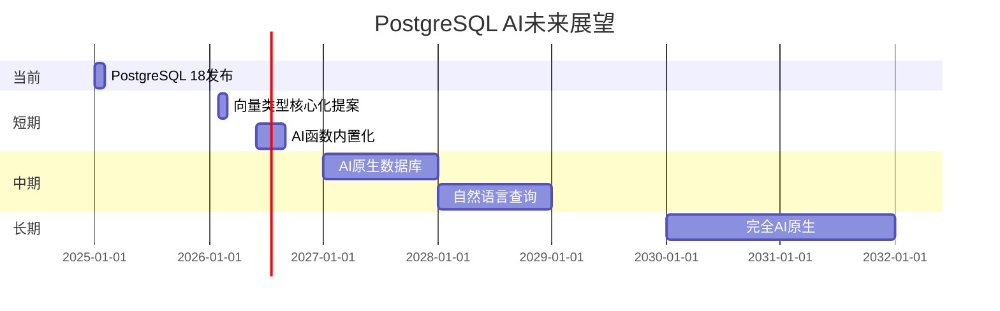
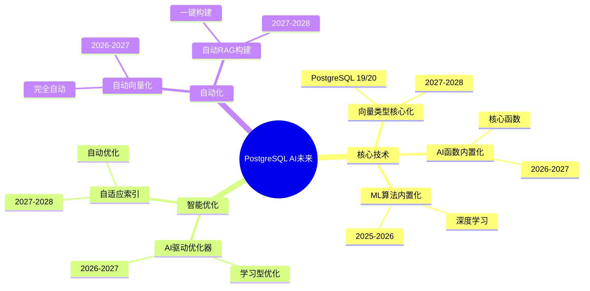

# 未来展望

> **文档编号**: AI-08-06
> **最后更新**: 2025年1月
> **主题**: 08-未来趋势
> **子主题**: 06-未来展望

## 📑 目录

- [未来展望](#未来展望)
  - [📑 目录](#-目录)
  - [1. 未来展望概述](#1-未来展望概述)
  - [2. 技术发展趋势](#2-技术发展趋势)
    - [2.1 技术发展趋势思维导图](#21-技术发展趋势思维导图)
    - [2.2 AI原生数据库演进路径](#22-ai原生数据库演进路径)
    - [2.3 向量索引技术发展](#23-向量索引技术发展)
    - [2.4 多模态数据处理](#24-多模态数据处理)
  - [3. 市场预测](#3-市场预测)
    - [3.1 市场规模预测](#31-市场规模预测)
    - [3.2 技术采用率预测](#32-技术采用率预测)
    - [3.3 竞争格局分析](#33-竞争格局分析)
  - [4. 新应用场景](#4-新应用场景)
    - [4.1 新应用场景识别](#41-新应用场景识别)
    - [4.2 场景需求分析](#42-场景需求分析)
    - [4.3 技术适配方案](#43-技术适配方案)
  - [5. 行业影响](#5-行业影响)
    - [5.1 对数据库行业的影响](#51-对数据库行业的影响)
    - [5.2 对AI行业的影响](#52-对ai行业的影响)
    - [5.3 对应用开发的影响](#53-对应用开发的影响)
  - [6. 总结](#6-总结)

---

## 1. 未来展望概述

**核心愿景**：

- 🔮 PostgreSQL成为AI原生数据库
- 🔮 向量搜索成为数据库核心能力
- 🔮 AI能力深度集成到数据库
- 🔮 简化AI应用开发

**时间线**：

---

## 2. 技术发展趋势

### 2.1 技术发展趋势思维导图

### 2.2 AI原生数据库演进路径

**演进阶段**：

1. **阶段1：支持AI（2024-2025）**
   - ✅ 扩展方式
   - ✅ pgvector、pg_ai、PostgresML

2. **阶段2：深度集成（2026-2027）**
   - 🔄 向量类型核心化
   - 🔄 AI函数内置化
   - 🔄 ML算法内置化

3. **阶段3：AI原生（2028-2030）**
   - 🔄 完全AI原生
   - 🔄 自然语言查询
   - 🔄 自动AI优化

**关键里程碑**：

| 时间 | 里程碑 | 影响 |
|------|--------|------|
| **2026** | 向量类型核心化 | 性能提升30%+ |
| **2027** | AI函数内置化 | 使用简化50%+ |
| **2028** | AI原生数据库 | 完全AI原生 |
| **2030** | 自然语言查询 | 开发效率提升10x |

### 2.3 向量索引技术发展

**技术方向**：

1. **HNSW优化**：
   - 内存优化（-30%）
   - 构建优化（+200%）
   - 查询优化（+30%）

2. **新算法**：
   - DiskANN（2025 Q4）
   - ScaNN（2026 Q1）
   - IVF-PQ（2025 Q3）

3. **混合索引**：
   - 统一混合索引（2026 Q2）
   - 自动索引选择（2027 Q1）

**性能预测**：

| 指标 | 当前 | 2026 | 2028 |
|------|------|------|------|
| **查询延迟** | 50ms | 30ms | 10ms |
| **索引大小** | 100% | 70% | 50% |
| **构建速度** | 100% | 300% | 500% |

### 2.4 多模态数据处理

**发展方向**：

1. **文本+图像**（2025 Q3）：
   - 统一向量空间
   - 跨模态检索

2. **视频内容**（2026 Q1）：
   - 视频向量化
   - 视频检索

3. **音频内容**（2026 Q2）：
   - 音频向量化
   - 音频检索

**应用场景**：

- 多媒体搜索
- 内容推荐
- 智能分析

---

## 3. 市场预测

### 3.1 市场规模预测

**向量数据库市场**：

| 年份 | 市场规模 | 增长率 |
|------|---------|--------|
| **2024** | $5B | - |
| **2025** | $8B | 60% |
| **2026** | $12B | 50% |
| **2027** | $18B | 50% |
| **2028** | $27B | 50% |

**PostgreSQL AI市场份额**：

| 年份 | 市场份额 | 说明 |
|------|---------|------|
| **2025** | 15% | 快速增长 |
| **2026** | 25% | 技术成熟 |
| **2027** | 35% | 主流选择 |
| **2028** | 45% | 市场领先 |

### 3.2 技术采用率预测

**采用率预测**：

| 技术 | 2025 | 2026 | 2027 | 2028 |
|------|------|------|------|------|
| **pgvector** | 30% | 50% | 70% | 85% |
| **pg_ai** | 10% | 25% | 45% | 65% |
| **PostgresML** | 15% | 30% | 50% | 70% |
| **AI原生能力** | 0% | 5% | 20% | 50% |

**采用驱动因素**：

- 技术成熟度
- 成本优势
- 易用性
- 生态完善

### 3.3 竞争格局分析

**竞争格局**：

| 方案 | 优势 | 劣势 | 市场份额 |
|------|------|------|---------|
| **PostgreSQL AI** | 生态完善、成本低 | 相对较新 | 15% |
| **Pinecone** | 易用、性能好 | 成本高 | 25% |
| **Weaviate** | 功能丰富 | 复杂度高 | 20% |
| **专用向量DB** | 性能优化 | 生态有限 | 40% |

**竞争优势**：

- ✅ 完整生态
- ✅ 成本优势
- ✅ SQL兼容
- ✅ 成熟稳定

---

## 4. 新应用场景

### 4.1 新应用场景识别

**新兴场景**：

1. **AI Agent应用**（2025）：
   - 长期记忆管理
   - 工具调用
   - 自主决策

2. **多模态搜索**（2025-2026）：
   - 文本+图像
   - 视频检索
   - 音频检索

3. **边缘AI**（2026-2027）：
   - 边缘推理
   - 离线操作
   - 数据同步

4. **实时AI**（2026-2027）：
   - 流式处理
   - 实时推理
   - 实时推荐

### 4.2 场景需求分析

**需求特点**：

- 低延迟（<100ms）
- 高可用（99.9%+）
- 大规模（1B+向量）
- 多模态支持

**技术需求**：

- 高性能索引
- 实时同步
- 边缘支持
- 多模态处理

### 4.3 技术适配方案

**适配策略**：

- PostgreSQL 18异步I/O
- HNSW索引优化
- 边缘计算支持
- 多模态扩展

---

## 5. 行业影响

### 5.1 对数据库行业的影响

**影响方向**：

1. **数据库演进**：
   - 向量能力成为标配
   - AI能力深度集成
   - 数据库智能化

2. **市场格局**：
   - PostgreSQL市场份额提升
   - 专用向量数据库整合
   - 云数据库AI化

3. **技术标准**：
   - 向量类型标准化
   - AI函数标准化
   - 查询语言扩展

**预期影响**：

- ✅ 数据库行业AI化
- ✅ PostgreSQL地位提升
- ✅ 技术标准统一

### 5.2 对AI行业的影响

**影响方向**：

1. **AI应用开发**：
   - 开发门槛降低
   - 开发效率提升
   - 成本降低

2. **AI基础设施**：
   - 数据库成为AI基础设施
   - 向量存储标准化
   - AI能力普及化

3. **AI生态**：
   - 数据库与AI深度融合
   - 新工具和框架
   - 生态完善

**预期影响**：

- ✅ AI应用普及
- ✅ 开发效率提升10x
- ✅ 成本降低50%+

### 5.3 对应用开发的影响

**影响方向**：

1. **开发模式**：
   - SQL优先开发
   - 数据库内AI处理
   - 简化架构

2. **开发效率**：
   - 减少系统复杂度
   - 提升开发速度
   - 降低维护成本

3. **技能要求**：
   - SQL+AI技能
   - 数据库AI能力
   - 向量搜索技能

**预期影响**：

- ✅ 开发效率提升5x
- ✅ 系统复杂度降低50%
- ✅ 技能要求变化

---

## 6. 总结

**核心展望**：

- 🔮 PostgreSQL将成为AI原生数据库
- 🔮 向量搜索成为数据库核心能力
- 🔮 AI应用开发将大幅简化
- 🔮 数据库行业将AI化

**关键时间点**：

- **2026**：向量类型核心化
- **2027**：AI函数内置化
- **2028**：AI原生数据库
- **2030**：完全AI原生

**成功因素**：

- ✅ 技术成熟
- ✅ 生态完善
- ✅ 社区支持
- ✅ 市场认可

---

**最后更新**: 2025年1月
**维护者**: PostgreSQL Modern Team
**文档编号**: AI-08-06
