---

> **📋 文档来源**: `PostgreSQL_AI\08-未来趋势\未来展望.md`
> **📅 复制日期**: 2025-12-22
> **⚠️ 注意**: 本文档为复制版本，原文件保持不变

---

# 未来展望

> **文档编号**: AI-08-06
> **最后更新**: 2025年1月
> **主题**: 08-未来趋势
> **子主题**: 06-未来展望

## 📑 目录

- [未来展望](#未来展望)
  - [📑 目录](#-目录)
  - [一、概述](#一概述)
  - [二、技术发展方向](#二技术发展方向)
    - [2.1 技术发展趋势思维导图](#21-技术发展趋势思维导图)
    - [2.2 AI原生数据库演进路径](#22-ai原生数据库演进路径)
    - [2.3 向量索引技术发展](#23-向量索引技术发展)
    - [2.4 多模态数据处理](#24-多模态数据处理)
  - [三、市场趋势预测](#三市场趋势预测)
    - [3.1 市场规模预测](#31-市场规模预测)
    - [3.2 技术采用率预测](#32-技术采用率预测)
    - [3.3 竞争格局分析](#33-竞争格局分析)
  - [四、应用场景扩展](#四应用场景扩展)
    - [4.1 新应用场景识别](#41-新应用场景识别)
    - [4.2 场景需求分析](#42-场景需求分析)
    - [4.3 技术适配方案](#43-技术适配方案)
  - [五、行业影响分析](#五行业影响分析)
    - [5.1 对数据库行业的影响](#51-对数据库行业的影响)
    - [5.2 对AI行业的影响](#52-对ai行业的影响)
    - [5.3 对应用开发的影响](#53-对应用开发的影响)
  - [六、技术路线图](#六技术路线图)
  - [七、风险与机遇](#七风险与机遇)
    - [风险分析](#风险分析)
    - [机遇分析](#机遇分析)
  - [八、关联主题](#八关联主题)
  - [九、对标资源](#九对标资源)
    - [市场报告](#市场报告)
    - [技术研究](#技术研究)

## 一、概述

PostgreSQL AI的未来展望，包括技术发展方向、市场趋势预测、应用场景扩展和行业影响分析，为PostgreSQL AI的长期发展提供战略指导。

## 二、技术发展方向

### 2.1 技术发展趋势思维导图

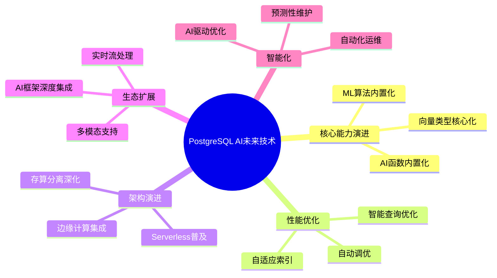

### 2.2 AI原生数据库演进路径

**演进阶段**:

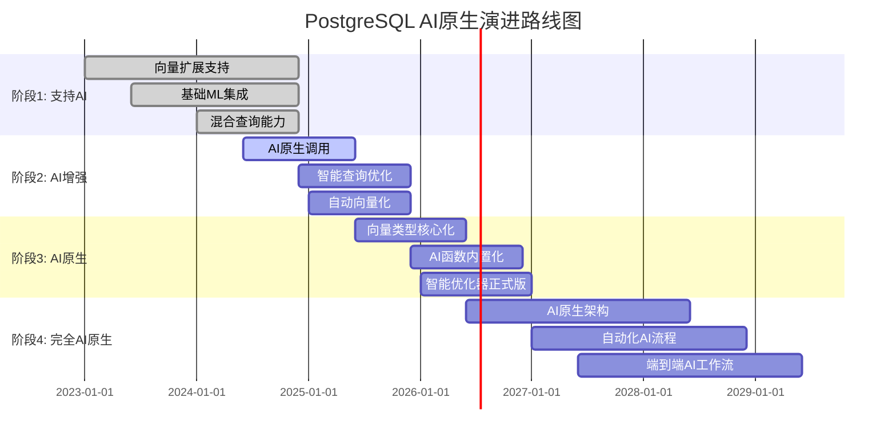

**关键技术节点**:

| 时间节点 | 关键技术 | 说明 | 状态 |
|---------|:--------|:----|:----|
| **2024年** | pgvector成熟 | 向量检索能力完善 | ✅ 已完成 |
| **2025年** | pgai集成 | AI原生调用能力 | 🚧 进行中 |
| **2026年** | 向量类型核心化 | 向量类型内置 | ⏳ 计划中 |
| **2027年** | 智能优化器 | AI驱动查询优化 | ⏳ 计划中 |
| **2028年** | AI原生架构 | 完整AI原生能力 | ⏳ 计划中 |

### 2.3 向量索引技术发展

**技术演进路径**:

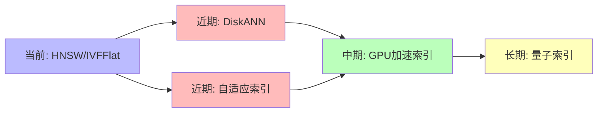

**技术对比**:

| 技术 | 优势 | 劣势 | 适用场景 | 成熟度 |
|------|:----|:----|:--------|:------|
| **HNSW** | 高精度、快速检索 | 内存占用大 | 小规模数据 | ⭐⭐⭐⭐⭐ |
| **IVFFlat** | 内存占用小 | 精度较低 | 大规模数据 | ⭐⭐⭐⭐ |
| **DiskANN** | 磁盘友好 | 实现复杂 | 超大规模数据 | ⭐⭐⭐ |
| **自适应索引** | 自动优化 | 开发中 | 通用场景 | ⭐⭐ |
| **GPU加速** | 高性能 | 成本高 | 高性能要求 | ⭐⭐ |

### 2.4 多模态数据处理

**多模态支持路线图**:

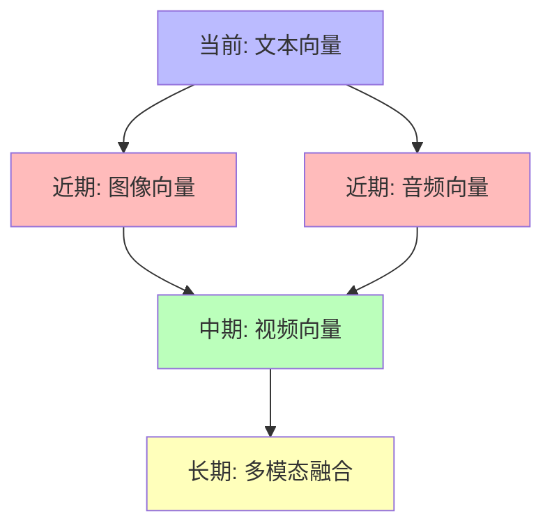

**多模态应用场景**:

| 模态 | 应用场景 | 技术挑战 | 解决方案 |
|------|:--------|:--------|:--------|
| **文本** | RAG、搜索 | 语义理解 | 大语言模型 |
| **图像** | 图像检索、分类 | 特征提取 | 视觉模型 |
| **音频** | 语音识别、检索 | 时序处理 | 音频模型 |
| **视频** | 视频检索、分析 | 时空建模 | 视频模型 |
| **多模态** | 跨模态检索 | 模态对齐 | 多模态模型 |

## 三、市场趋势预测

### 3.1 市场规模预测

**市场增长预测**:

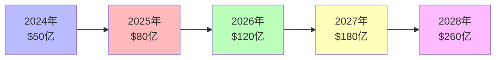

**细分市场预测**:

| 市场细分 | 2024年 | 2025年预测 | 2026年预测 | CAGR |
|---------|:------:|:----------:|:----------:|:----|
| **向量数据库** | $10亿 | $18亿 | $30亿 | 73% |
| **AI原生数据库** | $5亿 | $12亿 | $25亿 | 124% |
| **RAG基础设施** | $15亿 | $25亿 | $40亿 | 63% |
| **AI Agent数据** | $20亿 | $25亿 | $35亿 | 32% |

### 3.2 技术采用率预测

**采用率增长曲线**:

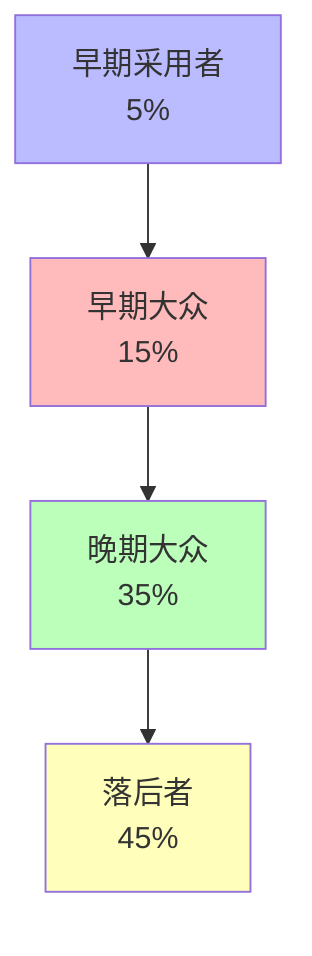

**技术采用时间表**:

| 技术 | 2024年 | 2025年 | 2026年 | 2027年 |
|------|:------:|:------:|:------:|:------:|
| **pgvector** | 15% | 35% | 55% | 70% |
| **pgai** | 2% | 10% | 25% | 45% |
| **PostgresML** | 5% | 15% | 30% | 50% |
| **RAG架构** | 20% | 40% | 60% | 75% |

### 3.3 竞争格局分析

**竞争格局矩阵**:

| 厂商 | 技术能力 | 市场地位 | 生态建设 | 未来潜力 |
|------|:--------:|:--------:|:--------|:--------|
| **PostgreSQL** | ⭐⭐⭐⭐⭐ | ⭐⭐⭐⭐ | ⭐⭐⭐⭐⭐ | ⭐⭐⭐⭐⭐ |
| **Pinecone** | ⭐⭐⭐⭐⭐ | ⭐⭐⭐⭐⭐ | ⭐⭐⭐ | ⭐⭐⭐⭐ |
| **Weaviate** | ⭐⭐⭐⭐ | ⭐⭐⭐ | ⭐⭐⭐⭐ | ⭐⭐⭐⭐ |
| **Milvus** | ⭐⭐⭐⭐⭐ | ⭐⭐⭐ | ⭐⭐⭐⭐ | ⭐⭐⭐⭐ |
| **Qdrant** | ⭐⭐⭐⭐ | ⭐⭐ | ⭐⭐⭐ | ⭐⭐⭐ |

**竞争优势分析**:

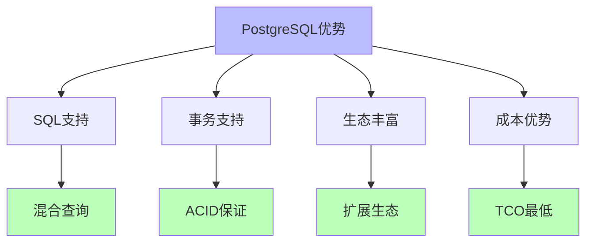

## 四、应用场景扩展

### 4.1 新应用场景识别

**场景扩展思维导图**:

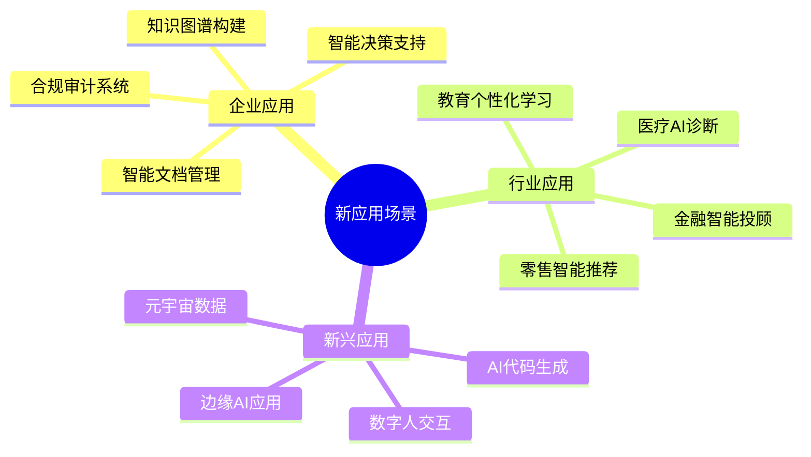

**场景优先级矩阵**:

| 场景 | 市场潜力 | 技术成熟度 | 实施难度 | 优先级 |
|------|:--------:|:----------:|:--------|:------|
| **智能文档管理** | ⭐⭐⭐⭐⭐ | ⭐⭐⭐⭐ | ⭐⭐⭐ | P0 |
| **知识图谱构建** | ⭐⭐⭐⭐ | ⭐⭐⭐ | ⭐⭐⭐⭐ | P1 |
| **AI代码生成** | ⭐⭐⭐⭐⭐ | ⭐⭐⭐ | ⭐⭐⭐⭐ | P1 |
| **医疗AI诊断** | ⭐⭐⭐⭐⭐ | ⭐⭐ | ⭐⭐⭐⭐⭐ | P2 |
| **数字人交互** | ⭐⭐⭐⭐ | ⭐⭐ | ⭐⭐⭐⭐ | P2 |

### 4.2 场景需求分析

**需求分析框架**:

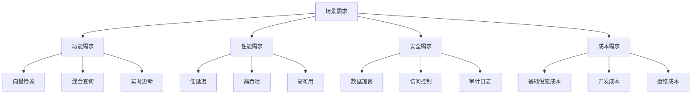

### 4.3 技术适配方案

**技术适配决策树**:

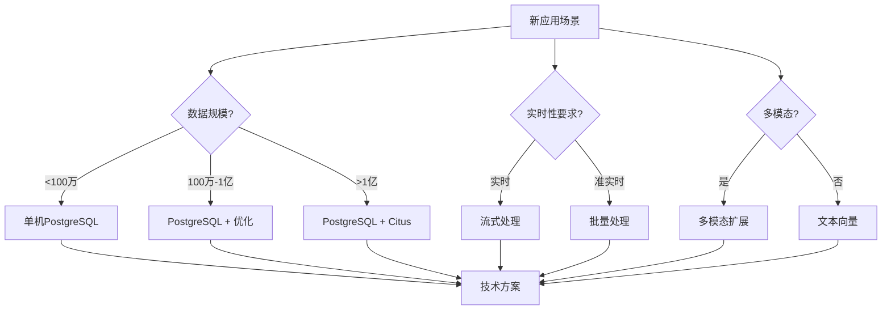

## 五、行业影响分析

### 5.1 对数据库行业的影响

**行业变革路径**:

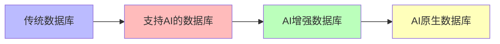

**影响分析**:

| 影响维度 | 传统数据库 | AI增强数据库 | AI原生数据库 |
|---------|:----------|:------------|:------------|
| **数据模型** | 关系模型 | 关系+向量 | 统一数据模型 |
| **查询语言** | SQL | SQL+向量查询 | 自然语言+SQL |
| **优化方式** | 规则优化 | 规则+ML优化 | AI驱动优化 |
| **开发模式** | 手动开发 | 半自动开发 | 自动生成 |

### 5.2 对AI行业的影响

**AI基础设施演进**:

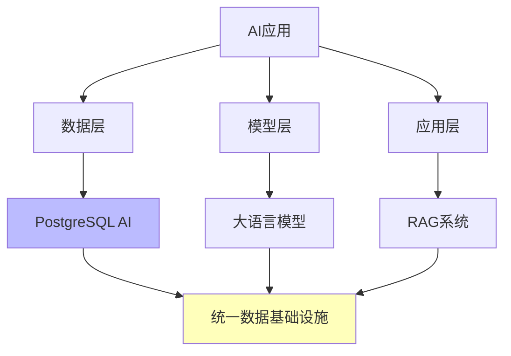

**影响总结**:

1. **降低AI应用开发门槛**
   - 统一的SQL接口
   - 内置AI能力
   - 减少系统复杂度

2. **提升AI应用性能**
   - 向量检索优化
   - 混合查询能力
   - 智能缓存策略

3. **降低AI应用成本**
   - 减少基础设施成本
   - 降低开发成本
   - 优化运维成本

### 5.3 对应用开发的影响

**开发范式变革**:

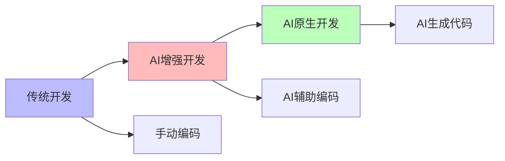

**开发效率提升**:

| 开发阶段 | 传统方式 | AI增强方式 | 效率提升 |
|---------|:--------|:----------|:--------|
| **数据建模** | 手动设计 | AI辅助设计 | 50% |
| **查询编写** | 手动编写 | AI生成 | 70% |
| **性能优化** | 手动调优 | AI自动优化 | 60% |
| **测试调试** | 手动测试 | AI辅助测试 | 40% |

## 六、技术路线图

**完整技术路线图**:

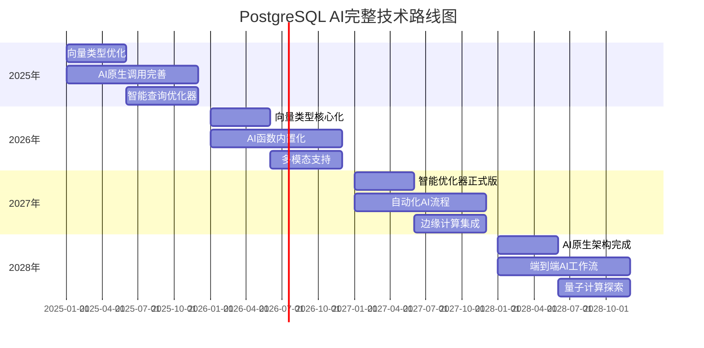

## 七、风险与机遇

### 风险分析

| 风险 | 概率 | 影响 | 应对措施 |
|------|:----:|:----|:--------|
| **技术不成熟** | 中 | 高 | 持续技术研发，建立测试体系 |
| **竞争加剧** | 高 | 中 | 加强生态建设，提升用户体验 |
| **标准缺失** | 中 | 中 | 参与标准制定，推动行业规范 |
| **安全隐私** | 中 | 高 | 加强安全机制，合规设计 |

### 机遇分析

| 机遇 | 概率 | 影响 | 把握策略 |
|------|:----:|:----|:--------|
| **AI应用爆发** | 高 | 高 | 提前布局，建立生态 |
| **技术突破** | 中 | 高 | 持续研发，技术领先 |
| **市场扩张** | 高 | 中 | 扩大市场，提升份额 |
| **生态成熟** | 高 | 高 | 加强合作，共建生态 |

## 八、关联主题

- [技术发展趋势](./技术发展趋势.md) - 技术发展方向
- [AI原生数据库演进](./AI原生数据库演进.md) - 演进路径
- [扩展生态完善方向](./扩展生态完善方向.md) - 生态发展
- [云原生集成趋势](./云原生集成趋势.md) - 云原生趋势
- [战略实施建议](./战略实施建议.md) - 实施路径

## 九、对标资源

### 市场报告

- [Gartner Technology Trends 2025](https://www.gartner.com/)
- [Forrester AI Infrastructure Report](https://www.forrester.com/)
- [IDC AI Database Market Forecast](https://www.idc.com/)

### 技术研究

- [PostgreSQL Roadmap](https://www.postgresql.org/)
- [AI Database Research Papers](https://arxiv.org/)
- [Industry Technology Reports](https://www.oreilly.com/)

---

**最后更新**: 2025年1月
**维护者**: PostgreSQL Modern Team
**文档编号**: AI-08-06
