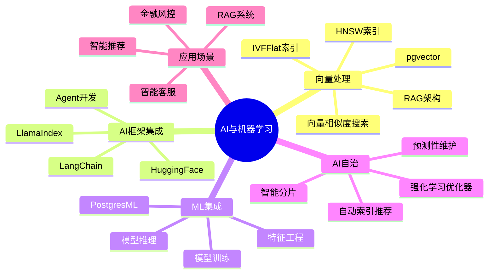
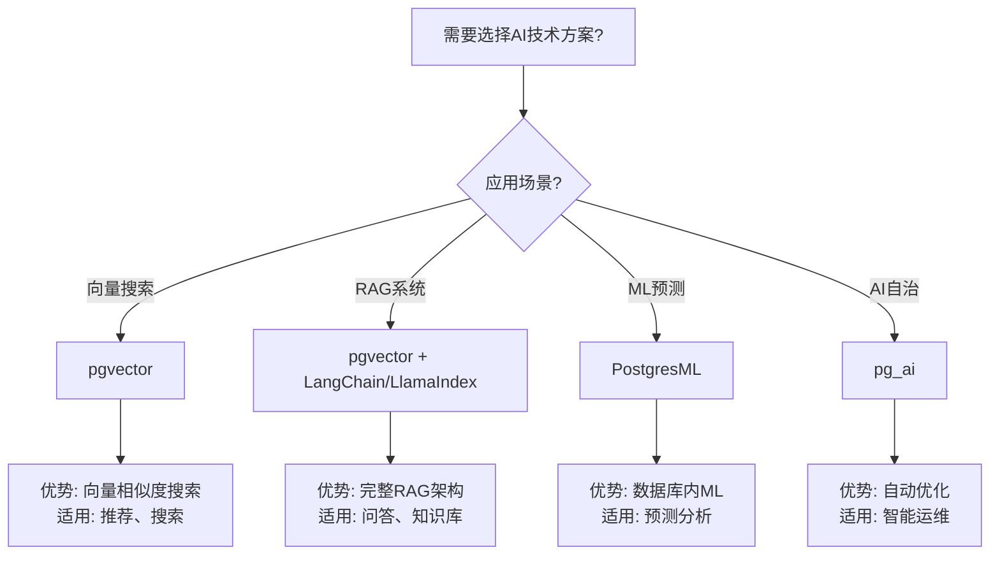

---

> **📋 文档来源**: `docs\02-AI-ML\README.md`
> **📅 复制日期**: 2025-12-22
> **⚠️ 注意**: 本文档为复制版本，原文件保持不变

---

# 10-AI与机器学习

> **文档总数**: 50+个文档
> **覆盖领域**: pgvector、RAG、LangChain、LlamaIndex、PostgresML、AI自治
> **版本覆盖**: PostgreSQL 18.x (推荐) ⭐ | 17.x (推荐) | 16.x (兼容)
> **最后更新**: 2025年1月

---

## 📊 知识体系思维导图

---

## 🎯 本目录说明

**PostgreSQL作为AI/ML向量数据库**的完整生产级指南。

本目录包含**50+个深度指南**，涵盖向量处理、AI框架集成、ML集成、AI自治等完整技术栈。

---

## 📊 AI技术选型决策树

---

## 📊 AI技术栈对比矩阵

| 技术方案 | 功能 | 性能 | 易用性 | 社区支持 | 适用场景 |
| --- | --- | --- | --- | --- | --- |
| **pgvector** | ⭐⭐⭐⭐⭐ | ⭐⭐⭐⭐⭐ | ⭐⭐⭐⭐ | ⭐⭐⭐⭐⭐ | 向量搜索、相似度匹配 |
| **LangChain** | ⭐⭐⭐⭐⭐ | ⭐⭐⭐⭐ | ⭐⭐⭐⭐ | ⭐⭐⭐⭐⭐ | RAG系统、Agent开发 |
| **LlamaIndex** | ⭐⭐⭐⭐ | ⭐⭐⭐⭐ | ⭐⭐⭐⭐ | ⭐⭐⭐⭐ | 数据索引、RAG系统 |
| **PostgresML** | ⭐⭐⭐⭐ | ⭐⭐⭐⭐ | ⭐⭐⭐ | ⭐⭐⭐ | 数据库内ML、预测分析 |
| **pg_ai** | ⭐⭐⭐⭐ | ⭐⭐⭐⭐ | ⭐⭐⭐ | ⭐⭐⭐ | AI自治、自动优化 |

---

## 🆕 最新文档 (2025-01-29)

### pgvector 0.8.1新特性完整指南 ✅

**文件**: [pgvector-0.8.1-新特性完整指南.md](./pgvector-0.8.1-新特性完整指南.md)
**字数**: 25,000字
**内容**:
- StreamingDiskANN索引完整指南
- Statistical Binary Quantization (SBQ)详解
- 性能对比 (vs Pinecone等)
- PostgreSQL 18兼容性测试
- 生产部署和迁移指南

---

## 📋 计划创建的指南

### P5-1: pgvector 0.7+ 完整深化指南 ⭐⭐⭐⭐⭐ ✅ 已完成

**重要性**: 最高（AI应用基础）

**内容**：

- pgvector 0.7+最新特性
- 向量索引（IVFFlat、HNSW）深度对比
- 相似度搜索优化
- 性能调优
- RAG架构完整实现
- 生产环境部署

**目标**: 4000行详细内容
**状态**: 🔵 进行中

---

### P5-2: LangChain 0.3+ 生产级集成指南 ⭐⭐⭐⭐⭐

**内容**：

- LangChain 0.3+架构
- PostgreSQL作为向量存储
- Agent开发
- 生产环境最佳实践

**目标**: 4500行
**状态**: 🔵 计划中

---

### P5-3: LlamaIndex 0.11+ 完整指南 ⭐⭐⭐⭐

**目标**: 3000行
**状态**: 🔵 计划中

---

### P5-4: 模型优化完整指南 ⭐⭐⭐⭐⭐

**目标**: 5000行
**状态**: 🔵 计划中

---

### P5-5: 推理加速完整指南 ⭐⭐⭐⭐

**目标**: 3500行
**状态**: 🔵 计划中

---

### P5-6: RAG生产架构完整指南 ⭐⭐⭐⭐⭐

**目标**: 3000行
**状态**: 🔵 计划中

---

## 📊 预期成果

**完成后**：

- 📄 6个深度指南
- 📏 23,000行详细内容
- 💻 完整的代码和测试
- 📈 真实的性能数据
- 🏢 12+个真实案例

**项目完整度**：68-72% → 88-92%（+20%）

---

**等待深度内容创建...** 🚀

---

**最后更新**: 2025年12月4日
