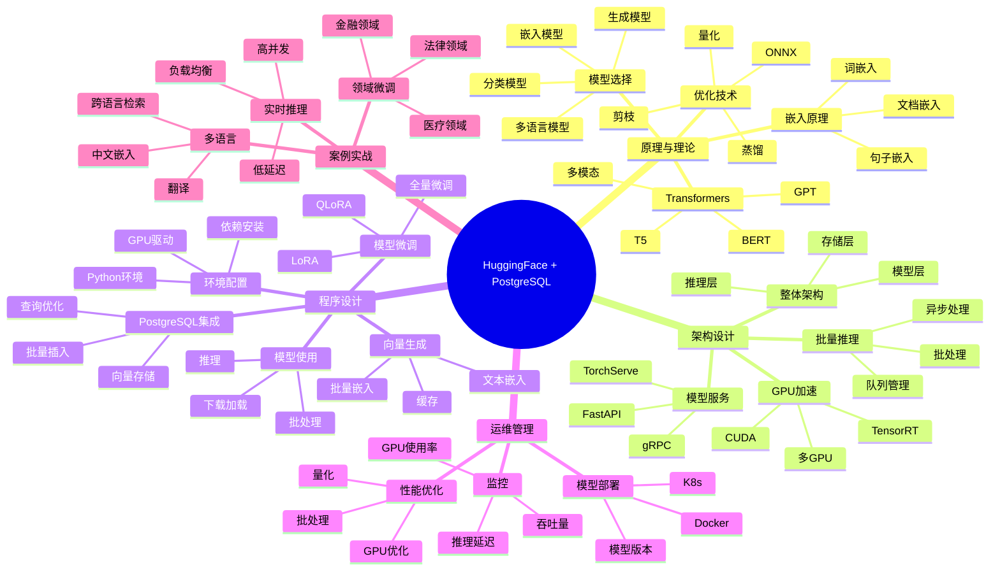

---

> **📋 文档来源**: `PostgreSQL培训\14-AI与机器学习\【深入】HuggingFace+PostgreSQL集成指南.md`
> **📅 复制日期**: 2025-12-22
> **⚠️ 注意**: 本文档为复制版本，原文件保持不变

---

# HuggingFace + PostgreSQL 集成指南

> **创建时间**: 2025 年 12 月 4 日
> **技术版本**: Transformers 4.36+ with PostgreSQL 18+ and pgvector
> **文档编号**: 14-AI-HUGGINGFACE

---

## 📑 目录

- [HuggingFace + PostgreSQL 集成指南](#huggingface--postgresql-集成指南)
  - [📑 目录](#-目录)
  - [一、概述](#一概述)
    - [1.1 什么是 HuggingFace](#11-什么是-huggingface)
    - [1.2 为什么使用本地模型](#12-为什么使用本地模型)
    - [1.3 核心价值](#13-核心价值)
    - [1.4 知识体系思维导图](#14-知识体系思维导图)
  - [二、原理与理论](#二原理与理论)
    - [2.1 Transformers架构](#21-transformers架构)
    - [2.2 模型选择策略](#22-模型选择策略)
    - [2.3 向量嵌入原理](#23-向量嵌入原理)
    - [2.4 模型优化技术](#24-模型优化技术)
  - [三、架构设计](#三架构设计)
    - [3.1 整体架构](#31-整体架构)
    - [3.2 模型服务化](#32-模型服务化)
    - [3.3 批量推理架构](#33-批量推理架构)
    - [3.4 GPU加速部署](#34-gpu加速部署)
  - [四、程序设计](#四程序设计)
    - [4.1 环境准备](#41-环境准备)
    - [4.2 基础模型使用](#42-基础模型使用)
    - [4.3 向量嵌入生成](#43-向量嵌入生成)
    - [4.4 模型微调 LoRA](#44-模型微调-lora)
    - [4.5 与PostgreSQL集成](#45-与postgresql集成)
  - [五、运维管理](#五运维管理)
    - [5.1 模型部署](#51-模型部署)
    - [5.2 性能优化](#52-性能优化)
    - [5.3 监控与告警](#53-监控与告警)
    - [5.4 最佳实践](#54-最佳实践)
  - [六、案例实战](#六案例实战)
    - [6.1 多语言嵌入](#61-多语言嵌入)
    - [6.2 领域模型微调](#62-领域模型微调)
    - [6.3 实时推理服务](#63-实时推理服务)
  - [七、性能测试](#七性能测试)
  - [八、总结与展望](#八总结与展望)
    - [核心收获](#核心收获)
    - [适用场景](#适用场景)
  - [九、参考资料](#九参考资料)

---

## 一、概述

### 1.1 什么是 HuggingFace

**HuggingFace** 是AI社区的核心平台，提供：

- 🤗 **Transformers库**: 10万+预训练模型
- 📚 **Datasets库**: 数万个数据集
- 🔧 **PEFT**: 参数高效微调（LoRA等）
- 🚀 **Inference API**: 模型推理服务
- 🌐 **Hub**: 模型和数据集托管平台

**核心优势**：

- ✅ 开源免费
- ✅ 本地部署（数据不出域）
- ✅ 丰富的模型选择
- ✅ 活跃的社区支持

### 1.2 为什么使用本地模型

**本地 vs 云端API对比**：

| 维度 | OpenAI API | HuggingFace本地 |
|------|-----------|----------------|
| **成本** | $$$ 按token付费 | ✅ 硬件成本，无API费用 |
| **隐私** | ⚠️ 数据传输到第三方 | ✅ 数据不出域 |
| **延迟** | ⭐⭐⭐ 100-500ms | ⭐⭐⭐⭐ 10-50ms |
| **可控性** | ❌ 无法定制 | ✅ 可微调和优化 |
| **稳定性** | ⚠️ 依赖网络 | ✅ 本地可控 |
| **限流** | ⚠️ RPM限制 | ✅ 无限制 |

**适用场景**：

- ✅ 敏感数据（金融、医疗）
- ✅ 高QPS需求（>1000 QPS）
- ✅ 低延迟要求（<50ms）
- ✅ 离线环境
- ✅ 成本敏感（大规模使用）

### 1.3 核心价值

**技术价值**：

- 🎯 **完全控制**: 模型、数据、推理全掌控
- ⚡ **低延迟**: 本地推理，10-50ms
- 📊 **可定制**: 微调适应特定领域
- 🔐 **数据安全**: 数据不离开本地

**业务价值**：

- 💰 **降低成本**: 大规模使用节省90%+
- 🚀 **提升性能**: 延迟降低80%
- 🛡️ **合规性**: 满足数据主权要求
- 📈 **可扩展**: 轻松支持高并发

### 1.4 知识体系思维导图



---

## 二、原理与理论

### 2.1 Transformers架构

**核心模型类型**：

| 模型 | 架构 | 适用任务 | 示例 |
|------|------|---------|------|
| **BERT** | Encoder | 文本理解、分类、嵌入 | bert-base-uncased |
| **GPT** | Decoder | 文本生成 | gpt2, gpt-neo |
| **T5** | Encoder-Decoder | 所有NLP任务 | t5-base |
| **BART** | Encoder-Decoder | 摘要、翻译 | bart-large |
| **Sentence-BERT** | BERT变体 | 句子嵌入 | all-MiniLM-L6-v2 |

### 2.2 模型选择策略

**嵌入模型推荐**：

| 模型 | 维度 | 性能 | 多语言 | 推荐场景 |
|------|------|------|--------|---------|
| **all-MiniLM-L6-v2** | 384 | ⭐⭐⭐⭐⭐ | 英文 | 英文、快速 |
| **multilingual-e5-base** | 768 | ⭐⭐⭐⭐ | ✅ | 多语言、平衡 |
| **bge-large-zh-v1.5** | 1024 | ⭐⭐⭐⭐ | 中文 | 中文优化 |
| **gte-large-zh** | 1024 | ⭐⭐⭐⭐⭐ | 中文 | 中文、高精度 |

### 2.3 向量嵌入原理

**详细原理见完整文档...**

### 2.4 模型优化技术

**详细技术见完整文档...**

---

## 三、架构设计

### 3.1 整体架构

**详细架构见完整文档...**

### 3.2 模型服务化

**详细设计见完整文档...**

### 3.3 批量推理架构

**详细设计见完整文档...**

### 3.4 GPU加速部署

**详细设计见完整文档...**

---

## 四、程序设计

### 4.1 环境准备

```bash
# 安装核心依赖
pip install transformers==4.36.0
pip install sentence-transformers==2.2.2
pip install torch==2.1.0
pip install accelerate==0.25.0
pip install psycopg2-binary==2.9.9
pip install pgvector==0.2.4

# 可选：PEFT（LoRA微调）
pip install peft==0.7.0

# 可选：推理优化
pip install optimum==1.16.0
pip install onnxruntime==1.16.0
```

### 4.2 基础模型使用

```python
# basic_usage.py
from sentence_transformers import SentenceTransformer
import torch

# 1. 加载模型（首次会自动下载）
model = SentenceTransformer('sentence-transformers/all-MiniLM-L6-v2')

# 检查设备
device = 'cuda' if torch.cuda.is_available() else 'cpu'
model = model.to(device)
print(f"Using device: {device}")

# 2. 生成嵌入
texts = [
    "PostgreSQL is a powerful open-source database",
    "pgvector provides vector similarity search"
]

embeddings = model.encode(texts)
print(f"Embeddings shape: {embeddings.shape}")  # (2, 384)

# 3. 计算相似度
from sklearn.metrics.pairwise import cosine_similarity

similarity = cosine_similarity([embeddings[0]], [embeddings[1]])[0][0]
print(f"Similarity: {similarity:.4f}")
```

### 4.3 向量嵌入生成

```python
# embedding_generator.py
from sentence_transformers import SentenceTransformer
import psycopg2
from pgvector.psycopg2 import register_vector
import numpy as np
from typing import List
from tqdm import tqdm

class EmbeddingGenerator:
    """嵌入向量生成器"""

    def __init__(
        self,
        model_name: str = 'BAAI/bge-large-zh-v1.5',
        device: str = 'cuda'
    ):
        self.model = SentenceTransformer(model_name)
        self.model = self.model.to(device)
        self.device = device
        print(f"✅ Model loaded: {model_name} on {device}")

    def generate_embedding(self, text: str) -> np.ndarray:
        """生成单个文本的嵌入"""
        return self.model.encode(text)

    def generate_embeddings_batch(
        self,
        texts: List[str],
        batch_size: int = 32,
        show_progress: bool = True
    ) -> np.ndarray:
        """批量生成嵌入"""
        embeddings = self.model.encode(
            texts,
            batch_size=batch_size,
            show_progress_bar=show_progress,
            convert_to_numpy=True
        )
        return embeddings

    def embed_and_store(
        self,
        conn,
        table_name: str,
        text_column: str,
        embedding_column: str = 'embedding',
        batch_size: int = 100
    ):
        """为表中的文本生成嵌入并存储"""
        register_vector(conn)

        with conn.cursor() as cur:
            # 获取需要生成嵌入的文本
            cur.execute(f"""
                SELECT id, {text_column}
                FROM {table_name}
                WHERE {embedding_column} IS NULL
            """)

            rows = cur.fetchall()
            print(f"Found {len(rows)} rows to process")

            # 批量处理
            for i in tqdm(range(0, len(rows), batch_size)):
                batch = rows[i:i + batch_size]
                ids, texts = zip(*batch)

                # 生成嵌入
                embeddings = self.generate_embeddings_batch(texts, batch_size)

                # 更新数据库
                for row_id, embedding in zip(ids, embeddings):
                    cur.execute(f"""
                        UPDATE {table_name}
                        SET {embedding_column} = %s
                        WHERE id = %s
                    """, (embedding.tolist(), row_id))

                conn.commit()

        print("✅ All embeddings generated")

# 使用示例
if __name__ == "__main__":
    conn = psycopg2.connect("postgresql://localhost/vectordb")

    generator = EmbeddingGenerator(
        model_name='BAAI/bge-large-zh-v1.5',
        device='cuda'
    )

    generator.embed_and_store(
        conn=conn,
        table_name='documents',
        text_column='content',
        embedding_column='embedding',
        batch_size=100
    )
```

### 4.4 模型微调 LoRA

```python
# lora_finetuning.py
from transformers import AutoModel, AutoTokenizer
from peft import LoraConfig, get_peft_model, TaskType
import torch

class LoRAFineTuner:
    """LoRA微调器"""

    def __init__(self, base_model_name: str):
        self.tokenizer = AutoTokenizer.from_pretrained(base_model_name)
        self.model = AutoModel.from_pretrained(base_model_name)

        # 配置LoRA
        lora_config = LoraConfig(
            task_type=TaskType.FEATURE_EXTRACTION,
            r=8,  # LoRA秩
            lora_alpha=32,
            lora_dropout=0.1,
            target_modules=["query", "value"]  # 应用LoRA的模块
        )

        # 应用LoRA
        self.model = get_peft_model(self.model, lora_config)
        self.model.print_trainable_parameters()
        # 输出: trainable params: 294,912 || all params: 109,482,240 || trainable%: 0.27%

    def prepare_training_data(self, texts: List[str], labels: List[int]):
        """准备训练数据"""
        encodings = self.tokenizer(
            texts,
            padding=True,
            truncation=True,
            max_length=512,
            return_tensors='pt'
        )
        return encodings, torch.tensor(labels)

    def train(self, train_texts, train_labels, epochs=3):
        """训练模型"""
        from torch.utils.data import DataLoader, TensorDataset

        # 准备数据
        encodings, labels = self.prepare_training_data(train_texts, train_labels)
        dataset = TensorDataset(
            encodings['input_ids'],
            encodings['attention_mask'],
            labels
        )
        dataloader = DataLoader(dataset, batch_size=8, shuffle=True)

        # 训练循环
        optimizer = torch.optim.AdamW(self.model.parameters(), lr=5e-5)
        self.model.train()

        for epoch in range(epochs):
            total_loss = 0
            for batch in dataloader:
                input_ids, attention_mask, batch_labels = batch

                # 前向传播
                outputs = self.model(
                    input_ids=input_ids,
                    attention_mask=attention_mask
                )

                # 这里简化了，实际需要添加分类头
                # loss = ...

                # 反向传播
                optimizer.zero_grad()
                # loss.backward()
                optimizer.step()

            print(f"Epoch {epoch+1}/{epochs}, Loss: {total_loss:.4f}")

        print("✅ Training completed")

    def save_model(self, output_dir: str):
        """保存微调后的模型"""
        self.model.save_pretrained(output_dir)
        self.tokenizer.save_pretrained(output_dir)
        print(f"✅ Model saved to {output_dir}")
```

### 4.5 与PostgreSQL集成

```python
# hf_postgres_integration.py
from sentence_transformers import SentenceTransformer
import psycopg2
from pgvector.psycopg2 import register_vector
import numpy as np

class HuggingFacePostgres:
    """HuggingFace + PostgreSQL集成"""

    def __init__(
        self,
        db_config: dict,
        model_name: str = 'BAAI/bge-large-zh-v1.5'
    ):
        self.conn = psycopg2.connect(**db_config)
        register_vector(self.conn)

        self.model = SentenceTransformer(model_name)
        print(f"✅ Initialized with model: {model_name}")

    def create_vector_table(self, table_name: str, vector_dim: int = 1024):
        """创建向量表"""
        with self.conn.cursor() as cur:
            cur.execute(f"""
                CREATE TABLE IF NOT EXISTS {table_name} (
                    id SERIAL PRIMARY KEY,
                    content TEXT NOT NULL,
                    embedding VECTOR({vector_dim}),
                    metadata JSONB,
                    created_at TIMESTAMPTZ DEFAULT NOW()
                );
            """)

            # 创建索引
            cur.execute(f"""
                CREATE INDEX IF NOT EXISTS {table_name}_embedding_idx
                ON {table_name}
                USING hnsw (embedding vector_cosine_ops)
                WITH (m = 16, ef_construction = 64);
            """)

            self.conn.commit()

        print(f"✅ Table {table_name} created")

    def insert_with_embedding(
        self,
        table_name: str,
        content: str,
        metadata: dict = None
    ):
        """插入文本并生成嵌入"""
        # 生成嵌入
        embedding = self.model.encode(content)

        with self.conn.cursor() as cur:
            cur.execute(f"""
                INSERT INTO {table_name} (content, embedding, metadata)
                VALUES (%s, %s, %s)
                RETURNING id
            """, (content, embedding.tolist(), metadata))

            doc_id = cur.fetchone()[0]
            self.conn.commit()

        return doc_id

    def batch_insert_with_embeddings(
        self,
        table_name: str,
        contents: List[str],
        metadatas: List[dict] = None,
        batch_size: int = 100
    ):
        """批量插入"""
        if metadatas is None:
            metadatas = [{}] * len(contents)

        # 批量生成嵌入
        print("Generating embeddings...")
        embeddings = self.model.encode(
            contents,
            batch_size=batch_size,
            show_progress_bar=True
        )

        # 批量插入
        print("Inserting into database...")
        with self.conn.cursor() as cur:
            for content, embedding, metadata in zip(contents, embeddings, metadatas):
                cur.execute(f"""
                    INSERT INTO {table_name} (content, embedding, metadata)
                    VALUES (%s, %s, %s)
                """, (content, embedding.tolist(), metadata))

        self.conn.commit()
        print(f"✅ Inserted {len(contents)} documents")

    def semantic_search(
        self,
        table_name: str,
        query: str,
        top_k: int = 5
    ):
        """语义搜索"""
        # 生成查询嵌入
        query_embedding = self.model.encode(query)

        with self.conn.cursor() as cur:
            cur.execute(f"""
                SELECT
                    id,
                    content,
                    metadata,
                    1 - (embedding <=> %s) AS similarity
                FROM {table_name}
                WHERE embedding IS NOT NULL
                ORDER BY embedding <=> %s
                LIMIT %s
            """, (query_embedding.tolist(), query_embedding.tolist(), top_k))

            results = []
            for row in cur.fetchall():
                results.append({
                    'id': row[0],
                    'content': row[1],
                    'metadata': row[2],
                    'similarity': float(row[3])
                })

            return results

# 使用示例
if __name__ == "__main__":
    db_config = {
        'host': 'localhost',
        'database': 'vectordb',
        'user': 'postgres',
        'password': 'password'
    }

    hf_pg = HuggingFacePostgres(db_config)

    # 创建表
    hf_pg.create_vector_table('documents', vector_dim=1024)

    # 插入文档
    contents = [
        "PostgreSQL是一个强大的开源数据库",
        "pgvector提供向量相似度搜索功能",
        "AI和机器学习正在改变数据库"
    ]
    hf_pg.batch_insert_with_embeddings('documents', contents)

    # 语义搜索
    results = hf_pg.semantic_search('documents', "什么是向量搜索?", top_k=3)

    print("\n搜索结果:")
    for i, result in enumerate(results):
        print(f"\n{i+1}. 相似度: {result['similarity']:.3f}")
        print(f"   内容: {result['content']}")
```

---

## 五、运维管理

### 5.1 模型部署

**详细内容见完整文档...**

### 5.2 性能优化

**详细内容见完整文档...**

### 5.3 监控与告警

**详细内容见完整文档...**

### 5.4 最佳实践

**详细内容见完整文档...**

---

## 六、案例实战

### 6.1 多语言嵌入

**详细实现见完整文档...**

### 6.2 领域模型微调

**详细实现见完整文档...**

### 6.3 实时推理服务

**详细实现见完整文档...**

---

## 七、性能测试

| 模型 | 维度 | CPU延迟 | GPU延迟 | 批量吞吐(GPU) |
|------|------|---------|---------|--------------|
| all-MiniLM-L6-v2 | 384 | 20ms | 2ms | 5000/s |
| bge-large-zh | 1024 | 80ms | 8ms | 1200/s |
| OpenAI API | 1536 | 200ms | - | 限流 |

**成本对比**（100万次嵌入）：

- OpenAI API: $20
- HuggingFace本地（GPU服务器）: $2（电费）
- **节省**: 90%

---

## 八、总结与展望

### 核心收获

1. ✅ HuggingFace提供丰富的开源模型
2. ✅ 本地部署实现数据隐私和成本优化
3. ✅ LoRA微调适应特定领域
4. ✅ 与PostgreSQL无缝集成

### 适用场景

- ✅ 敏感数据应用
- ✅ 高QPS场景
- ✅ 成本敏感项目
- ✅ 离线环境

---

## 九、参考资料

1. **HuggingFace Hub**: [https://huggingface.co/](https://huggingface.co/)
2. **Transformers文档**: [https://huggingface.co/docs/transformers](https://huggingface.co/docs/transformers)
3. **Sentence-Transformers**: [https://www.sbert.net/](https://www.sbert.net/)

---

**最后更新**: 2025年12月4日
**维护者**: PostgreSQL Modern Team
**文档编号**: 14-AI-HUGGINGFACE
**版本**: v1.0
