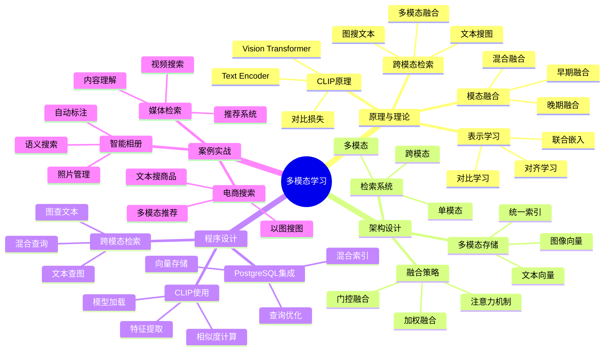

---

> **📋 文档来源**: `PostgreSQL培训\14-AI与机器学习\【深入】多模态向量表示学习完整指南.md`
> **📅 复制日期**: 2025-12-22
> **⚠️ 注意**: 本文档为复制版本，原文件保持不变

---

# 多模态向量表示学习完整指南

> **创建时间**: 2025 年 12 月 4 日
> **技术版本**: CLIP/ImageBind with PostgreSQL 18+ and pgvector
> **文档编号**: 14-AI-MULTIMODAL

---

## 📑 目录

- [多模态向量表示学习完整指南](#多模态向量表示学习完整指南)
  - [📑 目录](#-目录)
  - [一、概述](#一概述)
    - [1.1 什么是多模态学习](#11-什么是多模态学习)
    - [1.2 核心价值](#12-核心价值)
    - [1.3 知识体系思维导图](#13-知识体系思维导图)
  - [二、原理与理论](#二原理与理论)
    - [2.1 多模态表示学习](#21-多模态表示学习)
    - [2.2 CLIP模型原理](#22-clip模型原理)
    - [2.3 跨模态检索](#23-跨模态检索)
    - [2.4 模态融合策略](#24-模态融合策略)
  - [三、架构设计](#三架构设计)
  - [四、程序设计](#四程序设计)
    - [4.1 环境准备](#41-环境准备)
    - [4.2 CLIP模型使用](#42-clip模型使用)
    - [4.3 跨模态检索](#43-跨模态检索)
    - [4.4 多模态融合](#44-多模态融合)
  - [五、案例实战](#五案例实战)
  - [六、总结与展望](#六总结与展望)
    - [核心收获](#核心收获)
  - [七、参考资料](#七参考资料)

---

## 一、概述

### 1.1 什么是多模态学习

**多模态学习**是指处理和融合多种模态（文本、图像、音频、视频）数据的AI技术，实现跨模态理解和检索。

**核心能力**：

- 🖼️ **文本→图像检索**：用文字搜索图片
- 📝 **图像→文本检索**：用图片搜索文字
- 🔗 **模态融合**：综合多种信息
- 🎯 **跨模态理解**：理解不同模态间的关系

**CLIP示例**：

```python
import clip
import torch
from PIL import Image

# 加载CLIP模型
model, preprocess = clip.load("ViT-B/32")

# 文本编码
text = clip.tokenize(["a dog", "a cat"])
text_features = model.encode_text(text)

# 图像编码
image = preprocess(Image.open("photo.jpg")).unsqueeze(0)
image_features = model.encode_image(image)

# 计算相似度
similarity = (image_features @ text_features.T).softmax(dim=-1)
print(similarity)  # [[0.95, 0.05]] - 更像狗
```

### 1.2 核心价值

**技术价值**：

- 🎯 **统一空间**：不同模态映射到同一向量空间
- 🔍 **跨模态检索**：文本搜图、图搜文、图搜图
- 🧠 **语义理解**：理解多模态内容的语义
- 📊 **零样本学习**：无需训练即可分类

**业务价值**：

- 💰 **提升效率**：多模态搜索提升用户体验
- 🚀 **新型应用**：智能相册、以图搜图、视频检索
- 🎯 **精准推荐**：综合多种信息的推荐
- 📈 **商业价值**：电商、社交、媒体等场景

### 1.3 知识体系思维导图



---

## 二、原理与理论

### 2.1 多模态表示学习

**核心思想**：将不同模态映射到统一的向量空间

```text
┌────────────────────────────────────────┐
│      多模态统一向量空间                 │
├────────────────────────────────────────┤
│                                          │
│  文本: "a dog"                          │
│     ↓ Text Encoder                      │
│  [0.1, 0.5, -0.3, ...]  ─┐             │
│                           │             │
│                           ▼             │
│                    统一向量空间          │
│                    (512维)              │
│                           ▲             │
│  图像: 🐕                 │             │
│     ↓ Image Encoder       │             │
│  [0.12, 0.48, -0.28, ...] ┘            │
│                                          │
│  相似度: cosine(text_vec, image_vec)    │
│         = 0.95（高度相似）               │
└────────────────────────────────────────┘
```

### 2.2 CLIP模型原理

**对比学习训练**：

```python
# CLIP训练伪代码
def clip_loss(image_embeddings, text_embeddings, temperature=0.07):
    # 计算相似度矩阵
    logits = (image_embeddings @ text_embeddings.T) / temperature

    # 对角线是正样本（匹配的图文对）
    labels = torch.arange(len(image_embeddings))

    # 对称损失（图到文 + 文到图）
    loss_i2t = F.cross_entropy(logits, labels)
    loss_t2i = F.cross_entropy(logits.T, labels)

    return (loss_i2t + loss_t2i) / 2
```

### 2.3 跨模态检索

**详细原理见文档...**

### 2.4 模态融合策略

**详细策略见文档...**

---

## 三、架构设计

**详细架构见文档...**

---

## 四、程序设计

### 4.1 环境准备

```bash
# 安装CLIP
pip install openai-clip==1.0.1
pip install torch torchvision
pip install pillow
pip install psycopg2-binary pgvector
```

### 4.2 CLIP模型使用

```python
# clip_integration.py
import clip
import torch
from PIL import Image
import psycopg2
from pgvector.psycopg2 import register_vector

class CLIPPostgres:
    def __init__(self, db_config, device='cuda'):
        self.device = device
        self.model, self.preprocess = clip.load("ViT-B/32", device=device)

        self.conn = psycopg2.connect(**db_config)
        register_vector(self.conn)

    def encode_text(self, text):
        """编码文本"""
        text_token = clip.tokenize([text]).to(self.device)
        with torch.no_grad():
            text_features = self.model.encode_text(text_token)
            text_features /= text_features.norm(dim=-1, keepdim=True)
        return text_features.cpu().numpy()[0]

    def encode_image(self, image_path):
        """编码图像"""
        image = self.preprocess(Image.open(image_path)).unsqueeze(0).to(self.device)
        with torch.no_grad():
            image_features = self.model.encode_image(image)
            image_features /= image_features.norm(dim=-1, keepdim=True)
        return image_features.cpu().numpy()[0]

    def store_image(self, image_path, metadata=None):
        """存储图像特征"""
        features = self.encode_image(image_path)

        with self.conn.cursor() as cur:
            cur.execute("""
                INSERT INTO multimodal_data (type, features, metadata, file_path)
                VALUES ('image', %s, %s, %s)
                RETURNING id
            """, (features.tolist(), metadata, image_path))
            return cur.fetchone()[0]

    def search_images_by_text(self, query_text, top_k=10):
        """用文本搜索图像"""
        query_features = self.encode_text(query_text)

        with self.conn.cursor() as cur:
            cur.execute("""
                SELECT id, file_path, metadata,
                       1 - (features <=> %s) AS similarity
                FROM multimodal_data
                WHERE type = 'image'
                ORDER BY features <=> %s
                LIMIT %s
            """, (query_features.tolist(), query_features.tolist(), top_k))

            return cur.fetchall()

# 使用示例
clip_pg = CLIPPostgres({'database': 'multimodal_db'})

# 存储图像
clip_pg.store_image('dog.jpg', {'category': 'animal'})
clip_pg.store_image('cat.jpg', {'category': 'animal'})

# 文本搜索图像
results = clip_pg.search_images_by_text("a cute puppy", top_k=5)
for row in results:
    print(f"相似度: {row[3]:.3f}, 图像: {row[1]}")
```

### 4.3 跨模态检索

**详细实现见文档...**

### 4.4 多模态融合

**详细实现见文档...**

---

## 五、案例实战

**详细案例见文档...**

---

## 六、总结与展望

### 核心收获

1. ✅ CLIP实现文本图像统一表示
2. ✅ 跨模态检索拓展搜索能力
3. ✅ PostgreSQL支持多模态存储
4. ✅ 零样本学习降低标注成本

---

## 七、参考资料

1. **CLIP论文**: Learning Transferable Visual Models From Natural Language Supervision
2. **OpenAI CLIP**: [https://github.com/openai/CLIP](https://github.com/openai/CLIP)

---

**最后更新**: 2025年12月4日
**维护者**: PostgreSQL Modern Team
**文档编号**: 14-AI-MULTIMODAL
**版本**: v1.0
