---

> **📋 文档来源**: `PostgreSQL\04-部署运维\99-归档\1.1.150-PostgreSQL部署方式与场景对比分析.md`
> **📅 复制日期**: 2025-12-22
> **⚠️ 注意**: 本文档为复制版本，原文件保持不变

---

# PostgreSQL部署方式与场景对比分析

## 目录

- [PostgreSQL部署方式与场景对比分析](#postgresql部署方式与场景对比分析)
  - [目录](#目录)
  - [1. 部署方式分类](#1-部署方式分类)
    - [1.1 部署架构分类](#11-部署架构分类)
    - [1.2 部署方式对比矩阵](#12-部署方式对比矩阵)
  - [2. 单机部署详解](#2-单机部署详解)
    - [2.1 标准单机部署](#21-标准单机部署)
      - [2.1.1 安装配置](#211-安装配置)
      - [2.1.2 基础配置优化](#212-基础配置优化)
      - [2.1.3 性能监控](#213-性能监控)
    - [2.2 高性能单机配置](#22-高性能单机配置)
      - [2.2.1 硬件优化配置](#221-硬件优化配置)
      - [2.2.2 存储优化](#222-存储优化)
  - [3. 集群部署方案](#3-集群部署方案)
    - [3.1 主从复制部署](#31-主从复制部署)
      - [3.1.1 流复制配置](#311-流复制配置)
      - [3.1.2 读写分离配置](#312-读写分离配置)
    - [3.2 高可用集群部署](#32-高可用集群部署)
      - [3.2.1 Patroni高可用配置](#321-patroni高可用配置)
      - [3.2.2 故障转移配置](#322-故障转移配置)
    - [3.3 分布式集群部署](#33-分布式集群部署)
      - [3.3.1 Citus分布式扩展](#331-citus分布式扩展)
      - [3.3.2 分片策略](#332-分片策略)
  - [4. 云原生部署](#4-云原生部署)
    - [4.1 容器化部署](#41-容器化部署)
      - [4.1.1 Docker部署](#411-docker部署)
      - [4.1.2 Kubernetes部署](#412-kubernetes部署)
    - [4.2 云服务部署](#42-云服务部署)
      - [4.2.1 AWS RDS配置](#421-aws-rds配置)
      - [4.2.2 Google Cloud SQL配置](#422-google-cloud-sql配置)
  - [5. 场景对比分析](#5-场景对比分析)
    - [5.1 应用场景分类](#51-应用场景分类)
      - [5.1.1 开发测试环境](#511-开发测试环境)
      - [5.1.2 生产环境](#512-生产环境)
      - [5.1.3 大规模应用](#513-大规模应用)
    - [5.2 性能对比分析](#52-性能对比分析)
      - [5.2.1 吞吐量对比](#521-吞吐量对比)
      - [5.2.2 可用性对比](#522-可用性对比)
  - [6. 性能基准测试](#6-性能基准测试)
    - [6.1 测试环境配置](#61-测试环境配置)
      - [6.1.1 硬件配置](#611-硬件配置)
      - [6.1.2 测试工具](#612-测试工具)
    - [6.2 测试结果分析](#62-测试结果分析)
      - [6.2.1 OLTP性能测试](#621-oltp性能测试)
      - [6.2.2 OLAP性能测试](#622-olap性能测试)
  - [7. 成本效益分析](#7-成本效益分析)
    - [7.1 成本构成分析](#71-成本构成分析)
      - [7.1.1 硬件成本](#711-硬件成本)
      - [7.1.2 运维成本](#712-运维成本)
    - [7.2 ROI分析](#72-roi分析)
      - [7.2.1 三年总成本对比](#721-三年总成本对比)
      - [7.2.2 性能收益分析](#722-性能收益分析)
  - [总结](#总结)

## 1. 部署方式分类

### 1.1 部署架构分类

```mermaid
graph TB
    A[PostgreSQL部署方式] --> B[单机部署]
    A --> C[集群部署]
    A --> D[云原生部署]

    B --> B1[标准单机]
    B --> B2[高性能单机]

    C --> C1[主从复制]
    C --> C2[分布式集群]
    C --> C3[高可用集群]

    D --> D1[容器化部署]
    D --> D2[Kubernetes部署]
    D --> D3[云服务部署]
```



### 1.2 部署方式对比矩阵

| 部署方式 | 复杂度 | 成本 | 性能 | 可用性 | 扩展性 | 适用场景 |
|---------|--------|------|------|--------|--------|----------|
| 单机部署 | 低 | 低 | 中 | 低 | 低 | 开发测试、小型应用 |
| 主从复制 | 中 | 中 | 高 | 高 | 中 | 中等规模应用 |
| 分布式集群 | 高 | 高 | 很高 | 很高 | 很高 | 大规模应用 |
| 容器化部署 | 中 | 中 | 高 | 高 | 高 | 微服务架构 |
| 云原生部署 | 低 | 高 | 高 | 很高 | 很高 | 企业级应用 |

## 2. 单机部署详解

### 2.1 标准单机部署

#### 2.1.1 安装配置

```bash
# Ubuntu/Debian安装
sudo apt-get update
sudo apt-get install postgresql-17 postgresql-client-17

# CentOS/RHEL安装
sudo yum install postgresql17-server postgresql17
sudo /usr/pgsql-17/bin/postgresql-17-setup initdb

# 启动服务
sudo systemctl start postgresql-17
sudo systemctl enable postgresql-17
```

#### 2.1.2 基础配置优化

```sql
-- postgresql.conf基础优化
shared_buffers = 256MB                    -- 共享缓冲区
effective_cache_size = 1GB                -- 有效缓存大小
work_mem = 4MB                           -- 工作内存
maintenance_work_mem = 64MB              -- 维护工作内存
checkpoint_completion_target = 0.9       -- 检查点完成目标
wal_buffers = 16MB                       -- WAL缓冲区
default_statistics_target = 100          -- 默认统计目标
random_page_cost = 4.0                   -- 随机页面代价
effective_io_concurrency = 1             -- 有效IO并发数
```

#### 2.1.3 性能监控

```sql
-- 创建性能监控视图
CREATE VIEW performance_monitor AS
SELECT
    datname as database_name,
    numbackends as active_connections,
    xact_commit as committed_transactions,
    xact_rollback as rolled_back_transactions,
    blks_read as blocks_read,
    blks_hit as blocks_hit,
    tup_returned as tuples_returned,
    tup_fetched as tuples_fetched,
    tup_inserted as tuples_inserted,
    tup_updated as tuples_updated,
    tup_deleted as tuples_deleted
FROM pg_stat_database
WHERE datname = current_database();

-- 查看慢查询
SELECT
    query,
    calls,
    total_time,
    mean_time,
    rows
FROM pg_stat_statements
ORDER BY mean_time DESC
LIMIT 10;
```

### 2.2 高性能单机配置

#### 2.2.1 硬件优化配置

```sql
-- 高性能配置
ALTER SYSTEM SET shared_buffers = '8GB';
ALTER SYSTEM SET effective_cache_size = '24GB';
ALTER SYSTEM SET work_mem = '256MB';
ALTER SYSTEM SET maintenance_work_mem = '2GB';
ALTER SYSTEM SET max_connections = 200;
ALTER SYSTEM SET checkpoint_completion_target = 0.9;
ALTER SYSTEM SET wal_buffers = '64MB';
ALTER SYSTEM SET random_page_cost = 1.1;
ALTER SYSTEM SET effective_io_concurrency = 200;
ALTER SYSTEM SET max_worker_processes = 8;
ALTER SYSTEM SET max_parallel_workers_per_gather = 4;
ALTER SYSTEM SET max_parallel_workers = 8;
ALTER SYSTEM SET max_parallel_maintenance_workers = 4;
```

#### 2.2.2 存储优化

```bash
# 创建专用数据目录
sudo mkdir -p /opt/postgresql/data
sudo chown postgres:postgres /opt/postgresql/data

# 配置存储参数
# postgresql.conf
data_directory = '/opt/postgresql/data'
temp_tablespaces = 'temp_tbs'
log_directory = '/var/log/postgresql'
log_filename = 'postgresql-%Y-%m-%d_%H%M%S.log'
log_rotation_age = '1d'
log_rotation_size = '100MB'
```

## 3. 集群部署方案

### 3.1 主从复制部署

#### 3.1.1 流复制配置

**主库配置**:

```sql
-- postgresql.conf
wal_level = replica
max_wal_senders = 3
max_replication_slots = 3
hot_standby = on
archive_mode = on
archive_command = 'cp %p /var/lib/postgresql/archive/%f'

-- pg_hba.conf
host replication replicator 192.168.1.0/24 md5
```

**从库配置**:

```bash
# 基础备份
pg_basebackup -h master_host -D /var/lib/postgresql/data -U replicator -v -P -W

# 配置recovery.conf
standby_mode = 'on'
primary_conninfo = 'host=master_host port=5432 user=replicator'
trigger_file = '/tmp/postgresql.trigger'
```

#### 3.1.2 读写分离配置

```sql
-- 创建读写分离函数
CREATE OR REPLACE FUNCTION get_read_connection()
RETURNS TEXT AS $$
BEGIN
    -- 根据负载选择读库
    RETURN CASE
        WHEN random() < 0.5 THEN 'replica1_host:5432'
        ELSE 'replica2_host:5432'
    END;
END;
$$ LANGUAGE plpgsql;

-- 应用层读写分离示例
-- 写操作连接主库
-- 读操作连接从库
```

### 3.2 高可用集群部署

#### 3.2.1 Patroni高可用配置

```yaml
# patroni.yml
scope: postgres
name: postgresql-node1

restapi:
  listen: 0.0.0.0:8008
  connect_address: 192.168.1.10:8008

etcd3:
  host: 192.168.1.5:2379

bootstrap:
  dcs:
    ttl: 30
    loop_wait: 10
    retry_timeout: 10
    maximum_lag_on_failover: 1048576
    postgresql:
      use_pg_rewind: true
      parameters:
        wal_level: replica
        hot_standby: "on"
        max_connections: 100
        max_prepared_transactions: 0
        max_locks_per_transaction: 64
        wal_keep_segments: 8
        max_wal_senders: 10
        max_replication_slots: 10
        track_commit_timestamp: off

postgresql:
  listen: 0.0.0.0:5432
  connect_address: 192.168.1.10:5432
  data_dir: /var/lib/postgresql/data
  bin_dir: /usr/lib/postgresql/17/bin
  config_dir: /etc/postgresql/17/main
  pgpass: /var/lib/postgresql/.pgpass
  authentication:
    replication:
      username: replicator
      password: replicator_password
    superuser:
      username: postgres
      password: postgres_password
  parameters:
    unix_socket_directories: '/var/run/postgresql'
```

#### 3.2.2 故障转移配置

```bash
# 配置HAProxy负载均衡
global
    daemon
    maxconn 4096

defaults
    mode tcp
    timeout connect 5000ms
    timeout client 50000ms
    timeout server 50000ms

listen postgresql
    bind *:5432
    option tcp-check
    tcp-check connect port 5432
    tcp-check expect string "PostgreSQL"
    balance roundrobin
    server postgresql-master 192.168.1.10:5432 check
    server postgresql-replica1 192.168.1.11:5432 check backup
    server postgresql-replica2 192.168.1.12:5432 check backup
```

### 3.3 分布式集群部署

#### 3.3.1 Citus分布式扩展

```sql
-- 安装Citus扩展
CREATE EXTENSION citus;

-- 添加工作节点
SELECT citus_add_node('192.168.1.11', 5432);
SELECT citus_add_node('192.168.1.12', 5432);
SELECT citus_add_node('192.168.1.13', 5432);

-- 创建分布式表
CREATE TABLE users (
    id BIGSERIAL PRIMARY KEY,
    name TEXT,
    email TEXT,
    created_at TIMESTAMPTZ DEFAULT NOW()
);

SELECT create_distributed_table('users', 'id');

-- 创建参考表
CREATE TABLE countries (
    id SERIAL PRIMARY KEY,
    name TEXT,
    code TEXT
);

SELECT create_reference_table('countries');
```

#### 3.3.2 分片策略

```sql
-- 哈希分片
SELECT create_distributed_table('orders', 'user_id', 'hash');

-- 范围分片
SELECT create_distributed_table('events', 'created_at', 'range');

-- 查看分片信息
SELECT shard_count, shard_size, table_size
FROM citus_shards
WHERE table_name = 'orders';
```

## 4. 云原生部署

### 4.1 容器化部署

#### 4.1.1 Docker部署

```dockerfile
# Dockerfile
FROM postgres:17

# 安装扩展
RUN apt-get update && apt-get install -y \
    postgresql-17-pgvector \
    postgresql-17-postgis

# 复制配置文件
COPY postgresql.conf /etc/postgresql/postgresql.conf
COPY init.sql /docker-entrypoint-initdb.d/

# 设置环境变量
ENV POSTGRES_DB=myapp
ENV POSTGRES_USER=app_user
ENV POSTGRES_PASSWORD=secure_password
```

```yaml
# docker-compose.yml
version: '3.8'
services:
  postgres:
    build: .
    ports:
      - "5432:5432"
    environment:
      POSTGRES_DB: myapp
      POSTGRES_USER: app_user
      POSTGRES_PASSWORD: secure_password
    volumes:
      - postgres_data:/var/lib/postgresql/data
      - ./backups:/backups
    networks:
      - app_network

volumes:
  postgres_data:

networks:
  app_network:
    driver: bridge
```

#### 4.1.2 Kubernetes部署

```yaml
# postgresql-statefulset.yaml
apiVersion: apps/v1
kind: StatefulSet
metadata:
  name: postgresql
spec:
  serviceName: postgresql
  replicas: 3
  selector:
    matchLabels:
      app: postgresql
  template:
    metadata:
      labels:
        app: postgresql
    spec:
      containers:
      - name: postgresql
        image: postgres:17
        ports:
        - containerPort: 5432
        env:
        - name: POSTGRES_DB
          value: "myapp"
        - name: POSTGRES_USER
          valueFrom:
            secretKeyRef:
              name: postgresql-secret
              key: username
        - name: POSTGRES_PASSWORD
          valueFrom:
            secretKeyRef:
              name: postgresql-secret
              key: password
        volumeMounts:
        - name: postgresql-data
          mountPath: /var/lib/postgresql/data
        resources:
          requests:
            memory: "2Gi"
            cpu: "1000m"
          limits:
            memory: "4Gi"
            cpu: "2000m"
  volumeClaimTemplates:
  - metadata:
      name: postgresql-data
    spec:
      accessModes: ["ReadWriteOnce"]
      resources:
        requests:
          storage: 100Gi
```

### 4.2 云服务部署

#### 4.2.1 AWS RDS配置

```hcl
# terraform配置
resource "aws_db_instance" "postgresql" {
  identifier = "myapp-postgresql"

  engine         = "postgres"
  engine_version = "17.2"
  instance_class = "db.r6g.large"

  allocated_storage     = 100
  max_allocated_storage = 1000
  storage_type          = "gp3"
  storage_encrypted     = true

  db_name  = "myapp"
  username = "app_user"
  password = var.db_password

  vpc_security_group_ids = [aws_security_group.rds.id]
  db_subnet_group_name   = aws_db_subnet_group.main.name

  backup_retention_period = 7
  backup_window          = "03:00-04:00"
  maintenance_window     = "sun:04:00-sun:05:00"

  performance_insights_enabled = true
  monitoring_interval         = 60

  tags = {
    Name = "myapp-postgresql"
    Environment = "production"
  }
}
```

#### 4.2.2 Google Cloud SQL配置

```yaml
# gcloud配置
gcloud sql instances create myapp-postgresql \
    --database-version=POSTGRES_17 \
    --tier=db-standard-2 \
    --region=us-central1 \
    --storage-type=SSD \
    --storage-size=100GB \
    --storage-auto-increase \
    --backup-start-time=03:00 \
    --maintenance-window-day=SUN \
    --maintenance-window-hour=04 \
    --enable-bin-log \
    --enable-point-in-time-recovery
```

## 5. 场景对比分析

### 5.1 应用场景分类

#### 5.1.1 开发测试环境

**特点**:

- 数据量小
- 并发量低
- 对可用性要求不高
- 成本敏感

**推荐部署**:

- 单机部署
- Docker容器化
- 云服务基础版

#### 5.1.2 生产环境

**特点**:

- 数据量大
- 高并发
- 高可用性要求
- 性能要求高

**推荐部署**:

- 主从复制集群
- 高可用集群
- 云服务高可用版

#### 5.1.3 大规模应用

**特点**:

- 海量数据
- 极高并发
- 全球分布
- 复杂查询

**推荐部署**:

- 分布式集群
- 云原生部署
- 多云部署

### 5.2 性能对比分析

#### 5.2.1 吞吐量对比

| 部署方式 | 读QPS | 写QPS | 混合QPS | 延迟(ms) |
|---------|-------|-------|---------|----------|
| 单机部署 | 5,000 | 2,000 | 3,000 | 2-5 |
| 主从复制 | 15,000 | 2,000 | 8,000 | 2-8 |
| 分布式集群 | 50,000 | 10,000 | 30,000 | 5-15 |
| 云服务 | 20,000 | 5,000 | 12,000 | 3-10 |

#### 5.2.2 可用性对比

| 部署方式 | 可用性 | 故障恢复时间 | 数据丢失风险 |
|---------|--------|-------------|-------------|
| 单机部署 | 99.0% | 30分钟 | 高 |
| 主从复制 | 99.9% | 5分钟 | 低 |
| 分布式集群 | 99.99% | 1分钟 | 极低 |
| 云服务 | 99.95% | 2分钟 | 极低 |

## 6. 性能基准测试

### 6.1 测试环境配置

#### 6.1.1 硬件配置

```yaml
# 测试环境配置
master_node:
  cpu: 8 cores Intel Xeon
  memory: 32GB DDR4
  storage: 1TB NVMe SSD
  network: 10Gbps

replica_node:
  cpu: 8 cores Intel Xeon
  memory: 32GB DDR4
  storage: 1TB NVMe SSD
  network: 10Gbps

client_node:
  cpu: 4 cores Intel i7
  memory: 16GB DDR4
  storage: 500GB SSD
  network: 1Gbps
```

#### 6.1.2 测试工具

```bash
# 安装pgbench
sudo apt-get install postgresql-contrib

# 创建测试数据库
createdb benchmark

# 初始化测试数据
pgbench -i -s 100 benchmark

# 运行基准测试
pgbench -c 10 -j 2 -T 300 benchmark
```

### 6.2 测试结果分析

#### 6.2.1 OLTP性能测试

```sql
-- 测试查询
SELECT
    'OLTP Performance Test' as test_type,
    tps as transactions_per_second,
    latency_ms as average_latency_ms,
    stddev_latency_ms as latency_stddev
FROM pgbench_results
WHERE test_name = 'oltp_standard';
```

#### 6.2.2 OLAP性能测试

```sql
-- 复杂查询测试
EXPLAIN (ANALYZE, BUFFERS)
SELECT
    c.customer_id,
    c.customer_name,
    COUNT(o.order_id) as order_count,
    SUM(o.total_amount) as total_spent,
    AVG(o.total_amount) as avg_order_value
FROM customers c
LEFT JOIN orders o ON c.customer_id = o.customer_id
WHERE o.order_date >= '2024-01-01'
GROUP BY c.customer_id, c.customer_name
HAVING COUNT(o.order_id) > 5
ORDER BY total_spent DESC
LIMIT 100;
```

## 7. 成本效益分析

### 7.1 成本构成分析

#### 7.1.1 硬件成本

| 组件 | 单机部署 | 集群部署 | 云服务 |
|------|----------|----------|--------|
| 服务器 | $5,000 | $15,000 | $0 |
| 存储 | $1,000 | $3,000 | $0 |
| 网络 | $500 | $1,500 | $0 |
| 软件许可 | $0 | $0 | $0 |
| **总计** | **$6,500** | **$19,500** | **$0** |

#### 7.1.2 运维成本

| 项目 | 单机部署 | 集群部署 | 云服务 |
|------|----------|----------|--------|
| 人力成本 | $50,000/年 | $80,000/年 | $30,000/年 |
| 电费 | $2,000/年 | $6,000/年 | $0 |
| 机房费用 | $5,000/年 | $15,000/年 | $0 |
| 维护费用 | $3,000/年 | $8,000/年 | $0 |
| **总计** | **$60,000/年** | **$109,000/年** | **$30,000/年** |

### 7.2 ROI分析

#### 7.2.1 三年总成本对比

```mermaid
graph LR
    A[单机部署<br/>$246,500] --> B[集群部署<br/>$346,500]
    B --> C[云服务<br/>$90,000]

    A --> A1[硬件: $6,500<br/>运维: $60,000×3]
    B --> B1[硬件: $19,500<br/>运维: $109,000×3]
    C --> C1[云服务: $30,000×3]
```



#### 7.2.2 性能收益分析

| 部署方式 | 性能提升 | 可用性提升 | 扩展性提升 | 综合收益 |
|---------|----------|------------|------------|----------|
| 单机部署 | 基准 | 基准 | 基准 | 基准 |
| 集群部署 | +200% | +90% | +300% | +150% |
| 云服务 | +150% | +95% | +500% | +200% |

---

## 总结

PostgreSQL的部署方式选择需要根据具体的应用场景、性能要求、可用性需求和成本预算来决定：

**单机部署**适合：

- 开发测试环境
- 小型应用
- 成本敏感项目

**集群部署**适合：

- 生产环境
- 中等规模应用
- 高可用性要求

**云原生部署**适合：

- 大规模应用
- 微服务架构
- 快速扩展需求

**云服务部署**适合：

- 企业级应用
- 托管服务需求
- 降低运维复杂度

选择合适的部署方式，结合性能优化和成本控制，能够最大化PostgreSQL的价值，为业务发展提供强有力的数据支撑。
