---

> **📋 文档来源**: `PostgreSQL培训\05-部署架构\【深入】Istio服务网格+PostgreSQL完整指南.md`
> **📅 复制日期**: 2025-12-22
> **⚠️ 注意**: 本文档为复制版本，原文件保持不变

---

# Istio服务网格 + PostgreSQL完整指南

> **创建时间**: 2025 年 12 月 4 日
> **技术版本**: Istio 1.20+ with PostgreSQL 18+
> **文档编号**: 05-DEPLOY-ISTIO

---

## 📑 目录

- [1.1 什么是服务网格](#11-什么是服务网格)
- [1.2 核心价值](#12-核心价值)
- [1.3 知识体系思维导图](#13-知识体系思维导图)
- [2.1 Istio架构原理](#21-istio架构原理)
- [2.2 流量管理](#22-流量管理)
- [2.3 安全通信](#23-安全通信)
- [2.4 可观测性](#24-可观测性)
- [3.1 整体架构](#31-整体架构)
- [3.2 PostgreSQL Sidecar](#32-postgresql-sidecar)
- [3.3 流量策略](#33-流量策略)
- [3.4 灰度发布](#34-灰度发布)
- [4.1 环境准备](#41-环境准备)
- [4.2 PostgreSQL部署](#42-postgresql部署)
- [4.3 Istio配置](#43-istio配置)
- [4.4 流量管理](#44-流量管理)
- [核心收获](#核心收获)
---

## 一、概述

### 1.1 什么是服务网格

**服务网格**（Service Mesh）是处理服务间通信的基础设施层，提供流量管理、安全、可观测性等能力。

**核心组件**：

- 🔷 **数据平面**：Envoy Sidecar代理
- 🎛️ **控制平面**：Istiod（配置管理）
- 📊 **可观测性**：指标、日志、追踪

### 1.2 核心价值

**技术价值**：

- 🎯 **流量管理**：灰度发布、金丝雀、A/B测试
- 🔐 **安全通信**：mTLS、认证、授权
- 📊 **可观测性**：分布式追踪、指标收集
- 🛡️ **弹性**：重试、超时、熔断

### 1.3 知识体系思维导图

```mermaid
mindmap
  root((Istio + PostgreSQL))
    原理与理论
      Istio架构
        控制平面
        数据平面
        Envoy代理
      流量管理
        路由规则
        负载均衡
        故障注入
      安全通信
        mTLS
        认证授权
        策略
      可观测性
        指标
        日志
        追踪
    架构设计
      整体架构
        应用层
        网格层
        数据层
      Sidecar模式
        代理注入
        流量拦截
        透明代理
      流量策略
        读写分离
        主从切换
        灰度发布
    程序设计
      K8s部署
        StatefulSet
        Service
        ConfigMap
      Istio配置
        VirtualService
        DestinationRule
        Gateway
      应用集成
        连接字符串
        健康检查
        超时配置
    运维管理
      流量控制
        限流
        熔断
        重试
      安全管理
        证书管理
        策略配置
        审计日志
      监控告警
        Prometheus
        Grafana
        Jaeger
    案例实战
      微服务
        多服务共享
        连接池
        读写分离
      灰度发布
        金丝雀
        蓝绿部署
        A/B测试
      高可用
        故障转移
        流量迁移
        灾备切换
```



---

## 二、原理与理论

### 2.1 Istio架构原理

**详细原理见文档...**

### 2.2 流量管理

**详细内容见文档...**

### 2.3 安全通信

**详细内容见文档...**

### 2.4 可观测性

**详细内容见文档...**

---

## 三、架构设计

### 3.1 整体架构

**详细架构见文档...**

### 3.2 PostgreSQL Sidecar

```yaml
# postgresql-with-sidecar.yaml
apiVersion: apps/v1
kind: StatefulSet
metadata:
  name: postgresql
spec:
  serviceName: postgresql
  replicas: 1
  template:
    metadata:
      labels:
        app: postgresql
        version: v1
      annotations:
        sidecar.istio.io/inject: "true"  # 自动注入Envoy
    spec:
      containers:
      - name: postgresql
        image: postgres:18
        ports:
        - containerPort: 5432
          name: postgres
        env:
        - name: POSTGRES_PASSWORD
          valueFrom:
            secretKeyRef:
              name: pg-secret
              key: password
---
apiVersion: v1
kind: Service
metadata:
  name: postgresql
spec:
  ports:
  - port: 5432
    name: postgres
  selector:
    app: postgresql
```

### 3.3 流量策略

**详细策略见文档...**

### 3.4 灰度发布

**详细实现见文档...**

---

## 四、程序设计

### 4.1 环境准备

```bash
# 安装Istio
curl -L https://istio.io/downloadIstio | sh -
cd istio-1.20.0
export PATH=$PWD/bin:$PATH

# 安装到Kubernetes
istioctl install --set profile=demo -y

# 启用自动注入
kubectl label namespace default istio-injection=enabled
```

### 4.2 PostgreSQL部署

**详细部署见文档...**

### 4.3 Istio配置

```yaml
# virtualservice-postgresql.yaml
apiVersion: networking.istio.io/v1beta1
kind: VirtualService
metadata:
  name: postgresql
spec:
  hosts:
  - postgresql
  tcp:
  - match:
    - port: 5432
    route:
    - destination:
        host: postgresql
        port:
          number: 5432
      weight: 90  # 90%流量到主库
    - destination:
        host: postgresql-replica
        port:
          number: 5432
      weight: 10  # 10%流量到从库
```

### 4.4 流量管理

**详细实现见文档...**

---

## 五、运维管理

**详细内容见文档...**

---

## 六、案例实战

**详细案例见文档...**

---

## 七、总结与展望

### 核心收获

1. ✅ Istio提供强大的流量管理能力
2. ✅ 透明代理简化微服务数据库治理
3. ✅ mTLS保证通信安全
4. ✅ 可观测性提升运维效率

---

## 八、参考资料

1. **Istio官方文档**: [https://istio.io/](https://istio.io/)
2. **Envoy Proxy**: [https://www.envoyproxy.io/](https://www.envoyproxy.io/)

---

**最后更新**: 2025年12月4日
**维护者**: PostgreSQL Modern Team
**文档编号**: 05-DEPLOY-ISTIO
**版本**: v1.0
