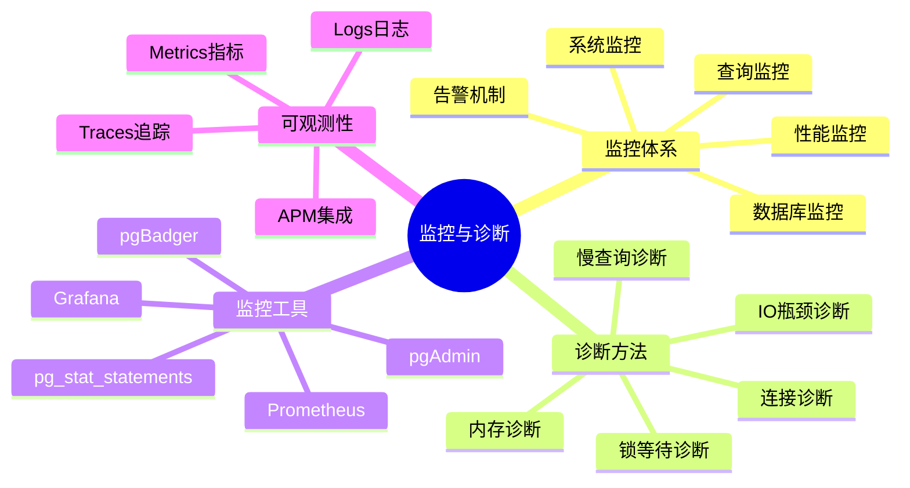
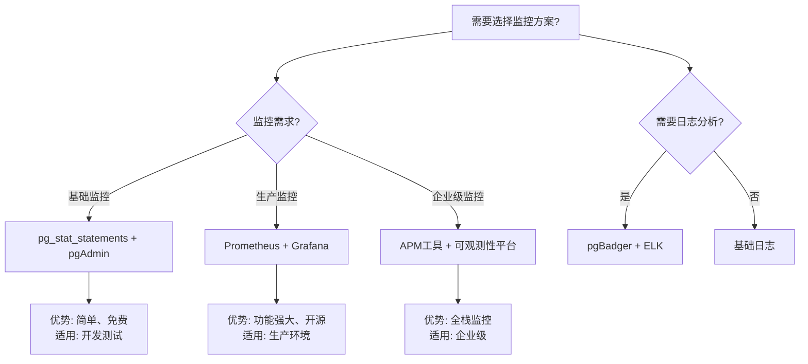

# 12-监控与诊断

> **文档总数**: 8个文档
> **覆盖领域**: 监控工具、诊断方法、故障排查、性能分析
> **版本覆盖**: PostgreSQL 18.x (推荐) ⭐ | 17.x (推荐) | 16.x (兼容)

---

## 📊 知识体系思维导图

---

## 📋 主题说明

本主题整合所有PostgreSQL监控与诊断相关内容，包括监控工具使用、诊断方法、故障排查流程、性能分析技巧等。

---

## 📚 核心文档

### 监控与诊断指南

- **[监控诊断体系详解.md](./监控诊断体系详解.md)** - 监控诊断完整体系
- **[监控与诊断.md](./监控与诊断.md)** - 监控与诊断基础
- **[06.01-监控与诊断.md](./06.01-监控与诊断.md)** - 监控与诊断实践
- **[06.02-监控与诊断落地指南.md](./06.02-监控与诊断落地指南.md)** - 监控落地实践
- **[监控与诊断深度应用指南.md](./监控与诊断深度应用指南.md)** ⭐⭐⭐⭐⭐ ⭐ 新增
  - 监控指标选型决策（关键指标、阈值设置、告警策略）
  - 性能诊断场景分析（慢查询诊断、锁等待诊断、IO瓶颈诊断）
  - 监控架构设计场景（监控工具选型、监控架构设计）
  - 诊断工具对比与应用场景
  - **字数**: 约28,000字
  - **状态**: ✅ 已完成

- **[PostgreSQL可观测性完整指南.md](./PostgreSQL可观测性完整指南.md)** ⭐⭐⭐⭐⭐ ⭐ 新增
  - Metrics指标监控（系统级、数据库级、查询级指标）
  - Logs日志管理（结构化日志、日志聚合与分析）
  - Traces分布式追踪（分布式追踪、APM集成）
  - 可观测性工具选型（Prometheus、Grafana、ELK、Jaeger、OpenTelemetry）
  - 可观测性最佳实践
  - 综合选型案例（大规模系统、云原生环境）
  - **字数**: 约25,000字
  - **状态**: ✅ 已完成

---

## 📊 监控工具选型决策树

---

## 📊 监控工具对比矩阵

| 监控工具 | 功能 | 易用性 | 成本 | 扩展性 | 适用场景 |
|---------|------|--------|------|--------|---------|
| **pg_stat_statements** | ⭐⭐⭐ | ⭐⭐⭐⭐ | 免费 | ⭐⭐⭐ | 查询性能分析 |
| **Prometheus + Grafana** | ⭐⭐⭐⭐⭐ | ⭐⭐⭐ | 免费 | ⭐⭐⭐⭐⭐ | 生产环境监控 |
| **pgBadger** | ⭐⭐⭐⭐ | ⭐⭐⭐ | 免费 | ⭐⭐⭐ | 日志分析 |
| **APM工具** | ⭐⭐⭐⭐⭐ | ⭐⭐⭐⭐ | 付费 | ⭐⭐⭐⭐⭐ | 企业级监控 |
| **pgAdmin** | ⭐⭐⭐ | ⭐⭐⭐⭐⭐ | 免费 | ⭐⭐ | 开发管理 |

---

## 🎯 使用建议

### 监控配置

1. 选择合适的监控工具
2. 配置关键指标监控
3. 设置告警规则

### 故障诊断

1. 使用诊断工具定位问题
2. 分析性能指标
3. 参考故障诊断案例

---

## 📚 文档来源

本主题整合了以下源目录的文档：

- `PostgreSQL/06-运维实践/监控与诊断/`
- `PostgreSQL培训/10-监控诊断/`
- `docs/01-PostgreSQL18/` (监控相关文档)

**原则**: 所有文档均为复制，原文件保持不变。

---

## 🔗 相关文档

- [20-故障诊断案例](../20-故障诊断案例/README.md) - 故障诊断案例库
- [21-最佳实践/运维手册/监控与告警.md](../21-最佳实践/运维手册/监控与告警.md) - 监控与告警最佳实践
- [21-最佳实践/故障排查/](../21-最佳实践/故障排查/) - 故障排查方法

---

**最后更新**: 2025年1月
**状态**: ✅ 文档整合完成
